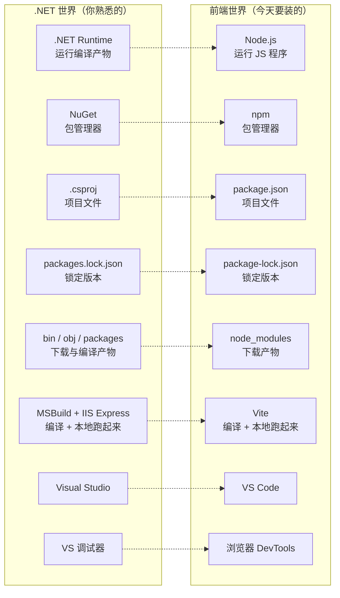
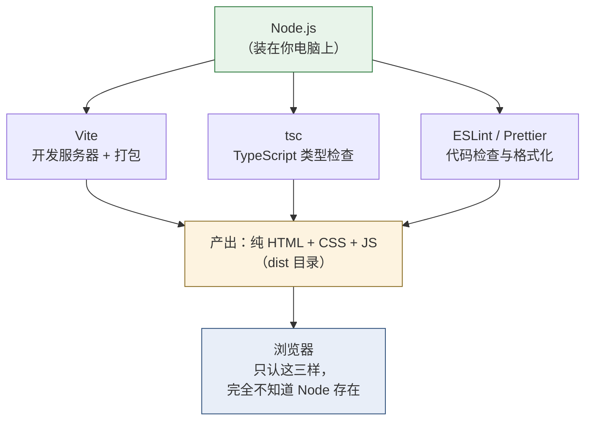
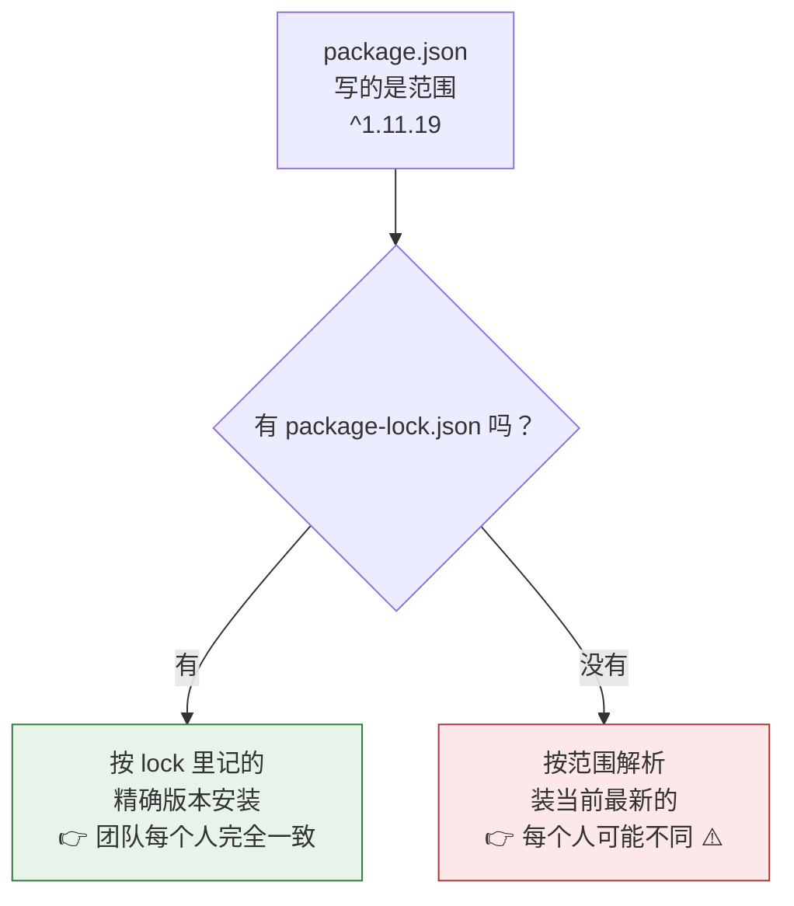
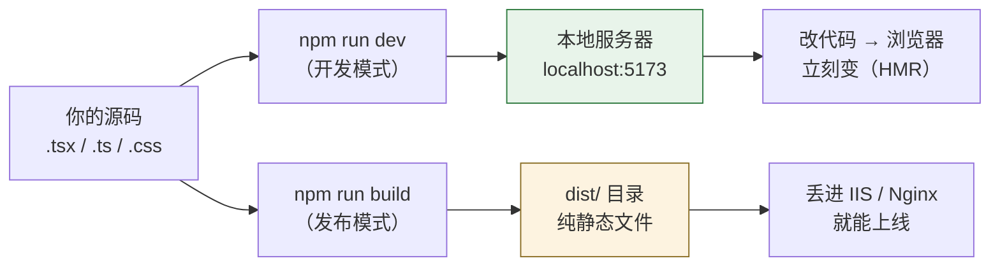

# Day 1 — 工具链

> **今天的定位**：不写任何业务代码，只把「能开工」的环境搭起来，并且**搞清楚每个工具在整条链子上站在哪个位置**。
>
> **时间**：2 小时
> **前置**：一台能上网的 Windows 电脑（macOS 步骤会另注）
> **版本基准**：Node.js 24.x LTS · Vite 8.x · 2026 年 7 月

## 今天结束时你应该能做到

- [ ] 在命令行里敲 `node -v` 和 `npm -v`，两个都有版本号输出
- [ ] 能解释清楚「我写的是浏览器代码，为什么要在自己电脑上装 Node」
- [ ] 看着一个 `package.json`，能说出每个字段是干什么的
- [ ] 知道 `^1.2.3` 和 `~1.2.3` 的区别，知道为什么 `package-lock.json` 必须提交而 `node_modules` 绝不提交
- [ ] 有一个能跑起来的 React 项目，改一行字保存后浏览器**不刷新**就变了
- [ ] 会在浏览器 DevTools 的 Console 里执行 JS、在 Sources 里打断点

## 时间分配

| 时段 | 内容 | 时长 |
| --- | --- | --- |
| 1 | 先看懂一张对照地图 | 10 分钟 |
| 2 | 安装 Node.js | 20 分钟 |
| 3 | npm 与 `package.json`（**今天最重要的一节**） | 30 分钟 |
| 4 | 用 Vite 建第一个项目 | 30 分钟 |
| 5 | 配置 VS Code | 15 分钟 |
| 6 | 浏览器 DevTools | 15 分钟 |

---

# 第 1 节：先看懂一张对照地图（10 分钟）

前端工具链看起来是一堆陌生名字，其实**每一个都在 .NET 世界里有对应物**。先建立这张映射，后面就不会迷路。



一张表再过一遍：

| .NET 世界 | 前端世界 | 差别提示 |
| --- | --- | --- |
| .NET Runtime | **Node.js** | 都是「运行时」，但 Node 主要跑**开发工具**，不跑你的网页 |
| NuGet | **npm** | 概念几乎一样，命令不同 |
| `.csproj` | **`package.json`** | npm 的是 JSON，手写友好得多 |
| `packages.lock.json` | **`package-lock.json`** | 都必须提交到 Git |
| `bin` / `obj` / `packages` | **`node_modules`** | 都不提交，都可重建 |
| MSBuild + IIS Express | **Vite** | Vite 一个工具干了编译 + 本地服务器两件事 |
| Visual Studio | **VS Code** | 轻得多，靠扩展补功能 |
| VS 调试器 | **浏览器 DevTools** | 断点、单步、监视变量，一一对应 |
| Fiddler | **DevTools 的 Network 面板** | 内置了，不用另装 |
| SQL Server 查询窗口 | **DevTools 的 Console 面板** | 都是「随手敲一行立刻看结果」 |

> **今天不用记住任何命令。** 只要看完这张表以后，听到「node_modules」你脑子里会闪过「哦，相当于 packages 文件夹」，这一节就成功了。

---

# 第 2 节：安装 Node.js（20 分钟）

## 2.1 Node.js 到底是什么

一句话：**Node.js 就是把浏览器里的 JS 引擎单独抠出来，做成了一个能在命令行运行的程序。**

在 Node 出现之前，JS 只能在浏览器里跑。Node 让 JS 也能像 C# 一样写命令行工具、写服务器程序。

## 2.2 关键疑问：我写的是浏览器代码，为什么要装 Node？

**这是每个新手的第一个困惑，必须现在讲清楚。**

答案：**Node 不是给你的网页用的，是给你的「开发工具」用的。**

你即将用到的工具 —— Vite（打包）、tsc（TypeScript 类型检查）、ESLint（代码检查）、Prettier（格式化）—— **它们本身就是用 JavaScript 写的程序**。要在你的电脑上运行它们，就得有个能跑 JS 的运行时，那就是 Node。



**类比**：你写 C# 网站，客户的浏览器不需要装 .NET SDK —— SDK 是**你开发时**用的，客户只收到编译好的结果。Node 在前端扮演的正是「你开发时用的 SDK」这个角色。

> **所以**：项目上线时，服务器上**不需要**装 Node（除非你用服务端渲染）。你最终交付的就是一堆静态文件，扔进 IIS 就能跑。

## 2.3 该装哪个版本

打开 [nodejs.org](https://nodejs.org/zh-cn)，你会看到两个大按钮。**选 LTS 那个。**

Node 的版本规则（和 .NET 的 LTS 概念一样）：

| 版本号 | 状态 | 能不能用 |
| --- | --- | --- |
| **24.x** | **Active LTS** | ✅ **装这个**。官方推荐给生产项目 |
| 26.x | Current（2026 年 10 月转 LTS） | ⚠️ 新特性尝鲜用，学习期别碰 |
| 22.x | Maintenance LTS | 🔸 老项目维护可以，新项目不选 |
| 20.x 及以下 | 已 EOL（20.x 于 2026 年 4 月停止支持） | ❌ 不要装 |

规则记一句就够：**偶数版本号才会成为 LTS，奇数版本只活 6 个月。** 所以永远选偶数、且标着 LTS 的那个。

## 2.4 Windows 安装步骤

1. 下载 `.msi` 安装包（选 **LTS** / **Windows Installer (.msi)** / **64-bit**）
2. 双击运行，一路 **Next**
3. **「Add to PATH」这一项必须保持勾选**（默认就是勾选的，别取消）—— 不勾的话命令行里找不到 `node` 命令
4. 有一个可选项叫 **「Tools for Native Modules」**（会额外装 Python 和 VS 生成工具，几个 GB）—— **不要勾**，学习期完全用不到
5. 装完后，**关掉所有已经打开的命令行窗口**，重新开一个新的

> **为什么必须重开命令行**：PATH 环境变量是命令行窗口启动时读取的。已经开着的窗口读的是旧的 PATH，找不到刚装的 node。这个坑每年坑住无数人。

**macOS**：官网下 `.pkg` 双击装，或者 `brew install node@24`。

## 2.5 验证安装

打开命令行（Windows 上按 `Win + R`，输入 `cmd`，回车），敲这两行：

```bash
node -v
npm -v
```

你应该看到类似这样的输出（版本号的小数点后面不用完全一致）：

```
C:\Users\你的名字> node -v
v24.15.0

C:\Users\你的名字> npm -v
11.6.2
```

**两条都有版本号 = 安装成功。** 注意 npm 是跟着 Node 一起装的，不用单独安装。

## 2.6 玩一下 Node 的交互模式

命令行里敲 `node` 然后回车，会进入一个可以直接写 JS 的交互环境（叫 REPL，跟 SQL Server 的查询窗口是一个意思）：

```
C:\Users\你的名字> node
Welcome to Node.js v24.15.0.
Type ".help" for more information.
> 1 + 1
2
> 'Hello' + ' ' + 'World'
'Hello World'
> [1, 2, 3].map(x => x * 2)
[ 2, 4, 6 ]
> 0.1 + 0.2
0.30000000000000004
>
```

最后那一行请你**亲手敲一遍**。

`0.1 + 0.2` 居然不等于 `0.3` —— 因为 JS 里只有一种数字类型（64 位浮点），**没有 `decimal`**。你 20 年 SQL Server 的 `decimal(18,2)` 习惯在这里没有对应物。这是 Day 3 的重点内容，今天先埋个印象：**JS 里算钱要格外小心**。

按两次 `Ctrl + C`（或输入 `.exit`）退出 REPL。

## 2.7 【中国大陆必做】换镜像源

npm 官方源在国内经常慢到超时。换成国内镜像：

```bash
npm config set registry https://registry.npmmirror.com
```

验证：

```bash
npm config get registry
```

应该输出 `https://registry.npmmirror.com/`。

> 如果你在公司网络里、需要走代理，还要额外配：
> ```bash
> npm config set proxy http://代理地址:端口
> npm config set https-proxy http://代理地址:端口
> ```
> 具体地址问你们网管。这一步搞不定的话后面所有 `npm install` 都会失败。

---

# 第 3 节：npm 与 package.json（30 分钟）

> **这是今天最重要的一节。** Vite、VS Code 那些以后天天用自然就会了，但 `package.json` 和版本号规则如果没搞清楚，会在整个学习过程中反复给你制造莫名其妙的问题。

## 3.1 手工建一个最小项目

先不用 Vite，我们手工来一遍，看清每一步到底发生了什么。

```bash
mkdir npm-练习
cd npm-练习
npm init -y
```

> **注意**：路径里**不要有中文和空格**。上面用中文目录名只是为了这一次演示；真实项目请用 `d:\code\my-app` 这种纯英文路径。前端工具链对中文路径的兼容性时好时坏，出问题很难查。
>
> 保险起见，把上面那行改成 `mkdir npm-test && cd npm-test`。

`npm init -y` 会生成一个 `package.json`（`-y` 意思是「所有问题都用默认答案」）。打开看看：

```json
{
  "name": "npm-test",
  "version": "1.0.0",
  "description": "",
  "main": "index.js",
  "scripts": {
    "test": "echo \"Error: no test specified\" && exit 1"
  },
  "keywords": [],
  "author": "",
  "license": "ISC"
}
```

逐个字段解释（对应 `.csproj` 里的各种 `<PropertyGroup>`）：

| 字段 | 作用 | .csproj 对应 |
| --- | --- | --- |
| `name` | 项目名，只能小写字母、数字、`-` | `<AssemblyName>` |
| `version` | 版本号，三段式 | `<Version>` |
| `description` | 描述，可以留空 | `<Description>` |
| `main` | 入口文件（做库时才重要，做网页项目基本无用） | 启动项目 |
| `scripts` | **自定义命令，最常用的字段** | MSBuild Target / 批处理 |
| `keywords` / `author` / `license` | 发布到 npm 公共仓库时才有意义，公司内部项目随便填 | 程序集元数据 |

## 3.2 装一个包，看看发生了什么

```bash
npm install dayjs
```

（`dayjs` 是个日期处理库，选它是因为它很小，装得快。）

**装完后，你的目录里发生了三件事：**

### 变化一：`package.json` 多了一段

```json
{
  "name": "npm-test",
  "version": "1.0.0",
  ...
  "dependencies": {
    "dayjs": "^1.11.19"
  }
}
```

这就是「我这个项目需要 dayjs，版本约束是 `^1.11.19`」。**这一段相当于 `.csproj` 里的 `<PackageReference>`。**

### 变化二：出现了 `package-lock.json`

一个很长的文件，记录了**实际装上的每一个包的精确版本和下载地址**。

### 变化三：出现了 `node_modules` 文件夹

```
npm-test/
├── node_modules/
│   ├── dayjs/           ← 你要的那个
│   └── .package-lock.json
├── package.json
└── package-lock.json
```

dayjs 没有依赖别的包，所以这里很干净。等你装 Vite 和 React，`node_modules` 里会出现**几百个文件夹** —— 因为包会依赖别的包，别的包又依赖更多包（传递依赖）。这是正常的，不是出错。

> **心理准备**：一个普通 React 项目的 `node_modules` 大约 200–400 MB、十几万个文件。第一次看到会觉得离谱，但这就是前端生态的现状。它相当于 NuGet 的 `packages` 文件夹，只是层级展开得更彻底。

## 3.3 `dependencies` vs `devDependencies`

再装一个，注意这次的 `-D` 参数：

```bash
npm install -D prettier
```

现在 `package.json` 变成：

```json
{
  "dependencies": {
    "dayjs": "^1.11.19"
  },
  "devDependencies": {
    "prettier": "^3.6.2"
  }
}
```

区别：

| | `dependencies` | `devDependencies` |
| --- | --- | --- |
| 命令 | `npm install 包名` | `npm install -D 包名` |
| 含义 | **代码运行时需要** | **只在开发/构建时需要** |
| 例子 | React、dayjs、axios | Vite、TypeScript、ESLint、Prettier |
| 判断标准 | 「打包进最终产物吗？」是 → 放这里 | 「用户浏览器需要它吗？」不需要 → 放这里 |

**对照 NuGet**：相当于 `<PackageReference>` 上加不加 `PrivateAssets="all"` —— 一个是运行时真依赖，一个是仅开发期工具。

> 实话说：对于「打包成静态文件」的前端项目，这两者的区别**没有 .NET 里那么关键**（都会被下载、构建时都在）。但分清楚是良好习惯，而且团队 code review 会看这个。

## 3.4 语义化版本：`^` 和 `~` 到底差在哪

版本号是三段：`主版本.次版本.修订号`（`MAJOR.MINOR.PATCH`）

| 段位 | 什么时候会变 | 例子 |
| --- | --- | --- |
| **主版本** MAJOR | **有破坏性改动**，升级可能让你的代码跑不了 | `1.x.x` → `2.0.0` |
| **次版本** MINOR | 加了新功能，但向后兼容 | `1.11.x` → `1.12.0` |
| **修订号** PATCH | 只修 bug，无新功能 | `1.11.19` → `1.11.20` |

前缀符号决定**允许自动升到哪**：

| 写法 | 含义 | 允许的范围 | 用在什么场合 |
| --- | --- | --- | --- |
| `^1.11.19` | **锁主版本**（npm 默认） | `1.11.19` ~ `1.x.x`，**不会到 2.0.0** | ✅ 绝大多数情况 |
| `~1.11.19` | **锁到次版本** | `1.11.19` ~ `1.11.x`，**不会到 1.12.0** | 保守派、对稳定性极敏感的依赖 |
| `1.11.19` | **完全锁死** | 只能是 `1.11.19` | 有已知兼容问题、必须钉死时 |
| `*` 或 `latest` | 什么都允许 | 任意版本 | ❌ **永远不要用**，等于埋雷 |

**具体例子**，假设你写的是 `^1.11.19`：

```
1.11.20  ✅ 会自动升（修订号）
1.12.0   ✅ 会自动升（次版本）
1.99.5   ✅ 会自动升
2.0.0    ❌ 不会升（主版本变了，可能不兼容）
1.11.18  ❌ 不会降
```

> **一个必须知道的例外**：主版本号是 `0` 时（如 `^0.2.5`），`^` 的行为变严 —— 只允许升修订号，不允许升次版本。因为 `0.x` 表示「还在早期开发，随时可能变」。

## 3.5 `package-lock.json`：为什么必须提交到 Git

看出问题了吗 —— `package.json` 里写的是**范围**（`^1.11.19`），不是精确版本。

那么：**你今天 `npm install` 装到 1.11.19，同事下周 `npm install` 可能装到 1.12.3。** 你们两个人的 `node_modules` 内容不一样，却都符合 `package.json`。

于是就有了经典的「**在我机器上是好的**」事故。

`package-lock.json` 就是为解决这个而生的：它记录**实际装上的精确版本**，精确到每一个传递依赖。



**规则：**

| 文件 | 提交到 Git？ | 原因 |
| --- | --- | --- |
| `package.json` | ✅ **必须提交** | 它是项目定义 |
| `package-lock.json` | ✅ **必须提交** | 它保证团队装出一样的东西 |
| `node_modules/` | ❌ **绝不提交** | 几十万个文件、可完全重建、还含平台相关的二进制 |

`.gitignore` 里必须有 `node_modules`（Vite 生成的模板已经帮你写好了）。

> **补充一个命令**：`npm ci`（continuous integration）—— **严格按 lock 文件安装**，忽略 `package.json` 的范围，而且会先清空 `node_modules`。CI 流水线里应该用 `npm ci` 而不是 `npm install`。

## 3.6 `npm run` 与 scripts

`scripts` 是 `package.json` 里你**最常打交道**的字段。它就是给一串长命令起个短名字。

手动改一下 `package.json`：

```json
{
  "scripts": {
    "hello": "node -e \"console.log('第一个 npm 脚本跑起来了')\"",
    "查版本": "node -v"
  }
}
```

然后运行：

```bash
npm run hello
npm run 查版本
```

输出：

```
> npm-test@1.0.0 hello
> node -e "console.log('第一个 npm 脚本跑起来了')"

第一个 npm 脚本跑起来了
```

**对照**：相当于 MSBuild 的自定义 Target，或者你项目里那些 `build.bat`。

以后你在任何前端项目里，想知道「这项目怎么启动」，**第一件事就是打开 `package.json` 看 `scripts`**。常见的几个约定名字：

| 脚本名 | 惯例含义 | 运行方式 |
| --- | --- | --- |
| `dev` | 启动开发服务器 | `npm run dev` |
| `build` | 打包生产版本 | `npm run build` |
| `preview` | 本地预览打包结果 | `npm run preview` |
| `lint` | 跑 ESLint 检查 | `npm run lint` |
| `test` | 跑测试 | `npm test`（可省略 run） |

> `start` 和 `test` 这两个名字可以省略 `run`（`npm start`），其他都必须写 `npm run xxx`。

## 3.7 `npx` 是什么

```bash
npx prettier --version
```

`npx` = **临时执行一个包，用完不留在项目里**。

三个区别：

| 命令 | 行为 |
| --- | --- |
| `npm install -D prettier` | 装进项目，写进 `package.json`，长期保留 |
| `npx prettier ...` | 优先用项目里已装的；没装就临时下载到缓存、执行完不写进 `package.json` |
| `npm install -g prettier` | 装到全局。**尽量别用**，会导致不同项目工具版本冲突 |

**对照** `dotnet tool run`。

`npx` 最常见的用途就是**创建新项目** —— 你只需要跑一次脚手架，没必要把脚手架永久装在电脑上。下一节就要用到。

## 3.8 本节小结

```bash
npm init -y                  # 生成 package.json
npm install 包名              # 装运行时依赖
npm install -D 包名           # 装开发依赖
npm install                  # 按 package.json + lock 装齐所有依赖
npm ci                       # 严格按 lock 装（CI 用）
npm run 脚本名                # 跑 scripts 里定义的命令
npm uninstall 包名            # 卸载
npm outdated                 # 看哪些包有新版本
npx 包名                      # 临时执行
```

这个 `npm-test` 文件夹可以删了，它的任务已经完成。

---

# 第 4 节：用 Vite 建第一个项目（30 分钟）

## 4.1 Vite 是什么

**Vite**（法语「快」，读作 /vit/，近似「veet」）一个工具干了两件事：

1. **开发时**：启动一个本地服务器，你改代码它立刻在浏览器里生效（相当于 IIS Express + 自动编译）
2. **发布时**：把你的源码打包成浏览器能直接吃的 HTML + CSS + JS（相当于 MSBuild 编译）



> Vite 8（2026 年 3 月发布）把开发和打包统一到了 Rolldown 这一个打包器上。这些内部细节你完全不用关心，知道「Vite 负责编译和本地服务器」就够。

## 4.2 创建项目

**先切换到一个纯英文路径**，比如：

```bash
d:
cd \code
```

（没有 `d:\code` 就先 `mkdir \code`。）

然后：

```bash
npm create vite@latest
```

会进入一串交互式提问。**选项文字可能随版本微调，你只要认准 `React` 和 `TypeScript` 两个关键词。**

```
> npx create-vite

◇  Project name:
│  my-first-app                    ← 输入项目名，回车

◇  Select a framework:
│  ○ Vanilla
│  ○ Vue
│  ● React                         ← 用方向键选到 React，回车
│  ○ Preact
│  ○ Lit
│  ○ Svelte
│  ○ Solid
│  ○ Qwik
│  ○ Others

◇  Select a variant:
│  ● TypeScript                    ← 选这个，回车
│  ○ TypeScript + SWC
│  ○ JavaScript
│  ○ JavaScript + SWC
│  ○ React Router v7 ↗
│  ○ TanStack Router ↗

◇  Scaffolding project in d:\code\my-first-app...
└  Done. Now run:

  cd my-first-app
  npm install
  npm run dev
```

> **为什么直接选 TypeScript？** 按学习计划，你从第一行 React 代码起就写 TS —— 类型系统是你 20 年 C# 的母语，不是额外负担。今天你还不会 TS 语法，但模板已经配好，不影响今天的操作。
>
> **`TypeScript + SWC` 是什么？** SWC 是另一个编译器，更快但生态支持略少。**选普通的 `TypeScript` 就行。**

按提示执行：

```bash
cd my-first-app
npm install
```

`npm install` 会下载几百个包，第一次大约 1–3 分钟（换了镜像源的话）。屏幕上滚一堆东西是正常的。看到类似这样就成功了：

```
added 213 packages, and audited 214 packages in 47s

52 packages are looking for funding
  run `npm fund` for details

found 0 vulnerabilities
```

> 如果出现 `npm warn deprecated ...` 之类的黄色警告，**忽略它们**。只有红色的 `npm error` 才需要处理（见文末排查表）。

## 4.3 目录结构逐个解释

```
my-first-app/
├── node_modules/            ← 下载的依赖（几百个文件夹，不要动、不要提交）
├── public/                  ← 不参与打包处理的静态文件
│   └── vite.svg                （放 favicon、robots.txt 之类）
├── src/                     ← 【你的全部工作区域都在这里】
│   ├── assets/
│   │   └── react.svg           参与打包的图片资源
│   ├── App.css                 App 组件的样式
│   ├── App.tsx              ← 【今天要改的就是这个文件】
│   ├── index.css               全局样式
│   ├── main.tsx             ← 程序入口，把 App 挂到页面上
│   └── vite-env.d.ts           类型声明，别动
├── .gitignore               ← 已经帮你写好了 node_modules
├── eslint.config.js            ESLint 配置（Day 20 才学）
├── index.html               ← 唯一的 HTML 页面
├── package.json             ← 项目定义（刚学过）
├── package-lock.json        ← 版本锁定（刚学过）
├── tsconfig.json               TypeScript 配置（Day 15 才学）
├── tsconfig.app.json           同上
├── tsconfig.node.json          同上
└── vite.config.ts              Vite 配置
```

**今天你只需要认识 4 个：**

| 文件 | 作用 | .NET 类比 |
| --- | --- | --- |
| `src/App.tsx` | 页面主体内容，**今天要改它** | 一个 `.aspx` 页面 |
| `src/main.tsx` | 程序入口 | `Global.asax` / `Program.cs` |
| `index.html` | 唯一的 HTML 骨架 | 母版页，但只有一个 |
| `package.json` | 项目定义和命令 | `.csproj` |

**剩下那些配置文件今天一律不用看懂。** 它们是模板预置的、能正常工作的，等到对应的 Day 再学。

> **一个重要观念**：整个项目**只有一个 `index.html`**。这跟 WebForm 一个页面一个 `.aspx` 完全不同 —— React 是「单页应用」，所有页面切换都在这一个 HTML 里由 JS 完成，浏览器地址变了但页面从不真正重新加载。这也是为什么没有 PostBack。

## 4.4 启动它

```bash
npm run dev
```

```
  VITE v8.0.4  ready in 312 ms

  ➜  Local:   http://localhost:5173/
  ➜  Network: use --host to expose
  ➜  press h + enter to show help
```

浏览器打开 **http://localhost:5173/**，你会看到 Vite 和 React 的 logo，一句 `Vite + React`，和一个写着 `count is 0` 的按钮。

**恭喜，你的第一个 React 应用跑起来了。**

> **注意**：这个命令**会一直占用命令行窗口**，这是正常的 —— 它是个常驻服务器。想停下来按 `Ctrl + C`。学习期间就让它一直开着。
>
> 需要再敲别的命令时，**另开一个命令行窗口**。

## 4.5 【今天的高光时刻】体验 HMR

这一步请**严格按顺序做**，它会让你直观感受到 React 开发和 WebForm 的根本差别。

**第 1 步**：在浏览器里，**连点 5 次**那个 `count is 0` 按钮，让它变成 `count is 5`。

**第 2 步**：不要碰浏览器。在 VS Code 里打开 `src/App.tsx`，找到这一行：

```tsx
<h1>Vite + React</h1>
```

改成：

```tsx
<h1>我的第一个 React 应用</h1>
```

**第 3 步**：`Ctrl + S` 保存。然后看浏览器。

### 你应该看到

- 标题**瞬间**变成了「我的第一个 React 应用」
- 浏览器**完全没有刷新**（地址栏没有转圈，页面没有闪白）
- **计数器还是 `count is 5`** ⬅️ **这是关键**

### 这意味着什么

这个特性叫 **HMR（Hot Module Replacement，模块热替换）**。Vite 只把你改动的那一个模块换掉，**页面上的状态原地保留**。

对比一下你熟悉的流程：

| | WebForm | React + Vite |
| --- | --- | --- |
| 改一行文字后 | 重新编译 → F5 刷新 | 保存即生效，**不刷新** |
| 页面上已填的表单 | **全丢了**，要重新填 | **原样保留** |
| 已选中的下拉框、展开的树节点 | 全部重置 | 全部保留 |
| 等待时间 | 几秒到几十秒 | 几十毫秒 |

**为什么这件事很重要**：假设你在调一个「第 3 步的弹窗里第 5 个字段的校验提示」。WebForm 下你每改一次样式，就要重新走一遍前 4 步把弹窗点出来。React + HMR 下，弹窗一直开着，你改一次看一次，一秒一轮。

这是前端开发体验最大的一次进步，也是你会最快感受到「爽」的地方。

> 试试更多：改 `App.css` 里的颜色、改按钮文字。**注意什么时候状态会被保留，什么时候会重置**（改动太大时 Vite 会退化成整页刷新，这也正常）。

## 4.6 打包看看产物

再开**一个新的**命令行窗口（原来那个还在跑 dev），进到项目目录：

```bash
npm run build
```

```
vite v8.0.4 building for production...
✓ 34 modules transformed.
dist/index.html                   0.46 kB │ gzip:  0.30 kB
dist/assets/index-DiwrgTda.css    1.39 kB │ gzip:  0.72 kB
dist/assets/index-C8s3xhKz.js   188.24 kB │ gzip: 59.24 kB
✓ built in 1.24s
```

现在多了一个 `dist` 文件夹：

```
dist/
├── assets/
│   ├── index-DiwrgTda.css
│   └── index-C8s3xhKz.js
├── index.html
└── vite.svg
```

**这就是你要交付上线的全部东西。** 三个要点：

1. **纯静态文件**。没有 `.dll`，没有 `web.config`，服务器上**不需要装 Node**。丢进 IIS 的一个虚拟目录、或者 Nginx，就能跑
2. **文件名里那串乱码是内容哈希**（`index-C8s3xhKz.js`）。内容变了哈希就变，用于让浏览器缓存精确失效 —— 这解决了 WebForm 时代「客户说页面没更新，让他 Ctrl+F5」的老问题
3. **`.tsx` 全部消失了**。TypeScript 和 JSX 都被编译成了普通 JS，浏览器根本不知道你写的是 TS

本地预览打包结果：

```bash
npm run preview
```

会起在另一个端口（通常 4173）。这个是**看打包后的真实效果**，跟 `npm run dev` 不是一回事。

| | `npm run dev` | `npm run build` + `preview` |
| --- | --- | --- |
| 用途 | 日常开发 | 验证上线产物 |
| 速度 | 启动极快 | 需要完整打包 |
| HMR | ✅ 有 | ❌ 没有 |
| 代码压缩 | ❌ 不压缩，便于调试 | ✅ 压缩混淆 |
| 什么时候用 | 99% 的时间 | 上线前 |

> **澄清一个常见误解**：`npm run dev` 起的那个 `localhost:5173` **不是 IIS，也不是你的生产环境**。它是个专为开发设计的临时服务器，带一堆调试便利但性能和安全性都不适合上线。上线永远用 `dist` 里的产物。

---

# 第 5 节：配置 VS Code（15 分钟）

## 5.1 打开项目的正确方式

**用「打开文件夹」，不要用「打开文件」。**

VS Code 里 `文件 → 打开文件夹` → 选 `my-first-app` 这个**文件夹**。

> **为什么**：VS Code 靠「当前打开的文件夹」来定位 `tsconfig.json`、`node_modules` 里的类型定义、ESLint 配置。如果你只是双击打开了单个 `.tsx` 文件，**所有智能提示和类型检查都不会工作**，你会以为「VS Code 好难用」。这是新手第一大误区。

## 5.2 必装的两个扩展

左侧栏点方块图标（扩展），或按 `Ctrl + Shift + X`，搜索安装：

| 扩展名 | 发布者 | 作用 |
| --- | --- | --- |
| **ESLint** | Microsoft | 代码问题实时标红波浪线 |
| **Prettier - Code formatter** | Prettier | 自动格式化 |

可选（看个人喜好）：

| 扩展名 | 作用 |
| --- | --- |
| Chinese (Simplified) Language Pack | 界面汉化 |
| Error Lens | 把报错直接显示在代码行尾，不用悬停 |
| GitLens | Git 增强 |

> **不要装** 那些「React 代码片段大全」「一键生成组件」的扩展。学习期你需要**手敲**每一行来形成肌肉记忆，代码片段会让你跳过这个过程。

## 5.3 开启「保存时自动格式化」

按 `Ctrl + Shift + P` 打开命令面板，输入 `settings json`，选 **「首选项：打开用户设置(JSON)」**，加上这几行：

```json
{
  "editor.formatOnSave": true,
  "editor.defaultFormatter": "esbenp.prettier-vscode",
  "editor.tabSize": 2,
  "files.eol": "\n"
}
```

四行的意思：

| 设置 | 作用 |
| --- | --- |
| `formatOnSave` | 每次 `Ctrl+S` 自动排版 —— **从此不用手动对齐缩进** |
| `defaultFormatter` | 指定用 Prettier 来格式化 |
| `tabSize: 2` | 前端惯例是缩进 2 空格（C# 习惯是 4，这里要改过来） |
| `files.eol: "\n"` | 换行符统一用 LF。Windows 默认 CRLF，跨平台协作会造成整个文件都显示为「已修改」 |

**验证**：回到 `App.tsx`，故意把缩进搞乱（随便加一堆空格），然后 `Ctrl + S`。应该瞬间自动排整齐。

## 5.4 快捷键（对照 Visual Studio）

| 操作 | VS Code | Visual Studio |
| --- | --- | --- |
| 按文件名快速打开 | `Ctrl + P` | `Ctrl + ,` |
| 命令面板（万能入口） | `Ctrl + Shift + P` | — |
| 跳转到定义 | `F12` | `F12` ✅ 相同 |
| 查看所有引用 | `Shift + F12` | `Shift + F12` ✅ 相同 |
| 重命名符号（安全改名） | `F2` | `Ctrl + R, R` |
| 全局搜索 | `Ctrl + Shift + F` | `Ctrl + Shift + F` ✅ 相同 |
| 打开内置终端 | **`Ctrl + ` `**（反引号） | — |
| 格式化文档 | `Shift + Alt + F` | `Ctrl + K, D` |
| 多光标（批量改） | `Alt + 点击` / `Ctrl + D` | `Alt + 点击` |
| 注释/取消注释 | `Ctrl + /` | `Ctrl + K, C` |

**最该先记的两个**：`Ctrl + P`（找文件，比在目录树里点快十倍）和 **`` Ctrl + ` ``**（内置终端，以后 `npm run dev` 直接在 VS Code 里跑，不用切窗口）。

## 5.5 试一下类型提示

在 `App.tsx` 里，把鼠标悬停在 `useState` 上停两秒 —— 会弹出它的类型签名和说明。

然后在 `useState` 上按 `F12` —— 会跳到 React 的类型定义文件里。看不懂没关系，**关键是确认这个能力存在**：

> 这就是选 TypeScript 的直接回报。整个 React 的 API 你都能像 C# 里按 F12 看源码一样探索，而不是去搜文档。

如果悬停没有任何反应，说明你是用「打开文件」而不是「打开文件夹」进来的，回去看 5.1。

---

# 第 6 节：浏览器 DevTools（15 分钟）

在浏览器里按 **`F12`**（或 `Ctrl + Shift + I`）。这是你今后**每天都会开着**的工具。

```
┌────────────────────────────────────────────────────────────┐
│  Elements  Console  Sources  Network  Performance   ⋮  ✕  │
├────────────────────────────────────────────────────────────┤
│                                                            │
│   （当前选中面板的内容）                                     │
│                                                            │
└────────────────────────────────────────────────────────────┘
```

今天只认四个面板：

| 面板 | 作用 | .NET 类比 |
| --- | --- | --- |
| **Console** | 看输出、随手执行 JS | SQL 查询窗口 / VS 即时窗口 |
| **Sources** | 打断点、单步调试 | VS 调试器 |
| **Network** | 看所有 HTTP 请求 | Fiddler |
| **Elements** | 看当前页面结构和样式 | 无直接对应 |

## 6.1 Console：随手执行代码

切到 **Console**，在 `>` 后面敲：

```js
1 + 1
'abc'.toUpperCase()
[3, 1, 2].sort((a, b) => a - b)
document.title
console.log('这是我打的日志')
```

每敲一行回车，立刻出结果。**这是你今后学 JS 语法最重要的实验场** —— 学习计划的铁律第 1 条「每个概念必须亲手跑一遍」，就在这里跑。

再试试这两个，为后面的学习埋伏笔：

```js
0.1 + 0.2 === 0.3        // false  ← Day 3：浮点数
[] == false              // true   ← Day 4：为什么一律用 ===
```

> **提示**：`Ctrl + L` 清屏。方向键 `↑` 调出上一条命令（跟命令行一样）。

## 6.2 Sources：打断点

这是你 C# 调试经验能 100% 迁移过来的地方。

1. 切到 **Sources** 面板
2. 左侧文件树里找到 `src/App.tsx`（Vite 会通过 Source Map 显示你的**原始 TS 源码**，不是编译后的 JS）
3. 找到 `onClick={() => setCount((count) => count + 1)}` 这一行
4. **点击行号**，出现蓝色标记 = 断点已设
5. 回到页面点那个计数按钮
6. **程序停住了**

现在你可以：

| 操作 | 快捷键 | 说明 |
| --- | --- | --- |
| 单步跳过 | `F10` | 同 VS |
| 单步进入 | `F11` | 同 VS |
| 继续运行 | `F8` | VS 里是 `F5` |
| 看变量值 | 悬停在变量上 | 同 VS |
| 看调用栈 | 右侧 Call Stack | 同 VS |
| 加监视 | 右侧 Watch 面板 | 同 VS |

**把鼠标悬停在 `count` 上**，会显示它当前的值。

> 断点调好后记得**取消断点**（再点一次行号），否则后面每次点按钮都会停。

## 6.3 Network：看请求

1. 切到 **Network**
2. 按 `F5` 刷新页面
3. 会列出所有请求：HTML、JS、CSS、图片

点任意一条，右侧能看到：

| 标签 | 内容 |
| --- | --- |
| Headers | 请求/响应头、状态码 |
| Payload | 发送的数据（POST 时） |
| Response | 服务器返回的原始内容 |
| Timing | 各阶段耗时 |

**上方的筛选器**很有用：点 `Fetch/XHR` 只看接口调用，忽略掉图片和脚本。这是你以后调接口时的主战场（Day 11 会大量用到）。

> 勾上 **Disable cache**（禁用缓存）—— 开发期建议一直勾着，避免被浏览器缓存误导。

## 6.4 Elements：看页面结构（附一条警告）

切到 **Elements**，能看到当前页面的 HTML 结构和 CSS。

试试：双击某段文字直接改掉，页面立刻变了。

**⚠️ 但这里必须给一条警告：**

> **在 Elements 面板里改的东西，不会影响 React 的 state，而且下次组件重新渲染时会被完全冲掉。**
>
> 它只适合**临时试样式**，不能用来「修改数据」。
>
> 这一点对你尤其要提醒：WebForm 的思路是「找到那个控件，改它的值」（`Label1.Text = "x"`、`document.getElementById(...)`）。**在 React 里这条路是死路。** React 的模型是「改 state，UI 自己重算」（`UI = f(state)`）。
>
> 你今后调试 React 状态要用的是 **React DevTools**（一个单独的浏览器扩展，Day 20 会装），而不是 Elements 面板。

---

# 今日验收清单

全部打勾才算完成今天：

- [ ] `node -v` 输出 `v24.x.x`
- [ ] `npm -v` 有版本号输出
- [ ] `npm config get registry` 输出国内镜像地址（大陆用户）
- [ ] 在 `node` REPL 里跑过 `0.1 + 0.2`，看到了 `0.30000000000000004`
- [ ] 手工建过一个 `npm-test` 项目，看过 `npm init -y` 生成的 `package.json` 每个字段
- [ ] 装过一个包，观察到了三个变化（`package.json` 多一段 / 出现 lock 文件 / 出现 `node_modules`）
- [ ] 能说出 `^1.11.19` 允许升到 `1.99.0` 但不会升到 `2.0.0`
- [ ] 能说出为什么 `package-lock.json` 要提交、`node_modules` 不能提交
- [ ] 自己写过一个 `npm run` 脚本并成功执行
- [ ] `my-first-app` 项目 `npm run dev` 能起来，浏览器能看到页面
- [ ] **做过 HMR 实验**：先点到 `count is 5`，改标题保存，确认标题变了但计数没丢
- [ ] `npm run build` 成功，看过 `dist` 目录里的内容
- [ ] VS Code 是用「打开**文件夹**」打开项目的
- [ ] 装了 ESLint + Prettier 扩展，配了保存时自动格式化，并验证过
- [ ] 在 `useState` 上悬停能看到类型提示（说明 5.1 做对了）
- [ ] 在 DevTools Console 里执行过 JS
- [ ] 在 `App.tsx` 里打过断点，点按钮停住了，看到了 `count` 的值

---

# 常见问题排查

## `'node' 不是内部或外部命令`

安装时没勾 Add to PATH，或者**没重开命令行窗口**。先关掉所有命令行重开一个试；还不行就重新运行安装包，确认勾选了 Add to PATH。

## PowerShell 报 `无法加载文件 ...\npm.ps1，因为在此系统上禁止运行脚本`

Windows PowerShell 默认执行策略拦住了。两个办法：

**办法一（推荐）**：改用 `cmd` 而不是 PowerShell。

**办法二**：以管理员身份打开 PowerShell，执行：

```powershell
Set-ExecutionPolicy -Scope CurrentUser RemoteSigned
```

## `npm install` 卡住不动 / 报网络错误

1. 确认换过镜像源：`npm config get registry`
2. 公司网络需要代理的话配 `npm config set proxy ...`（见 2.7）
3. 清缓存重试：
   ```bash
   npm cache clean --force
   ```
4. 实在不行，删掉重来：删除 `node_modules` 文件夹和 `package-lock.json`，再 `npm install`
   > 这是前端的「重启试试」，出奇地有效，不用觉得心虚

## `Port 5173 is already in use`

上一个 `npm run dev` 还在后台跑着。要么找到那个窗口按 `Ctrl + C`，要么换端口：

```bash
npm run dev -- --port 5174
```

（中间那个 `--` 是把参数透传给 Vite，不是笔误。）

## 页面打开是空白的

按 `F12` 看 **Console** 面板有没有红色报错。前端 90% 的「白屏」都能在 Console 里找到原因。

## 命令行里中文显示成乱码

```bash
chcp 65001
```

切成 UTF-8 编码。或者直接用 VS Code 的内置终端（`` Ctrl + ` ``），它默认就是 UTF-8。

## 项目路径带中文或空格导致奇怪报错

把项目移到纯英文、无空格的路径，比如 `d:\code\my-first-app`。前端工具链对这个的兼容性不稳定，别在这上面浪费时间。

---

# 今天不需要理解的东西

明确列出来，免得你在这些地方卡住浪费时间：

| 你会看到 | 什么时候学 |
| --- | --- |
| `App.tsx` 里的 `<div>` 写在 JS 中间（JSX） | 阶段 4 第 1 周 |
| `useState` 是什么、为什么用数组接收返回值 | Day 8 学数组解构，阶段 4 第 1 周学 Hook |
| `tsconfig.json` 里那几十个选项 | Day 15 |
| `eslint.config.js` 的内容 | Day 20 |
| `vite.config.ts` 的内容 | 需要配代理时（Day 11 会提） |
| `: string` `: number` 这些冒号标注 | Day 15 |
| `interface` / `type` | Day 16 |
| `node_modules` 里那几百个包分别是什么 | **永远不用知道** |

**今天的唯一标准是「工具能跑起来」。** 一行 React 代码看不懂，完全不影响今天满分。

---

# 作业（20 分钟）

## 作业 1：给项目加一个自己的 npm 脚本

在 `package.json` 的 `scripts` 里加一条 `typecheck`：

```json
{
  "scripts": {
    "dev": "vite",
    "build": "tsc -b && vite build",
    "lint": "eslint .",
    "preview": "vite preview",
    "typecheck": "tsc --noEmit"
  }
}
```

跑 `npm run typecheck`，应该没有任何输出（= 没有类型错误）。

> **这个脚本以后天天用。** 原因见学习计划 Day 15：**Vite 只转译不检查类型**，类型错误只有 `tsc --noEmit` 才会报出来。不加这个脚本，类型错误会一路静默溜到生产环境。

## 作业 2：故意制造一个错误，观察三个工具怎么报

在 `App.tsx` 里，把

```tsx
const [count, setCount] = useState(0)
```

改成

```tsx
const [count, setCount] = useState('零')
```

然后依次观察：

| 在哪看 | 你看到了什么 | 记录下来 |
| --- | --- | --- |
| VS Code 里 | 哪一行标了红波浪线？悬停显示什么？ | |
| `npm run typecheck` | 报了什么错？ | |
| 浏览器页面 | 页面还能打开吗？点按钮会怎样？ | |

**这个练习的目的**：让你亲眼看到**类型错误在代码还没运行时就被抓住了**。这就是 TypeScript 的全部价值，也是你 C# 经验能直接迁移过来的那部分。

改完记得改回 `useState(0)`。

## 作业 3：用一句话回答（写在你的学习笔记里）

1. 我的网页要给客户用，客户的服务器上需要装 Node.js 吗？为什么？
2. `package.json` 里写 `^2.5.1`，某天这个包发布了 `2.9.0` 和 `3.0.0`，`npm install` 会装哪个？
3. 同事说「我拉了你的代码跑不起来」，你最先让他检查哪两件事？

<details>
<summary>点开看参考答案</summary>

1. **不需要**。Node 只是你开发时用来跑 Vite / tsc / ESLint 这些工具的。`npm run build` 产出的 `dist` 是纯 HTML + CSS + JS 静态文件，任何 Web 服务器（IIS、Nginx）都能直接托管。（例外：用了 Next.js 之类的服务端渲染框架时才需要）
2. **装 `2.9.0`**。`^` 锁主版本，允许升次版本和修订号，但不会跨到 `3.0.0`。
3. **① 有没有跑 `npm install`**（`node_modules` 不在 Git 里，拉下来是空的）；**② Node 版本对不对**（`node -v`）。顺带第三个：`package-lock.json` 有没有一起拉下来。

</details>

---

# 明天预告：Day 2 — 模块系统 + 心智模型

明天两件事：

1. **ESM 模块**（`import` / `export`）—— 今后每个文件的第一行都是它。核心差异：**JS 没有 `namespace`、没有 dll、没有 `using`，文件路径就是模块标识**
2. **三个心智模型** —— 单线程与事件循环、编译期 vs 运行期、以及那句要贯穿整个学习过程的 **`UI = f(state)`**

今天装好的 `my-first-app` 明天继续用，别删。

---

## 参考来源

- [Node.js 官方发布说明](https://nodejs.org/en/about/previous-releases)
- [Vite 官方文档](https://vite.dev/guide/)
- [npm 官方文档](https://docs.npmjs.com/)
- [MDN JavaScript 指南](https://developer.mozilla.org/zh-CN/docs/Web/JavaScript)

> 上述来源的内容已经过改写与归纳，以符合许可要求。
