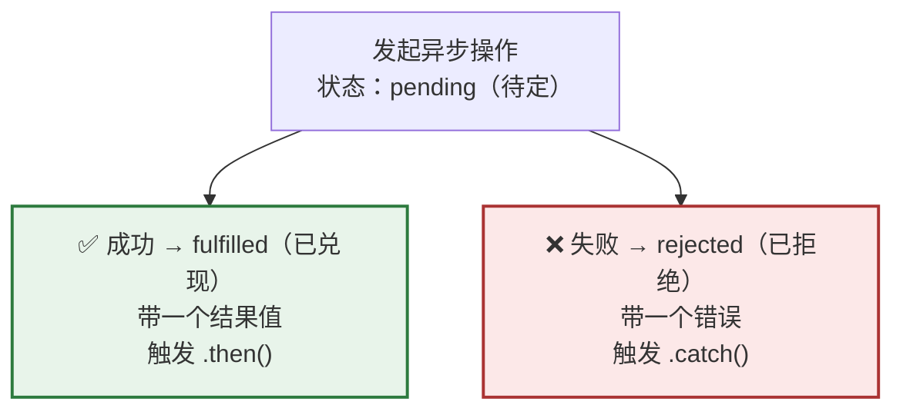
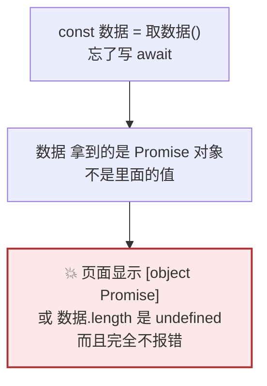
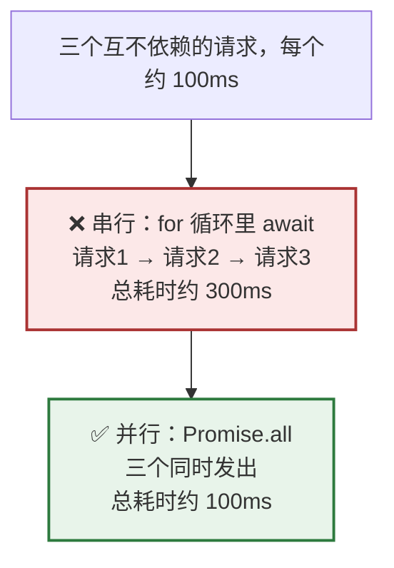
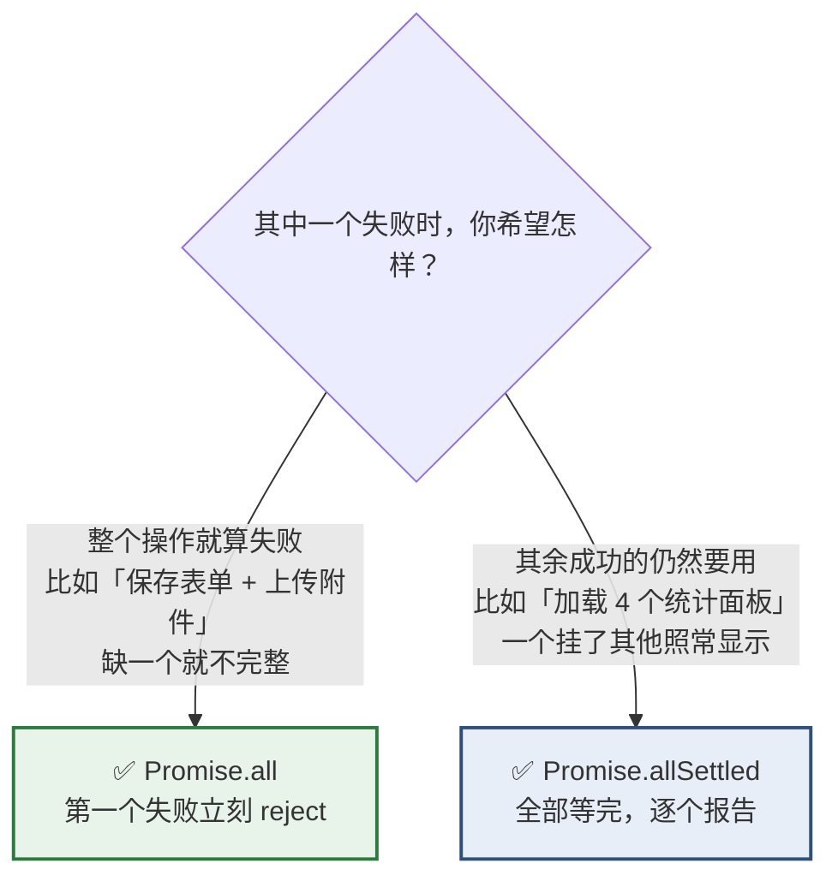

# Day 10 — 异步（一）：Promise 与 async/await

> **今天的定位**：从今天起进入「取后端数据」这条主线。四个重点：
> 1. **`async` / `await`** —— 日常主力。**写法和 C# 几乎一样，但底层模型完全不同**：没有线程池、没有 `ConfigureAwait`、没有真并行，也**没法同步等待**
> 2. **忘了写 `await`** —— 页面上出现 `[object Promise]`，而且不报错
> 3. **串行 vs 并行** —— `for` 循环里 `await` 三个请求要 300ms，`Promise.all` 只要 100ms
> 4. **错误处理** —— 含一个重要预告：**`try/catch` 抓不住 HTTP 错误状态**（明天 Day 11 专门讲）
>
> **时间**：2 小时
> **前置**：`day2-modules` 项目
> **本文所有输出均经 Node.js 24 实测**

## 今天结束时你应该能做到

- [ ] 说出 `Promise` 的三种状态，知道定型后不可再变
- [ ] **熟练写 `async` / `await`**，知道 `async` 函数总是返回 `Promise`
- [ ] **能说出忘了 `await` 会发生什么**，以及怎么一眼认出来
- [ ] **知道 JS 里没有办法同步等待一个 `Promise`**（C# 的 `.Result` 没有对应物）
- [ ] 会用 `try` / `catch` / `finally` 配 `await`
- [ ] 知道判断错误类型要用 `e.name`，会写自定义 `Error` 子类
- [ ] **会用 `Promise.all` 把串行改成并行**，能说出耗时差别
- [ ] 知道 `all` 和 `allSettled` 分别用在什么场景
- [ ] **知道 `forEach` 里写 `async` 不会被等待**（一个高频坑）
- [ ] 会写 `sleep(ms)` 工具函数

## 时间分配

| 时段 | 内容 | 时长 |
| --- | --- | --- |
| 1 | 同步 / 异步与事件循环复习 | 15 分钟 |
| 2 | `Promise` 三态与 `then` / `catch` | 20 分钟 |
| 3 | **`async` / `await`** | 25 分钟 |
| 4 | **错误处理** | 25 分钟 |
| 5 | **并发：`Promise.all` 与 `allSettled`** | 20 分钟 |
| 6 | 定时器与 `sleep` | 15 分钟 |

---

# 第 1 节：同步 / 异步与事件循环复习（15 分钟）

## 1.1 为什么需要异步

**JS 只有一个线程**（Day 2 第 9.2 节）。如果取数据是同步的：

```js
// 假想的同步写法（JS 里没有这种东西）
const 数据 = 同步取数据()      // 假设网络耗时 2 秒
// 这 2 秒里：按钮点不动、动画停住、连滚动都不行
```

**整个页面会冻结 2 秒。** 所以所有 I/O 操作在 JS 里必须是异步的。

## 1.2 复习打印顺序

新建 `async1.js`，**先猜再跑**：

```js
console.log('① 同步')

setTimeout(() => console.log('② 宏任务 setTimeout'), 0)

Promise.resolve().then(() => console.log('③ 微任务 Promise'))

console.log('④ 同步')
```

<details>
<summary>点开看答案</summary>

```
① 同步
④ 同步
③ 微任务 Promise
② 宏任务 setTimeout
```

**三条规则（Day 2 学过）：**

1. 先把当前同步代码跑完
2. 清空**微任务**队列（`Promise` 回调）
3. 取**一个**宏任务（`setTimeout`、事件回调）执行，然后回到第 2 步

**`setTimeout(fn, 0)` 里的 `0` 不代表「立刻」**，只代表「最少等 0 毫秒后排进宏任务队列」。

</details>

## 1.3 ⭐ 和 C# 的根本差异：没有线程池

| C# | JS |
| --- | --- |
| `Task.Run(() => 重活())` 丢到线程池 | ❌ **不存在**。没有线程池 |
| 主线程忙时后台线程照常跑 | ❌ 只有一个线程 |
| `await` 后可能换线程继续 | 永远在同一个线程继续 |
| 需要 `lock` / `Interlocked` | ❌ **完全不需要**（Day 2 讲过的唯一好处） |

**关键推论：JS 的 `async` 不是「并行」，是「让出主线程去排队」。**

```js
// ❌ 这个 async 一点用都没有 —— CPU 密集的活不会因为 async 就不阻塞
async function 算个大数() {
  let 和 = 0
  for (let i = 0; i < 1e9; i++) 和 += i     // 整个页面还是会卡住
  return 和
}
```

**`async` 只对「等待 I/O」有意义**（网络请求、读文件、定时器）。CPU 密集的计算该在后端做。

---

# 第 2 节：`Promise` 三态与 `then` / `catch`（20 分钟）

## 2.1 三种状态



**关键性质：状态一旦从 `pending` 变成 `fulfilled` 或 `rejected`，就永久定型，不能再变。**

**类比**：`Promise` 就像一张取货单。刚拿到时不知道结果（pending），最后要么取到货（fulfilled），要么被告知缺货（rejected）。**取货单不能反复使用。**

## 2.2 `then` / `catch` / `finally`

```js
const 成功 = Promise.resolve('数据来了')
const 失败 = Promise.reject(new Error('接口挂了'))

成功
  .then((值) => console.log('then 收到：', 值))         // then 收到： 数据来了
  .catch((错) => console.log('不会执行'))
  .finally(() => console.log('finally 总会执行'))

失败
  .then((值) => console.log('不会执行'))
  .catch((错) => console.log('catch 收到：', 错.message))  // catch 收到： 接口挂了
  .finally(() => console.log('finally 总会执行'))
```

| 方法 | 什么时候执行 |
| --- | --- |
| `.then(值 => ...)` | 成功时 |
| `.catch(错 => ...)` | 失败时 |
| `.finally(() => ...)` | **不管成功失败都执行**（用于关闭 loading） |

**对照 C#**：`.finally` 相当于 `try/finally` 的 `finally` 块，语义一致。

## 2.3 `then` 可以链式，返回值自动包装

```js
Promise.resolve(1)
  .then((x) => x + 1)              // 返回普通值，自动包装成 Promise
  .then((x) => x * 10)
  .then((x) => console.log(x))     // 20
```

**每个 `then` 的返回值成为下一个 `then` 的输入。**

## 2.4 手动创建 `Promise`（封装老 API 时用）

```js
// 把 setTimeout 包装成 Promise —— 这就是 sleep
const sleep = (毫秒) => new Promise((resolve) => setTimeout(resolve, 毫秒))

// 模拟一个可能失败的请求
const 模拟请求 = (成功) =>
  new Promise((resolve, reject) => {
    setTimeout(() => {
      if (成功) resolve({ 单号: 'SQ0001' })
      else reject(new Error('网络错误'))
    }, 50)
  })
```

**`new Promise((resolve, reject) => {...})` 的两个参数：**

| 参数 | 调用它表示 |
| --- | --- |
| `resolve(值)` | 成功，把 `值` 传给 `.then` |
| `reject(错)` | 失败，把 `错` 传给 `.catch` |

> **实务上很少手写 `new Promise`** —— `fetch` 已经返回 `Promise` 了。只在「封装一个基于回调的老 API」时才需要，比如上面的 `sleep`。

## 2.5 为什么现在不用 `then` 而用 `await`

```js
// 😖 then 链：嵌套一深就难读
取申请单(1)
  .then((单) => 取明细(单.id))
  .then((明细) => 取价格(明细[0].项目码))
  .then((价格) => console.log(价格))
  .catch((错) => console.error(错))

// ✅ async/await：像同步代码一样读
try {
  const 单 = await 取申请单(1)
  const 明细 = await 取明细(单.id)
  const 价格 = await 取价格(明细[0].项目码)
  console.log(价格)
} catch (错) {
  console.error(错)
}
```

**规矩：新代码一律用 `async/await`。** `then` 只在两种情况用：

1. 链条极短（一行）：`fetch(url).then(r => r.json())`
2. 不想让当前函数变成 `async`

---

# 第 3 节：`async` / `await`（25 分钟）★

## 3.1 两条基本规则

```js
// 规则一：async 函数总是返回 Promise
async function 取数据() {
  return { 单号: 'SQ0001' }        // 返回的是普通对象
}
console.log(取数据())               // Promise { { 单号: 'SQ0001' } }  ← 被包成 Promise 了
console.log(await 取数据())         // { 单号: 'SQ0001' }              ← await 拆开它

// 规则二：await 等待 Promise 完成，取出里面的值
const 数据 = await 取数据()
console.log(数据.单号)              // 'SQ0001'
```

**`await` 能用在哪：**

| 位置 | 能用吗 |
| --- | --- |
| `async` 函数体内 | ✅ |
| **ESM 模块顶层**（`.mjs` 或 `"type": "module"`） | ✅ 能（叫顶层 await） |
| 普通（非 async）函数体内 | ❌ 语法错误 |
| `forEach` 的回调里 | ⚠️ 语法上可以，但**不会被等待**（见第 5.5 节） |

> **今天的练习文件能在顶层直接写 `await`**，因为 Day 2 给 `package.json` 加了 `"type": "module"`。

## 3.2 ⭐ 和 C# 的完整对照

| C# | JS | 说明 |
| --- | --- | --- |
| `Task<T>` | `Promise<T>` | 概念对应 |
| `Task`（无返回值） | `Promise<void>` | JS 不区分 |
| `async Task<T> F()` | `async function F()` | 写法几乎一样 |
| `await` | `await` | ✅ **完全一样** |
| `Task.WhenAll` | `Promise.all` | ✅ 对应 |
| `Task.WhenAny` | `Promise.race` | ✅ 对应 |
| `Task.Delay(1000)` | ❌ 没有内置，自己写 `sleep` | |
| `CancellationToken` | `AbortController`（Day 11） | 概念对应 |
| **`Task.Run()`** | ❌ **不存在** | 没有线程池 |
| **`ConfigureAwait(false)`** | ❌ **不存在** | 没有同步上下文，不需要 |
| **`.Result` / `.Wait()`** | ❌ **不存在，也做不到** | 见下 |
| **`async void` 的坑** | ❌ 不存在这个坑 | 但有「忘了 await」的坑 |
| `AggregateException` | `AggregateError`（只 `Promise.any` 用） | 语义不同 |

### 最重要的一条：JS 里没法同步等待

```csharp
// C# 里可以这样（虽然危险，可能死锁）
var 结果 = 取数据Async().Result;
```

```js
// JS 里根本没有对应写法
const 结果 = 取数据().???       // 没有 .Result，没有 .Wait()，做不到
```

**为什么做不到**：同步等待需要「阻塞当前线程直到另一个线程完成」。JS 只有一个线程 —— 阻塞它，那个异步操作就永远没机会完成，必然死锁。**所以语言层面直接不提供这个能力。**

**推论：异步会「传染」。** 一个函数里用了 `await`，它就必须是 `async`；调用它的地方要拿到值，也必须 `await`，于是也得是 `async`……一直传到最上层。

```js
// 传染链
const 层三 = async () => await sleep(1)
const 层二 = async () => await 层三()      // 必须 async
const 层一 = async () => await 层二()      // 必须 async
```

**在 React 里，最上层通常是事件处理函数或 `useEffect`**，它们可以是 `async`（`useEffect` 的回调本身不能是 async，要在里面定义一个 async 函数再调用 —— 阶段 4 会讲）。

## 3.3 💥 忘了写 `await`



**亲手验证：**

```js
const 取列表 = async () => [1, 2, 3]

// ❌ 忘了 await
const 错的 = 取列表()
console.log(错的)                          // Promise { [ 1, 2, 3 ] }
console.log(错的.length)                   // undefined      ← Promise 没有 length
console.log(`显示：${错的}`)               // '显示：[object Promise]'
console.log(Array.isArray(错的))           // false

// ✅ 加了 await
const 对的 = await 取列表()
console.log(对的.length)                   // 3
console.log(Array.isArray(对的))           // true
```

### 三个识别信号

| 症状 | 说明 |
| --- | --- |
| 页面上出现 **`[object Promise]`** | 把 Promise 直接渲染成了字符串 |
| `.length` / `.map` 是 `undefined` 或报错 | 拿到的是 Promise 不是数组 |
| React 里报 `Objects are not valid as a React child` | 把 Promise 当 JSX 子元素了 |

**规矩：调用任何 `async` 函数时，先问自己「我 `await` 了吗」。**

> **TypeScript 能自动抓住这个错误**（Day 15 之后）—— 类型不匹配会直接报红。**这是用 TS 的一个实际收益。**

## 3.4 `await` 一个非 Promise 值也合法

```js
console.log(await 42)                      // 42     不是 Promise 也能 await
```

**用途**：函数可能返回 Promise 也可能返回普通值时，统一 `await` 就行，不用判断。

## 3.5 `async` 箭头函数

```js
const 取数据2 = async () => {
  const 结果 = await sleep(10)
  return '完成'
}
console.log(await 取数据2())               // '完成'

// 在 React 事件处理里最常见
// <button onClick={async () => { await 保存() }}>保存</button>
```

---

# 第 4 节：错误处理（25 分钟）★

## 4.1 `try` / `catch` / `finally`

```js
const 模拟请求 = (成功) =>
  new Promise((resolve, reject) =>
    setTimeout(() => (成功 ? resolve({ 单号: 'SQ0001' }) : reject(new Error('网络错误'))), 20)
  )

const 取单 = async (成功) => {
  try {
    const 单 = await 模拟请求(成功)
    return `成功：${单.单号}`
  } catch (错) {
    return `失败：${错.message}`
  } finally {
    // 这里最适合关 loading —— 不管成功失败都会执行
  }
}

console.log(await 取单(true))              // '成功：SQ0001'
console.log(await 取单(false))             // '失败：网络错误'
```

**这就是 C# 的 `try/catch` 用在 `await` 上，写法完全一致。**

## 4.2 `Error` 对象

```js
const 错 = new Error('金额不能为负')

console.log(错.message)                    // '金额不能为负'
console.log(错.name)                       // 'Error'
console.log(typeof 错.stack)               // 'string'   调用栈
console.log(错 instanceof Error)           // true
```

**永远 `throw new Error(...)`，不要 `throw '字符串'`：**

```js
// ❌ 抛字符串 —— 没有调用栈，排查困难
// throw '出错了'

// ✅ 抛 Error 对象
// throw new Error('出错了')
```

## 4.3 ★ `cause`：包装错误链（ES2022）

**场景**：底层报了个技术错误，你想加上业务上下文再往上抛，但**不想丢掉原始错误**。

```js
const 保存申请单 = async () => {
  try {
    throw new Error('数据库连接超时')
  } catch (原错) {
    throw new Error('保存申请单失败', { cause: 原错 })
  }
}

try {
  await 保存申请单()
} catch (错) {
  console.log(错.message)                  // '保存申请单失败'
  console.log(错.cause.message)            // '数据库连接超时'   ← 原始错误还在
}
```

**对照 C#**：这就是 `new Exception("msg", innerException)` 的 `InnerException`。**概念完全一样。**

## 4.4 自定义 `Error` 子类（业务异常）

```js
class 业务错误 extends Error {
  constructor(消息, 代码) {
    super(消息)
    this.name = '业务错误'                  // ← 一定要设 name
    this.代码 = 代码
  }
}

class 校验错误 extends 业务错误 {
  constructor(消息, 字段) {
    super(消息, 'VALIDATION')
    this.name = '校验错误'
    this.字段 = 字段
  }
}

const 抛业务错误 = () => { throw new 校验错误('金额不能为负', '金额分') }

try {
  抛业务错误()
} catch (错) {
  console.log(错.name)                     // '校验错误'
  console.log(错.message)                  // '金额不能为负'
  console.log(错.字段)                     // '金额分'
  console.log(错.代码)                     // 'VALIDATION'
  console.log(错 instanceof 校验错误)      // true
  console.log(错 instanceof 业务错误)      // true
  console.log(错 instanceof Error)         // true
}
```

**`instanceof` 能正确区分层级**，所以可以按类型分别处理：

```js
const 处理错误 = (错) => {
  if (错 instanceof 校验错误) return `请检查「${错.字段}」`
  if (错 instanceof 业务错误) return `业务异常：${错.message}`
  return '系统异常，请联系管理员'
}

console.log(处理错误(new 校验错误('x', '金额分')))     // '请检查「金额分」'
console.log(处理错误(new 业务错误('余额不足', 'X')))   // '业务异常：余额不足'
console.log(处理错误(new Error('随便')))               // '系统异常，请联系管理员'
```

**这个模式对企业系统很有用** —— 校验错误要提示用户改哪个字段，系统错误只显示通用提示。

## 4.5 ⚠️ 判断错误种类用 `e.name`，不是 `e.constructor.name`

**Day 7 埋过这条**，这里正式说清：

```js
try {
  structuredClone({ f: () => 1 })
} catch (e) {
  console.log(e.name)                      // 'DataCloneError'
  console.log(e.constructor.name)          // 'DOMException'    ← 看不出区别
}
```

**因为浏览器/Node 的很多内置错误共用 `DOMException` 这一个类**，靠 `name` 区分。

**规矩：判断内置错误用 `e.name`；判断自己定义的错误用 `instanceof`。**

## 4.6 ⚠️ 未捕获的 Promise rejection

```js
// ❌ 没有 catch，也没有 await
const 会失败 = async () => { throw new Error('炸了') }
会失败()        // 不加 await 也不加 .catch → 未捕获的 rejection
```

**后果**：

| 环境 | 表现 |
| --- | --- |
| 浏览器 | 控制台一条 `Uncaught (in promise) Error`，**页面继续运行** |
| Node.js | **进程直接退出**（默认行为） |

**在 React 里的典型场景：**

```jsx
// ❌ onClick 里调 async 函数但没处理错误
<button onClick={() => 保存()}>保存</button>
// 保存失败时用户什么反馈都没有，只有控制台一条日志

// ✅ 显式处理
<button onClick={async () => {
  try {
    await 保存()
    提示('保存成功')
  } catch (错) {
    提示(`保存失败：${错.message}`)
  }
}}>保存</button>
```

**规矩：每个 `async` 调用都要么被 `await` 且外层有 `try/catch`，要么挂一个 `.catch()`。**

## 4.7 ⚠️ 重要预告：`try/catch` 抓不住 HTTP 错误状态

**这是整个学习计划里最重要的一个坑，明天 Day 11 会专门讲。今天先埋下：**

```js
// ❌ 你以为这样就防住了
try {
  const res = await fetch('/api/申请单')
  const 数据 = await res.json()
} catch (错) {
  // 只有「断网 / DNS 失败 / CORS 被拒」才会进这里
  // 服务器返回 404 或 500 时，压根不会进这里！
}
```

**`fetch` 遇到 500 是「成功地拿到了一个 500 响应」**，不算失败，不抛异常。

**你的 WebForm 直觉在这里会主动害你** —— `SqlCommand` 出错一定抛 `SqlException`，你的 `try/catch` 一定抓得到。

**必须手动检查：**

```js
const res = await fetch(url)
if (!res.ok) throw new Error(`请求失败：${res.status}`)
```

**明天整节课讲这个。**

---

# 第 5 节：并发（20 分钟）★

## 5.1 串行的代价



**实测对比：**

```js
const sleep = (ms) => new Promise((r) => setTimeout(r, ms))
const 取一个 = async (id) => { await sleep(100); return `数据${id}` }

// ❌ 串行
const 开始1 = Date.now()
const 串行结果 = []
for (const id of [1, 2, 3]) {
  串行结果.push(await 取一个(id))       // 等完一个才发下一个
}
console.log('串行耗时约', Date.now() - 开始1, 'ms')      // 约 300ms

// ✅ 并行
const 开始2 = Date.now()
const 并行结果 = await Promise.all([1, 2, 3].map((id) => 取一个(id)))
console.log('并行耗时约', Date.now() - 开始2, 'ms')      // 约 100ms
console.log(并行结果)                    // [ '数据1', '数据2', '数据3' ]
```

**关键在 `.map((id) => 取一个(id))`** —— 这一步**立刻把三个请求都发出去了**（因为没有 `await`），拿到三个 pending 的 Promise，然后 `Promise.all` 一起等。

## 5.2 什么时候必须串行

**只有「后一个依赖前一个的结果」时才该串行：**

```js
// ✅ 必须串行 —— 要先拿到单号才能查明细
const 单 = await 取申请单(1)
const 明细 = await 取明细(单.单号)

// ❌ 不该串行 —— 三个互不相干
const 用户 = await 取用户()
const 部门 = await 取部门()
const 字典 = await 取字典()

// ✅ 改成并行
const [用户2, 部门2, 字典2] = await Promise.all([取用户(), 取部门(), 取字典()])
```

**注意最后那行用了数组解构（Day 8）** —— `Promise.all` 返回的结果数组**顺序和传入顺序一致**，不是按完成快慢。

> **企业后台的典型场景**：一个页面要加载「当前用户信息 + 部门下拉选项 + 状态字典 + 列表数据」。**四个请求并行，比串行快 4 倍。**

## 5.3 `Promise.all`：一个失败全失败

```js
const 成功一 = async () => { await sleep(10); return 'A' }
const 会失败 = async () => { await sleep(20); throw new Error('B 挂了') }
const 成功二 = async () => { await sleep(30); return 'C' }

try {
  await Promise.all([成功一(), 会失败(), 成功二()])
} catch (错) {
  console.log('all 抛出：', 错.message)     // 'all 抛出： B 挂了'
}
```

**行为：**

- **第一个 reject 立刻让整个 `Promise.all` reject**
- 其余请求**不会被取消**（还是会跑完），但结果被丢弃
- 你**拿不到那些成功的结果**

**对照 C#**：`Task.WhenAll` 会把所有异常打包成 `AggregateException`，JS 的 `Promise.all` **只给你第一个错误**。这是个差异。

## 5.4 `Promise.allSettled`：都等完，各自报告

```js
const 结果 = await Promise.allSettled([成功一(), 会失败(), 成功二()])
console.log(结果)
// [
//   { status: 'fulfilled', value: 'A' },
//   { status: 'rejected', reason: Error: B 挂了 },
//   { status: 'fulfilled', value: 'C' }
// ]

// 分别取出成功和失败的
const 成功的 = 结果.filter((r) => r.status === 'fulfilled').map((r) => r.value)
const 失败的 = 结果.filter((r) => r.status === 'rejected').map((r) => r.reason.message)
console.log(成功的)                        // [ 'A', 'C' ]
console.log(失败的)                        // [ 'B 挂了' ]
```

**每一项的形状固定：**

| `status` | 有什么字段 |
| --- | --- |
| `'fulfilled'` | `value` |
| `'rejected'` | `reason` |

## 5.5 怎么选



**企业后台的实务判断：**

| 场景 | 用哪个 |
| --- | --- |
| 页面初始化加载多个下拉字典 | **`allSettled`**（一个字典挂了，页面其他部分还能用） |
| 保存主表 + 明细表 | **`all`**（必须都成功） |
| 批量导出多个报表 | `allSettled` + 告诉用户哪几个失败了 |
| 批量删除选中行 | `allSettled` + 汇总「成功 8 条，失败 2 条」 |

## 5.6 ⚠️ `Promise.race` / `Promise.any`

```js
// race：第一个「定型」的（成功或失败都算）
console.log(await Promise.race([成功一(), 成功二()]))       // 'A'   （10ms 最快）

// any：第一个「成功」的（失败的忽略）
console.log(await Promise.any([会失败(), 成功二()]))        // 'C'   （跳过失败的）

// any 全部失败时抛 AggregateError
try {
  await Promise.any([会失败(), 会失败()])
} catch (错) {
  console.log(错.name)                     // 'AggregateError'
  console.log(错.errors.length)            // 2   所有错误都在这
}
```

**`race` 的实用场景：超时控制**

```js
const 带超时 = (承诺, 毫秒) =>
  Promise.race([
    承诺,
    sleep(毫秒).then(() => { throw new Error('请求超时') }),
  ])

try {
  await 带超时(sleep(500), 50)
} catch (错) {
  console.log(错.message)                  // '请求超时'
}
```

> **但实务上更推荐用 `AbortController`**（Day 11 讲）—— 因为 `race` 超时后，那个慢请求**还在后台跑**，只是结果被丢弃了。`AbortController` 能真正取消它。

## 5.7 💥 `forEach` 里的 `async` 不会被等待

**这是一个高频坑：**

```js
const 待处理 = [1, 2, 3]
const 记录 = []

// ❌ forEach 不认识 async，不会等
待处理.forEach(async (id) => {
  await sleep(10)
  记录.push(id)
})
console.log('forEach 之后：', 记录.length)      // 0   ← 一条都还没跑完！

await sleep(50)
console.log('等一会儿后：', 记录.length)         // 3   ← 其实跑完了，只是没等
```

**原因**：`forEach` 拿到回调的返回值（一个 Promise）之后**直接丢掉**，它压根不知道要等。

### ✅ 三种正确写法

```js
const 记录2 = []

// 方式一：for...of + await —— 串行，一个一个来
for (const id of 待处理) {
  await sleep(10)
  记录2.push(id)
}
console.log('for...of 串行：', 记录2.length)     // 3   ✅

// 方式二：map + Promise.all —— 并行，全部同时发
const 记录3 = await Promise.all(待处理.map(async (id) => {
  await sleep(10)
  return id
}))
console.log('map + all 并行：', 记录3.length)    // 3   ✅

// 方式三：allSettled —— 并行且容错
const 结果3 = await Promise.allSettled(待处理.map((id) => sleep(10).then(() => id)))
console.log('allSettled：', 结果3.length)        // 3   ✅
```

| 写法 | 串行还是并行 | 用在 |
| --- | --- | --- |
| `for...of` + `await` | **串行** | 必须按顺序、或要限流避免打爆后端 |
| `map` + `Promise.all` | **并行** | 互不依赖，越快越好 |
| `forEach` + `async` | ❌ **永远不要** | — |

**规矩：数组里要做异步操作，只有 `for...of` 和 `map + Promise.all` 两种选择。看到 `forEach(async ...)` 一律改掉。**

---

# 第 6 节：定时器与 `sleep`（15 分钟）

## 6.1 四个定时器函数

```js
// 延迟一次
const 编号1 = setTimeout(() => console.log('1 秒后'), 1000)
clearTimeout(编号1)                        // 取消

// 重复执行
const 编号2 = setInterval(() => console.log('每秒一次'), 1000)
clearInterval(编号2)                       // 停止
```

**`setTimeout` / `setInterval` 返回一个「句柄」**，用它来取消。

> **Node 里返回的是一个对象，浏览器里返回的是数字。** 不要依赖它的具体类型，只用来传给 `clearXxx`。

## 6.2 `sleep` 工具函数

```js
const sleep = (毫秒) => new Promise((resolve) => setTimeout(resolve, 毫秒))

const 开始 = Date.now()
await sleep(50)
console.log('实际等了约', Date.now() - 开始, 'ms')       // 约 50ms
```

**这是 `new Promise` 最经典的用途**，也是 C# `Task.Delay` 的等价物。

**实务用途**：

```js
// 重试时的退避等待
const 重试 = async (操作, 次数 = 3) => {
  for (let i = 0; i < 次数; i++) {
    try {
      return await 操作()
    } catch (错) {
      if (i === 次数 - 1) throw 错              // 最后一次还失败就抛出
      await sleep(100 * 2 ** i)                 // 100ms → 200ms → 400ms
    }
  }
}

let 尝试次数 = 0
const 结果 = await 重试(async () => {
  尝试次数++
  if (尝试次数 < 3) throw new Error('临时故障')
  return '第三次成功'
})
console.log(结果, '共尝试', 尝试次数, '次')       // '第三次成功 共尝试 3 次'
```

**这个「指数退避重试」模式在调不稳定的接口时很有用。**

## 6.3 ⚠️ `setTimeout(fn, 0)` 不是「立刻」

```js
const 顺序 = []
顺序.push('同步1')
setTimeout(() => 顺序.push('timeout'), 0)
Promise.resolve().then(() => 顺序.push('microtask'))
顺序.push('同步2')

await sleep(20)
console.log(顺序)
// [ '同步1', '同步2', 'microtask', 'timeout' ]
```

**`setTimeout(fn, 0)` 一定排在所有同步代码和所有微任务之后。**（第 1.2 节讲过）

## 6.4 定时器必须清理（Day 6 呼应）

```js
// ❌ 组件卸载了定时器还在跑 → 内存泄漏 + 报错
setInterval(() => 更新数据(), 1000)

// ✅ React 里用 useEffect 的清理函数
// useEffect(() => {
//   const 句柄 = setInterval(() => 更新数据(), 1000)
//   return () => clearInterval(句柄)        // ← 卸载时清理
// }, [])
```

**Day 6 第 6.3 节的原则：凡是「注册」了什么，就一定要有对应的「注销」。**

> 你在 C# 里已经很熟这件事了 —— `IDisposable` / `using` / 取消事件订阅 `-=`。**同一个道理。**

---

# 今日验收清单

- [ ] `async1.js` 跑过了，能解释打印顺序 `① ④ ③ ②`
- [ ] 知道 `async` 对 CPU 密集的计算**没有用**，只对等 I/O 有意义
- [ ] 说得出 `Promise` 三种状态，知道定型后不可再变
- [ ] 会用 `then` / `catch` / `finally`，知道 `finally` 适合关 loading
- [ ] 会用 `new Promise((resolve, reject) => ...)` 写 `sleep`
- [ ] **知道 `async` 函数总是返回 `Promise`**
- [ ] **亲手验证过忘了 `await` 的三个症状**（`[object Promise]` / `.length` 是 `undefined` / `Array.isArray` 为 `false`）
- [ ] **知道 JS 里没法同步等待 Promise**（没有 `.Result`），以及为什么
- [ ] 理解「异步会传染」：用了 `await` 就必须是 `async`
- [ ] 会用 `try` / `catch` / `finally` 配 `await`
- [ ] 永远 `throw new Error(...)`，不抛字符串
- [ ] 会用 `cause` 包装错误链（对应 C# 的 `InnerException`）
- [ ] **会写自定义 `Error` 子类**，记得设 `this.name`
- [ ] 知道判断内置错误用 `e.name`，判断自定义错误用 `instanceof`
- [ ] 知道未捕获的 rejection 在浏览器只报警、**在 Node 会让进程退出**
- [ ] **知道 `try/catch` 抓不住 HTTP 404/500**（明天专讲）
- [ ] **实测过串行约 300ms、并行约 100ms**
- [ ] 知道只有「后一个依赖前一个」时才该串行
- [ ] 会用 `const [a, b, c] = await Promise.all([...])`
- [ ] 知道 `Promise.all` 只给第一个错误（不像 C# 的 `AggregateException`）
- [ ] 知道 `allSettled` 每项的形状是 `{status, value}` 或 `{status, reason}`
- [ ] 能说出 `all` 和 `allSettled` 各自的适用场景
- [ ] **知道 `forEach(async ...)` 不会被等待**，只能用 `for...of` 或 `map + Promise.all`
- [ ] 会写 `sleep(ms)` 和指数退避重试
- [ ] 知道定时器必须清理

---

# 常见问题排查

## 页面上显示 `[object Promise]`

忘了写 `await`。第 3.3 节。

## `数据.map is not a function` / `.length` 是 `undefined`

同上，拿到的是 Promise 不是数组。第 3.3 节。

## React 报 `Objects are not valid as a React child (found: [object Promise])`

把一个没 `await` 的 Promise 当 JSX 子元素渲染了。第 3.3 节。

## `await is only valid in async functions`

在非 `async` 函数里用了 `await`。把外层函数改成 `async`，或者用 `.then()`。第 3.1 节。

## Node 脚本跑到一半进程就退出了，没报错

未捕获的 Promise rejection。加 `try/catch` 或 `.catch()`。第 4.6 节。

## 点了保存按钮没反应，控制台有 `Uncaught (in promise)`

`onClick={() => 保存()}` 没处理错误。第 4.6 节。

## 接口返回 500，但 `catch` 没有进去

**`fetch` 不会因为 HTTP 错误状态而 reject。** 要手动 `if (!res.ok) throw ...`。第 4.7 节，明天详讲。

## 页面加载很慢，四个请求一个接一个发

串行了。改成 `Promise.all`。第 5.1 / 5.2 节。

## `forEach` 里写了 `await`，但循环结束时数据还没准备好

`forEach` 不等 `async` 回调。用 `for...of` 或 `map + Promise.all`。第 5.7 节。

## `Promise.all` 里一个失败，其他成功的结果也拿不到了

`all` 的设计就是这样。要保留成功结果用 `allSettled`。第 5.3 / 5.4 节。

## 判断错误类型时 `e.constructor.name` 总是 `DOMException`

用 `e.name`。第 4.5 节。

## 组件切走了但定时器还在跑

忘了清理。`useEffect` 要 `return` 清理函数。第 6.4 节。

---

# 今天不需要理解的东西

| 你会看到 | 什么时候学 |
| --- | --- |
| **`fetch` 与 `res.ok`** | **明天 Day 11** |
| `AbortController` 取消请求 | 明天 Day 11 |
| 竞态条件（race condition） | 明天 Day 11 |
| `useEffect` 里怎么发请求 | 阶段 4 第 2 周 |
| TanStack Query（真实项目的取数方案） | 阶段 4 第 4 周 |
| `catch (e: unknown)` 的类型收窄 | Day 17 |
| 事件循环的完整规范（宏/微任务的细分） | **永远不用**，直觉级理解够用 |
| `async` 生成器、`for await...of` | 用不到 |
| Web Worker（真正的多线程） | 用不到 |

---

# 作业（25 分钟）

## 作业 1：写五个异步工具函数

新建 `async-utils.js`：

```js
/** 等待指定毫秒 */
export function sleep(毫秒) {
  // TODO
}

/**
 * 给任意 Promise 加超时
 * 超时(sleep(500), 50) → 抛出 Error('请求超时')
 * 超时(sleep(10), 50)  → 正常完成
 */
export function 超时(承诺, 毫秒) {
  // TODO：提示用 Promise.race
}

/**
 * 指数退避重试。失败后等 100ms、200ms、400ms 再试
 * 最后一次仍失败则把错误抛出
 */
export async function 重试(操作, 次数 = 3) {
  // TODO
}

/**
 * 串行执行一批异步任务，返回结果数组
 * 串行([() => sleep(10).then(() => 1), () => sleep(10).then(() => 2)]) → [1, 2]
 */
export async function 串行(任务数组) {
  // TODO：注意不能用 forEach
}

/**
 * 并行执行但容错，返回 { 成功: [...], 失败: [...错误消息] }
 */
export async function 并行容错(任务数组) {
  // TODO：提示用 Promise.allSettled
}
```

自测：

| 调用 | 期望 |
| --- | --- |
| `await sleep(50)` 耗时 | 约 50ms |
| `超时(sleep(500), 50)` | 抛出 `'请求超时'` |
| `超时(sleep(10), 50)` | 正常完成 |
| `重试` 第 3 次才成功的操作 | 返回结果，共尝试 3 次 |
| `串行([...])` 三个各 50ms 的任务 | 耗时约 150ms |
| `并行容错` 中 1 成功 1 失败 | `{ 成功: [...1项], 失败: [...1项] }` |

<details>
<summary>提示（卡住了再看）</summary>

- `sleep`：`new Promise((r) => setTimeout(r, 毫秒))`
- `超时`：`Promise.race([承诺, sleep(毫秒).then(() => { throw new Error('请求超时') })])`
- `重试`：`for` 循环 + `try/catch`，最后一次 `throw 错`，否则 `await sleep(100 * 2 ** i)`
- `串行`：`for (const 任务 of 任务数组) 结果.push(await 任务())`
- `并行容错`：`Promise.allSettled` 后按 `status` 分组

</details>

## 作业 2：找出并修复 8 个问题

```jsx
function 申请单页面() {
  const [列表, set列表] = useState([])

  // 问题一
  const 加载 = () => {
    const 数据 = 取列表()
    set列表(数据)
  }

  // 问题二
  const 加载全部 = async () => {
    const 用户 = await 取用户()
    const 部门 = await 取部门()
    const 字典 = await 取字典()
    return { 用户, 部门, 字典 }
  }

  // 问题三
  const 批量审核 = async (ids) => {
    ids.forEach(async (id) => {
      await 审核(id)
    })
    提示('全部审核完成')
  }

  // 问题四
  const 保存 = async () => {
    const res = await fetch('/api/保存', { method: 'POST' })
    const 结果 = await res.json()
    return 结果
  }

  // 问题五
  const 删除 = async (id) => {
    try {
      await 删除接口(id)
    } catch (错) {
      throw '删除失败'
    }
  }

  return <button onClick={() => 保存()}>保存</button>
}
```

<details>
<summary>点开看答案</summary>

| # | 问题 | 修复 |
| --- | --- | --- |
| 1 | `取列表()` 忘了 `await`，`数据` 是 Promise → state 存了个 Promise，渲染出 `[object Promise]` | `const 数据 = await 取列表()`，且 `加载` 要改成 `async` |
| 2 | 三个互不依赖的请求串行了，耗时是三者之和 | `const [用户, 部门, 字典] = await Promise.all([取用户(), 取部门(), 取字典()])` |
| 3 | `forEach(async ...)` **不会被等待**，`提示('全部完成')` 会在第一个审核还没完成时就弹出 | `await Promise.all(ids.map((id) => 审核(id)))`，或用 `for...of` 串行 |
| 4 | `fetch` **没检查 `res.ok`** —— 接口返回 500 时不抛异常，`res.json()` 解析 HTML 错误页时才炸，报错信息完全误导 | `if (!res.ok) throw new Error(\`保存失败：${res.status}\`)` |
| 5 | `throw '删除失败'` 抛字符串，丢了调用栈；而且原始错误信息完全丢失 | `throw new Error('删除失败', { cause: 错 })` |
| 6 | `onClick={() => 保存()}` 没有 `try/catch`，保存失败时用户毫无反馈，只有控制台一条未捕获 rejection | 包 `try/catch` 并给用户提示 |
| 7 | 缺 loading 状态 —— 用户不知道正在保存，可能连点多次 | 加 `const [保存中, set保存中] = useState(false)`，`finally` 里复位 |
| 8 | 所有 `async` 操作都没有 `finally` 做收尾 | 用 `finally` 关 loading |

**参考修复版：**

```jsx
function 申请单页面() {
  const [列表, set列表] = useState([])
  const [保存中, set保存中] = useState(false)

  const 加载 = async () => {
    const 数据 = await 取列表()              // ✅ 加了 await
    set列表(数据)
  }

  const 加载全部 = async () => {
    // ✅ 并行，耗时从三者之和变成最慢的那一个
    const [用户, 部门, 字典] = await Promise.all([取用户(), 取部门(), 取字典()])
    return { 用户, 部门, 字典 }
  }

  const 批量审核 = async (ids) => {
    // ✅ 用 allSettled 并行且容错，能告诉用户哪几条失败
    const 结果 = await Promise.allSettled(ids.map((id) => 审核(id)))
    const 失败数 = 结果.filter((r) => r.status === 'rejected').length
    提示(失败数 === 0 ? '全部审核完成' : `完成 ${结果.length - 失败数} 条，失败 ${失败数} 条`)
  }

  const 保存 = async () => {
    const res = await fetch('/api/保存', { method: 'POST' })
    if (!res.ok) throw new Error(`保存失败：${res.status}`)   // ✅ 必须检查
    return await res.json()
  }

  const 删除 = async (id) => {
    try {
      await 删除接口(id)
    } catch (错) {
      throw new Error('删除失败', { cause: 错 })   // ✅ Error 对象 + 保留原因
    }
  }

  const 处理保存 = async () => {
    set保存中(true)
    try {
      await 保存()
      提示('保存成功')
    } catch (错) {
      提示(`保存失败：${错.message}`)              // ✅ 给用户反馈
    } finally {
      set保存中(false)                             // ✅ 不管成败都复位
    }
  }

  return (
    <button onClick={处理保存} disabled={保存中}>
      {保存中 ? '保存中…' : '保存'}
    </button>
  )
}
```

**第 3 和第 4 个最严重** —— 前者会在数据还没处理完就告诉用户「完成了」，后者会让接口故障静默通过。

</details>

## 作业 3：预测输出（先写答案，再运行）

```js
const sleep = (ms) => new Promise((r) => setTimeout(r, ms))

// 第一组：打印顺序
const 顺序 = []
顺序.push('A')
setTimeout(() => 顺序.push('B'), 0)
Promise.resolve().then(() => 顺序.push('C'))
顺序.push('D')
await sleep(20)
console.log('①', JSON.stringify(顺序))

// 第二组：async 返回值
const f = async () => 42
console.log('②', f() instanceof Promise)
console.log('③', await f())

// 第三组：忘了 await
const 取列表 = async () => [1, 2, 3]
const 忘了 = 取列表()
console.log('④', 忘了.length, Array.isArray(忘了))
console.log('⑤', `${忘了}`)

// 第四组：forEach
const 记录 = []
;[1, 2, 3].forEach(async (id) => { await sleep(5); 记录.push(id) })
console.log('⑥', 记录.length)
await sleep(30)
console.log('⑦', 记录.length)

// 第五组：allSettled
const 好 = async () => 'ok'
const 坏 = async () => { throw new Error('boom') }
const r = await Promise.allSettled([好(), 坏()])
console.log('⑧', r.map((x) => x.status))
console.log('⑨', r[0].value, r[1].reason.message)

// 第六组：错误
class 我的错 extends Error {
  constructor(m) { super(m); this.name = '我的错' }
}
try { throw new 我的错('测试') } catch (e) {
  console.log('⑩', e.name, e instanceof Error, e instanceof 我的错)
}
const 外 = new Error('外层', { cause: new Error('内层') })
console.log('⑪', 外.message, 外.cause.message)
```

<details>
<summary>点开看答案</summary>

```
① ["A","D","C","B"]           同步 → 微任务 → 宏任务
② true                        async 函数返回 Promise
③ 42                          await 拆开它
④ undefined false             ⚠️ Promise 没有 length，也不是数组
⑤ [object Promise]            ⚠️ 这就是页面上那串东西的来源
⑥ 0                           ⚠️ forEach 不等 async，此刻一条都没跑完
⑦ 3                           其实跑完了，只是 forEach 没等
⑧ ["fulfilled","rejected"]    allSettled 逐个报告
⑨ ok boom                     成功取 value，失败取 reason
⑩ 我的错 true true             自定义 Error 的 name 和 instanceof 都正常
⑪ 外层 内层                    cause 保留了原始错误
```

**④⑤ 是今天最该记住的** —— 忘了 `await` 的两个识别信号。

**⑥⑦ 对照看**：`forEach` 里的异步任务**确实执行了**，只是没人等它。所以「循环后面的代码」会提前跑，这就是 bug 的来源。

</details>

## 作业 4：一句话回答（写在笔记里）

1. 我写 `const 列表 = 取列表()` 然后 `set列表(列表)`，页面上出现了 `[object Promise]`。为什么？
2. C# 里我可以写 `var 结果 = 取数据Async().Result` 同步等待。JS 里怎么写？
3. 一个页面要加载用户信息、部门列表、状态字典三份数据，三者互不依赖。怎么写最快？
4. `ids.forEach(async id => await 审核(id))` 之后我提示「全部完成」，为什么用户说提示出来了但数据没变？
5. 我用 `try/catch` 包住了 `fetch`，但接口返回 500 时 `catch` 没进去。为什么？
6. 批量删除 10 条，其中 2 条失败。我想告诉用户「成功 8 条，失败 2 条」，用 `all` 还是 `allSettled`？

<details>
<summary>点开看参考答案</summary>

1. **因为忘了写 `await`。** `取列表()` 返回的是一个 `Promise` 对象，不是里面的数组。你把这个 Promise 存进了 state，React 渲染它时调用了字符串转换，得到 `[object Promise]`。修法：`const 列表 = await 取列表()`，并把外层函数改成 `async`。

2. **JS 里做不到，语言层面不提供这个能力。** 因为 JS 只有一个线程，阻塞它等待异步完成必然死锁。**推论是「异步会传染」**：调用链上每一层都必须是 `async` + `await`，一直传到最上层（React 里通常是事件处理函数或 `useEffect`）。

3. **用 `Promise.all` 并行：**
   ```js
   const [用户, 部门, 字典] = await Promise.all([取用户(), 取部门(), 取字典()])
   ```
   串行三个各 100ms 的请求要 300ms，并行只要约 100ms。**只有「后一个依赖前一个的结果」时才该串行。**

4. **因为 `forEach` 不会等待 `async` 回调。** 它拿到回调返回的 Promise 后直接丢掉，循环立刻结束，于是「全部完成」的提示在第一条审核还没完成时就弹出来了。改成 `await Promise.all(ids.map(id => 审核(id)))`（并行）或 `for...of` + `await`（串行）。

5. **因为 `fetch` 不把 HTTP 错误状态当作失败。** 它「成功地拿到了一个 500 响应」，`Promise` 是 fulfilled 的，所以不进 `catch`。只有断网、DNS 失败、CORS 被拒这类**网络层**问题才会 reject。必须手动检查 `if (!res.ok) throw new Error(...)`。**这和 `SqlCommand` 出错必抛 `SqlException` 的行为正好相反**，明天 Day 11 专门讲。

6. **用 `allSettled`。** `Promise.all` 在第一个失败时就整体 reject，你拿不到那 8 条成功的结果。`allSettled` 会等全部完成，返回每一项的 `{status, value}` 或 `{status, reason}`，然后按 `status` 分组统计即可。

</details>

---

# 明天预告：Day 11 — 异步（二）：fetch 与真实数据

明天是**整个学习计划里最重要的一节**。四个重点：

1. **⚠️ `fetch` 在 404 / 500 时不会 reject** —— 今天第 4.7 节埋的那条，明天讲透。**你的 WebForm 直觉在这里会主动害你**，而且那个报错原文（`Unexpected token '<', "<!DOCTYPE "... is not valid JSON`）会把你引向完全错误的方向
2. **`fetch` 的完整用法** —— GET / POST / 请求头 / 查询参数 / HTTP 状态码常识
3. **`AbortController`** —— 真正取消请求（比今天的 `race` 超时更好）
4. **竞态条件** —— 快速切换筛选条件时，先发的请求后返回，页面显示了旧数据

`async-utils.js` 明天要用，别删。

---

## 参考来源

- [MDN：Promise](https://developer.mozilla.org/zh-CN/docs/Web/JavaScript/Reference/Global_Objects/Promise)
- [MDN：async function](https://developer.mozilla.org/zh-CN/docs/Web/JavaScript/Reference/Statements/async_function)
- [MDN：Error](https://developer.mozilla.org/zh-CN/docs/Web/JavaScript/Reference/Global_Objects/Error)
- [MDN：Promise.allSettled](https://developer.mozilla.org/zh-CN/docs/Web/JavaScript/Reference/Global_Objects/Promise/allSettled)

> 上述来源的内容已经过改写与归纳，以符合许可要求。
