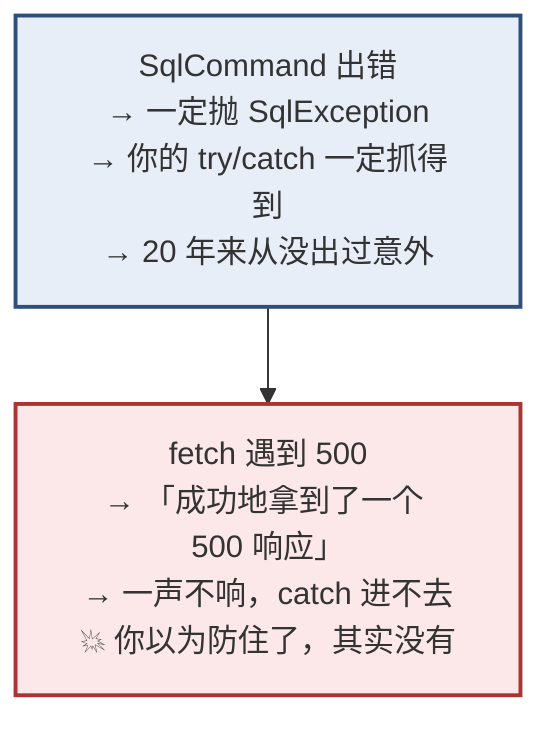
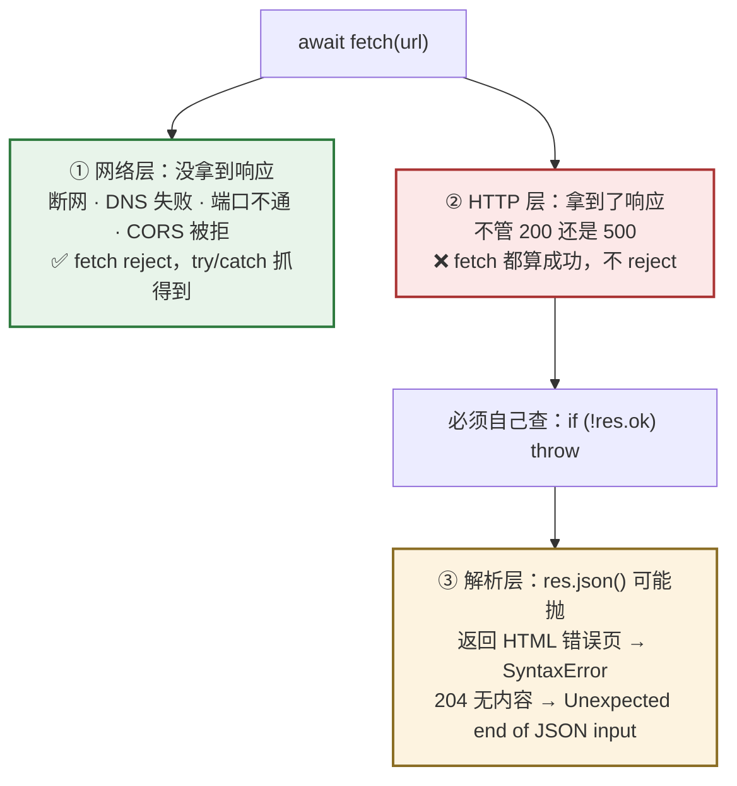
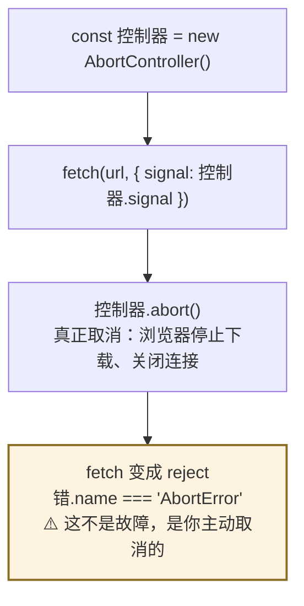
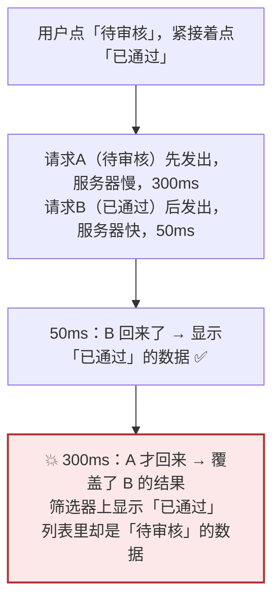

# Day 11 — 异步（二）：fetch 与真实数据

> **今天的定位**：**整个学习计划里最重要的一节。** 四个重点：
> 1. **⚠️ `fetch` 在 404 / 500 时不会 reject** —— 你的 `try/catch` 抓不住接口故障。**你 20 年的 WebForm 直觉在这里会主动害你**，而且那个报错原文会把你引向完全错误的方向
> 2. **三层错误** —— 网络层 / HTTP 层 / 解析层，只有第一层会让 `fetch` 失败
> 3. **`AbortController`** —— 真正取消请求，以及为什么「取消」不该弹错误提示
> 4. **竞态条件** —— 快速切换筛选条件时，先发的请求后返回，页面显示了错误的数据
>
> **时间**：2 小时
> **前置**：`day2-modules` 项目，`async-utils.js` 今天要用
> **本文所有输出均经 Node.js 24 实测**（含真实起本地 HTTP 服务器验证）

## 今天结束时你应该能做到

- [ ] **能解释为什么 `try/catch` 包住 `fetch` 仍然防不住接口 500**
- [ ] **每次 `fetch` 之后都写 `if (!res.ok) throw ...`**，形成肌肉记忆
- [ ] 认出那个误导性报错 `Unexpected token '<', "<!DOCTYPE "... is not valid JSON` 的真实含义
- [ ] 知道 `204 No Content` 时 `res.ok` 是 `true` 但 `res.json()` 会抛异常
- [ ] 会写一个健壮的 `请求()` 工具函数，一次性处理三层错误
- [ ] 会用 `URLSearchParams` 拼查询参数（含中文）
- [ ] **会用 `AbortController` 取消请求**，并知道 `e.name === 'AbortError'` 不该当错误处理
- [ ] 知道 `AbortSignal.timeout(ms)` 这个现代写法
- [ ] **能说清竞态条件是怎么产生的**，以及两种解法
- [ ] 知道 CORS 是什么，本地开发为什么要配 Vite proxy

## 时间分配

| 时段 | 内容 | 时长 |
| --- | --- | --- |
| 0 | 起一个本地假接口（准备工作） | 10 分钟 |
| 1 | **`fetch` 不会因 HTTP 错误而失败** | 25 分钟 |
| 2 | **三层错误与健壮的请求封装** | 25 分钟 |
| 3 | `fetch` 的完整用法 | 20 分钟 |
| 4 | **`AbortController`** | 20 分钟 |
| 5 | **竞态条件** | 15 分钟 |
| 6 | CORS 与 Vite proxy | 5 分钟 |

---

# 第 0 节：起一个本地假接口（10 分钟）

**今天要反复测试「接口返回 500 会怎样」，所以先给自己造一个能返回任意状态码的假接口。**

在 `day2-modules` 里新建 `假接口.mjs`：

```js
// 假接口.mjs —— 一个能按需返回各种响应的本地服务器
import http from 'node:http'

const 服务器 = http.createServer((req, res) => {
  const 地址 = new URL(req.url, 'http://x')

  switch (地址.pathname) {
    case '/ok': // 正常返回 JSON
      res.writeHead(200, { 'Content-Type': 'application/json' })
      return res.end(JSON.stringify({ 单号: 'SQ0001', 金额分: 4165 }))

    case '/500': // 服务器炸了，返回 HTML 错误页（这是最关键的场景）
      res.writeHead(500, { 'Content-Type': 'text/html' })
      return res.end('<!DOCTYPE html><html><body>Server Error</body></html>')

    case '/404': // 找不到，但返回了规范的 JSON 错误体
      res.writeHead(404, { 'Content-Type': 'application/json' })
      return res.end(JSON.stringify({ 错误: '申请单不存在' }))

    case '/401': // 未登录
      res.writeHead(401, { 'Content-Type': 'application/json' })
      return res.end(JSON.stringify({ 错误: '登录已过期' }))

    case '/204': // 删除成功，没有响应体
      res.writeHead(204)
      return res.end()

    case '/slow': // 慢接口，300ms 后才返回
      return setTimeout(() => {
        res.writeHead(200, { 'Content-Type': 'application/json' })
        res.end(JSON.stringify({ 慢: true }))
      }, 300)

    case '/echo': { // 把收到的东西原样返回，用于验证 POST
      let 体 = ''
      req.on('data', (块) => (体 += 块))
      return req.on('end', () => {
        res.writeHead(200, { 'Content-Type': 'application/json' })
        res.end(JSON.stringify({
          方法: req.method,
          类型: req.headers['content-type'],
          收到: 体,
          查询: 地址.search,
        }))
      })
    }

    default:
      res.writeHead(200)
      return res.end('plain')
  }
})

服务器.listen(3001, () => console.log('假接口已启动：http://127.0.0.1:3001'))
```

**开一个新的命令行窗口**，把它跑起来（今天全程让它开着）：

```bash
node 假接口.mjs
```

```
假接口已启动：http://127.0.0.1:3001
```

> **为什么要自己造假接口？** 因为你需要**可控地**制造 500、404、204、慢响应这些情况。真实接口不会配合你出错。
>
> **在线替代品**：`https://httpstat.us/500` 能返回任意状态码。但需要联网，而且服务可能不稳定 —— **本地的更可靠**。

---

# 第 1 节：`fetch` 不会因 HTTP 错误而失败（25 分钟）★★★

## 1.1 亲手看一遍

新建 `fetch1.mjs`（**另开一个命令行窗口**跑，别关掉假接口）：

```js
const 基址 = 'http://127.0.0.1:3001'

console.log('=== 用 try/catch 包住，请求一个必然 500 的接口 ===')
try {
  const res = await fetch(`${基址}/500`)

  console.log('fetch 执行完了，没有抛异常！')
  console.log('  res.ok         =', res.ok)
  console.log('  res.status     =', res.status)
  console.log('  res.statusText =', res.statusText)

  const 数据 = await res.json()          // ← 真正炸的地方在这里
  console.log('数据 =', 数据)
} catch (错) {
  console.log('catch 抓到了：')
  console.log('  错.name    =', 错.name)
  console.log('  错.message =', 错.message)
}
```

**实际输出：**

```
=== 用 try/catch 包住，请求一个必然 500 的接口 ===
fetch 执行完了，没有抛异常！
  res.ok         = false
  res.status     = 500
  res.statusText = Internal Server Error
catch 抓到了：
  错.name    = SyntaxError
  错.message = Unexpected token '<', "<!DOCTYPE "... is not valid JSON
```

## 1.2 这段输出里有三件事要看清

**第一件：`fetch` 那一行完全没有抛异常。**

它打印了「fetch 执行完了」，说明 `await fetch(...)` 顺利通过。**从 `Promise` 的角度看，这次请求是「成功」的** —— 状态是 `fulfilled`。

**第二件：`res.ok` 是 `false`，`res.status` 是 `500`。**

信息**全都在**，`fetch` 老老实实把 500 响应交给了你。**它只是不认为这是「失败」。**

**第三件：真正抛异常的是 `res.json()`，而且报错信息极具误导性。**

```
SyntaxError: Unexpected token '<', "<!DOCTYPE "... is not valid JSON
```

**你看到这行会想什么？** 大概是「JSON 解析出问题了」「后端返回的格式不对」「是不是编码问题」。

**真相是**：服务器挂了，返回的是一个 HTML 错误页（`<!DOCTYPE html>...`），而你拿它去当 JSON 解析。

> **这个报错会让你往完全错误的方向排查半天。** 记住它的真实含义：
>
> **`Unexpected token '<'` = 接口返回了 HTML，通常意味着 500 错误页、或者请求打到了前端路由（返回了 index.html）。**

## 1.3 ⭐ 你的 WebForm 直觉在这里会主动害你



**对照你熟悉的 C# 代码：**

```csharp
// C#：出错必抛异常，try/catch 一定能兜住
try {
    myConnection.Open();
    cmd.ExecuteNonQuery();      // 出错 → SqlException
} catch {
    Response.Write("<script>alert('Error！');</script>");
    return;
}
```

**这个模式你写了 20 年，从来没让你失望。** 所以你会自然而然地写出：

```js
// ❌ 看起来一模一样，但防不住接口故障
try {
  const res = await fetch('/api/申请单')
  const 数据 = await res.json()
  显示(数据)
} catch (错) {
  提示('出错了')        // 接口 500 时进不来（除非 json 解析也炸了）
}
```

**最坏的情况**：如果后端 500 时恰好返回了合法 JSON（比如 `{"error":"内部错误"}`），那么：

- `fetch` 不抛
- `res.json()` 也不抛
- **你的代码一路顺畅地往下走，拿着一个错误响应当正常数据用**
- 页面上显示一堆 `undefined`，`catch` 从头到尾没进去过

## 1.4 ✅ 唯一的解法：每次都手动检查 `res.ok`

```js
const res = await fetch(url)
if (!res.ok) {
  throw new Error(`请求失败：${res.status} ${res.statusText}`)
}
const 数据 = await res.json()
```

**`res.ok` 的定义：`status` 在 200–299 之间。**

```js
// 验证一下各种状态码的 res.ok
// 200 → true
// 204 → true      ⚠️ 注意这个，第 2.3 节讲
// 404 → false
// 401 → false
// 500 → false
```

**加上检查后重跑：**

```js
try {
  const res = await fetch(`${基址}/500`)
  if (!res.ok) throw new Error(`请求失败：${res.status} ${res.statusText}`)
  const 数据 = await res.json()
} catch (错) {
  console.log('这次抓到了：', 错.message)
  // 这次抓到了： 请求失败：500 Internal Server Error
}
```

**报错信息从「JSON 解析失败」变成了「请求失败：500」** —— 一眼就知道是接口的问题。

## 1.5 为什么 `fetch` 要这么设计

**不是缺陷，是刻意的。** `fetch` 的 `Promise` 只回答一个问题：

> **「我有没有从服务器拿到一个 HTTP 响应？」**

- 拿到了 → `fulfilled`，不管状态码是 200 还是 500
- 压根没拿到（断网、DNS 失败、连接被拒） → `rejected`

**理由**：500 是服务器的「正常回答」之一 —— 它成功地告诉你「我出错了」。这在协议层面是一次成功的通信。

> **你可以不同意这个设计**（很多人不同意），但你必须适应它。
>
> **好消息**：真实项目里你不会裸用 `fetch`。要么自己封一个（第 2 节），要么用 axios / TanStack Query（阶段 4 第 4 周）—— 它们都默认把 4xx/5xx 当错误抛出。**但你必须先理解底层为什么这样，否则封装出来的东西你自己都不放心。**

---

# 第 2 节：三层错误与健壮的请求封装（25 分钟）★

## 2.1 三层错误



| 层 | 典型原因 | `fetch` 会 reject 吗 | 怎么检测 |
| --- | --- | --- | --- |
| **① 网络层** | 断网、DNS 失败、端口不通、CORS 被拒、请求被取消 | ✅ **会** | `try/catch` |
| **② HTTP 层** | 400 / 401 / 403 / 404 / 409 / 500 | ❌ **不会** | **`if (!res.ok)`** |
| **③ 解析层** | 返回 HTML、返回空内容、格式不是 JSON | ❌ `fetch` 不管 | `res.json()` 会抛 `SyntaxError` |

**只有第①层会让 `fetch` 失败。②③ 都要你自己处理。**

## 2.2 网络层失败长什么样

```js
try {
  await fetch('http://127.0.0.1:1/nope')      // 端口 1 肯定连不上
} catch (错) {
  console.log('错.name    =', 错.name)
  console.log('错.message =', 错.message)
  console.log('错.cause   =', 错.cause?.message)
}
```

**Node 里的实际输出：**

```
错.name    = TypeError
错.message = fetch failed
错.cause   = bad port
```

**⚠️ 浏览器和 Node 的报错文字不一样：**

| 环境 | `错.message` | 真正原因在哪 |
| --- | --- | --- |
| **Node.js** | `fetch failed` | **`错.cause`** 里 |
| **浏览器** | `Failed to fetch` | ⚠️ 拿不到细节，要去 DevTools 的 Network 面板看 |

**注意 `错.name` 是 `TypeError`** —— 这个名字很怪（跟「类型」没关系），但标准就是这么定的。

> **浏览器里 `Failed to fetch` 是个信息量极低的报错**，它可能是：断网 / 服务器没起 / **CORS 被拒** / 请求被浏览器插件拦截。
>
> **排查顺序**：先看 DevTools 的 Network 面板（Day 1 学过）—— 那里能看到请求到底有没有发出去、被谁拒了。

## 2.3 ⚠️ `204 No Content` 的坑（实测发现）

**`DELETE` 和 `PUT` 接口经常返回 `204`（成功但没有响应体）。**

```js
const res = await fetch(`${基址}/204`)
console.log('res.ok     =', res.ok)          // true    ✅ 是成功
console.log('res.status =', res.status)      // 204

try {
  await res.json()
} catch (错) {
  console.log('但 res.json() 抛了：', 错.name, '|', 错.message)
  // 但 res.json() 抛了： SyntaxError | Unexpected end of JSON input
}
```

**所以「删除成功」也会抛异常** —— 因为你去解析一个空的响应体。

**✅ 解法：解析前先判断有没有内容。**

```js
// 方式一：看状态码
if (res.status === 204) return null

// 方式二：看 Content-Length —— ⚠️ 不可靠
if (res.headers.get('content-length') === '0') return null

// 方式三（最稳）：先读文本，有内容才解析
const 文本 = await res.text()
const 数据 = 文本 ? JSON.parse(文本) : null
```

**⚠️ 方式二有个陷阱，我实测过：** 真实的 `204` 响应**压根不会带 `Content-Length` 头**，所以 `res.headers.get('content-length')` 得到的是 **`null`**，不是 `'0'`。这个判断对 204 无效。

```js
const res = await fetch(`${基址}/204`)
console.log(res.headers.get('content-length'))    // null   ← 不是 '0'
```

**所以只有方式一和方式三可靠。方式三最稳**，因为它同时兜住了：

- `204 No Content`
- 后端返回了空字符串
- 后端偶尔忘记返回 body

> **这也是个小教训**：「看 `Content-Length` 判断有没有内容」是个听起来合理但实际不成立的做法。**HTTP 头是可选的，别依赖它一定存在。**

## 2.4 ✅ 封装一个健壮的 `请求()`

**把三层错误一次性处理掉。** 在 `async-utils.js` 里追加：

```js
/** 业务错误：接口返回了 4xx / 5xx */
export class 接口错误 extends Error {
  constructor(状态码, 状态文本, 响应体) {
    super(`请求失败：${状态码} ${状态文本}`)
    this.name = '接口错误'
    this.状态码 = 状态码
    this.响应体 = 响应体
  }
}

/** 网络错误：压根没连上 */
export class 网络错误 extends Error {
  constructor(原因) {
    super('网络连接失败，请检查网络后重试')
    this.name = '网络错误'
    this.cause = 原因
  }
}

/**
 * 健壮的请求封装：三层错误全部处理
 */
export async function 请求(地址, 选项 = {}) {
  let res

  // ===== 第①层：网络层 =====
  try {
    res = await fetch(地址, 选项)
  } catch (错) {
    if (错.name === 'AbortError') throw 错        // 主动取消，原样抛出（第 4 节）
    throw new 网络错误(错)
  }

  // ===== 第②层：HTTP 层 =====
  if (!res.ok) {
    // 尽力读出后端返回的错误信息（可能是 JSON，也可能是 HTML）
    let 响应体 = null
    try {
      const 文本 = await res.text()
      响应体 = 文本 ? (文本.trimStart().startsWith('{') ? JSON.parse(文本) : 文本) : null
    } catch {
      响应体 = null
    }
    throw new 接口错误(res.status, res.statusText, 响应体)
  }

  // ===== 第③层：解析层 =====
  if (res.status === 204) return null
  const 文本 = await res.text()
  if (!文本) return null
  try {
    return JSON.parse(文本)
  } catch {
    throw new Error(`响应不是合法 JSON（可能是 HTML 错误页）：${文本.slice(0, 60)}`)
  }
}
```

**用起来：**

```js
import { 请求, 接口错误, 网络错误 } from './async-utils.js'

const 试一下 = async (路径) => {
  try {
    const 数据 = await 请求(`http://127.0.0.1:3001${路径}`)
    return `✅ 成功：${JSON.stringify(数据)}`
  } catch (错) {
    if (错 instanceof 接口错误) return `❌ 接口错误 ${错.状态码}：${JSON.stringify(错.响应体)}`
    if (错 instanceof 网络错误) return `❌ 网络错误：${错.message}`
    return `❌ 其他：${错.message}`
  }
}

console.log(await 试一下('/ok'))
// ✅ 成功：{"单号":"SQ0001","金额分":4165}

console.log(await 试一下('/404'))
// ❌ 接口错误 404：{"错误":"申请单不存在"}

console.log(await 试一下('/500'))
// ❌ 接口错误 500："<!DOCTYPE html><html><body>Server Error</body></html>"

console.log(await 试一下('/204'))
// ✅ 成功：null
```

**四种情况全部被正确分类了。** 注意 `/500` 那条 —— 它现在报的是「接口错误 500」，而不是那个误导性的 JSON 解析错误。

## 2.5 按状态码分类处理

**企业系统里不同状态码要有不同反应：**

```js
const 处理接口错误 = (错) => {
  if (!(错 instanceof 接口错误)) return '系统异常，请联系管理员'

  switch (错.状态码) {
    case 400: return `提交的数据有问题：${错.响应体?.错误 ?? ''}`
    case 401: return '登录已过期，请重新登录'      // 通常还要跳登录页
    case 403: return '你没有权限执行此操作'
    case 404: return '记录不存在，可能已被他人删除'
    case 409: return '数据已被他人修改，请刷新后重试'   // 乐观锁冲突
    case 422: return `校验未通过：${错.响应体?.错误 ?? ''}`
    default:
      if (错.状态码 >= 500) return '服务器繁忙，请稍后重试'
      return `请求失败（${错.状态码}）`
  }
}
```

**HTTP 状态码常识（做后台够用）：**

| 码 | 含义 | 前端该怎么做 |
| --- | --- | --- |
| **200** | 成功 | 正常处理 |
| **201** | 创建成功 | 通常返回新建的记录 |
| **204** | 成功但无内容 | 删除/更新成功，**别去 `json()`** |
| **400** | 请求数据有问题 | 显示后端给的具体错误 |
| **401** | 未登录 / token 过期 | **跳登录页** |
| **403** | 已登录但没权限 | 提示无权限，别跳登录页 |
| **404** | 资源不存在 | 提示记录已不存在 |
| **409** | 冲突（并发修改） | 提示刷新重试 |
| **422** | 校验失败 | 把错误定位到具体字段 |
| **500** | 服务器内部错误 | 通用提示 + 上报日志 |
| **502 / 504** | 网关错误 / 超时 | 提示稍后重试 |

> **401 和 403 的区别很重要**：401 是「你是谁我不知道」（跳登录），403 是「我知道你是谁，但你不能干这事」（别跳登录，否则用户会困惑）。

---

# 第 3 节：`fetch` 的完整用法（20 分钟）

## 3.1 GET 与响应读取

```js
const res = await fetch('http://127.0.0.1:3001/ok')

console.log(res.ok)                            // true
console.log(res.status)                        // 200
console.log(res.statusText)                    // 'OK'
console.log(res.headers.get('content-type'))   // 'application/json'

const 数据 = await res.json()
console.log(数据)                              // { 单号: 'SQ0001', 金额分: 4165 }
```

**响应体只能读一次：**

```js
const res2 = await fetch('http://127.0.0.1:3001/ok')
await res2.json()
try {
  await res2.json()                            // 💥 第二次读
} catch (错) {
  console.log(错.name)                         // 'TypeError'（body 已被消费）
}
```

**所以第 2.4 节的封装里，我们只读一次 `text()` 然后自己 `JSON.parse`** —— 这样既能拿到原文（出错时用于诊断），又不会重复读。

**三种读法：**

| 方法 | 得到 | 用在 |
| --- | --- | --- |
| `res.json()` | 解析后的对象 | 接口返回 JSON |
| `res.text()` | 原始字符串 | 不确定格式、或要看原文 |
| `res.blob()` | 二进制 | 下载文件（Day 13） |

## 3.2 查询参数：`URLSearchParams`

```js
const 参数 = new URLSearchParams({
  状态: '待审核',
  页码: '1',
  每页: '20',
})

console.log(参数.toString())
// %E7%8A%B6%E6%80%81=%E5%BE%85%E5%AE%A1%E6%A0%B8&%E9%A1%B5%E7%A0%81=1&%E6%AF%8F%E9%A1%B5=20
```

**中文被自动 URL 编码了** —— 这正是你要的。如果手工拼字符串：

```js
// ❌ 中文和特殊字符没编码，参数里有 & 或 = 就会出错
const 差 = `/api/列表?状态=${状态}&关键词=${关键词}`

// ✅ 自动编码
const 好 = `/api/列表?${new URLSearchParams({ 状态, 关键词 })}`
```

**注意 `${new URLSearchParams(...)}` 直接放进模板字符串就会自动调 `toString()`。**

**动态构造（跳过空值）：**

```js
const 建查询 = (条件) => {
  const 参数 = new URLSearchParams()
  for (const [键, 值] of Object.entries(条件)) {
    if (值 !== undefined && 值 !== null && 值 !== '') {
      参数.set(键, String(值))
    }
  }
  return 参数.toString()
}

console.log(建查询({ 状态: '待审核', 关键词: '', 页码: 1 }))
// %E7%8A%B6%E6%80%81=%E5%BE%85%E5%AE%A1%E6%A0%B8&%E9%A1%B5%E7%A0%81=1
// 关键词为空串，被跳过了
```

**这个函数在做「多条件筛选」的列表页时天天用** —— 用户没填的条件不该出现在 URL 里。

> 注意 `值 !== ''` 这个判断 —— 不能用 `if (值)`，因为**数字 `0` 是合法值但是假值**（Day 4 的坑）。

## 3.3 POST

```js
const res = await fetch('http://127.0.0.1:3001/echo', {
  method: 'POST',
  headers: { 'Content-Type': 'application/json' },
  body: JSON.stringify({ 单号: 'SQ0001', 金额分: 4165 }),
})

console.log(await res.json())
// {
//   方法: 'POST',
//   类型: 'application/json',
//   收到: '{"单号":"SQ0001","金额分":4165}',
//   查询: ''
// }
```

**三个必写项：**

| 项 | 值 | 忘了会怎样 |
| --- | --- | --- |
| `method` | `'POST'` / `'PUT'` / `'DELETE'` / `'PATCH'` | 默认是 GET，后端收不到数据 |
| `headers` 里的 `Content-Type` | `'application/json'` | **后端可能解析不出 body** |
| `body` | **`JSON.stringify(对象)`** | 直接传对象会变成 `[object Object]` |

**最常见的错误：忘了 `JSON.stringify`。**

```js
// ❌ 直接传对象
body: { 单号: 'SQ0001' }        // 实际发出去的是字符串 "[object Object]"

// ✅
body: JSON.stringify({ 单号: 'SQ0001' })
```

> **回想 Day 3 第 4.4 节**：`JSON.stringify` 会**悄悄删掉值为 `undefined` 的字段**。所以「清空某个字段」要传 `null` 而不是 `undefined`。这条在 POST/PATCH 时格外重要。

## 3.4 认证头

```js
const res = await fetch(url, {
  headers: {
    'Content-Type': 'application/json',
    Authorization: `Bearer ${令牌}`,       // JWT 的标准写法
  },
})
```

**⚠️ 别把令牌硬编码在代码里**（Day 1 讲过：前端代码全部可见）。它应该来自登录接口的返回，存在内存或 `sessionStorage`（Day 13 讲存储）。

## 3.5 完整的封装（把查询参数也纳入）

```js
const 接口基址 = 'http://127.0.0.1:3001'

export const API = {
  get: (路径, 条件) => 请求(`${接口基址}${路径}${条件 ? `?${建查询(条件)}` : ''}`),

  post: (路径, 数据) =>
    请求(`${接口基址}${路径}`, {
      method: 'POST',
      headers: { 'Content-Type': 'application/json' },
      body: JSON.stringify(数据),
    }),

  del: (路径) => 请求(`${接口基址}${路径}`, { method: 'DELETE' }),
}

// 用起来就很清爽了
// const 列表 = await API.get('/申请单', { 状态: '待审核', 页码: 1 })
// const 新单 = await API.post('/申请单', { 金额分: 4165 })
// await API.del('/申请单/1')
```

**真实项目里这层封装通常放在 `src/api/` 目录下**，业务代码只调 `API.get(...)`，不直接碰 `fetch`。

---

# 第 4 节：`AbortController`（20 分钟）★

## 4.1 为什么需要取消请求

**三个场景：**

1. **用户切走了页面** —— 请求还在跑，返回后想更新一个已经卸载的组件（React 会警告）
2. **用户快速切换筛选条件** —— 旧请求的结果已经没用了（第 5 节的竞态条件）
3. **超时** —— 等太久了，不等了

## 4.2 基本用法



```js
const 控制器 = new AbortController()

// 50ms 后取消（那个接口要 300ms 才返回）
setTimeout(() => 控制器.abort(), 50)

try {
  await fetch('http://127.0.0.1:3001/slow', { signal: 控制器.signal })
} catch (错) {
  console.log('错.name             =', 错.name)             // 'AbortError'
  console.log('错.constructor.name =', 错.constructor.name) // 'DOMException'
  console.log('错.message          =', 错.message)          // 'This operation was aborted'
}
```

**⚠️ 注意 `错.constructor.name` 是 `DOMException`，只有 `错.name` 是 `AbortError`。**

> **这就是 Day 10 第 4.5 节那条规矩的实战场景**：判断内置错误一律用 `错.name`。如果你写 `错.constructor.name === 'AbortError'`，永远为假。

## 4.3 ⭐ 取消不是错误，不要弹提示

**这是一个非常常见的体验 bug：**

```js
// ❌ 用户切换了筛选条件，屏幕上弹出「网络错误」
try {
  const 数据 = await fetch(url, { signal })
} catch (错) {
  提示('请求失败')      // 主动取消也会走到这里，用户莫名收到一个错误提示
}

// ✅ 主动取消要单独放行
try {
  const 数据 = await fetch(url, { signal })
} catch (错) {
  if (错.name === 'AbortError') return      // ← 静默返回，什么都不做
  提示(`请求失败：${错.message}`)
}
```

**第 2.4 节那个 `请求()` 封装里已经处理了这一条：**

```js
if (错.name === 'AbortError') throw 错        // 原样抛出，不包装成「网络错误」
```

**这样调用方能用 `错.name === 'AbortError'` 识别出来并静默忽略。**

## 4.4 `AbortSignal.timeout()` —— 现代写法

**如果你只是想要超时，不用手写 `setTimeout` + `abort`：**

```js
try {
  await fetch('http://127.0.0.1:3001/slow', { signal: AbortSignal.timeout(50) })
} catch (错) {
  console.log(错.name)       // 'TimeoutError'
  console.log(错.message)    // 'The operation was aborted due to timeout'
}
```

**注意 `name` 是 `TimeoutError` 而不是 `AbortError`** —— 所以你能区分「超时」和「用户主动取消」，分别给不同提示。

| 取消方式 | `错.name` | 该怎么提示用户 |
| --- | --- | --- |
| `控制器.abort()` | `AbortError` | **什么都不提示**（是我们主动取消的） |
| `AbortSignal.timeout(ms)` | `TimeoutError` | 「请求超时，请重试」 |

## 4.5 和 Day 10 的 `Promise.race` 超时对比

Day 10 第 5.6 节用 `race` 实现了超时。**对比一下：**

| | `Promise.race` + `sleep` | `AbortController` |
| --- | --- | --- |
| 超时后请求还在跑吗 | ✅ **还在跑**，只是结果被丢弃 | ❌ **真的停了**，连接关闭 |
| 浪费带宽 / 服务器资源 | ✅ 浪费 | ❌ 不浪费 |
| 能手动取消吗 | ❌ 不能 | ✅ 能 |
| 适用范围 | 任何 Promise | 只有支持 `signal` 的 API |

**规矩：能用 `AbortController` 就别用 `race`。**

## 4.6 组合多个信号（了解）

```js
// 既要「用户可手动取消」又要「10 秒自动超时」
const 控制器 = new AbortController()
const 信号 = AbortSignal.any([控制器.signal, AbortSignal.timeout(10_000)])
// fetch(url, { signal: 信号 })
```

`AbortSignal.any([...])` 任一个触发就取消。**知道有这个就行。**

> 注意 `10_000` 这个写法 —— **数字里的下划线是分隔符**，等于 `10000`，只为了好读。这是 ES2021 的特性，写大数字（金额分、超时毫秒）时很有用。

## 4.7 在 React 里的位置（预告）

```jsx
// 阶段 4 第 2 周会写到的样子
useEffect(() => {
  const 控制器 = new AbortController()

  const 加载 = async () => {
    try {
      const 数据 = await 请求(url, { signal: 控制器.signal })
      set数据(数据)
    } catch (错) {
      if (错.name === 'AbortError') return       // 组件卸载导致的取消，忽略
      set错误(错.message)
    }
  }
  加载()

  return () => 控制器.abort()         // ← 组件卸载 / 依赖变化时取消
}, [url])
```

**Day 6 第 6.3 节的原则：凡是「注册」了什么，就要有对应的「注销」。** 这里 `return () => 控制器.abort()` 就是注销。

> **但实务上你大概不会手写这段** —— 阶段 4 第 4 周会用 **TanStack Query**，它自动处理取消、缓存、竞态、重试。**先理解原理，再用工具。**

---

# 第 5 节：竞态条件（15 分钟）★

## 5.1 它是怎么发生的



**关键在于：请求的返回顺序不等于发出顺序。** 网络延迟、服务器负载、缓存命中，都会打乱顺序。

## 5.2 用纯 JS 复现

```js
const 假请求 = (标签, 延迟) =>
  new Promise((resolve) => setTimeout(() => resolve(`${标签}的数据`), 延迟))

// ❌ 无保护版本
let 界面显示 = '（空）'
const 加载 = async (标签, 延迟) => {
  const 数据 = await 假请求(标签, 延迟)
  界面显示 = 数据            // 谁后回来谁覆盖
}

// 用户先点「待审核」（慢），紧接着点「已通过」（快）
加载('待审核', 300)
加载('已通过', 50)

await new Promise((r) => setTimeout(r, 400))
console.log('最终界面显示：', 界面显示)
// 最终界面显示： 待审核的数据      💥 用户点的是「已通过」！
```

**输出是「待审核的数据」** —— 因为它虽然先发出，但最后才回来，覆盖了正确的结果。

## 5.3 解法一：`AbortController`（推荐）

**发新请求前，取消上一个。**

```js
let 当前控制器 = null

const 加载2 = async (标签, 延迟) => {
  当前控制器?.abort()                     // 取消上一个（?. 兜住第一次为 null）
  const 控制器 = new AbortController()
  当前控制器 = 控制器

  try {
    const 数据 = await 可取消的请求(标签, 延迟, 控制器.signal)
    界面显示2 = 数据
  } catch (错) {
    if (错.name === 'AbortError') return   // 被取消了，静默忽略
    throw 错
  }
}
```

**效果**：请求 A 在 B 发出的瞬间就被取消了，它的结果永远不会回来覆盖 B。

**额外好处**：真的省了带宽和服务器资源。

## 5.4 解法二：只认最后一次请求（不需要取消能力时）

**给每次请求编号，只接受最新那个编号的结果。**

```js
let 最新编号 = 0
let 界面显示3 = '（空）'

const 加载3 = async (标签, 延迟) => {
  const 我的编号 = ++最新编号             // 领一个号
  const 数据 = await 假请求(标签, 延迟)

  if (我的编号 !== 最新编号) return       // 我不是最新的了，结果作废
  界面显示3 = 数据
}

加载3('待审核', 300)
加载3('已通过', 50)

await new Promise((r) => setTimeout(r, 400))
console.log('最终界面显示：', 界面显示3)
// 最终界面显示： 已通过的数据      ✅ 正确了
```

**这次输出正确。** 请求 A 回来时发现 `我的编号(1) !== 最新编号(2)`，直接丢弃。

**在 React 里这个模式叫「忽略过期响应」**，用一个 `useRef` 存最新编号（`useRef` 的值在多次渲染间保持，Day 6 第 5.4 节讲过）。

## 5.5 两种解法怎么选

| | `AbortController` | 编号法 |
| --- | --- | --- |
| 真正停止请求 | ✅ | ❌ 请求还在跑 |
| 省带宽 | ✅ | ❌ |
| 适用范围 | 只有支持 `signal` 的 API | **任何异步操作** |
| 代码量 | 略多 | 略少 |

**规矩：优先 `AbortController`；对不支持 `signal` 的异步操作（比如某个第三方 SDK）用编号法。**

## 5.6 实务：这类问题最终交给库

**竞态、取消、缓存、重试、去重 —— 这些都是「取数据」的通用问题。**

阶段 4 第 4 周会学 **TanStack Query**，它默认处理了全部这些：

```jsx
// TanStack Query 的写法，竞态和取消它自动处理
const { data, isLoading, error } = useQuery({
  queryKey: ['申请单', 状态, 页码],
  queryFn: ({ signal }) => API.get('/申请单', { 状态, 页码 }, { signal }),
})
```

> **那为什么今天还要学原理？** 两个理由：
> 1. 库出问题时你得看得懂它在做什么
> 2. **不是所有异步都能用库包住** —— 表单提交、文件上传、WebSocket，你还是要自己处理

---

# 第 6 节：CORS 与 Vite proxy（5 分钟）

## 6.1 同源策略

**浏览器规定：网页只能请求「同源」的地址。** 同源 = 协议 + 域名 + 端口三者完全一致。

| 你的页面 | 要请求的地址 | 同源吗 |
| --- | --- | --- |
| `http://localhost:5173` | `http://localhost:5173/api/x` | ✅ |
| `http://localhost:5173` | `http://localhost:3001/api/x` | ❌ **端口不同** |
| `http://localhost:5173` | `https://localhost:5173/api/x` | ❌ 协议不同 |
| `http://a.com` | `http://api.a.com` | ❌ 域名不同 |

**跨源请求需要服务器明确同意**（返回 `Access-Control-Allow-Origin` 响应头），这套机制叫 **CORS**。

## 6.2 为什么本地开发必然撞上

**Vite 开发服务器在 `localhost:5173`，你们的后端在别的端口或别的机器上。** 于是每个接口请求都是跨源的。

**CORS 被拒时的表现：**

- `fetch` **reject**（属于第 2.1 节的第①层网络错误）
- 浏览器里 `错.message` 是 `Failed to fetch` —— **信息量极低**
- 真正的原因在 **DevTools 控制台的一条独立红色警告**里，写着 `blocked by CORS policy`
- **JS 代码拿不到任何 CORS 细节**（这是安全设计）

> **所以看到 `Failed to fetch` 时，第一件事是看 DevTools 的 Console 和 Network 面板**，别在代码里瞎猜。

## 6.3 ✅ 解法：Vite proxy

**在 `vite.config.ts` 里配一个代理，让请求「看起来」是同源的：**

```ts
export default defineConfig({
  plugins: [react()],
  server: {
    proxy: {
      // 所有 /api 开头的请求，转发到后端
      '/api': {
        target: 'http://127.0.0.1:3001',
        changeOrigin: true,
      },
    },
  },
})
```

**配好之后，前端代码里请求 `/api/申请单`：**

```js
await fetch('/api/申请单')      // 浏览器看到的是同源请求，没有 CORS 问题
```

**原理**：浏览器请求 `localhost:5173/api/申请单`（同源，放行）→ Vite 开发服务器在**服务端**把它转发给 `127.0.0.1:3001`。**服务器之间通信不受同源策略约束。**

**注意 `fetch('/api/...')` 用的是相对路径**，不带域名。这样：

- 开发环境走 Vite proxy
- 生产环境走 Nginx / IIS 的反向代理

**同一份代码，两个环境都能用**，不需要判断环境。

> **生产环境怎么办**：通常前端静态文件和后端 API 挂在同一个域名下（`/` 给前端，`/api` 反向代理到后端），这样根本没有跨源问题。**这个配置由运维/网关负责**，你只要保证前端用相对路径。

---

# 今日验收清单

- [ ] `假接口.mjs` 跑起来了，能访问 `/ok` `/500` `/404` `/204` `/slow`
- [ ] **亲眼看到「`try/catch` 包住 `fetch`，接口 500 却没进 `catch`」**
- [ ] 看到过 `res.ok = false` / `res.status = 500` 但 `fetch` 没抛异常
- [ ] **认得 `Unexpected token '<', "<!DOCTYPE "... is not valid JSON` 的真实含义**（接口返回了 HTML 错误页）
- [ ] **每次 `fetch` 后都写 `if (!res.ok) throw ...`**
- [ ] 知道 `res.ok` 的定义是 status 在 200–299
- [ ] 能说出三层错误分别是什么、`fetch` 只对哪一层 reject
- [ ] 知道 Node 里网络失败是 `fetch failed`（真因在 `错.cause`）、浏览器里是 `Failed to fetch`
- [ ] **知道 `204` 时 `res.ok` 是 `true` 但 `res.json()` 会抛 `Unexpected end of JSON input`**
- [ ] `请求()` 封装写好了，四种情况（成功/404/500/204）都验证过
- [ ] 知道 401（跳登录）和 403（不跳登录）的区别
- [ ] 知道响应体只能读一次
- [ ] **会用 `URLSearchParams` 拼参数**，知道它自动编码中文
- [ ] 会写「跳过空值」的查询构造函数，知道不能用 `if (值)` 判断（`0` 是合法值）
- [ ] POST 三件套：`method` / `Content-Type` / **`JSON.stringify(body)`**
- [ ] **会用 `AbortController`**，知道 `错.name === 'AbortError'`
- [ ] 知道 `错.constructor.name` 是 `DOMException`，判断必须用 `错.name`
- [ ] **知道「主动取消」不该给用户弹错误提示**
- [ ] 会用 `AbortSignal.timeout(ms)`，知道它的 `name` 是 `TimeoutError`
- [ ] 知道 `AbortController` 比 `Promise.race` 超时好在哪
- [ ] **能说清竞态条件的产生过程**
- [ ] 跑过 5.2 那段，看到「最终显示的是先发出但后返回的那个错误结果」
- [ ] 会写编号法（只认最后一次请求）
- [ ] 知道同源的定义（协议 + 域名 + 端口）
- [ ] 知道 CORS 被拒时 JS 拿不到细节，要看 DevTools
- [ ] 知道 Vite proxy 的作用，以及为什么前端要用相对路径 `/api/...`

---

# 常见问题排查

## `Unexpected token '<', "<!DOCTYPE "... is not valid JSON`

**不是 JSON 解析问题。** 接口返回了 HTML，两种可能：

1. 后端 500 了，返回的是错误页 → 加 `if (!res.ok)` 检查就能看到真实状态码
2. 请求路径写错，打到了前端路由，返回了 `index.html` → 检查 URL 和 proxy 配置

第 1.2 节。

## 接口明明 500 了，`catch` 却没进去

`fetch` 不把 HTTP 错误状态当失败。必须 `if (!res.ok) throw ...`。第 1.4 节。

## 删除成功了，但代码抛了 `Unexpected end of JSON input`

接口返回 `204 No Content`，响应体是空的。解析前先判断。第 2.3 节。

## 浏览器报 `TypeError: Failed to fetch`，看不出原因

信息量极低的报错。**去 DevTools 看 Console 和 Network 面板**，常见原因：后端没起、端口写错、**CORS 被拒**。第 2.2 / 6.2 节。

## Node 里报 `TypeError: fetch failed`

真正原因在 `错.cause` 里。第 2.2 节。

## POST 的数据后端收不到

三个检查点：① 有没有写 `method: 'POST'`；② 有没有 `Content-Type: application/json`；③ **`body` 有没有 `JSON.stringify`**。第 3.3 节。

## 提交时某个字段莫名消失了

`JSON.stringify` 会删掉值为 `undefined` 的字段。要表达「清空」请传 `null`。Day 3 第 4.4 节。

## `Body has already been read` / `TypeError` 且涉及 `res.json()`

响应体只能读一次。第 3.1 节。

## 用户切换筛选后，屏幕上弹出「请求失败」

主动取消（`AbortError`）被当成错误处理了。要 `if (错.name === 'AbortError') return`。第 4.3 节。

## `错.constructor.name === 'AbortError'` 永远为假

`constructor.name` 是 `DOMException`。用 `错.name`。第 4.2 节 / Day 10 第 4.5 节。

## 快速切换筛选条件后，列表数据和筛选器不匹配

竞态条件。用 `AbortController` 或编号法。第 5 节。

## 本地开发所有接口都报 CORS 错误

配 Vite proxy，前端改用相对路径 `/api/...`。第 6.3 节。

## 查询参数里的中文变成乱码

手工拼字符串没做 URL 编码。用 `URLSearchParams`。第 3.2 节。

---

# 今天不需要理解的东西

| 你会看到 | 什么时候学 |
| --- | --- |
| `FormData` 上传文件、`Blob` 下载文件 | **明天 Day 13** |
| `localStorage` 存令牌 | 明天 Day 13 |
| `useEffect` 里怎么组织请求 | 阶段 4 第 2 周 |
| **TanStack Query**（真实项目的取数方案） | 阶段 4 第 4 周 |
| axios 和 `fetch` 的取舍 | 阶段 4 第 4 周 |
| JWT 的原理、刷新令牌流程 | 需要时再学 |
| HTTP 缓存头（`ETag` / `Cache-Control`） | **暂时不用** |
| CORS 预检请求（`OPTIONS`）的细节 | 知道有这回事就行 |
| `Request` / `Response` 对象的完整 API | 用到再查 |

---

# 作业（25 分钟）

## 作业 1：补全请求封装

在 `async-utils.js` 里完成：

```js
/**
 * 带重试的请求：只对「网络错误」和「5xx」重试，4xx 不重试
 * 因为 4xx 是你自己的请求有问题，重试一百次也一样
 */
export async function 请求带重试(地址, 选项 = {}, 次数 = 3) {
  // TODO：用 Day 10 的重试思路 + 今天的错误分类
}

/**
 * 把「跳过空值」的查询构造独立出来
 * 建查询({ 状态: '待审核', 关键词: '', 页码: 1, 已删除: false })
 *   → 状态和页码和已删除保留，关键词跳过
 * 注意：0 和 false 是合法值，必须保留！
 */
export function 建查询(条件) {
  // TODO
}

/**
 * 安全解析响应：204 或空体返回 null，非 JSON 抛带原文的错误
 */
export async function 安全解析(res) {
  // TODO
}
```

自测：

| 调用 | 期望 |
| --- | --- |
| `建查询({ 页码: 0 })` | 包含 `页码=0`（**不能因为 0 是假值就跳过**） |
| `建查询({ 已删除: false })` | 包含 `已删除=false` |
| `建查询({ 关键词: '' })` | **空字符串** |
| `建查询({ 状态: '待审核' })` | URL 编码后的中文 |
| `请求带重试('/500')` 3 次 | 尝试 3 次后抛出 |
| `请求带重试('/404')` | **只尝试 1 次**（4xx 不重试） |

<details>
<summary>提示（卡住了再看）</summary>

- `请求带重试`：`for` 循环里 `try { return await 请求(...) } catch (错)`，然后判断 `错 instanceof 接口错误 && 错.状态码 < 500` 就直接 `throw`（不重试）
- `建查询`：判断条件写 `值 !== undefined && 值 !== null && 值 !== ''`，**不要写 `if (值)`**
- `安全解析`：`if (res.status === 204) return null`，然后 `const 文本 = await res.text()`，空则 `null`，否则 `JSON.parse` 并用 `try/catch` 包住

</details>

## 作业 2：找出并修复 9 个问题

```jsx
function 申请单列表() {
  const [列表, set列表] = useState([])
  const [状态, set状态] = useState('待审核')
  const [关键词, set关键词] = useState('')

  const 加载 = async () => {
    try {
      const res = await fetch(`/api/申请单?状态=${状态}&关键词=${关键词}`)
      const 数据 = await res.json()
      set列表(数据)
    } catch (错) {
      alert('网络错误')
    }
  }

  const 保存 = async (单) => {
    const res = await fetch('/api/申请单', {
      method: 'POST',
      body: 单,
    })
    return res.json()
  }

  const 删除 = async (id) => {
    const res = await fetch(`/api/申请单/${id}`, { method: 'DELETE' })
    const 结果 = await res.json()
    alert('删除成功')
  }

  useEffect(() => {
    加载()
  }, [状态, 关键词])

  return <div>{列表.length} 条</div>
}
```

<details>
<summary>点开看答案</summary>

| # | 问题 | 修复 |
| --- | --- | --- |
| 1 | **没有检查 `res.ok`** —— 接口 500 时把错误响应当数据用 | `if (!res.ok) throw new Error(...)` |
| 2 | 查询参数**手工拼接，中文没编码**，`关键词` 里有 `&` 就会破坏 URL | `new URLSearchParams({ 状态, 关键词 })` |
| 3 | `关键词` 为空串时也拼进了 URL（`关键词=`） | 用「跳过空值」的 `建查询` |
| 4 | `catch` 里一律 `alert('网络错误')` —— 把 HTTP 错误、解析错误都说成网络错误，误导排查 | 按错误类型分别提示 |
| 5 | **没有 `AbortController`** —— 用户快速改筛选条件会产生竞态，列表和筛选器不匹配 | `useEffect` 里建控制器，`return () => 控制器.abort()` |
| 6 | `保存` 的 `body: 单` **没有 `JSON.stringify`** | `body: JSON.stringify(单)` |
| 7 | `保存` **缺 `Content-Type: application/json`**，后端可能解析不出 | 加 `headers` |
| 8 | `保存` 也没检查 `res.ok` | 同 #1 |
| 9 | `删除` 接口通常返回 **204**，`res.json()` 会抛 `Unexpected end of JSON input` | 判断 `res.status === 204` 或用 `安全解析` |

**另外两个非错误但该改的**：缺 loading 状态；`alert` 应换成正式的提示组件。

**参考修复版（用上第 2.4 / 3.5 节的封装）：**

```jsx
function 申请单列表() {
  const [列表, set列表] = useState([])
  const [状态, set状态] = useState('待审核')
  const [关键词, set关键词] = useState('')
  const [加载中, set加载中] = useState(false)
  const [错误, set错误] = useState('')

  useEffect(() => {
    const 控制器 = new AbortController()

    const 加载 = async () => {
      set加载中(true)
      set错误('')
      try {
        // ✅ 用封装：自动检查 res.ok、自动处理 204、参数自动编码且跳过空值
        const 数据 = await API.get('/api/申请单', { 状态, 关键词 }, {
          signal: 控制器.signal,
        })
        set列表(数据)
      } catch (错) {
        if (错.name === 'AbortError') return          // ✅ 主动取消，静默
        set错误(处理接口错误(错))                      // ✅ 按类型给具体提示
      } finally {
        set加载中(false)
      }
    }
    加载()

    return () => 控制器.abort()                       // ✅ 取消上一次请求
  }, [状态, 关键词])

  const 保存 = async (单) => {
    return await API.post('/api/申请单', 单)          // ✅ 封装里已含三件套
  }

  const 删除 = async (id) => {
    await API.del(`/api/申请单/${id}`)                // ✅ 封装里已处理 204
    提示('删除成功')
  }

  if (加载中) return <div>加载中…</div>
  if (错误) return <div className="错误">{错误}</div>
  return <div>{列表.length} 条</div>
}
```

**第 1 和第 5 个最严重** —— 前者让接口故障静默通过，后者让用户看到错误的数据却毫不知情。

</details>

## 作业 3：预测输出（先跑起假接口，再作答）

```js
const 基址 = 'http://127.0.0.1:3001'

// ①②③
const r1 = await fetch(`${基址}/500`)
console.log('①', r1.ok, r1.status)
try { await r1.json() } catch (e) { console.log('②', e.name) }

// ③
const r2 = await fetch(`${基址}/204`)
console.log('③', r2.ok, r2.status)
try { await r2.json() } catch (e) { console.log('④', e.message) }

// ⑤
try { await fetch('http://127.0.0.1:1/x') } catch (e) { console.log('⑤', e.name, e.message) }

// ⑥
const c = new AbortController()
setTimeout(() => c.abort(), 20)
try { await fetch(`${基址}/slow`, { signal: c.signal }) }
catch (e) { console.log('⑥', e.name, e.constructor.name) }

// ⑦
try { await fetch(`${基址}/slow`, { signal: AbortSignal.timeout(20) }) }
catch (e) { console.log('⑦', e.name) }

// ⑧
console.log('⑧', new URLSearchParams({ 状态: '待审核' }).toString())

// ⑨
const r3 = await fetch(`${基址}/ok`)
await r3.json()
try { await r3.json() } catch (e) { console.log('⑨', e.name) }
```

<details>
<summary>点开看答案</summary>

```
① false 500                              fetch 没抛，信息全在 res 上
② SyntaxError                            解析 HTML 时才炸
③ true 204                               ⚠️ 204 的 res.ok 是 true！
④ Unexpected end of JSON input           ⚠️ 空响应体解析失败
⑤ TypeError fetch failed                 网络层失败（浏览器里是 Failed to fetch）
⑥ AbortError DOMException                ⚠️ name 和 constructor.name 不同
⑦ TimeoutError                           超时和主动取消可以区分
⑧ %E7%8A%B6%E6%80%81=%E5%BE%85%E5%AE%A1%E6%A0%B8    自动 URL 编码
⑨ TypeError                              响应体只能读一次
```

**① 是今天全部内容的核心**：`fetch` 拿到 500 也算成功。

**③④ 是很多人踩过的坑**：`204` 明明是成功状态，却不能 `json()`。

**⑥ 呼应 Day 10 第 4.5 节**：判断内置错误必须用 `错.name`。

</details>

## 作业 4：一句话回答（写在笔记里）

1. 我用 `try/catch` 包住了整个请求，为什么接口返回 500 时 `catch` 没进去？
2. 页面上报 `Unexpected token '<', "<!DOCTYPE "... is not valid JSON`，我该先查什么？
3. 删除接口调用成功了，但代码抛了 `Unexpected end of JSON input`。为什么？
4. 用户在筛选下拉框里快速切了三次，最后列表显示的数据和筛选条件不符。这叫什么问题？两种解法是什么？
5. 用户切换筛选条件时，屏幕上弹出了「请求失败」的提示。怎么修？
6. 本地开发时所有接口都报 `Failed to fetch`，后端服务确认是正常的。最可能是什么原因？

<details>
<summary>点开看参考答案</summary>

1. **因为 `fetch` 不把 HTTP 错误状态当作失败。** 它的 `Promise` 只回答「有没有拿到一个 HTTP 响应」—— 拿到 500 也算拿到了，所以是 `fulfilled`。只有断网、DNS 失败、端口不通、CORS 被拒这类**网络层**问题才会 reject。**必须每次手动写 `if (!res.ok) throw new Error(...)`。**

2. **先查真实的 HTTP 状态码，不要查 JSON 格式。** 这个报错的真实含义是「接口返回了 HTML 而我拿它当 JSON 解析」，两种可能：① 后端 500 了返回错误页；② 请求路径错了，打到前端路由返回了 `index.html`。加上 `res.ok` 检查就能立刻看到真相。

3. **因为删除接口返回的是 `204 No Content`，响应体是空的。** `res.ok` 是 `true`（204 在 200–299 范围内），但 `res.json()` 解析空字符串会抛 `Unexpected end of JSON input`。解法：解析前先判断 `res.status === 204`，或者先 `res.text()` 看有没有内容。

4. **叫「竞态条件」（race condition）。** 因为请求的**返回顺序不等于发出顺序** —— 先发的慢请求最后返回，覆盖了后发的快请求的正确结果。**两种解法**：① `AbortController`，发新请求前取消上一个（推荐，还能省带宽）；② 编号法，给每次请求领一个号，返回时如果发现自己不是最新号就丢弃结果。

5. **主动取消不是错误，要单独放行**：`catch` 里加一行 `if (错.name === 'AbortError') return`，静默返回不提示。注意判断要用 `错.name`，`错.constructor.name` 是 `DOMException`。

6. **最可能是 CORS 被拒。** Vite 开发服务器在 `localhost:5173`，后端在别的端口，属于跨源请求。**先去 DevTools 的 Console 面板确认**（那里会有一条独立的 `blocked by CORS policy` 警告，JS 代码里拿不到这个细节）。解法：在 `vite.config.ts` 里配 `server.proxy`，前端改用相对路径 `/api/...`。

</details>

---

# 明天预告：Day 12 — 类、原型（认得出就行）

明天是**轻松的一天** —— React 里几乎不写 `class`，但你会在库的源码和错误处理里见到。三个重点：

1. **`class` 语法** —— `constructor` / `#私有字段` / `extends` / `static`，以及和 C# 的四个差别
2. **为什么 React 抛弃了 class 组件** —— `this` 绑定麻烦、逻辑无法复用、生命周期把相关逻辑拆散。**Hooks 用闭包解决了这些**（Day 6 的知识在这里收口）
3. **原型链** —— 只需读懂，**不要手写**

今天写的 `接口错误` / `网络错误` 就是 `class extends Error`，明天会把它讲透。

`假接口.mjs` 和 `async-utils.js` 都留着，Day 14 的阶段项目还要用。

---

## 参考来源

- [MDN：使用 Fetch](https://developer.mozilla.org/zh-CN/docs/Web/API/Fetch_API/Using_Fetch)
- [MDN：Response.ok](https://developer.mozilla.org/zh-CN/docs/Web/API/Response/ok)
- [MDN：AbortController](https://developer.mozilla.org/zh-CN/docs/Web/API/AbortController)
- [MDN：跨源资源共享 CORS](https://developer.mozilla.org/zh-CN/docs/Web/HTTP/CORS)
- [Vite 官方文档：server.proxy](https://vite.dev/config/server-options)

> 上述来源的内容已经过改写与归纳，以符合许可要求。
