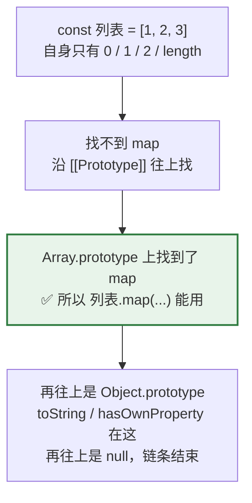
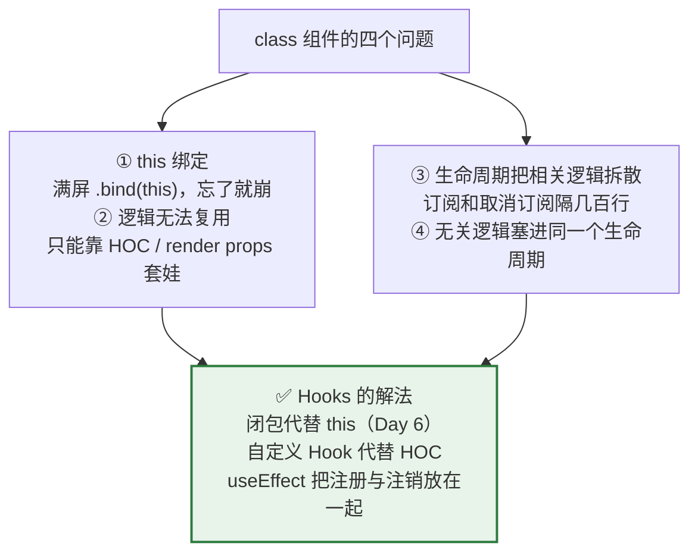

# Day 12 — 类、原型（认得出就行）

> **今天的定位**：**轻松的一天。** React 里几乎不写 `class`，但你会在三个地方遇到它：库的源码、错误处理、老教程。三个重点：
> 1. **`class` 语法** —— 够用就行，重点是和 C# 的**六个差别**
> 2. **`Error` 继承** —— Day 11 写的 `接口错误` / `网络错误` 就是它，今天讲透
> 3. **⭐ 为什么 React 抛弃了 class 组件** —— 这一节最重要。**Day 6 的闭包知识在这里收口**
>
> **原型链只需读懂，不要手写。** 今天不会让你写一行 `prototype`。
>
> **时间**：2 小时
> **前置**：`day2-modules` 项目，Day 11 的 `async-utils.js`
> **本文所有输出均经 Node.js 24 实测**

## 今天结束时你应该能做到

- [ ] 读得懂 `class` / `constructor` / `#私有字段` / `extends` / `static` / `get`
- [ ] **能说出 JS 的 class 和 C# 的六个差别**
- [ ] 会写自定义 `Error` 子类，**知道为什么必须设 `this.name`**
- [ ] 能用 `instanceof` 做错误分类处理
- [ ] **能解释 `[].map` 为什么能用**（原型链）
- [ ] 分得清 `__proto__` 和 `prototype`
- [ ] **能说出 React 抛弃 class 组件的四个理由，以及 Hooks 分别怎么解决的**
- [ ] 看到老教程里的 `this.handleClick = this.handleClick.bind(this)` 知道直接跳过

## 时间分配

| 时段 | 内容 | 时长 |
| --- | --- | --- |
| 1 | `class` 语法 | 25 分钟 |
| 2 | **和 C# 的六个差别** | 20 分钟 |
| 3 | **`Error` 继承** | 20 分钟 |
| 4 | 原型链（读懂即止） | 20 分钟 |
| 5 | **⭐ 为什么 React 抛弃了 class 组件** | 30 分钟 |
| 6 | `new` 做了什么（认得就行） | 5 分钟 |

---

# 第 1 节：`class` 语法（25 分钟）

## 1.1 一个完整的例子

新建 `cls.js`，一次把该认识的语法都过一遍：

```js
class 申请单 {
  // ===== 类字段（现代语法，直接在类体里声明）=====
  状态 = '草稿'                     // 公开字段，带默认值
  #审核日志 = []                    // 私有字段（# 开头，真私有）
  static 计数 = 0                   // 静态字段

  // ===== 构造函数 =====
  constructor(单号, 金额分) {
    this.单号 = 单号                 // 也可以在构造函数里赋值
    this.金额分 = 金额分
    申请单.计数++                    // 静态字段用类名访问
  }

  // ===== 方法 =====
  提交() {
    this.状态 = '待审核'
    this.#记日志('提交')
    return this
  }

  审核(通过) {
    this.状态 = 通过 ? '已通过' : '已驳回'
    this.#记日志(`审核：${this.状态}`)
    return this
  }

  // ===== 私有方法 =====
  #记日志(动作) {
    this.#审核日志.push(动作)
  }

  // ===== getter（像属性一样读）=====
  get 金额元() {
    return (this.金额分 / 100).toFixed(2)
  }

  // ===== setter（像属性一样写）=====
  set 金额元(值) {
    this.金额分 = Math.round(Number(值) * 100)
  }

  // ===== 只读的派生属性 =====
  get 可编辑() {
    return this.状态 === '草稿'
  }

  get 日志() {
    return [...this.#审核日志]      // 返回副本，不让外部改内部数组
  }

  // ===== 静态方法（工厂方法）=====
  static 建空单() {
    return new 申请单('（未编号）', 0)
  }

  // ===== 自定义字符串表示 =====
  toString() {
    return `申请单 ${this.单号}（${this.状态}，${this.金额元} 元）`
  }
}
```

**用起来：**

```js
const 单 = new 申请单('SQ0001', 4165)

console.log(单.状态)              // '草稿'
console.log(单.金额元)            // '41.65'      getter，不用加括号
console.log(单.可编辑)            // true

单.金额元 = '99.99'              // setter
console.log(单.金额分)            // 9999

单.提交().审核(true)             // 链式调用（因为方法 return this）
console.log(单.状态)              // '已通过'
console.log(单.可编辑)            // false
console.log(单.日志)              // [ '提交', '审核：已通过' ]

console.log(String(单))           // '申请单 SQ0001（已通过，99.99 元）'
console.log(申请单.计数)          // 1            静态字段
console.log(申请单.建空单().单号) // '（未编号）'  静态工厂方法
```

## 1.2 `#` 私有字段是真私有

```js
console.log(单.审核日志)          // undefined   （没有这个公开属性）

// console.log(单.#审核日志)      // 💥 语法错误，编译就过不去
```

**在类外面连「访问」都做不到 —— 这是语法层面的限制，不是约定。**

**对照 C#**：`#` ≈ `private`。区别是：

| | C# `private` | JS `#` |
| --- | --- | --- |
| 类内访问 | ✅ | ✅ |
| 类外访问 | 编译错误 | **语法错误** |
| 反射能绕过吗 | ✅ 能 | ❌ **不能**，运行时也访问不到 |
| 子类能访问吗 | ❌（要 `protected`） | ❌（**JS 没有 `protected`**） |

> **注意 JS 没有 `protected`**。要让子类访问，只能用普通字段（公开）或者加下划线约定 `_内部字段`（纯约定，不是强制）。

## 1.3 继承

```js
class 特殊价格申请单 extends 申请单 {
  #审批层级 = 2

  constructor(单号, 金额分, 科室) {
    super(单号, 金额分)            // ⚠️ 必须先调 super()
    this.科室 = 科室               // 之后才能用 this
  }

  // 覆盖父类方法
  审核(通过) {
    super.审核(通过)               // 调父类实现
    if (通过 && this.金额分 > 100000) {
      this.状态 = '待复审'         // 大额需要二次审批
    }
    return this
  }

  get 描述() {
    return `${this.科室} - ${this.单号}（${this.#审批层级} 级审批）`
  }
}

const 特单 = new 特殊价格申请单('SQ0002', 200000, '超声科')
console.log(特单.描述)            // '超声科 - SQ0002（2 级审批）'
console.log(特单.金额元)          // '2000.00'    继承了父类的 getter

特单.提交().审核(true)
console.log(特单.状态)            // '待复审'     子类的覆盖生效了

console.log(特单 instanceof 特殊价格申请单)   // true
console.log(特单 instanceof 申请单)           // true
```

### ⚠️ `super()` 必须在用 `this` 之前

```js
class 坏例子 extends 申请单 {
  constructor() {
    // this.x = 1                  // 💥 ReferenceError: Must call super constructor...
    super('x', 0)
    this.x = 1                     // ✅ 现在可以了
  }
}
```

**如果子类写了 `constructor`，就必须调 `super()`。** 不写 `constructor` 的话，JS 会自动帮你转发参数。

## 1.4 `static` 的两个用途

```js
class 金额 {
  // ① 常量
  static 零 = 0
  static 最大安全值 = Number.MAX_SAFE_INTEGER

  // ② 工厂方法 / 工具方法（不需要实例）
  static 元转分(元) {
    return Math.round(Number(元) * 100)
  }
}

console.log(金额.元转分('41.65'))        // 4165
console.log(金额.零)                     // 0
```

**但在 JS 里，这种「只有静态成员的类」是反模式** —— 直接用模块导出函数更自然：

```js
// ✅ 更符合 JS 习惯（Day 2 学的模块）
export const 元转分 = (元) => Math.round(Number(元) * 100)
export const 零 = 0
```

> **对照 C#**：C# 里一切必须在类里，所以有大量 `static class Helper`。**JS 有模块，不需要这个套路。**
>
> 你从 C# 迁过来时最容易犯的一个错，就是把所有工具函数塞进一个 `class Utils`。**别这么干**，直接导出函数。

---

# 第 2 节：和 C# 的六个差别（20 分钟）

| # | C# 有 | JS 里 | 影响 |
| --- | --- | --- | --- |
| 1 | `class Foo : IBar`（接口实现声明） | ❌ **没有** | JS 是鸭子类型；TS 有 `implements`，但也只是编译期检查 |
| 2 | `public string Name { get; set; }`（属性自动实现） | ❌ **没有** | 要么写普通字段，要么手写 `get` / `set` |
| 3 | 方法重载 | ❌ **没有**（Day 5 第 3.5 节） | 后定义的覆盖前面的；用对象参数替代 |
| 4 | `abstract class` / `abstract` 方法 | ❌ **没有**（TS 有） | 只能在基类方法里 `throw new Error('子类必须实现')` |
| 5 | `protected` | ❌ **没有** | 只有 `#`（真私有）和公开两档 |
| 6 | 构造函数重载 | ❌ **没有** | 用静态工厂方法替代 |

## 2.1 差别 1：没有接口实现声明

```js
// JS 只看「有没有那个方法」，不看「声明了实现哪个接口」
const 能打印的 = { 打印: () => '我能打印' }
const 打印它 = (东西) => 东西.打印()      // 只要有 打印 方法就行

console.log(打印它(能打印的))            // '我能打印'
```

**这叫「鸭子类型」** —— 「走起来像鸭子、叫起来像鸭子，那就是鸭子」。

**这和 Day 18 会学的 TypeScript「结构化类型」是同一个思想** —— 形状对得上就兼容，不需要显式声明继承关系。**这是你从 C# 过来最需要换的一个认知。**

## 2.2 差别 4：模拟抽象方法

```js
class 审核策略 {
  审核(单) {
    throw new Error(`${this.constructor.name} 必须实现 审核 方法`)
  }
}

class 普通审核 extends 审核策略 {
  审核(单) { return 单.金额分 < 100000 }
}

class 忘了实现 extends 审核策略 {}

console.log(new 普通审核().审核({ 金额分: 5000 }))   // true

try {
  new 忘了实现().审核({})
} catch (错) {
  console.log(错.message)      // '忘了实现 必须实现 审核 方法'
}
```

**注意 `this.constructor.name`** —— 能拿到实际的子类名，报错信息更有用。

**但这是运行时才发现的错误。** TypeScript 的 `abstract` 能在编译期就报出来（Day 24 会提）。

## 2.3 差别 6：用静态工厂替代构造函数重载

```js
class 申请单2 {
  constructor(数据) {
    Object.assign(this, 数据)
  }

  static 从接口数据(原始) {
    return new 申请单2({
      单号: 原始.order_no,
      金额分: Math.round(原始.amount * 100),
      状态: 原始.status,
    })
  }

  static 新建() {
    return new 申请单2({ 单号: '', 金额分: 0, 状态: '草稿' })
  }
}

console.log(申请单2.从接口数据({ order_no: 'SQ0001', amount: 41.65, status: '待审核' }).金额分)
// 4165
console.log(申请单2.新建().状态)      // '草稿'
```

**`静态工厂方法` 比构造函数重载更清楚** —— 名字直接说明了用途（`从接口数据` / `新建`）。**这个模式在 C# 里也推荐**，只是 JS 里是唯一选择。

> `Object.assign(this, 数据)` 把对象的所有字段拷到实例上（Day 7 第 3.4 节）。方便，但**会丢失类型提示**，TS 里不推荐这么写。

---

# 第 3 节：`Error` 继承（20 分钟）★

**这是你唯一真正需要写 `class` 的场景。** Day 11 已经用过了，今天讲透。

## 3.1 为什么必须设 `this.name`

```js
class 没设name extends Error {
  constructor(消息) { super(消息) }
}

class 设了name extends Error {
  constructor(消息) {
    super(消息)
    this.name = '设了name'        // ← 关键这一行
  }
}

const a = new 没设name('测试')
const b = new 设了name('测试')

console.log(a.name)               // 'Error'       ⚠️ 不是 '没设name'
console.log(b.name)               // '设了name'    ✅

console.log(String(a))            // 'Error: 测试'
console.log(String(b))            // '设了name: 测试'
```

**不设 `this.name` 的话，`name` 会继承父类的 `'Error'`。**

**后果**：

1. 日志和控制台里看不出是什么错误
2. 如果别人用 `错.name === 'xxx'` 判断（Day 10 第 4.5 节讲的规矩），永远匹配不上

> **`class` 名字不会自动变成 `name`** —— 这是从 C# 过来最容易忘的一点（C# 里 `ex.GetType().Name` 自动就是类名）。**必须手写一行 `this.name = '...'`。**

## 3.2 完整的错误体系（Day 11 的封装）

```js
class 业务错误 extends Error {
  constructor(消息, 代码) {
    super(消息)
    this.name = '业务错误'
    this.代码 = 代码
  }
}

class 接口错误 extends 业务错误 {
  constructor(状态码, 状态文本, 响应体) {
    super(`请求失败：${状态码} ${状态文本}`, 'HTTP')
    this.name = '接口错误'
    this.状态码 = 状态码
    this.响应体 = 响应体
  }
}

class 校验错误 extends 业务错误 {
  constructor(消息, 字段) {
    super(消息, 'VALIDATION')
    this.name = '校验错误'
    this.字段 = 字段
  }
}
```

**`instanceof` 沿整条链都成立：**

```js
const 错 = new 接口错误(404, 'Not Found', { 错误: '不存在' })

console.log(错 instanceof 接口错误)      // true
console.log(错 instanceof 业务错误)      // true
console.log(错 instanceof Error)         // true
console.log(错.name)                     // '接口错误'
console.log(错.状态码)                   // 404
console.log(错.代码)                     // 'HTTP'      从 业务错误 继承来的
```

## 3.3 按类型分派处理

```js
const 处理 = (错) => {
  if (错 instanceof 校验错误) return `请检查「${错.字段}」：${错.message}`
  if (错 instanceof 接口错误) {
    if (错.状态码 === 401) return '登录已过期，请重新登录'
    if (错.状态码 >= 500) return '服务器繁忙，请稍后重试'
    return 错.message
  }
  if (错 instanceof 业务错误) return `业务异常：${错.message}`
  return '系统异常，请联系管理员'
}

console.log(处理(new 校验错误('金额不能为负', '金额分')))
// '请检查「金额分」：金额不能为负'
console.log(处理(new 接口错误(401, 'Unauthorized', null)))
// '登录已过期，请重新登录'
console.log(处理(new 接口错误(500, 'Server Error', null)))
// '服务器繁忙，请稍后重试'
console.log(处理(new Error('随便')))
// '系统异常，请联系管理员'
```

**注意判断顺序：从具体到宽泛。** 如果把 `业务错误` 放在前面，`接口错误` 永远进不去（因为它也是 `业务错误`）。

> **对照 C#**：这就是 `catch (SpecificException)` 要写在 `catch (Exception)` 前面。**同一个道理，只是 JS 里用 `if` 手写。**

## 3.4 配合 `cause` 保留原始错误

```js
const 保存 = async () => {
  try {
    throw new Error('数据库连接超时')
  } catch (原错) {
    throw new 业务错误('保存申请单失败', 'SAVE')
      // 也可以：new Error('...', { cause: 原错 })
  }
}
```

**更好的写法是让自定义错误也支持 `cause`：**

```js
class 业务错误2 extends Error {
  constructor(消息, 代码, 选项) {
    super(消息, 选项)              // ← 把 { cause } 透给父类
    this.name = '业务错误'
    this.代码 = 代码
  }
}

const 外 = new 业务错误2('保存失败', 'SAVE', { cause: new Error('连接超时') })
console.log(外.message)            // '保存失败'
console.log(外.cause.message)      // '连接超时'
```

**`super(消息, 选项)` 这个透传是关键** —— `Error` 的第二个参数就是 `{ cause }`（Day 10 第 4.3 节）。

## 3.5 ★ 一个历史坑（现代项目不用担心）

**如果打包目标是 ES5（很老的浏览器），`extends Error` 会导致 `instanceof` 失效** —— 因为 ES5 没有真正的 class，Babel 转译后原型链会断。

**你的项目不用担心**：Vite 默认目标是现代浏览器（ES2020+），`class` 是原生的。

> 但如果你接手一个老项目，发现 `错 instanceof 自定义错误` 莫名其妙是 `false`，**就是这个原因**。解法是在构造函数里加 `Object.setPrototypeOf(this, 新类.prototype)`。**知道有这回事就行。**

---

# 第 4 节：原型链（读懂即止）（20 分钟）

## 4.1 一个问题：`[].map` 是从哪来的

```js
const 列表 = [1, 2, 3]
console.log(列表.map)                                  // [Function: map]
console.log(Object.hasOwn(列表, 'map'))                // false   ⚠️ 数组自己没有 map！
```

**`列表` 自己没有 `map` 属性，但能调用它。** 为什么？



**验证：**

```js
console.log(Object.getPrototypeOf(列表) === Array.prototype)              // true
console.log(Object.getPrototypeOf(Array.prototype) === Object.prototype)  // true
console.log(Object.getPrototypeOf(Object.prototype))                      // null   终点
console.log(Object.hasOwn(Array.prototype, 'map'))                        // true   在这里
```

**这就是原型链**：找属性时，自己没有就往上一级找，一直找到 `null`。

**对照 C#**：类似继承链上的方法查找，但有两个差别：

| | C# | JS |
| --- | --- | --- |
| 查找发生在 | 编译期确定（虚方法表在运行时） | **运行时，每次访问都查** |
| 链条是 | 类 → 基类 → `object` | **对象 → 对象**（`prototype` 也是普通对象） |
| 能运行时改吗 | ❌ | ✅ 能（但**绝对不要**） |

## 4.2 `__proto__` vs `prototype` —— 最容易混的两个

**这是原型里唯一值得花时间搞清的一点。**

| | 谁有它 | 是什么 |
| --- | --- | --- |
| **`prototype`** | **只有函数/类有** | 「用 `new` 创建实例时，给实例当原型的那个对象」 |
| **`__proto__`** | **每个对象都有** | 「我的原型是谁」（等于 `Object.getPrototypeOf(我)`） |

```js
class 甲 {}
const 实例 = new 甲()

console.log(typeof 甲.prototype)                       // 'object'   类有 prototype
console.log(实例.prototype)                            // undefined  实例没有
console.log(Object.getPrototypeOf(实例) === 甲.prototype)  // true    实例的原型 = 类的 prototype
```

**一句话记法：**

> **`prototype` 是「我给别人当原型的那个对象」；`__proto__` 是「我的原型是谁」。**

**`__proto__` 已过时**，用 `Object.getPrototypeOf()` / `Object.setPrototypeOf()` 代替。

## 4.3 ❌ 不要手写 prototype 继承

**你会在 2015 年前的代码里看到这个：**

```js
// ❌ ES5 时代的继承写法，认得出就行
function 父(名) { this.名 = 名 }
父.prototype.打招呼 = function () { return '我是' + this.名 }

function 子(名) { 父.call(this, 名) }
子.prototype = Object.create(父.prototype)
子.prototype.constructor = 子
```

```js
// ✅ 现代写法，做的是同一件事
class 父2 {
  constructor(名) { this.名 = 名 }
  打招呼() { return `我是${this.名}` }
}
class 子2 extends 父2 {}
```

**`class` 就是 prototype 继承的语法糖** —— 底层机制完全一样，只是写法从「手工接线」变成了声明式。

> **实务规矩：只用 `class`。看到手写 `prototype` 的教程，说明它至少十年没更新过，直接关掉。**

## 4.4 原型链的一个实际影响：`for...in`

**Day 9 第 6.3 节说过 `for...in` 不要用在数组上。现在能解释更深一层原因：**

```js
const 对象 = { a: 1 }
Object.getPrototypeOf(对象).临时污染 = '来自原型'      // 演示用，实际绝不要这么干

const 收集 = []
for (const 键 in 对象) 收集.push(键)
console.log(收集)                     // [ 'a', '临时污染' ]   ⚠️ 原型上的也被遍历了

console.log(Object.keys(对象))        // [ 'a' ]              ✅ 只看自身

delete Object.getPrototypeOf(对象).临时污染      // 清理掉
```

**`for...in` 会遍历原型链上的可枚举属性。** 这就是为什么老代码里到处是：

```js
for (const 键 in 对象) {
  if (Object.hasOwn(对象, 键)) {       // 必须加这层保护
    // ...
  }
}
```

**规矩：用 `Object.keys()` / `Object.entries()`，永远不用 `for...in`。** 这样根本没有这个问题。

## 4.5 `Object.create(null)` —— 没有原型的纯字典

```js
const 普通对象 = {}
console.log('toString' in 普通对象)          // true    从 Object.prototype 继承的

const 纯字典 = Object.create(null)
console.log('toString' in 纯字典)            // false   没有原型，什么都没继承
```

**用途**：当对象的键完全来自外部输入（用户输入、接口数据）时，用 `Object.create(null)` 避免键名和内置属性冲突。

**但实务上直接用 `Map`（Day 9 第 6.2 节）** —— 更清楚，而且 `Map` 天生没有这个问题。

---

# 第 5 节：⭐ 为什么 React 抛弃了 class 组件（30 分钟）

> **今天最重要的一节。** 不是为了让你写 class 组件，而是为了：
> 1. 你能读懂满网络的老教程和老代码
> 2. **理解 Hooks 到底解决了什么问题** —— 这会让你后面学 Hooks 时明白「为什么要这样设计」

## 5.1 class 组件长什么样

**看一眼就行，不用写。**

```jsx
class 申请单列表 extends React.Component {
  constructor(props) {
    super(props)
    this.state = { 列表: [], 加载中: false }
    this.处理刷新 = this.处理刷新.bind(this)      // ← 注意这一行
  }

  componentDidMount() {
    this.加载数据()
    window.addEventListener('resize', this.处理缩放)
    this.定时器 = setInterval(this.轮询, 5000)
  }

  componentDidUpdate(上一次props) {
    if (上一次props.状态 !== this.props.状态) {
      this.加载数据()
    }
  }

  componentWillUnmount() {
    window.removeEventListener('resize', this.处理缩放)
    clearInterval(this.定时器)
  }

  处理刷新() {
    this.setState({ 加载中: true })
  }

  render() {
    return <div onClick={this.处理刷新}>{this.state.列表.length} 条</div>
  }
}
```

## 5.2 四个问题



### 问题 ①：`this` 绑定

```jsx
// ❌ 忘了 bind
<div onClick={this.处理刷新}>       // 点击时 this 是 undefined → 崩
```

**因为普通函数的 `this` 取决于「怎么调用」，不是「在哪定义」**（Day 5 第 2.4 节、Day 6 第 6.1 节）。React 把这个函数当回调传出去时，它就丢失了 `this`。

**三种历史解法，都很难看：**

```jsx
// 解法一：构造函数里 bind（最常见）
this.处理刷新 = this.处理刷新.bind(this)

// 解法二：渲染时的箭头函数（每次渲染都创建新函数，影响性能）
<div onClick={() => this.处理刷新()}>

// 解法三：类字段 + 箭头函数（当时还是实验语法）
处理刷新 = () => { this.setState(...) }
```

**函数组件里这个问题根本不存在** —— 没有 `this`，只有闭包。

### 问题 ②：逻辑无法复用

**假设「窗口尺寸监听」这段逻辑要在 5 个组件里用。class 组件时代只有两种办法：**

```jsx
// 办法一：HOC（高阶组件）—— 层层包裹
export default withRouter(connect(mapState)(withTheme(withSize(申请单列表))))
// 组件树里出现四层无意义的包裹，调试时 React DevTools 里全是 <WithXxx>
```

```jsx
// 办法二：render props —— 嵌套地狱
<尺寸监听>
  {(尺寸) => (
    <主题监听>
      {(主题) => (
        <路由监听>
          {(路由) => <实际内容 尺寸={尺寸} 主题={主题} 路由={路由} />}
        </路由监听>
      )}
    </主题监听>
  )}
</尺寸监听>
```

**这两个模式都有名字**：「HOC 地狱」和「回调地狱的 JSX 版」。

**Hooks 的解法 —— 自定义 Hook，就是一个普通函数：**

```jsx
// ✅ 一行搞定，没有任何包裹层
function 申请单列表() {
  const 尺寸 = use窗口尺寸()
  const 主题 = use主题()
  const 路由 = use路由()
  // ...
}
```

> **自定义 Hook 的本质就是「一个用了别的 Hook 的普通函数」** —— 靠闭包保存状态（Day 6）。**不需要任何新语法。** 这是 Hooks 最优雅的地方。

### 问题 ③：生命周期把相关逻辑拆散

**看回 5.1 的代码，注意「窗口监听」这一件事被拆到了两个地方：**

```jsx
componentDidMount() {
  window.addEventListener('resize', this.处理缩放)      // 注册在这
  // ... 中间可能隔着几百行
}

componentWillUnmount() {
  window.removeEventListener('resize', this.处理缩放)   // 注销在那
}
```

**一件事，两个位置，中间隔着几百行代码。**

**后果**：改代码时很容易只改一边 —— 加了新的订阅忘了加对应的取消，**内存泄漏**（Day 6 第 6.3 节）。

**Hooks 的解法 —— `useEffect` 把注册和注销放在一起：**

```jsx
// ✅ 注册和清理紧挨着，不可能只改一半
useEffect(() => {
  window.addEventListener('resize', 处理缩放)
  return () => window.removeEventListener('resize', 处理缩放)   // ← 就在下一行
}, [])
```

**这是 `useEffect` 设计里最重要的一点**：清理函数就写在注册的旁边。

### 问题 ④：无关逻辑塞进同一个生命周期

**再看 5.1 的 `componentDidMount`：**

```jsx
componentDidMount() {
  this.加载数据()                                        // 事情 A：取数据
  window.addEventListener('resize', this.处理缩放)       // 事情 B：监听尺寸
  this.定时器 = setInterval(this.轮询, 5000)             // 事情 C：轮询
}
```

**三件完全不相关的事，因为「都要在挂载时做」而被塞进同一个方法。**

**而 `componentDidUpdate` 里又要处理它们各自的更新逻辑** —— 于是一件事的完整逻辑散落在三个生命周期方法里，三件事的逻辑又交织在一起。

**Hooks 的解法 —— 按「关注点」拆成多个 `useEffect`：**

```jsx
// ✅ 三件事，三个独立的 useEffect，各管各的
useEffect(() => { 加载数据() }, [状态])                  // 事情 A

useEffect(() => {                                        // 事情 B
  window.addEventListener('resize', 处理缩放)
  return () => window.removeEventListener('resize', 处理缩放)
}, [])

useEffect(() => {                                        // 事情 C
  const 定时器 = setInterval(轮询, 5000)
  return () => clearInterval(定时器)
}, [])
```

**每个 `useEffect` 是一个完整、自洽的关注点。** 删掉某个功能时，删掉对应那一整块就行。

## 5.3 并列对比

| 问题 | class 组件的做法 | Hooks 的做法 |
| --- | --- | --- |
| 状态 | `this.state` + `this.setState` | `useState` |
| `this` 绑定 | `.bind(this)` / 箭头函数字段 | **不存在这个问题**（没有 `this`） |
| 逻辑复用 | HOC / render props（套娃） | **自定义 Hook**（普通函数） |
| 挂载时做事 | `componentDidMount` | `useEffect(..., [])` |
| 更新时做事 | `componentDidUpdate` + 手工比较 props | `useEffect(..., [依赖])` |
| 卸载时清理 | `componentWillUnmount`（离得很远） | **清理函数就在注册旁边** |
| 相关逻辑的组织 | 按「生命周期时机」分组 | **按「关注点」分组** |

## 5.4 代价：Hooks 引入了新的难点

**要诚实地说：Hooks 不是没有成本的。**

| Hooks 的新难点 | 在哪学 |
| --- | --- |
| **stale closure**（读到旧值） | **Day 6 第 5 节**（已学） |
| 依赖数组要写对 | Day 4 第 3.3 节（已学） + 阶段 4 |
| 每次渲染都重新创建函数 | Day 6 第 4 节（已学）+ `useCallback` |
| Hooks 的调用顺序不能变（不能写在 `if` 里） | 阶段 4 第 1 周 |

**这四个难点里，前三个你已经学过了** —— 这就是为什么 Day 6 要花整天讲闭包。

> **总账**：class 组件的问题是**结构性的**（无法复用逻辑、无法聚合关注点），Hooks 的问题是**理解成本**（要懂闭包）。社区选择了后者，因为**理解成本是一次性的，结构性问题是永久的**。

## 5.5 实务结论

| 情况 | 怎么办 |
| --- | --- |
| 写新组件 | **一律用函数组件 + Hooks** |
| 看到 class 组件的教程 | **直接关掉**（说明至少 6 年没更新） |
| 看到 `.bind(this)` | 跳过，那是历史包袱 |
| 看到 HOC（`withXxx`） | 认得就行，新代码用自定义 Hook |
| 接手老项目里的 class 组件 | 能跑就别动；要改就整个重写成函数组件 |
| **错误边界（Error Boundary）** | ⚠️ **这是唯一还必须用 class 的地方** |

### 唯一的例外：错误边界

**React 到目前为止，错误边界仍然只能用 class 组件写**（因为需要 `componentDidCatch` / `getDerivedStateFromError`，没有对应的 Hook）：

```jsx
class 错误边界 extends React.Component {
  state = { 出错了: false }

  static getDerivedStateFromError() {
    return { 出错了: true }
  }

  componentDidCatch(错, 信息) {
    console.error('组件出错：', 错, 信息)      // 上报日志
  }

  render() {
    if (this.state.出错了) return <div>页面出错了，请刷新重试</div>
    return this.props.children
  }
}
```

**你只需要写这一个 class，全项目复用。** 阶段 4 第 4 周会讲它（实务上通常直接用 `react-error-boundary` 这个库，连这个 class 都不用自己写）。

---

# 第 6 节：`new` 做了什么（认得就行）（5 分钟）

```js
const 单 = new 申请单('SQ0001', 4165)
```

**`new` 干了四件事：**

1. 创建一个空对象
2. 把这个对象的原型设成 `申请单.prototype`
3. 以这个对象为 `this` 执行构造函数
4. 返回这个对象（除非构造函数显式返回了别的对象）

```js
// 手工模拟（只为理解，永远不要这么写）
const 手工new = (类, ...参数) => {
  const 对象 = Object.create(类.prototype)      // 第 1、2 步
  const 结果 = 类.apply(对象, 参数)             // 第 3 步
  return typeof 结果 === 'object' && 结果 !== null ? 结果 : 对象   // 第 4 步
}
```

**知道这四步就够了**，不用记代码。

## `Symbol.iterator`（认得就行）

**`for...of` 能遍历一个对象，是因为它实现了 `Symbol.iterator`：**

```js
class 明细集合 {
  #项 = []
  加(项) { this.#项.push(项); return this }
  *[Symbol.iterator]() { yield* this.#项 }      // 让它能被 for...of 遍历
}

const 集合 = new 明细集合().加('A').加('B')
console.log([...集合])                          // [ 'A', 'B' ]
for (const 项 of 集合) console.log(项)          // A / B
```

**`*` 和 `yield*` 是生成器语法。** 你**永远不需要写这个**，知道「`for...of` 和展开运算符依赖这个协议」就行。

---

# 今日验收清单

- [ ] `cls.js` 跑过了，`class` / `constructor` / `#私有` / `get` / `set` / `static` / `extends` 都见过
- [ ] 验证过 `单.审核日志` 是 `undefined`（`#` 是真私有）
- [ ] 知道子类 `constructor` 里必须先调 `super()` 才能用 `this`
- [ ] **能说出和 C# 的六个差别**（无接口声明 / 无属性自动实现 / 无重载 / 无抽象类 / 无 `protected` / 无构造函数重载）
- [ ] 知道 JS 有模块，**不要写只有静态成员的 `class Utils`**
- [ ] 知道「鸭子类型」，以及它和 TS 结构化类型是同一个思想
- [ ] **会写自定义 `Error` 子类，知道必须手写 `this.name = '...'`**
- [ ] 验证过不设 `this.name` 时 `错.name` 是 `'Error'`
- [ ] 会用 `instanceof` 分派，**知道判断顺序要从具体到宽泛**
- [ ] 知道自定义错误要透传 `super(消息, 选项)` 才能支持 `cause`
- [ ] **能解释 `[].map` 为什么能用**（原型链找到 `Array.prototype.map`）
- [ ] **分得清 `prototype`（类才有）和 `__proto__`（每个对象都有）**
- [ ] 知道 `class` 就是 prototype 继承的语法糖，**不要手写 prototype**
- [ ] 知道 `for...in` 会遍历原型链，所以一律用 `Object.keys()`
- [ ] **能说出 React 抛弃 class 组件的四个理由**
- [ ] **能说出 Hooks 分别怎么解决的**（闭包代替 `this` / 自定义 Hook 代替 HOC / 清理函数紧邻注册 / 按关注点拆 `useEffect`）
- [ ] 知道 Hooks 的代价是「要懂闭包」，而这一课 Day 6 已经上过
- [ ] 知道**错误边界是唯一还必须用 class 的地方**
- [ ] 知道 `new` 做的四件事

---

# 常见问题排查

## `Must call super constructor before accessing 'this'`

子类 `constructor` 里在 `super()` 之前用了 `this`。第 1.3 节。

## 自定义错误的 `错.name` 显示 `'Error'`

忘了在构造函数里写 `this.name = '...'`。第 3.1 节。

## `错 instanceof 我的错误` 是 `false`

两种可能：① 打包目标是 ES5（老项目），原型链被 Babel 转译打断；② 跨模块/跨 iframe 有两份类定义。第 3.5 节。

## `instanceof` 分派时具体的分支永远进不去

判断顺序写反了 —— 宽泛的父类判断放在了前面。要从具体到宽泛。第 3.3 节。

## 私有字段报语法错误

`#字段` 只能在类体内访问，类外访问是**语法错误**（不是运行时错误）。第 1.2 节。

## `for...in` 遍历出了不该有的键

它会遍历原型链上的可枚举属性。用 `Object.keys()`。第 4.4 节。

## 老教程里的 `this.handleClick.bind(this)` 是什么

class 组件时代的 `this` 绑定手法。**函数组件不需要，直接跳过。** 第 5.2 节。

## 组件树里全是 `<WithRouter>` `<WithTheme>` 这种包裹层

HOC 模式。新代码用自定义 Hook 替代。第 5.2 节。

---

# 今天不需要理解的东西

| 你会看到 | 什么时候学 |
| --- | --- |
| `useState` / `useEffect` 的实际用法 | 阶段 4 第 1–2 周 |
| 自定义 Hook 怎么写 | 阶段 4 第 3 周 |
| 错误边界的完整用法 | 阶段 4 第 4 周 |
| TS 的 `implements` / `abstract` / `private` | Day 24 |
| `Object.defineProperty` / 属性描述符 | **永远不用** |
| `Proxy` / `Reflect` | 用不到（知道 MobX、Vue 用它） |
| 生成器 `function*` / `yield` | **永远不用** |
| `Symbol.iterator` 之外的其他 well-known Symbol | 用不到 |
| mixin 模式 | 用不到 |

---

# 作业（25 分钟）

## 作业 1：写一套错误类体系

新建 `errors.js`：

```js
/** 基类：所有业务错误的根。要支持 cause */
export class 应用错误 extends Error {
  constructor(消息, 选项) {
    // TODO：调 super、设 name
  }
}

/** 接口错误：带状态码和响应体 */
export class 接口错误 extends 应用错误 {
  constructor(状态码, 状态文本, 响应体) {
    // TODO
  }
  /** 是不是「客户端的错」（4xx） */
  get 是客户端错误() {
    // TODO
  }
  /** 是不是「服务器的错」（5xx），这类才值得重试 */
  get 可重试() {
    // TODO
  }
}

/** 校验错误：带字段名 */
export class 校验错误 extends 应用错误 {
  constructor(消息, 字段) {
    // TODO
  }
}

/** 把任意错误翻译成给用户看的一句话 */
export function 用户提示(错) {
  // TODO：按 instanceof 从具体到宽泛分派
}
```

自测：

| 调用 | 期望 |
| --- | --- |
| `new 接口错误(404, 'Not Found', null).name` | `'接口错误'` |
| `new 接口错误(404, ...) instanceof 应用错误` | `true` |
| `new 接口错误(404, ...).是客户端错误` | `true` |
| `new 接口错误(500, ...).可重试` | `true` |
| `new 接口错误(404, ...).可重试` | **`false`** |
| `new 应用错误('x', { cause: new Error('原因') }).cause.message` | `'原因'` |
| `用户提示(new 校验错误('金额不能为负', '金额分'))` | 含字段名 |
| `用户提示(new Error('随便'))` | 通用提示 |

<details>
<summary>提示（卡住了再看）</summary>

- `应用错误`：`super(消息, 选项)` 透传 `{ cause }`，然后 `this.name = '应用错误'`
- `接口错误`：`super(\`请求失败：${状态码} ${状态文本}\`)`，`this.name = '接口错误'`
- `是客户端错误`：`this.状态码 >= 400 && this.状态码 < 500`
- `可重试`：`this.状态码 >= 500`
- `用户提示`：`if (错 instanceof 校验错误) ... if (错 instanceof 接口错误) ... if (错 instanceof 应用错误) ... return '系统异常'`

**注意顺序**：`校验错误` 和 `接口错误` 都是 `应用错误`，所以 `应用错误` 的判断必须放最后。

</details>

## 作业 2：把一个 class 组件翻译成函数组件的思路

**不用真写 React 代码**，只回答「这四段分别该怎么改」：

```jsx
class 明细面板 extends React.Component {
  constructor(props) {
    super(props)
    this.state = { 明细: [], 展开: false }
    this.切换展开 = this.切换展开.bind(this)         // 段 A
  }

  componentDidMount() {                              // 段 B
    this.加载(this.props.单号)
    this.定时器 = setInterval(() => this.加载(this.props.单号), 30000)
  }

  componentDidUpdate(上次props) {                     // 段 C
    if (上次props.单号 !== this.props.单号) {
      this.加载(this.props.单号)
    }
  }

  componentWillUnmount() {                           // 段 D
    clearInterval(this.定时器)
  }

  切换展开() {
    this.setState((上次) => ({ 展开: !上次.展开 }))
  }

  render() {
    return <div onClick={this.切换展开}>{this.state.明细.length}</div>
  }
}
```

<details>
<summary>点开看答案</summary>

| 段 | class 里的作用 | 函数组件怎么写 |
| --- | --- | --- |
| **A** | 绑定 `this` | **整段删掉**。函数组件里 `const 切换展开 = () => ...` 就是普通闭包，没有 `this` 问题 |
| **B + C + D** | 挂载时加载 + props 变化时重新加载 + 卸载时清理 | **合并成一个 `useEffect`**，依赖数组写 `[单号]` |
| `this.state` 两个字段 | 一个 state 对象 | **拆成两个 `useState`**（`明细` 和 `展开` 不相关） |
| `setState((上次) => ...)` | 函数式更新 | `set展开((上次) => !上次)`，写法几乎一样（Day 6 第 5.4 节） |

**关键洞察：B、C、D 三段其实是同一件事的三个片段。**

- B 里的「加载」和 C 里的「加载」是重复代码
- B 里的「设定时器」和 D 里的「清定时器」是一对
- 而 class 语法强迫你把它们拆到三个方法里

**函数组件版本（阶段 4 会正式学）：**

```jsx
function 明细面板({ 单号 }) {
  const [明细, set明细] = useState([])
  const [展开, set展开] = useState(false)

  // ✅ B + C + D 合成一个：单号 变化时自动重新执行，卸载时自动清理
  useEffect(() => {
    const 加载 = async () => set明细(await 取明细(单号))
    加载()
    const 定时器 = setInterval(加载, 30000)
    return () => clearInterval(定时器)        // 注册和清理紧挨着
  }, [单号])

  // ✅ A 整段消失
  const 切换展开 = () => set展开((上次) => !上次)

  return <div onClick={切换展开}>{明细.length}</div>
}
```

**代码从 30 行变成 15 行，而且「加载」这件事的完整逻辑集中在一处。**

</details>

## 作业 3：预测输出（先写答案，再运行）

```js
class 甲 { 名 = '甲'; 说() { return this.名 } }
class 乙 extends 甲 { 名 = '乙' }

console.log('①', new 乙().说())

class 没name extends Error { constructor(m) { super(m) } }
class 有name extends Error { constructor(m) { super(m); this.name = '有name' } }
console.log('②', new 没name('x').name)
console.log('③', new 有name('x').name)
console.log('④', String(new 有name('x')))

const 列表 = [1, 2, 3]
console.log('⑤', Object.hasOwn(列表, 'map'))
console.log('⑥', Object.getPrototypeOf(列表) === Array.prototype)
console.log('⑦', Object.getPrototypeOf(Object.prototype))

class 丙 {}
const 实例 = new 丙()
console.log('⑧', typeof 丙.prototype, 实例.prototype)

class 丁 { #私 = 1; 读() { return this.#私 } }
const d = new 丁()
console.log('⑨', d.读(), d.私, Object.keys(d).length)

class 戊 extends Error {
  constructor(m, o) { super(m, o); this.name = '戊' }
}
const e = new 戊('外', { cause: new Error('内') })
console.log('⑩', e.message, e.cause.message, e instanceof Error)
```

<details>
<summary>点开看答案</summary>

```
① 乙                    子类字段覆盖了父类字段
② Error                 ⚠️ 没设 this.name，继承了父类的
③ 有name                ✅ 设了
④ 有name: x             toString 用的是 name + message
⑤ false                 ⚠️ 数组自身没有 map
⑥ true                  map 在 Array.prototype 上
⑦ null                  原型链的终点
⑧ object undefined      ⚠️ 类有 prototype，实例没有
⑨ 1 undefined 0         # 是真私有，Object.keys 也看不到
⑩ 外 内 true            cause 透传成功
```

**① 值得注意**：类字段的初始化顺序是「父类字段 → 父类构造函数体 → 子类字段 → 子类构造函数体」，所以子类的 `名 = '乙'` 覆盖了父类的。

**② 是本章最实用的一条** —— 忘写 `this.name` 是自定义错误最常见的错误。

**⑨ 的第三项 `0`** 说明 `#私有字段` 完全不出现在 `Object.keys` 里，也不会被 `JSON.stringify` 序列化。

</details>

## 作业 4：一句话回答（写在笔记里）

1. 我写了 `class 我的错 extends Error {}`，为什么 `错.name` 显示的是 `'Error'`？
2. `[].map` 明明不在数组自己身上，为什么能调用？
3. `prototype` 和 `__proto__` 有什么区别？
4. React 抛弃 class 组件的四个理由是什么？
5. 我从 C# 过来，想写一个 `class 工具类 { static 元转分() {...} }`。这样好吗？
6. 项目里还有哪一处必须用 class 组件？

<details>
<summary>点开看参考答案</summary>

1. **因为 `name` 不会自动取类名，必须手写。** 在构造函数里加 `this.name = '我的错'`。不设的话它继承父类 `Error` 的 `name`。**这和 C# 的 `ex.GetType().Name` 自动就是类名不一样。**

2. **原型链查找。** `列表` 自身没有 `map`，JS 就沿 `[[Prototype]]` 往上找，在 `Array.prototype` 上找到了。链条继续往上是 `Object.prototype`（`toString` 等在这），终点是 `null`。

3. **`prototype` 只有函数/类才有**，它是「用 `new` 创建实例时给实例当原型的那个对象」；**`__proto__` 每个对象都有**，它是「我的原型是谁」。关系是 `Object.getPrototypeOf(实例) === 类.prototype`。实务上用 `Object.getPrototypeOf()` 而不是 `__proto__`。

4. ① **`this` 绑定**麻烦（满屏 `.bind(this)`）；② **逻辑无法复用**（只能靠 HOC / render props 套娃）；③ **生命周期把相关逻辑拆散**（订阅在 `componentDidMount`，取消订阅在 `componentWillUnmount`，隔几百行）；④ **无关逻辑塞进同一个生命周期**。Hooks 分别用「闭包代替 this」「自定义 Hook」「清理函数紧邻注册」「按关注点拆多个 useEffect」解决。

5. **不好，这是从 C# 带过来的习惯。** C# 里一切必须在类里，所以有 `static class Helper`；**JS 有模块系统**（Day 2），直接 `export const 元转分 = (元) => ...` 就行，更简洁，而且支持摇树优化（只用到的函数才会被打包）。

6. **错误边界（Error Boundary）。** 因为需要 `componentDidCatch` / `getDerivedStateFromError`，目前没有对应的 Hook。但全项目只需要写一个，或者直接用 `react-error-boundary` 库。

</details>

---

# 明天预告：Day 13 — 浏览器 API 与 DOM（够用即止）

明天四个重点：

1. **事件模型** —— `e.target` vs `e.currentTarget`、冒泡、`preventDefault`（React 表单必用）
2. **`localStorage`** —— 只能存字符串，配合 `JSON.stringify`
3. **`FormData` 与文件上传 / 下载** —— 企业后台的附件功能
4. **⚠️ 什么时候才允许直接摸 DOM** —— 这一节针对你的 WebForm 习惯：`document.getElementById` 去改 React 渲染出来的内容**是死路**

`errors.js` 留着，Day 14 的阶段项目要用。

---

## 参考来源

- [MDN：类](https://developer.mozilla.org/zh-CN/docs/Web/JavaScript/Reference/Classes)
- [MDN：私有属性](https://developer.mozilla.org/zh-CN/docs/Web/JavaScript/Reference/Classes/Private_properties)
- [MDN：继承与原型链](https://developer.mozilla.org/zh-CN/docs/Web/JavaScript/Guide/Inheritance_and_the_prototype_chain)
- [React 官方文档：错误边界](https://react.dev/reference/react/Component#catching-rendering-errors-with-an-error-boundary)

> 上述来源的内容已经过改写与归纳，以符合许可要求。
