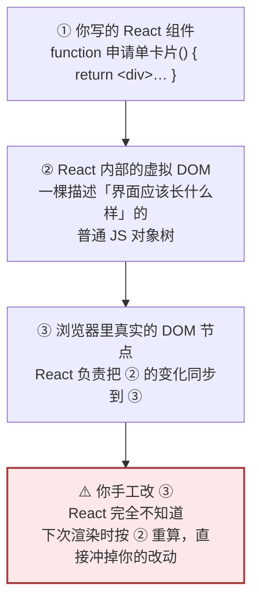
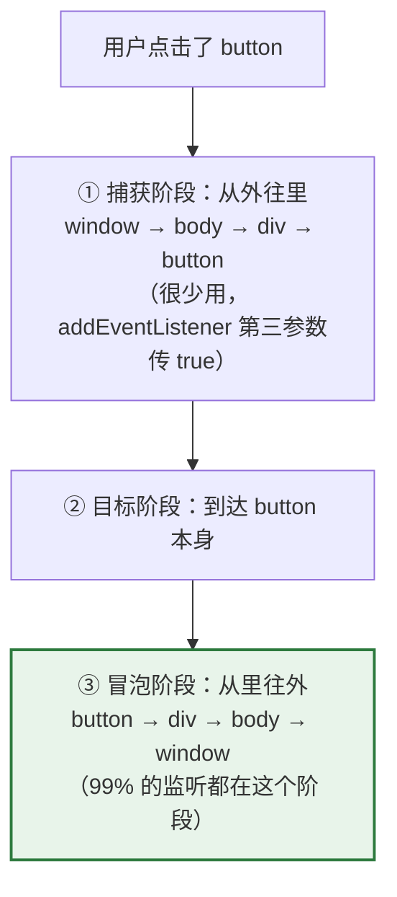
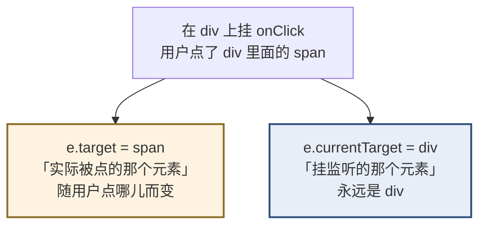
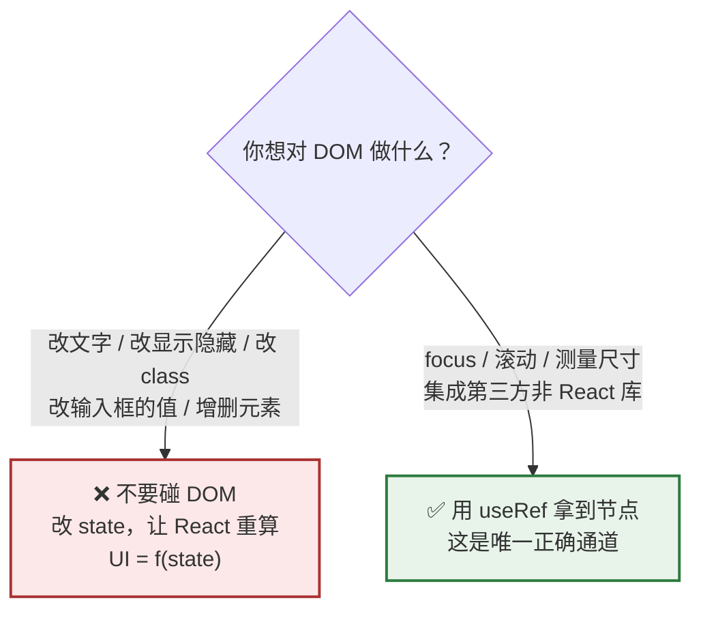

# Day 13 — 浏览器 API 与 DOM（够用即止）

> **今天的定位**：React 替你操作 DOM，所以这一章「够用即止」。但有四块内容你**必须**掌握：
> 1. **事件模型** —— `e.target` vs `e.currentTarget`、冒泡、`preventDefault`。**React 表单必用**
> 2. **⚠️ 什么时候才允许直接摸 DOM** —— 这一节专门针对你的 WebForm 习惯。`document.getElementById` 去改 React 渲染出来的内容**是死路**
> 3. **`localStorage`** —— 只能存字符串，而且**必须包 `try/catch`**（很多人不知道它会抛异常）
> 4. **`FormData` 上传 / `Blob` 下载** —— 企业后台的附件功能，含一个「设了 `Content-Type` 反而坏事」的反直觉坑
>
> **时间**：2 小时
> **前置**：Day 1 建的 `my-first-app`（今天要用浏览器）+ `day2-modules`
> **本文所有输出均经实测**：Node 24 验证 `URL` / `FormData` / `Blob` 等；DOM 与 `localStorage` 部分标注了**在浏览器 Console 里跑**

## ⚠️ 今天有两个运行环境

| 标记 | 在哪跑 | 为什么 |
| --- | --- | --- |
| 🌐 **浏览器** | 打开 `my-first-app`（`npm run dev`），按 `F12` 用 Console | `document` / `window` / `localStorage` 只有浏览器才有 |
| 🟩 **Node** | `day2-modules` 里建文件跑 | `URL` / `URLSearchParams` / `FormData` / `Blob` 两边都有 |

**每段代码前面都会标出该在哪跑。**

## 今天结束时你应该能做到

- [ ] 说清「React 组件 / 虚拟 DOM / 真实 DOM」三层的关系
- [ ] **分得清 `e.target` 和 `e.currentTarget`**
- [ ] 知道事件冒泡，会用事件委托（一个监听管整个列表）
- [ ] **知道 React 表单必须 `e.preventDefault()`**，否则页面会刷新
- [ ] 知道 React 的 `onChange` 其实对应原生的 `input` 事件
- [ ] **能列出「允许直接摸 DOM」的四种场景**，以及为什么改内容不在其中
- [ ] 知道 `useRef` 是拿到 DOM 节点的唯一正确通道
- [ ] **会写带 `try/catch` 的 `localStorage` 封装**，知道它为什么会抛异常
- [ ] 知道不能往 `localStorage` 存敏感信息
- [ ] **会用 `FormData` 上传文件，并知道绝对不能手动设 `Content-Type`**
- [ ] 会用 `Blob` + `createObjectURL` 实现「带认证头的文件下载」

## 时间分配

| 时段 | 内容 | 时长 |
| --- | --- | --- |
| 1 | DOM 是什么 · 三层关系 | 15 分钟 |
| 2 | **事件模型** | 30 分钟 |
| 3 | **⚠️ 什么时候才允许摸 DOM** | 20 分钟 |
| 4 | **`localStorage`** | 20 分钟 |
| 5 | `URL` / `location` / `history` | 15 分钟 |
| 6 | **`FormData` 上传 / `Blob` 下载** | 20 分钟 |

---

# 第 1 节：DOM 是什么 · 三层关系（15 分钟）

## 1.1 DOM = 文档的树形对象模型

**浏览器把 HTML 解析成一棵对象树，每个标签是一个节点对象。** JS 通过操作这些对象来改变页面。

```html
<div id="根">
  <h1>标题</h1>
  <ul>
    <li>甲</li>
    <li>乙</li>
  </ul>
</div>
```

对应的树：`div` → (`h1`, `ul` → (`li`, `li`))

## 1.2 ⭐ 三层关系（这一节是今天的地基）



**React 的工作就是「把 ② 和 ③ 对齐」。** 你只负责决定 ② 该长什么样（通过 state），③ 交给 React。

**你手工改 ③ 的后果**：React 手里的 ② 没变，它认为「界面已经是对的」。等下次任何原因触发重渲染时，它会按 ② 重新对齐 ③ —— 你的改动就没了。

## 1.3 和 WebForm 的三层对照

| 层 | WebForm | React |
| --- | --- | --- |
| 你写的东西 | `<asp:Label>` 服务器控件 | React 组件 |
| 中间表示 | 服务器端的控件树 + ViewState | **虚拟 DOM** |
| 最终产物 | 服务器拼出的 HTML 字符串 | 浏览器里的真实 DOM |
| 改内容的方式 | `Label1.Text = "x"` → **回发 → 重新拼 HTML** | **改 state → React 重算** |
| 中间表示在哪 | **服务器内存 / ViewState** | **浏览器内存** |

> **一个关键洞察**：WebForm 的「控件树」和 React 的「虚拟 DOM」**功能上是对应的** —— 都是「界面应该长什么样」的中间表示。
>
> **差别在于位置**：WebForm 的在服务器（所以需要 ViewState 来回搬），React 的在浏览器（所以不需要回发）。
>
> **所以你原来那句 `Label1.Text = "x"`，对应的 React 写法不是「找到 DOM 改它」，而是「改 state」** —— 因为在 WebForm 里你改的也不是最终 HTML，而是中间表示。**这个类比能帮你接受 React 的模型。**

---

# 第 2 节：事件模型（30 分钟）★

## 2.1 事件流的三个阶段



**默认监听的是冒泡阶段。** 所以「点子元素，父元素的监听也会触发」。

## 2.2 🌐 亲手体验冒泡

**在浏览器 Console 里跑**（打开 `my-first-app`，按 `F12`）：

```js
// 造三层嵌套结构
document.body.insertAdjacentHTML('beforeend', `
  <div id="外" style="padding:20px;background:#eef">
    外层 div
    <div id="中" style="padding:20px;background:#efe">
      中层 div
      <button id="内">点我</button>
    </div>
  </div>
`)

const 记录 = []
外.addEventListener('click', () => 记录.push('外层 div'))
中.addEventListener('click', () => 记录.push('中层 div'))
内.addEventListener('click', () => 记录.push('button'))

// 现在点一下那个按钮，然后：
console.log(记录)    // [ 'button', '中层 div', '外层 div' ]   ← 从里往外
```

> **顺带一提**：`外` / `中` / `内` 能直接当变量用，是因为浏览器会把带 `id` 的元素挂到全局。**这是个历史遗留特性，正式代码里不要依赖它**，要用 `document.getElementById('外')`。

## 2.3 ⭐ `e.target` vs `e.currentTarget`

**这是最容易混的一对，而且在 React 里天天用。**



| | 含义 | 什么时候用 |
| --- | --- | --- |
| **`e.target`** | 事件**最初发生**在哪个元素上 | 事件委托时判断「点的是哪一行」 |
| **`e.currentTarget`** | 当前正在处理事件的那个元素（挂监听的） | 想操作「挂监听的那个元素」本身 |

**一句话记法：`target` 是「用户点的」，`currentTarget` 是「我挂的」。**

### 🌐 在浏览器里验证

```js
const 容器 = document.getElementById('外')
容器.addEventListener('click', (e) => {
  console.log('target      =', e.target.tagName)         // 点 button 时是 'BUTTON'
  console.log('currentTarget =', e.currentTarget.tagName) // 永远是 'DIV'
})
```

### React 里最常用的场景：读输入框的值

```jsx
// e.target 是那个 input
<input name="单号" onChange={(e) => 处理变化(e.target.name, e.target.value)} />
```

**这就是 Day 7 第 1.4 节那个「一个 `onChange` 管整张表单」的来源** —— `e.target.name` 拿到字段名，`e.target.value` 拿到值。

## 2.4 事件委托（利用冒泡）

**场景**：一张 100 行的表格，每行有个「删除」按钮。

```jsx
// ❌ 挂 100 个监听
{行们.map((行) => <button key={行.id} onClick={() => 删除(行.id)}>删除</button>)}
```

**在 React 里这样写其实没问题**（React 内部已经做了委托，见 2.7 节）。但在原生 JS 里，**一个监听就够**：

```js
// ✅ 只在容器上挂一个，靠冒泡 + e.target 判断点的是哪个
表格.addEventListener('click', (e) => {
  const 按钮 = e.target.closest('button[data-id]')
  if (!按钮) return                        // 点的不是删除按钮，忽略
  删除(按钮.dataset.id)
})
```

**`e.target.closest(选择器)`** 从被点元素往上找最近的匹配祖先 —— 这样即使用户点到按钮里的图标上也能正确识别。

> **在 React 里你几乎不需要手写事件委托**，直接给每行挂 `onClick` 就行（React 帮你委托了）。**但你要认得这个模式**，因为集成第三方库或看老代码时会遇到。

## 2.5 ⭐ `preventDefault()` —— React 表单必用

**某些元素有「默认行为」：**

| 元素 | 默认行为 |
| --- | --- |
| `<form>` 提交 | **刷新整个页面**（或跳转） |
| `<a href="...">` 点击 | 跳转到那个地址 |
| 右键 | 弹出浏览器菜单 |
| 拖拽文件到页面 | 浏览器直接打开那个文件 |

**在 React 单页应用里，「刷新整个页面」是灾难** —— 所有 state 全丢，等于重新加载应用。

```jsx
// ❌ 页面会刷新，state 全丢
<form onSubmit={处理提交}>

// ✅ 阻止默认行为
<form onSubmit={(e) => {
  e.preventDefault()          // ← 必须写，否则页面刷新
  处理提交()
}}>
```

**这条对你尤其重要**：WebForm 里表单提交后刷新页面**是正常流程**（回发）。React 里这是 bug。

### 为什么还要用 `<form>` 而不是直接给按钮挂 `onClick`

**因为 `<form>` 免费给你三样东西：**

1. **回车键提交** —— 用户在输入框里按 Enter 会自动触发 `onSubmit`
2. **浏览器原生校验** —— `required` / `type="email"` / `pattern` 自动生效
3. **无障碍支持** —— 屏幕阅读器能识别这是个表单

**所以标准写法是：用 `<form onSubmit>` + `<button type="submit">`，并在 `onSubmit` 里第一行写 `e.preventDefault()`。**

## 2.6 `stopPropagation()` —— 阻止冒泡

```jsx
// 卡片整体可点击（进详情），但里面的删除按钮不该触发进详情
<div onClick={() => 进详情(单.id)}>
  <span>{单.单号}</span>
  <button onClick={(e) => {
    e.stopPropagation()      // ← 阻止冒泡到外层 div
    删除(单.id)
  }}>删除</button>
</div>
```

**不写 `stopPropagation` 的话**：点删除按钮会**同时**触发删除和进详情 —— 用户点了删除却跳走了。

| 方法 | 作用 |
| --- | --- |
| `e.preventDefault()` | 阻止**浏览器的默认行为**（表单提交、链接跳转） |
| `e.stopPropagation()` | 阻止**事件继续冒泡**到父元素 |

**两者互不相关**，经常需要同时用。

## 2.7 React 的合成事件

**React 不是直接在每个元素上 `addEventListener`。** 它的做法是：

- **React 17 及以后**：把所有事件监听挂在**根容器**（`<div id="root">`）上
- 事件冒泡到根容器时，React 根据 `e.target` 找出该调用哪个组件的处理函数
- 传给你的 `e` 是一个**合成事件对象**（`SyntheticEvent`），不是原生的

**你需要知道的四个差异：**

| 点 | 说明 |
| --- | --- |
| **命名是驼峰** | `onClick` 不是 `onclick`，`onChange` 不是 `onchange` |
| **`onChange` 其实是原生 `input` 事件** | ⚠️ 原生 `change` 要失焦才触发，React 的 `onChange` **每次输入都触发**。这是 React 刻意改的 |
| **`e.nativeEvent`** | 需要原生事件对象时用它 |
| **`e.stopPropagation()` 只阻止 React 内部的冒泡** | 阻止不了挂在 `document` 上的原生监听 |

```jsx
<input onChange={(e) => {
  console.log(e.target.value)          // 每次按键都触发
  console.log(e.nativeEvent.type)      // 'input'  ← 不是 'change'
}} />
```

> **`onChange` 这个差异很重要**：如果你从 WebForm 带来「TextChanged 要失焦才触发」的预期，React 会让你意外 —— 它是**每个字符都触发**。这也是为什么搜索框需要防抖（Day 6 第 2.3 节）。

---

# 第 3 节：⚠️ 什么时候才允许摸 DOM（20 分钟）★

> **这一节专门针对你 20 年的 WebForm 习惯。**

## 3.1 决策图



## 3.2 ✅ 允许的四种场景

| 场景 | 例子 | 为什么允许 |
| --- | --- | --- |
| **1. 焦点管理** | 弹窗打开后自动聚焦第一个输入框 | 焦点是浏览器状态，React 不管 |
| **2. 滚动控制** | 提交后滚到第一个错误字段；聊天窗滚到底部 | 滚动位置是浏览器状态 |
| **3. 测量尺寸/位置** | 下拉菜单要根据按钮位置决定往上还是往下弹 | 尺寸只有真实 DOM 才知道 |
| **4. 集成第三方库** | ECharts 图表、高德地图、富文本编辑器 | 那些库自己要操作 DOM |

**这四种的共同点：它们要的信息或能力，虚拟 DOM 里没有。**

**唯一正确的通道是 `useRef`：**

```jsx
function 搜索框() {
  const 输入框Ref = useRef(null)

  useEffect(() => {
    输入框Ref.current?.focus()          // ✅ 场景 1
  }, [])

  return <input ref={输入框Ref} />
}
```

> `?.` 是必要的 —— 首次渲染时 `current` 还是 `null`（Day 4 学的可选链）。

## 3.3 ❌ 不允许的：改内容

**这是 WebForm 习惯的直接迁移，也是最常见的错误：**

```jsx
// ❌ 死路
function 差组件() {
  const 处理点击 = () => {
    document.getElementById('客户名').textContent = '张三'      // WebForm 的 Label1.Text
    document.getElementById('面板').style.display = 'none'     // WebForm 的 Panel1.Visible
    document.querySelector('input').value = 'SQ0001'           // WebForm 的 TextBox1.Text
  }
  return <div>...</div>
}
```

**三个后果：**

1. **下次渲染被冲掉** —— React 按虚拟 DOM 重算，你改的全没了
2. **React 的状态和界面不一致** —— React 认为输入框是空的，界面上却有值
3. **可能报错** —— 你删了 React 管理的节点，React 下次找不到它

### ✅ 正确写法：改 state

```jsx
function 好组件() {
  const [客户名, set客户名] = useState('')
  const [显示面板, set显示面板] = useState(true)
  const [单号, set单号] = useState('')

  const 处理点击 = () => {
    set客户名('张三')          // ✅ 改数据
    set显示面板(false)
    set单号('SQ0001')
  }

  return (
    <div>
      <span>{客户名}</span>
      {显示面板 && <div>面板内容</div>}
      <input value={单号} onChange={(e) => set单号(e.target.value)} />
    </div>
  )
}
```

## 3.4 WebForm → React 迁移对照表

**这张表建议抄到你的笔记里：**

| WebForm 写法 | ❌ 别翻译成 | ✅ React 写法 |
| --- | --- | --- |
| `Label1.Text = "张三"` | `getElementById(...).textContent = ...` | `set客户名('张三')` |
| `TextBox1.Text = "x"` | `input.value = 'x'` | `set单号('x')` |
| `TextBox1.Text` 读值 | `input.value` | 直接读 state 变量 |
| `Panel1.Visible = false` | `el.style.display = 'none'` | `{显示 && <div/>}` |
| `Button1.Enabled = false` | `btn.disabled = true` | `<button disabled={加载中}>` |
| `GridView1.DataBind()` | 手工拼 `<tr>` 插进去 | `{行们.map(...)}` |
| `DropDownList1.Items.Add(...)` | `select.appendChild(option)` | `{选项们.map(o => <option/>)}` |
| `Label1.CssClass = "错误"` | `el.className = '错误'` | `<span className={有错 ? '错误' : ''}>` |
| `TextBox1.Focus()` | — | ✅ **`ref.current.focus()`**（这个允许） |

**注意最后一行是唯一「照搬」的** —— 因为焦点管理确实需要碰 DOM。

## 3.5 ⭐ 一个心理提示

> **每次你想「找到那个元素改它」时，先停一秒，问自己：**
>
> **「是哪个数据变了，才导致这里应该不一样？」**
>
> 找到那个数据，改它。这就是 `UI = f(state)`（Day 2 第 10 节）。

**这个转换比任何语法都难，也比任何语法都重要。** 它会贯穿你整个 React 学习过程。

---

# 第 4 节：`localStorage`（20 分钟）

## 4.1 🌐 基本用法（浏览器 Console）

```js
localStorage.setItem('主题', '暗色')
console.log(localStorage.getItem('主题'))        // '暗色'
console.log(localStorage.getItem('不存在'))      // null      ← 注意是 null 不是 undefined
localStorage.removeItem('主题')
// localStorage.clear()                          // 清空全部（谨慎）
console.log(localStorage.length)                 // 当前存了几项
```

## 4.2 ⚠️ 只能存字符串

```js
localStorage.setItem('配置', { 每页: 20 })
console.log(localStorage.getItem('配置'))        // '[object Object]'   💥 对象被转成字符串了
```

**必须配合 `JSON.stringify` / `JSON.parse`：**

```js
localStorage.setItem('配置', JSON.stringify({ 每页: 20, 排序: 'id' }))
console.log(JSON.parse(localStorage.getItem('配置')))    // { 每页: 20, 排序: 'id' }
```

> **回想 Day 7 第 4.6 节**：`JSON.stringify` 会丢掉 `Date` / `undefined` / 函数 / `Map` / `Set`。**存进 `localStorage` 的数据必须是「JSON 友好」的**，日期要存成字符串或时间戳。

## 4.3 ⚠️ 它会抛异常（很多人不知道）

**三种情况下 `localStorage` 会抛异常：**

| 情况 | 抛什么 |
| --- | --- |
| **超出容量**（约 5MB） | `QuotaExceededError` |
| **浏览器隐私设置禁用了存储** | `SecurityError` |
| **Safari 无痕模式** | 历史上会抛异常 |

**而 `JSON.parse` 也可能失败**（存进去的数据被手工改坏、或者上个版本的格式不兼容）。

**所以必须封装。** 🟩 在 `day2-modules` 里建 `storage.js`（这段逻辑本身可以在 Node 里读懂，但要在浏览器里跑）：

```js
/** 安全地存 */
export function 存(键, 值) {
  try {
    localStorage.setItem(键, JSON.stringify(值))
    return true
  } catch (错) {
    // 容量满了 / 隐私模式 / 序列化失败
    console.warn(`存储失败（${键}）：`, 错.name)
    return false
  }
}

/** 安全地取，失败时返回默认值 */
export function 取(键, 默认值 = null) {
  try {
    const 原始 = localStorage.getItem(键)
    if (原始 === null) return 默认值        // 注意判 null，不是判假值
    return JSON.parse(原始)
  } catch (错) {
    console.warn(`读取失败（${键}），已清除：`, 错.name)
    try { localStorage.removeItem(键) } catch { /* 忽略 */ }
    return 默认值
  }
}

/** 安全地删 */
export function 删(键) {
  try { localStorage.removeItem(键); return true } catch { return false }
}
```

**注意 `取()` 里的两个细节：**

1. **`if (原始 === null) return 默认值`** —— 必须判 `null`，不能写 `if (!原始)`。因为存进去的可能是 `'0'`、`'false'`、`'""'`，它们都是有效数据但是假值（Day 4 的坑）
2. **解析失败时主动删掉那条坏数据** —— 否则每次读都失败

## 4.4 三种存储的对比

| | `localStorage` | `sessionStorage` | Cookie |
| --- | --- | --- | --- |
| 生命周期 | **永久**（除非手动清） | **关闭标签页就没** | 可设过期时间 |
| 容量 | 约 5MB | 约 5MB | **约 4KB** |
| 会随请求发给服务器吗 | ❌ 不会 | ❌ 不会 | ✅ **每个请求都带** |
| 同一浏览器多标签共享 | ✅ 共享 | ❌ 每个标签独立 | ✅ 共享 |
| 服务器能设置吗 | ❌ | ❌ | ✅ |
| 适合存 | 用户偏好、草稿、缓存 | 一次性流程的中间状态 | 会话标识（由后端管） |

**实务选择：**

| 存什么 | 用哪个 |
| --- | --- |
| 界面偏好（主题、列表每页条数、列宽） | `localStorage` |
| 表单草稿（防止误关页面丢失） | `localStorage` |
| 多步骤向导的中间数据 | `sessionStorage` |
| 登录令牌 | ⚠️ 见下 |

## 4.5 ⚠️ 不要存敏感信息

**`localStorage` 里的东西，任何在你页面上运行的 JS 都能读到** —— 包括通过 XSS 注入的恶意脚本。

| 存什么 | 能放 localStorage 吗 |
| --- | --- |
| 主题、每页条数、列宽 | ✅ 可以 |
| 用户名、显示名 | ✅ 可以 |
| **密码** | ❌ **绝对不行** |
| **身份证号、手机号等个人敏感信息** | ❌ 不要 |
| **登录令牌（JWT）** | ⚠️ **有争议** |

**关于令牌**：业界更推荐用 **`HttpOnly` Cookie**（JS 读不到，天然免疫 XSS 窃取），令牌由后端设置。如果架构上必须放前端，放**内存变量**比 `localStorage` 安全（刷新就没，但配合刷新令牌可以接受）。

> **这是个架构决策，通常不由前端单方面定。** 你只需要知道：**`localStorage` 不是保险箱**，并且在方案讨论时能提出这一点。

## 4.6 🟩 其他要知道的

- **同步阻塞**：`localStorage` 的读写是同步的，存几 MB 的大数据会**卡住主线程**（Day 2 讲的单线程）。别拿它当数据库
- **`storage` 事件**：同一浏览器的**其他标签页**改了 `localStorage` 会触发 `window` 上的 `storage` 事件。可以用它做「多标签同步」（比如一个标签退出登录，其他标签也退出）
- **React 里的用法**：读初始值放在 `useState` 的初始化函数里，写放在 `useEffect` 里（阶段 4 第 2 周）

---

# 第 5 节：`URL` / `location` / `history`（15 分钟）

## 5.1 🟩 `URL` 解析（Node 也能跑）

```js
const 地址 = new URL('https://内网系统.com:8080/申请单/列表?状态=待审核&页码=2#明细')

console.log(地址.protocol)        // 'https:'      ⚠️ 带冒号
console.log(地址.port)            // '8080'        ⚠️ 是字符串，不是数字
console.log(地址.searchParams.get('状态'))    // '待审核'   ✅ 自动解码
```

**⚠️ 但下面这三个属性的输出会让你意外**（我实测过）：

```js
console.log(地址.hostname)
// 'xn--v6q827hrgb8m.com'          💥 中文域名变成了 punycode

console.log(地址.pathname)
// '/%E7%94%B3%E8%AF%B7%E5%8D%95/%E5%88%97%E8%A1%A8'    💥 中文路径被百分号编码

console.log(地址.search)
// '?%E7%8A%B6%E6%80%81=%E5%BE%85%E5%AE%A1%E6%A0%B8&%E9%A1%B5%E7%A0%81=2'

console.log(地址.hash)
// '#%E6%98%8E%E7%BB%86'           💥 连 hash 也被编码了
```

**两条规律：**

| 属性 | 中文会怎样 |
| --- | --- |
| `hostname` | 转成 **punycode**（`xn--` 开头）—— 这是 DNS 的要求 |
| `pathname` / `search` / `hash` | **百分号编码**（UTF-8 逐字节转 `%XX`） |
| **`searchParams.get(...)`** | ✅ **自动解码**，拿到的是原文「待审核」 |

**实务规矩：**

> **要读查询参数，永远用 `地址.searchParams.get()`，不要自己去解析 `地址.search` 字符串。**

**要手工解码时用 `decodeURIComponent`：**

```js
console.log(decodeURIComponent(地址.pathname))     // '/申请单/列表'
console.log(decodeURIComponent(地址.hash))         // '#明细'
```

> **顺带说一句**：真实项目里**不要在 URL 路径里放中文**。虽然技术上可行，但编码后又长又难读，日志和排查都痛苦。**用英文路径 + 中文放在查询参数里**（查询参数有 `searchParams` 自动处理）。

## 5.2 🟩 `URLSearchParams` 补充（Day 11 学过基础）

```js
const 参数 = new URLSearchParams('状态=待审核&标签=急&标签=重要')

console.log(参数.get('状态'))         // '待审核'
console.log(参数.get('不存在'))       // null
console.log(参数.getAll('标签'))      // [ '急', '重要' ]   ← 同名参数取全部
console.log(参数.has('状态'))         // true

参数.set('页码', '1')                // 设置（有则覆盖）
参数.append('标签', '加急')           // 追加（允许同名）
参数.delete('状态')

console.log(参数.getAll('标签'))      // [ '急', '重要', '加急' ]
```

**`set` vs `append` 的区别很重要：**

| | 行为 |
| --- | --- |
| `set(键, 值)` | **覆盖**同名的所有值 |
| `append(键, 值)` | **追加**一个，允许同名 |

**多选筛选条件（比如「状态可多选」）要用 `append`。**

**遍历（Day 8 的解构）：**

```js
for (const [键, 值] of new URLSearchParams('a=1&b=2')) {
  console.log(键, 值)              // a 1 / b 2
}
console.log(Object.fromEntries(new URLSearchParams('a=1&b=2')))   // { a: '1', b: '2' }
```

> ⚠️ **`Object.fromEntries` 会丢掉同名参数**（只保留最后一个）。有多选参数时别用它。

## 5.3 🌐 `window.location`

```js
console.log(location.href)          // 完整地址
console.log(location.pathname)      // '/申请单/列表'
console.log(location.search)        // '?状态=待审核'
console.log(location.origin)        // 'http://localhost:5173'

// 跳转（会刷新整个页面，React 应用里慎用）
// location.href = '/其他页'
// location.reload()                 // 刷新
```

**⚠️ 在 React 单页应用里，用 `location.href = ...` 跳转会刷新整个页面**（state 全丢）。**内部导航要用 React Router**（阶段 4 第 5 周）。

**什么时候可以用 `location.href`**：跳到外部站点、或者「退出登录后强制回到登录页」（这时**就是要**清空所有状态）。

## 5.4 🌐 `history`（React Router 的底层）

```js
// 改地址栏但不刷新页面 —— 这就是单页应用路由的原理
history.pushState({ 页: 1 }, '', '/申请单/列表?页码=1')

// 替换当前记录（不产生新的后退历史）
history.replaceState({ 页: 2 }, '', '/申请单/列表?页码=2')

history.back()          // 后退
history.forward()       // 前进

// 监听浏览器的前进/后退按钮
window.addEventListener('popstate', (e) => console.log('导航到', location.pathname, e.state))
```

**`pushState` 是单页应用的核心魔法**：改了地址栏，但页面完全没有重新加载。

> **你不需要直接用这些** —— React Router 把它们封装好了。**但知道原理很有价值**：这解释了为什么「单页应用能有正常的前进后退和可分享的 URL」。
>
> **也解释了一个部署坑**：用户在 `/申请单/列表` 刷新页面时，浏览器会真的向服务器请求这个路径 —— 服务器上并没有这个文件，会返回 404。**所以部署单页应用时，服务器要配「所有路径都返回 `index.html`」**（IIS 的 URL 重写、Nginx 的 `try_files`）。这个坑很多人第一次部署都会撞上。

---

# 第 6 节：`FormData` 上传 / `Blob` 下载（20 分钟）★

**企业后台的附件功能。** Day 11 提到过 `FormData`，今天讲透。

## 6.1 🟩 `FormData` 基础（Node 也能跑）

```js
const 表单 = new FormData()
表单.append('单号', 'SQ0001')
表单.append('金额分', '4165')
表单.append('备注', '加急处理')

console.log(表单.get('单号'))                  // 'SQ0001'
console.log([...表单.keys()])                  // [ '单号', '金额分', '备注' ]
console.log(表单.has('备注'))                  // true

// 值全部是字符串
console.log(typeof 表单.get('金额分'))         // 'string'   ⚠️ 数字被转成字符串了
```

**⚠️ `FormData` 的所有值都是字符串**（或 `File`）。数字、布尔值都会被转成字符串，后端要自己转回来。

## 6.2 🟩 附加文件

```js
// Node 里可以用 Blob / File 模拟
const 文件 = new File(['文件内容'], '申请单.txt', { type: 'text/plain' })

const 表单2 = new FormData()
表单2.append('单号', 'SQ0001')
表单2.append('附件', 文件)

const 取到的 = 表单2.get('附件')
console.log(取到的.name)                       // '申请单.txt'
console.log(取到的.type)                       // 'text/plain'
console.log(取到的.size)                       // 12   （UTF-8 下 4 个汉字 = 12 字节）
```

**注意 `size` 是 12** —— 「文件内容」4 个汉字，UTF-8 每个 3 字节。**这又是 Day 4 第 2.5 节那个「字符数 ≠ 字节数」的问题。**

## 6.3 💥 上传时绝对不能手动设 `Content-Type`

**这是本节最重要的一条，而且极其反直觉。**

```js
// ❌ 上传会失败，后端解析不出文件
await fetch('/api/上传', {
  method: 'POST',
  headers: { 'Content-Type': 'multipart/form-data' },    // ← 就是这一行害的
  body: 表单,
})

// ✅ 什么头都不要设
await fetch('/api/上传', {
  method: 'POST',
  body: 表单,                                            // 就这样
})
```

**为什么**：`multipart/form-data` 格式需要一个**随机生成的分隔符（boundary）**来区分各个字段，完整的头长这样：

```
Content-Type: multipart/form-data; boundary=----WebKitFormBoundaryABC123XYZ
```

**这个 boundary 只有浏览器自己知道**（它生成的）。你手工写 `Content-Type` 时没有 boundary，后端就无法拆分数据。

**规矩：`body` 是 `FormData` 时，什么请求头都不要设，让浏览器自动生成。**

> **这条和 Day 11 第 3.3 节「POST JSON 必须设 `Content-Type`」正好相反。** 记法：
> - **JSON** → **必须**手动设 `Content-Type: application/json`
> - **FormData** → **绝对不要**设，浏览器自己会加

## 6.4 🌐 完整的上传流程（浏览器）

```jsx
function 附件上传({ 单号 }) {
  const [上传中, set上传中] = useState(false)
  const [进度提示, set进度提示] = useState('')

  const 处理选择文件 = async (e) => {
    const 文件们 = [...e.target.files]          // FileList 转数组（Day 8 的展开）
    if (文件们.length === 0) return

    // 前端先校验，别等后端拒
    const 超大的 = 文件们.filter((f) => f.size > 10 * 1024 * 1024)
    if (超大的.length > 0) {
      set进度提示(`以下文件超过 10MB：${超大的.map((f) => f.name).join('、')}`)
      return
    }

    const 表单 = new FormData()
    表单.append('单号', 单号)
    for (const 文件 of 文件们) {
      表单.append('附件', 文件)                 // 同名 append 实现多文件
    }

    set上传中(true)
    try {
      const res = await fetch('/api/上传附件', {
        method: 'POST',
        body: 表单,                              // ✅ 不设任何头
      })
      if (!res.ok) throw new Error(`上传失败：${res.status}`)   // ✅ Day 11 的规矩
      set进度提示(`上传成功 ${文件们.length} 个文件`)
    } catch (错) {
      set进度提示(`上传失败：${错.message}`)
    } finally {
      set上传中(false)
      e.target.value = ''                        // ⚠️ 见下面说明
    }
  }

  return (
    <input type="file" multiple onChange={处理选择文件} disabled={上传中} />
  )
}
```

**两个细节：**

1. **`[...e.target.files]`** —— `files` 是 `FileList`（类数组），要展开成真数组才能用 `map` / `filter`
2. **`e.target.value = ''`** —— ⚠️ **这是唯一一处「允许直接改 DOM 的输入框值」**。因为如果用户选了同一个文件两次，`onChange` 不会触发（值没变）。清空后才能重复选同一个文件。**这是 `<input type="file">` 的特殊情况**，第 3 节的规则在这里有例外

## 6.5 🌐 `Blob` 下载 —— 带认证头的文件下载

**问题**：企业后台的下载接口通常需要认证头（`Authorization: Bearer ...`）。

```jsx
// ❌ 这样下载没有认证头，会 401
window.open('/api/导出报表')
// <a href="/api/导出报表" download>导出</a>       同样没有认证头
```

**✅ 解法：用 `fetch` 拿到 `Blob`，再造一个临时链接点它。**

```js
async function 下载文件(地址, 文件名) {
  const res = await fetch(地址, {
    headers: { Authorization: `Bearer ${令牌}` },      // ✅ 认证头带上了
  })
  if (!res.ok) throw new Error(`下载失败：${res.status}`)

  const blob = await res.blob()                        // 拿到二进制
  const 临时地址 = URL.createObjectURL(blob)           // 造一个 blob: 开头的临时 URL

  const 链接 = document.createElement('a')             // 造一个隐形的 <a>
  链接.href = 临时地址
  链接.download = 文件名                                // 指定下载的文件名
  document.body.appendChild(链接)
  链接.click()                                          // 程序化点击
  链接.remove()                                         // 用完删掉

  URL.revokeObjectURL(临时地址)                         // ⚠️ 必须释放，否则内存泄漏
}

// 用法
// await 下载文件('/api/导出报表?月份=2026-07', '价格申请报表.xlsx')
```

**⚠️ `URL.revokeObjectURL` 必须调** —— 否则这个 blob 会一直占着内存直到页面关闭。**这又是 Day 6 第 6.3 节那条原则：注册了就要注销。**

> **这里我们「创建了 DOM 元素并点击它」** —— 看起来违反第 3 节的规则？**不违反。** 因为：
> 1. 这个 `<a>` 不在 React 管理的树里（是临时造的，用完就删）
> 2. 它属于「集成浏览器能力」而不是「改界面内容」
>
> **这是第 3.2 节场景 4 的一个变体。** 实务上通常封装成一个工具函数，业务代码调一下就行。

## 6.6 其他相关 API（认得就行）

| API | 用途 | 什么时候学 |
| --- | --- | --- |
| `FileReader` | 读文件内容（图片预览的 base64） | 用到再查 |
| `IntersectionObserver` | 元素进入视口时触发（图片懒加载、无限滚动） | 用到再查 |
| `ResizeObserver` | 元素尺寸变化时触发（响应式图表） | 用到再查 |
| `navigator.clipboard` | 复制到剪贴板 | 用到再查 |
| `WebSocket` | 实时推送（消息通知） | 需要时学 |
| `Canvas` | 画图 | 通常用图表库代替 |
| `postMessage` | iframe / 窗口间通信 | 集成老系统时可能用到 |

**这些都是「用到时查文档」的东西，不用提前学。**

---

# 今日验收清单

- [ ] 能说清「React 组件 / 虚拟 DOM / 真实 DOM」三层，以及手工改真实 DOM 为什么会被冲掉
- [ ] 理解「WebForm 的控件树 ≈ React 的虚拟 DOM」这个类比
- [ ] 🌐 在浏览器 Console 里亲手验证过**事件冒泡**（`[ 'button', '中层 div', '外层 div' ]`）
- [ ] **分得清 `e.target`（用户点的）和 `e.currentTarget`（我挂的）**
- [ ] 知道 `e.target.name` / `e.target.value` 是「一个 `onChange` 管整表单」的基础
- [ ] 知道 `e.target.closest(选择器)` 用于事件委托
- [ ] **知道 React 表单必须写 `e.preventDefault()`**，否则页面刷新、state 全丢
- [ ] 知道为什么该用 `<form onSubmit>` 而不是给按钮挂 `onClick`（回车提交 / 原生校验 / 无障碍）
- [ ] 会用 `e.stopPropagation()` 阻止冒泡，知道它和 `preventDefault` 是两件事
- [ ] **知道 React 的 `onChange` 对应原生 `input` 事件（每次按键都触发）**
- [ ] **能列出允许摸 DOM 的四种场景**：焦点 / 滚动 / 测量 / 集成第三方库
- [ ] 知道 `useRef` 是拿 DOM 节点的唯一正确通道，且首次渲染时 `current` 是 `null`
- [ ] **把「WebForm → React 迁移对照表」抄进笔记了**
- [ ] 知道 `localStorage.getItem` 找不到时返回 **`null`**（不是 `undefined`）
- [ ] 知道只能存字符串，必须配 `JSON.stringify` / `JSON.parse`
- [ ] **`storage.js` 写好了**，`存` / `取` / `删` 都有 `try/catch`
- [ ] 知道 `取()` 里必须判 `=== null` 而不是 `if (!原始)`（`'0'` 是有效数据）
- [ ] 知道 `localStorage` 会在容量满 / 隐私模式下抛异常
- [ ] **知道不能往 `localStorage` 存密码和敏感信息**
- [ ] 能说出 `localStorage` / `sessionStorage` / Cookie 的三点区别
- [ ] 🟩 会用 `new URL(...)` 和 `地址.searchParams`
- [ ] 知道 `URLSearchParams` 的 `set`（覆盖）和 `append`（追加）的区别
- [ ] 知道 `location.href = ...` 会刷新整页，React 内部导航要用 Router
- [ ] 知道 `history.pushState` 是单页路由的原理，以及**部署时服务器要把所有路径指向 `index.html`**
- [ ] **知道上传 `FormData` 时绝对不能手动设 `Content-Type`**，以及为什么（boundary）
- [ ] 记住对比：JSON 必须设头 / FormData 绝对不设头
- [ ] 会用 `[...e.target.files]` 把 `FileList` 转数组
- [ ] 知道 `e.target.value = ''` 是为了能重复选同一个文件
- [ ] **会用 `fetch` + `Blob` + `createObjectURL` 实现带认证头的下载**
- [ ] 知道必须调 `URL.revokeObjectURL` 释放

---

# 常见问题排查

## 表单提交后整个页面刷新了，state 全丢

`onSubmit` 里忘了 `e.preventDefault()`。第 2.5 节。

## 点击「删除」按钮的同时也触发了外层的「进详情」

内层按钮没写 `e.stopPropagation()`。第 2.6 节。

## `e.target` 拿到的不是我挂监听的那个元素

`e.target` 是用户实际点的元素。想要挂监听的那个用 `e.currentTarget`。第 2.3 节。

## 我用 `document.getElementById` 改了内容，一会儿又变回去了

React 下次渲染按虚拟 DOM 重算，冲掉了你的改动。改 state。第 3.3 节。

## `ref.current` 是 `null`

首次渲染时 DOM 还没创建。用 `ref.current?.focus()`，或者放在 `useEffect` 里。第 3.2 节。

## `localStorage.getItem` 明明存过却拿到 `null`

检查键名拼写；或者是不是在不同的域名/端口下存的（`localStorage` 按源隔离）。

## 从 `localStorage` 读出来的是字符串 `'[object Object]'`

存的时候忘了 `JSON.stringify`。第 4.2 节。

## `JSON.parse` 报错，页面直接白屏

`localStorage` 里的数据坏了（手工改过、或旧版本格式）。**必须包 `try/catch`**，并在失败时删掉坏数据。第 4.3 节。

## `QuotaExceededError`

`localStorage` 满了（约 5MB）。清理旧数据，或者别用它存大数据。第 4.3 节。

## 上传文件后端收不到，报「找不到文件字段」

**手动设了 `Content-Type: multipart/form-data`**，导致缺少 boundary。**把那行删掉。** 第 6.3 节。

## 选了同一个文件第二次，`onChange` 没触发

`<input type="file">` 的值没变。在处理完后 `e.target.value = ''`。第 6.4 节。

## 下载接口返回 401

用了 `window.open` 或 `<a href>`，它们不会带认证头。改用 `fetch` + `Blob`。第 6.5 节。

## 下载了很多次之后页面变卡

忘了 `URL.revokeObjectURL`，blob 一直占内存。第 6.5 节。

## 部署后，在子路径刷新页面报 404

单页应用的服务器要配「所有路径返回 `index.html`」。第 5.4 节。

---

# 今天不需要理解的东西

| 你会看到 | 什么时候学 |
| --- | --- |
| `useRef` / `useState` / `useEffect` 的实际用法 | 阶段 4 第 1–3 周 |
| React Router | 阶段 4 第 5 周 |
| 受控组件 vs 非受控组件 | 阶段 4 第 1 周 |
| React 合成事件的内部实现 | **永远不用** |
| `FileReader` / `IntersectionObserver` / `ResizeObserver` | 用到再查 |
| WebSocket / Canvas / `postMessage` | 需要时学 |
| Shadow DOM / Web Components | 用不到 |
| 事件捕获阶段的实际用途 | 极少用 |

---

# 作业（25 分钟）

## 作业 1：🟩 写存储与 URL 工具（Node 里写逻辑，浏览器里验证）

在 `storage.js` 里补全：

```js
/**
 * 带「命名空间前缀」和「版本号」的存储封装
 * 存('配置', {每页:20}) 实际存的键是 'sq:v1:配置'
 * 好处：不会和同域名下其他应用的键冲突；改版本号可以一次性废弃旧数据
 */
const 前缀 = 'sq:v1:'

export function 存(键, 值) { /* TODO */ }
export function 取(键, 默认值 = null) { /* TODO */ }
export function 删(键) { /* TODO */ }

/** 清空本应用的所有键（不影响其他应用的键） */
export function 清空本应用() {
  // TODO：遍历 localStorage，只删以 前缀 开头的
}
```

在 `url-utils.js` 里写：

```js
/**
 * 把查询字符串解析成对象，支持同名多值
 * 解析查询('状态=待审核&标签=急&标签=重要')
 *   → { 状态: '待审核', 标签: ['急', '重要'] }
 * 单值返回字符串，多值返回数组
 */
export function 解析查询(查询字符串) {
  // TODO：用 URLSearchParams + getAll
}

/**
 * 把对象转成查询字符串，跳过空值，数组用 append
 * 建查询({ 状态: '待审核', 标签: ['急','重要'], 关键词: '', 页码: 0 })
 *   → 状态、标签×2、页码 都保留，关键词跳过
 */
export function 建查询(条件) {
  // TODO：注意 0 和 false 是有效值（Day 11 的坑）
}
```

自测：

| 调用 | 期望 |
| --- | --- |
| `解析查询('状态=待审核')` | `{ 状态: '待审核' }`（字符串，不是数组） |
| `解析查询('标签=急&标签=重要')` | `{ 标签: ['急','重要'] }` |
| `建查询({ 页码: 0 })` | 含 `页码=0` |
| `建查询({ 关键词: '' })` | 空字符串 |
| `建查询({ 标签: ['急','重要'] })` | 两个 `标签=` 参数 |

<details>
<summary>提示（卡住了再看）</summary>

- 存储：所有方法都包 `try/catch`；`取` 里判 `=== null`；`清空本应用` 用 `Object.keys(localStorage).filter(k => k.startsWith(前缀))`
- `解析查询`：遍历 `new Set(参数.keys())` 去重，然后 `const 全部 = 参数.getAll(键)`，`全部.length === 1 ? 全部[0] : 全部`
- `建查询`：数组用 `for (const v of 值) 参数.append(键, v)`，非数组用 `set`；判空写 `值 !== undefined && 值 !== null && 值 !== ''`

</details>

## 作业 2：找出并修复 9 个问题

```jsx
function 申请单表单({ 单号 }) {
  const [表单, set表单] = useState({ 客户名: '', 金额: '' })
  const [附件, set附件] = useState([])

  // 问题区
  useEffect(() => {
    const 草稿 = JSON.parse(localStorage.getItem(`草稿:${单号}`))
    if (草稿) set表单(草稿)
  }, [单号])

  const 保存草稿 = () => {
    localStorage.setItem(`草稿:${单号}`, 表单)
  }

  const 处理提交 = async () => {
    const 表单数据 = new FormData()
    表单数据.append('客户名', 表单.客户名)
    for (const f of 附件) 表单数据.append('附件', f)

    const res = await fetch('/api/提交', {
      method: 'POST',
      headers: { 'Content-Type': 'multipart/form-data' },
      body: 表单数据,
    })
    const 结果 = await res.json()
    document.getElementById('提示').textContent = '提交成功'
  }

  const 选文件 = (e) => {
    set附件(e.target.files)
  }

  const 导出 = () => {
    window.open('/api/导出?单号=' + 单号)
  }

  return (
    <form onSubmit={处理提交}>
      <input value={表单.客户名} onChange={(e) => set表单({ 客户名: e.target.value })} />
      <input type="file" multiple onChange={选文件} />
      <div id="提示"></div>
      <button type="submit">提交</button>
      <button onClick={导出}>导出</button>
    </form>
  )
}
```

<details>
<summary>点开看答案</summary>

| # | 问题 | 修复 |
| --- | --- | --- |
| 1 | `JSON.parse(localStorage.getItem(...))` **没有 `try/catch`** —— 数据坏了会直接白屏；而且 `getItem` 返回 `null` 时 `JSON.parse(null)` 得到 `null`（碰巧不炸，但很脆） | 用 `取()` 封装 |
| 2 | `localStorage.setItem(键, 表单)` **忘了 `JSON.stringify`** —— 存进去是 `'[object Object]'` | `JSON.stringify(表单)`，或用 `存()` |
| 3 | `onSubmit={处理提交}` **没有 `e.preventDefault()`** —— 提交后整页刷新，state 全丢 | `onSubmit={(e) => { e.preventDefault(); 处理提交() }}` |
| 4 | 上传 `FormData` 时**手动设了 `Content-Type`** —— 缺 boundary，后端解析不出文件 | **删掉那行 `headers`** |
| 5 | `fetch` 后**没检查 `res.ok`** | `if (!res.ok) throw new Error(...)`（Day 11） |
| 6 | `document.getElementById('提示').textContent = ...` —— **直接改 DOM**，下次渲染被冲掉 | 用 `useState` 存提示文字 |
| 7 | `set附件(e.target.files)` —— `FileList` 不是数组，后面 `for...of` 能跑但没法 `filter`/`map`；而且它是「活的」引用 | `set附件([...e.target.files])` |
| 8 | `onChange` 里 `set表单({ 客户名: ... })` —— **整个对象被替换，`金额` 字段丢了** | `set表单((旧) => ({ ...旧, 客户名: e.target.value }))`（Day 7） |
| 9 | `<button onClick={导出}>` **没写 `type="button"`** —— 表单内的按钮默认是 `submit`，点导出会触发提交 | `<button type="button" onClick={导出}>` |

**另外一个**：`window.open('/api/导出')` **不带认证头**，需要认证的接口会 401。应改用 `fetch` + `Blob`（第 6.5 节）。

**参考修复版（关键部分）：**

```jsx
function 申请单表单({ 单号 }) {
  const [表单, set表单] = useState({ 客户名: '', 金额: '' })
  const [附件, set附件] = useState([])
  const [提示文字, set提示文字] = useState('')

  useEffect(() => {
    const 草稿 = 取(`草稿:${单号}`)              // ✅ 带 try/catch 的封装
    if (草稿) set表单(草稿)
  }, [单号])

  const 保存草稿 = () => 存(`草稿:${单号}`, 表单) // ✅ 内部会 stringify

  const 处理提交 = async (e) => {
    e.preventDefault()                            // ✅ 阻止页面刷新

    const 表单数据 = new FormData()
    表单数据.append('客户名', 表单.客户名)
    for (const f of 附件) 表单数据.append('附件', f)

    try {
      const res = await fetch('/api/提交', {
        method: 'POST',
        body: 表单数据,                            // ✅ 不设任何头
      })
      if (!res.ok) throw new Error(`提交失败：${res.status}`)   // ✅ 检查
      await res.json()
      set提示文字('提交成功')                       // ✅ 改 state 不改 DOM
    } catch (错) {
      set提示文字(`提交失败：${错.message}`)
    }
  }

  const 选文件 = (e) => {
    set附件([...e.target.files])                  // ✅ 转成真数组
    e.target.value = ''                            // ✅ 允许重复选同一个文件
  }

  const 导出 = () => 下载文件(`/api/导出?单号=${单号}`, `${单号}.xlsx`)  // ✅ 带认证头

  return (
    <form onSubmit={处理提交}>
      <input
        value={表单.客户名}
        onChange={(e) => set表单((旧) => ({ ...旧, 客户名: e.target.value }))}  // ✅ 保留其他字段
      />
      <input type="file" multiple onChange={选文件} />
      <div>{提示文字}</div>
      <button type="submit">提交</button>
      <button type="button" onClick={导出}>导出</button>       {/* ✅ type="button" */}
    </form>
  )
}
```

**第 3、4、8、9 个最容易被忽略**，而且每一个都会造成「功能看起来做完了但用起来不对」。

</details>

## 作业 3：🟩 预测输出（Node 里跑）

```js
const 地址 = new URL('https://x.com:8080/a/b?状态=待审核&标签=急&标签=重要#尾')
console.log('①', 地址.port, typeof 地址.port)
console.log('②', 地址.protocol)
console.log('③', 地址.searchParams.get('状态'))
console.log('④', 地址.searchParams.getAll('标签'))
console.log('⑤', 地址.searchParams.get('不存在'))

const p = new URLSearchParams('a=1&a=2')
p.set('a', '9')
console.log('⑥', p.getAll('a'))
const q = new URLSearchParams('a=1&a=2')
q.append('a', '9')
console.log('⑦', q.getAll('a'))
console.log('⑧', JSON.stringify(Object.fromEntries(new URLSearchParams('a=1&a=2'))))

const fd = new FormData()
fd.append('金额分', 4165)
console.log('⑨', fd.get('金额分'), typeof fd.get('金额分'))

const f = new File(['文件内容'], 'a.txt', { type: 'text/plain' })
console.log('⑩', f.name, f.size, f.type)

const b = new Blob(['abc'], { type: 'text/plain' })
console.log('⑪', b.size, b.type)
```

<details>
<summary>点开看答案</summary>

```
① 8080 string             ⚠️ port 是字符串
② https:                  ⚠️ 带冒号
③ 待审核                   searchParams 自动解码
④ [ '急', '重要' ]         getAll 取同名全部
⑤ null                    ⚠️ 找不到是 null 不是 undefined
⑥ [ '9' ]                 set 覆盖了所有同名值
⑦ [ '1', '2', '9' ]       append 追加
⑧ {"a":"2"}               ⚠️ fromEntries 只保留最后一个，丢了 a=1
⑨ 4165 string             ⚠️ FormData 的值全是字符串
⑩ a.txt 12 text/plain     4 个汉字 UTF-8 = 12 字节
⑪ 3 text/plain            'abc' 是 3 字节
```

**⑥⑦ 对照看**，就记住了 `set`（覆盖）和 `append`（追加）的区别 —— 做多选筛选必须用 `append`。

**⑧ 是个陷阱**：`Object.fromEntries` 看起来很方便，但**会静默丢掉同名参数**。

**⑨ 说明**：往 `FormData` 里放数字，取出来是字符串。后端要自己转换。

**⑩ 又一次印证 Day 4 第 2.5 节**：中文的字符数（4）和字节数（12）不是一回事。

</details>

## 作业 4：一句话回答（写在笔记里）

1. 我用 `document.getElementById('客户名').textContent = '张三'` 改了页面，为什么一会儿又变回去了？对应的 React 写法是什么？
2. 表单提交后整个页面刷新了，state 全丢。为什么？
3. `e.target` 和 `e.currentTarget` 有什么区别？
4. 上传文件时我设了 `Content-Type: multipart/form-data`，后端说收不到文件。为什么？
5. 从 `localStorage` 读配置时，为什么必须包 `try/catch`？
6. 下载报表的接口需要认证头，我用 `window.open` 调用它返回 401。怎么改？
7. 允许直接操作 DOM 的四种场景是什么？

<details>
<summary>点开看参考答案</summary>

1. **因为你改的是「真实 DOM」，而 React 手里的「虚拟 DOM」没变。** 下次任何原因触发重渲染时，React 按虚拟 DOM 重新对齐真实 DOM，你的改动就被冲掉了。**正确写法**：`const [客户名, set客户名] = useState('')` + `set客户名('张三')`，页面上用 `{客户名}` 渲染。

2. **`onSubmit` 里忘了 `e.preventDefault()`。** `<form>` 的默认行为是提交并刷新页面 —— 这在 WebForm 里是正常流程（回发），在 React 单页应用里是灾难（所有 state 全丢，等于重新加载应用）。

3. **`e.target` 是「用户实际点击的那个元素」**（随点哪儿而变）；**`e.currentTarget` 是「挂监听的那个元素」**（永远不变）。记法：`target` 是用户点的，`currentTarget` 是我挂的。读输入框值用 `e.target.value`；想操作挂监听的容器用 `e.currentTarget`。

4. **因为 `multipart/form-data` 需要一个随机的 boundary 分隔符来区分各字段，而这个 boundary 只有浏览器知道。** 你手工设的头里没有 boundary，后端就无法拆分数据。**规矩：`body` 是 `FormData` 时什么头都不要设。** 注意这和 POST JSON 正好相反（那个必须设）。

5. **两个原因都会抛异常**：① `localStorage` 本身可能失败（容量满 `QuotaExceededError`、隐私模式 `SecurityError`）；② `JSON.parse` 可能失败（数据被手工改坏、或旧版本格式不兼容）。**不包 `try/catch` 的后果是整个页面白屏。** 而且解析失败时应该主动删掉那条坏数据，否则每次读都失败。

6. **改用 `fetch` + `Blob`。** `window.open` 和 `<a href>` 都是浏览器直接发起的请求，无法附加自定义请求头。正确做法：`fetch` 带上 `Authorization` 头 → `await res.blob()` → `URL.createObjectURL(blob)` → 造一个临时 `<a>` 设 `download` 并 `click()` → **最后必须 `URL.revokeObjectURL()` 释放内存**。

7. **① 焦点管理**（弹窗自动聚焦）；**② 滚动控制**（滚到错误字段、聊天窗滚到底）；**③ 测量尺寸/位置**（下拉菜单决定往上还是往下弹）；**④ 集成第三方非 React 库**（ECharts、地图、富文本）。共同点是「它们要的信息或能力，虚拟 DOM 里没有」。**唯一正确的通道是 `useRef`**，不是 `document.getElementById`。

</details>

---

# 明天预告：Day 14 — 收口 + 阶段项目

**明天是阶段 1 的最后一天**，也是检验成果的一天：

1. **日期时间** —— 原生 `Date` 的坑（月份从 0 开始！），以及为什么实务上直接装 `date-fns`
2. **`Intl` 格式化** —— 千分位金额、日期格式化。**前端没有 `String.Format("{0:N2}")`，这就是替代品**，报表页面天天用
3. **正则表达式基础** —— 表单校验够用即止
4. **⭐ 阶段项目** —— 把 Day 3–13 学的全部串起来，写一个完整的「价格申请单管理」模块。不做界面，全在控制台验证

**明天要用到今天以及之前所有章节的产出**，请确认这些文件都还在：

`money.js`（Day 3）· `str-utils.js`（Day 4）· `fn-utils.js`（Day 5–6）· `obj-utils.js`（Day 7）· `arr-utils.js`（Day 8）· `immutable.js`（Day 9）· `async-utils.js`（Day 10–11）· `errors.js`（Day 12）· `storage.js` / `url-utils.js`（今天）· `假接口.mjs`（Day 11）

---

## 参考来源

- [MDN：事件介绍](https://developer.mozilla.org/zh-CN/docs/Learn/JavaScript/Building_blocks/Events)
- [MDN：Window.localStorage](https://developer.mozilla.org/zh-CN/docs/Web/API/Window/localStorage)
- [MDN：FormData](https://developer.mozilla.org/zh-CN/docs/Web/API/FormData)
- [MDN：URL.createObjectURL](https://developer.mozilla.org/zh-CN/docs/Web/API/URL/createObjectURL_static)
- [React 官方文档：用 ref 操作 DOM](https://react.dev/learn/manipulating-the-dom-with-refs)
- [React 官方文档：响应事件](https://react.dev/learn/responding-to-events)

> 上述来源的内容已经过改写与归纳，以符合许可要求。
