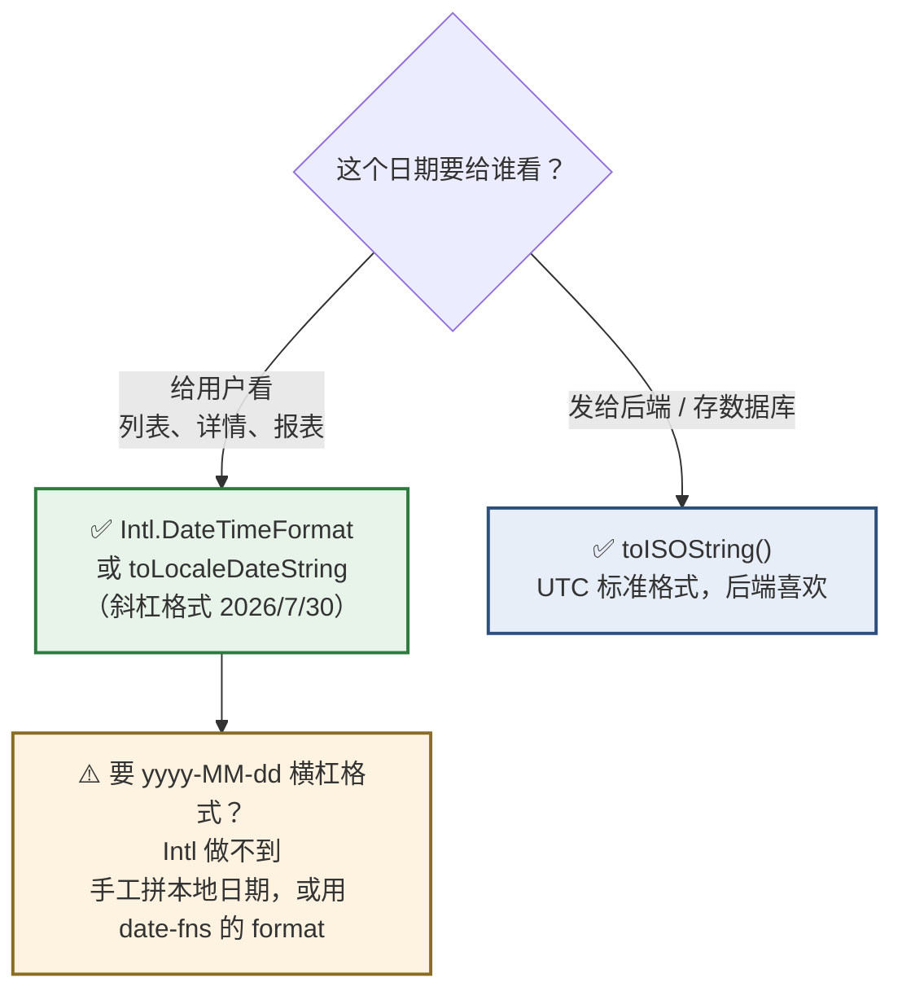
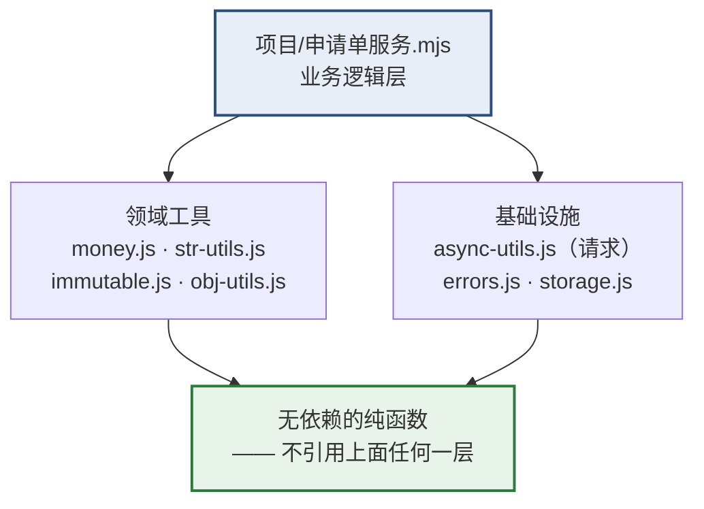

# Day 14 — 收口 + 杂项 + 阶段项目

> **阶段 1 的最后一天。** 上半场补完三块日常必用的东西，下半场做一个项目把 Day 3–13 全部串起来。
> 1. **原生 `Date` 的六个坑** —— 月份从 0 开始只是最出名的那个。含一个**只在中国时区才暴露**的坑
> 2. **`Intl` 格式化** —— **前端没有 `String.Format("{0:N2}")`，这就是替代品**，报表页面天天用
> 3. **正则基础** —— 表单校验够用即止
> 4. **⭐ 阶段项目** —— 「价格申请单管理」模块，把前 11 天的产出全部用上
>
> **时间**：2 小时（项目可顺延 1–2 天）
> **前置**：Day 3–13 的所有练习文件
> **本文所有输出均经 Node.js 24 实测**，日期部分在 `TZ=Asia/Shanghai` 下验证

## 今天结束时你应该能做到

- [ ] **知道 `new Date(2026, 6, 30)` 是七月不是六月**
- [ ] **知道 `new Date('2026-07-30')` 和 `new Date('2026/07/30')` 差 8 小时**
- [ ] 知道 `toISOString().slice(0, 10)` 可能给出**前一天**
- [ ] 知道日期能用 `<` `>` 比较，但**不能用 `===`**
- [ ] 会判断非法日期
- [ ] **知道实务结论：装 `date-fns`，不要自己处理日期**
- [ ] **会用 `Intl.NumberFormat` 输出千分位金额**（`String.Format("{0:N2}")` 的替代品）
- [ ] 会用 `Intl.DateTimeFormat` 格式化日期
- [ ] 会写手机号、金额的正则校验
- [ ] **完成阶段项目**，并通过全部验收清单

## 时间分配

| 时段 | 内容 | 时长 |
| --- | --- | --- |
| 1 | **原生 `Date` 的六个坑** | 25 分钟 |
| 2 | **`Intl` 格式化** | 20 分钟 |
| 3 | 正则基础 | 20 分钟 |
| 4 | 认得就行 / 永远不用 | 10 分钟 |
| 5 | **⭐ 阶段项目** | 45 分钟 |

---

# 第 1 节：原生 `Date` 的六个坑（25 分钟）

> **先说结论：实务上装 `date-fns`，不要自己处理日期。**
>
> 但你**必须知道这些坑**，因为：① 你会在接手的代码里看到裸 `Date`；② 后端返回的日期字符串要你解析；③ 出 bug 时得认得出来。

## 1.1 🟩 亲手跑一遍（`day2-modules` 里建 `date1.mjs`）

**⚠️ 中国大陆用户请这样跑，才能重现真实环境的行为：**

```bash
# Windows（cmd）
set TZ=Asia/Shanghai && node date1.mjs

# Windows（PowerShell）
$env:TZ="Asia/Shanghai"; node date1.mjs

# macOS / Linux
TZ=Asia/Shanghai node date1.mjs
```

```js
console.log('当前时区:', Intl.DateTimeFormat().resolvedOptions().timeZone)
```

**应该输出 `Asia/Shanghai`。** 如果输出 `UTC`，下面第 2、3 个坑就重现不出来。

## 1.2 坑 1：月份从 0 开始 💥

```js
console.log(new Date(2026, 6, 30).toString().slice(0, 15))    // 'Thu Jul 30 2026'   ← 6 是七月！
console.log(new Date(2026, 7, 30).toString().slice(0, 15))    // 'Sun Aug 30 2026'   ← 7 是八月
console.log(new Date(2026, 6, 30).getMonth())                 // 6                   ← 读出来也是 6
```

**「年、日、时、分、秒」都是正常的自然数，只有「月」从 0 开始。**

**这是 JS 里最出名的设计失误**（1995 年从 Java 抄来的）。

**对照 C#**：`new DateTime(2026, 7, 30)` 里的 `7` 就是七月。**你的直觉在这里会直接害你。**

```js
// 显示月份时永远要 +1
const d = new Date(2026, 6, 30)
console.log(`${d.getFullYear()}-${String(d.getMonth() + 1).padStart(2, '0')}-${String(d.getDate()).padStart(2, '0')}`)
// '2026-07-30'
```

## 1.3 坑 2：横杠和斜杠的解析基准不同 💥

```js
const 横杠 = new Date('2026-07-30')
const 斜杠 = new Date('2026/07/30')

console.log(横杠.toISOString())      // '2026-07-30T00:00:00.000Z'   ← 按 UTC 零点解析
console.log(斜杠.toISOString())      // '2026-07-29T16:00:00.000Z'   ← 按本地零点解析

console.log(横杠.getTime() === 斜杠.getTime())                  // false
console.log((斜杠.getTime() - 横杠.getTime()) / 3600000)         // -8   相差 8 小时
```

**规则：**

| 格式 | 解析基准 |
| --- | --- |
| `'2026-07-30'`（ISO 短格式，横杠） | **UTC 零点** |
| `'2026/07/30'`（斜杠） | **本地时区零点** |
| `'2026-07-30T00:00:00'`（ISO 带时间，无 Z） | 本地时区 |
| `'2026-07-30T00:00:00Z'`（带 Z） | UTC |

**在中国（UTC+8），`new Date('2026-07-30')` 实际是本地时间 7 月 30 日 08:00。**

> **这个坑在美国等 UTC 之后的时区更凶** —— `new Date('2026-07-30')` 会变成本地 **7 月 29 日**，`getDate()` 直接差一天。中国是 UTC+8（在 UTC 之前），所以 `getDate()` 碰巧还是 30，**但下一个坑就躲不过了**。

## 1.4 坑 3：`toISOString()` 是 UTC，可能给出前一天 💥

**这是中国时区下最容易中招的一个。**

```js
// 本地 2026-07-30 早上 8 点 → UTC 刚好是当天零点，没问题
const 上午 = new Date(2026, 6, 30, 8, 0, 0)
console.log(上午.toISOString())                  // '2026-07-30T00:00:00.000Z'
console.log(上午.toISOString().slice(0, 10))     // '2026-07-30'   ✅

// 本地 2026-07-30 凌晨 1 点 → UTC 是前一天 17 点
const 凌晨 = new Date(2026, 6, 30, 1, 0, 0)
console.log(凌晨.toISOString())                  // '2026-07-29T17:00:00.000Z'
console.log(凌晨.toISOString().slice(0, 10))     // '2026-07-29'   💥 变成前一天了！
```

**`toISOString().slice(0, 10)` 是网上最流行的「取日期部分」写法，但它在中国时区下，对当天 08:00 之前的时间会给出前一天。**

### 这会造成什么业务问题

**场景**：值班护士凌晨 2 点提交一张价格申请单，前端用 `toISOString().slice(0,10)` 记录申请日期。

**结果**：数据库里记的是**前一天**。月底统计时，这张单被算进了上个月。

**✅ 正确做法：用本地时间的年月日拼，或者用 `Intl`。**

```js
// 方式一：手工拼本地日期
const 本地日期 = (d) =>
  `${d.getFullYear()}-${String(d.getMonth() + 1).padStart(2, '0')}-${String(d.getDate()).padStart(2, '0')}`
console.log(本地日期(凌晨))                      // '2026-07-30'   ✅

// 方式二：用 Intl（第 2 节讲）
// 方式三：用 date-fns 的 format(d, 'yyyy-MM-dd')
```

> **规矩：`toISOString()` 只用于「发给后端的时间戳」（它是标准 UTC 格式，后端喜欢）。「给人看的日期」永远用本地时间格式化。**

## 1.5 坑 4：不能用 `===` 比较日期

```js
const a = new Date(2026, 0, 1)
const b = new Date(2026, 0, 1)

console.log(a === b)                    // false   ⚠️ 引用比较（Day 3 的知识）
console.log(a < b, a > b)               // false false   ← 大小比较是对的
console.log(a.getTime() === b.getTime()) // true   ✅
console.log(+a === +b)                   // true   ✅ 一元 + 转成毫秒数
```

**为什么 `<` `>` 能用但 `===` 不行**：`<` `>` 会先把 `Date` 转成数字（毫秒），而 `===` 是严格相等，两个不同的对象引用永远不等（Day 3 第 5 节）。

**规矩：比较日期是否相等，用 `+a === +b` 或 `a.getTime() === b.getTime()`。**

## 1.6 坑 5：非法日期不报错

```js
const 非法 = new Date('不是日期')

console.log(String(非法))                // 'Invalid Date'
console.log(非法.getTime())              // NaN
console.log(Number.isNaN(+非法))         // true    ✅ 这是判断方式
```

**`new Date('乱七八糟')` 不抛异常**，而是给你一个 `Invalid Date`。然后它会一路往下传，最后在页面上显示 `Invalid Date` 或 `NaN`。

**✅ 解析后必须校验：**

```js
const 安全解析日期 = (值) => {
  const d = new Date(值)
  return Number.isNaN(+d) ? null : d
}
console.log(安全解析日期('2026-07-30') !== null)     // true
console.log(安全解析日期('乱七八糟'))                 // null
```

> **这和 Day 3 第 3.6 节的 `NaN` 是同一个主题**：JS 倾向于「给一个无效值继续跑」而不是「抛异常停下来」。**所有从外部来的数据都要校验。**

## 1.7 坑 6：自动进位（有时有用，有时是 bug）

```js
console.log(new Date(2026, 0, 32).toString().slice(0, 15))     // 'Sun Feb 01 2026'   1月32日 → 2月1日
console.log(new Date(2026, 12, 1).toString().slice(0, 15))     // 'Fri Jan 01 2027'   第13个月 → 明年1月
```

**「越界自动进位」**。这个特性偶尔有用（`new Date(年, 月 + 1, 0)` 能拿到某月最后一天），但更多时候是在掩盖 bug。

## 1.8 ✅ 实务结论：装 `date-fns`

```bash
npm install date-fns
```

```js
// import { format, addDays, differenceInDays, parseISO, isValid } from 'date-fns'

// format(new Date(2026, 6, 30), 'yyyy-MM-dd')        → '2026-07-30'   本地时区，无坑
// format(new Date(), 'yyyy-MM-dd HH:mm:ss')          → 当前时间
// addDays(new Date(), 7)                             → 七天后
// differenceInDays(结束, 开始)                        → 相差天数
// isValid(parseISO('2026-07-30'))                    → true
```

**为什么选 `date-fns` 而不是 `moment.js`：**

| | `date-fns` | `moment.js` |
| --- | --- | --- |
| 状态 | ✅ 活跃 | ❌ **官方已宣布停止维护** |
| 体积 | 按需引入，只打包你用到的函数 | 整个库都打进去（很大） |
| 是否修改原对象 | ❌ 不改（纯函数，符合 React 理念） | ✅ 会改（可变对象） |

**看到用 `moment.js` 的教程，说明它至少五年没更新过。**

## 1.9 `Temporal`（了解名字就行）

**`Temporal` 是设计中的新日期 API**，会彻底解决上面所有坑（明确区分「日期」「时间」「时区」，全部不可变）。

**我实测过：Node 24 里还没有。**

```js
console.log(typeof globalThis.Temporal)      // 'undefined'
```

**浏览器端只有部分版本开始支持，整体尚未普及。** 工作项目里**至少还要等几年**。

> **今天只要记住这个名字**，将来看到 `Temporal.PlainDate` 这种写法知道那是什么。**现在用 `date-fns`。**

---

# 第 2 节：`Intl` 格式化（20 分钟）★

> **前端没有 `String.Format("{0:N2}")` 和 `ToString("yyyy-MM-dd")`。`Intl` 就是替代品。**

## 2.1 🟩 `Intl.NumberFormat` —— 数字格式化

**全部实测输出：**

```js
const 数 = 1234567.891

// 千分位
console.log(new Intl.NumberFormat('zh-CN').format(数))
// '1,234,567.891'

// 固定两位小数（这就是 String.Format("{0:N2}")）
console.log(new Intl.NumberFormat('zh-CN', {
  minimumFractionDigits: 2,
  maximumFractionDigits: 2,
}).format(数))
// '1,234,567.89'

// 人民币
console.log(new Intl.NumberFormat('zh-CN', { style: 'currency', currency: 'CNY' }).format(41.65))
// '¥41.65'
console.log(new Intl.NumberFormat('zh-CN', { style: 'currency', currency: 'CNY' }).format(1234567.891))
// '¥1,234,567.89'

// 百分比（注意传的是小数 0.1305，不是 13.05）
console.log(new Intl.NumberFormat('zh-CN', { style: 'percent', minimumFractionDigits: 1 }).format(0.1305))
// '13.1%'

// 紧凑显示（大数字）
console.log(new Intl.NumberFormat('zh-CN', { notation: 'compact' }).format(12345678))
// '1235万'

// 0 也会补齐两位
console.log(new Intl.NumberFormat('zh-CN', { minimumFractionDigits: 2 }).format(0))
// '0.00'
```

**⚠️ 两个注意点：**

1. **百分比传的是小数** —— `format(0.1305)` 得到 `13.1%`。如果传 `13.05` 会得到 `1,305%`
2. **`compact` 在中文下用「万」「亿」** —— 这正是中文报表想要的，英文 locale 会用 `12M`

## 2.2 ⭐ 和 Day 3 的整数分方案配合

**Day 3 定的规矩：金额全程用整数分，只在显示时转元。今天补上「显示」这一步的最佳写法。**

在 `money.js` 里追加：

```js
// 复用同一个 formatter 实例（创建 formatter 有开销，别在循环里 new）
const 金额格式 = new Intl.NumberFormat('zh-CN', {
  minimumFractionDigits: 2,
  maximumFractionDigits: 2,
})

const 人民币格式 = new Intl.NumberFormat('zh-CN', {
  style: 'currency',
  currency: 'CNY',
})

/** 分 → 带千分位的元字符串。'1,234,567.89' */
export function 分转元显示(分) {
  return 金额格式.format(分 / 100)
}

/** 分 → 带￥符号。'¥1,234,567.89' */
export function 分转人民币(分) {
  return 人民币格式.format(分 / 100)
}
```

```js
console.log(分转元显示(123456789))       // '1,234,567.89'
console.log(分转人民币(4165))            // '¥41.65'
console.log(分转元显示(0))               // '0.00'
```

**对比 Day 3 那个简单版：**

| 写法 | `4165` 分 | `123456789` 分 |
| --- | --- | --- |
| `(分/100).toFixed(2)`（Day 3） | `'41.65'` | `'1234567.89'`（无千分位） |
| **`分转元显示`（今天）** | `'41.65'` | **`'1,234,567.89'`** ✅ |

**报表页面必须有千分位** —— 否则用户数不清是一百万还是一千万。

> **⚠️ 性能提示**：`new Intl.NumberFormat(...)` 的创建开销不小。**一定要在模块顶层创建一次复用**，不要写在 `map` 回调里 —— 一张 1000 行的表格会创建 1000 个 formatter。

## 2.3 🟩 `Intl.DateTimeFormat` —— 日期格式化

```js
const 时刻 = new Date(2026, 6, 30, 14, 5, 9)

console.log(new Intl.DateTimeFormat('zh-CN').format(时刻))
// '2026/7/30'

console.log(new Intl.DateTimeFormat('zh-CN', {
  year: 'numeric', month: '2-digit', day: '2-digit',
}).format(时刻))
// '2026/07/30'      ← 补零了

console.log(new Intl.DateTimeFormat('zh-CN', {
  dateStyle: 'short', timeStyle: 'medium',
}).format(时刻))
// '2026/7/30 14:05:09'

console.log(new Intl.DateTimeFormat('zh-CN', { dateStyle: 'full' }).format(时刻))
// '2026年7月30日星期四'

// 简写形式
console.log(时刻.toLocaleDateString('zh-CN'))     // '2026/7/30'
console.log(时刻.toLocaleString('zh-CN'))         // '2026/7/30 14:05:09'
```

**⚠️ `Intl` 输出的是斜杠格式 `2026/7/30`，不是 `2026-07-30`。**

**如果后端或报表要求 `yyyy-MM-dd` 横杠格式，`Intl` 做不到**（它按 locale 习惯输出）。这时用手工拼或 `date-fns`：

```js
// 手工拼（第 1.4 节那个函数）
const 本地日期 = (d) =>
  `${d.getFullYear()}-${String(d.getMonth() + 1).padStart(2, '0')}-${String(d.getDate()).padStart(2, '0')}`

// 或 date-fns
// format(d, 'yyyy-MM-dd')
```

**实务分工：**



| 用途 | 用什么 |
| --- | --- |
| 给用户看的日期 | `Intl.DateTimeFormat` 或 `toLocaleDateString` |
| 需要 `yyyy-MM-dd` 精确格式 | 手工拼本地日期 或 `date-fns` 的 `format` |
| 发给后端 | `toISOString()`（UTC 标准格式） |

## 2.4 `Intl.RelativeTimeFormat` —— 「3天前」

```js
const 相对 = new Intl.RelativeTimeFormat('zh-CN', { numeric: 'auto' })

console.log(相对.format(-3, 'day'))       // '3天前'
console.log(相对.format(-1, 'day'))       // '昨天'      ← numeric: 'auto' 才会这样
console.log(相对.format(2, 'hour'))       // '2小时后'
```

**`numeric: 'auto'` 会把 `-1 天` 说成「昨天」而不是「1天前」** —— 更自然。

**用途**：列表里的「最后修改时间」显示「3天前」比显示完整日期更友好。

## 2.5 `Math` 速查

```js
console.log(Math.round(4.5), Math.round(-4.5))    // 5 -4      ⚠️ 负数是「向上取整」
console.log(Math.floor(4.9), Math.ceil(4.1))      // 4 5
console.log(Math.abs(-3))                         // 3
console.log(Math.max(1, 5, 3), Math.min(1, 5, 3)) // 5 1
console.log(Math.max(...[1, 5, 3]))               // 5         ← 数组要展开
console.log(Math.trunc(-4.9))                     // -4        直接砍掉小数
```

**⚠️ `Math.round(-4.5)` 是 `-4` 不是 `-5`** —— 它的规则是「四舍五入到更大的那个整数」。**做金额计算时如果涉及负数（退款、冲红），要留意这一点。**

**`Math.max()` 不接受数组**，要用展开运算符（Day 8）。

---

# 第 3 节：正则基础（20 分钟）

> **企业内部系统必然做表单校验**，所以这个不能跳过。但不用深挖 —— 掌握下面这些够用 95% 场景。

## 3.1 三个常用方法

```js
const 正则 = /\d+/

console.log(正则.test('abc123'))              // true    只判断有没有
console.log('abc123'.match(/\d+/))            // [ '123', index: 3, ... ]  取第一个匹配
console.log('a1b22c333'.match(/\d+/g))        // [ '1', '22', '333' ]      g 标志取全部
console.log('a1b2'.replace(/\d/g, '*'))       // 'a*b*'
```

| 方法 | 返回 | 用在 |
| --- | --- | --- |
| `正则.test(字符串)` | `true` / `false` | **校验（最常用）** |
| `字符串.match(正则)` | 匹配结果数组 或 `null` | 提取内容 |
| `字符串.replace(正则, 替换)` | 新字符串 | 替换 |
| `字符串.matchAll(正则)` | 迭代器（需 `g` 标志） | 提取全部 + 分组 |

## 3.2 够用的语法表

| 写法 | 含义 |
| --- | --- |
| `\d` | 一个数字（等于 `[0-9]`） |
| `\D` | 一个非数字 |
| `\w` | 一个字母/数字/下划线 |
| `\s` | 一个空白（空格、Tab、换行） |
| `.` | 任意一个字符（除换行） |
| `[abc]` | a 或 b 或 c |
| `[^abc]` | 除了 a b c |
| `[0-9]` `[a-z]` `[\u4e00-\u9fa5]` | 范围（最后一个是**中文汉字**） |
| `*` | 0 个或多个 |
| `+` | **1 个或多个** |
| `?` | 0 个或 1 个（可选） |
| `{3}` | 恰好 3 个 |
| `{2,4}` | 2 到 4 个 |
| `^` | 字符串**开头** |
| `$` | 字符串**结尾** |
| `\|` | 或 |
| `(...)` | 分组（可以捕获） |
| `(?<名字>...)` | **命名分组** |

**标志（写在末尾）：**

| 标志 | 含义 |
| --- | --- |
| `g` | 全局（找全部而不是第一个） |
| `i` | 忽略大小写 |
| `m` | 多行模式 |

## 3.3 ⭐ `^` 和 `$` 是校验的关键

```js
// ❌ 没有 ^ $ —— 只要「包含」11 位数字就通过
console.log(/\d{11}/.test('乱码13812345678乱码'))         // true    💥

// ✅ 加上 ^ $ —— 必须「整个字符串就是」11 位数字
console.log(/^\d{11}$/.test('乱码13812345678乱码'))       // false   ✅
console.log(/^\d{11}$/.test('13812345678'))              // true
```

**规矩：做校验时 `^` 和 `$` 必须都写。** 忘了就变成「包含即通过」。

## 3.4 企业表单常用的几个

在 `str-utils.js` 里追加：

```js
/** 手机号（中国大陆，1 开头 11 位） */
export const 是手机号 = (值) => /^1[3-9]\d{9}$/.test(值)

/** 金额：最多两位小数，不允许负数和前导零 */
export const 是金额 = (值) => /^(0|[1-9]\d*)(\.\d{1,2})?$/.test(值)

/** 单号：两位大写字母 + 8 位数字 */
export const 是单号 = (值) => /^[A-Z]{2}\d{8}$/.test(值)

/** 纯中文姓名，2–10 个汉字 */
export const 是中文姓名 = (值) => /^[\u4e00-\u9fa5]{2,10}$/.test(值)

/** 邮箱（宽松版，够用） */
export const 是邮箱 = (值) => /^[^\s@]+@[^\s@]+\.[^\s@]+$/.test(值)
```

**实测：**

```js
console.log(是手机号('13812345678'))      // true
console.log(是手机号('12812345678'))      // false   第二位不能是 2
console.log(是手机号('1381234567'))       // false   只有 10 位

console.log(是金额('41.65'))              // true
console.log(是金额('0.5'))                // true
console.log(是金额('41.655'))             // false   三位小数
console.log(是金额('041.65'))             // false   前导零
console.log(是金额('-41.65'))             // false   负数

console.log(是单号('SQ20260730'))         // true
console.log(是单号('sq20260730'))         // false   小写
```

### ⚠️ 邮箱正则不要追求「完全正确」

**网上流传的「完美邮箱正则」有几千个字符，而且仍然不完整**（RFC 5322 允许极其古怪的格式）。

**实务做法**：用宽松正则挡住明显的错（没有 `@`、没有域名后缀），**真正的验证靠发验证邮件**。

## 3.5 命名分组 —— 提取内容

```js
const 单号正则 = /^(?<前缀>[A-Z]{2})(?<年>\d{4})(?<月>\d{2})(?<日>\d{2})$/
const 结果 = 'SQ20260730'.match(单号正则)

console.log(结果.groups.前缀)             // 'SQ'
console.log(结果.groups.年)               // '2026'
console.log(结果.groups.月)               // '07'
console.log(结果.groups.日)               // '30'
```

**`match` 返回的对象上有个 `groups` 属性**，里面是命名分组。比用 `结果[1]` `结果[2]` 清楚得多。

**注意匹配失败时 `match` 返回 `null`**，所以要用 `?.`（Day 4）：

```js
console.log('乱码'.match(单号正则)?.groups?.前缀 ?? '解析失败')     // '解析失败'
```

## 3.6 ⚠️ 带 `g` 标志的正则有状态

```js
const 有g = /\d/g
console.log(有g.test('a1'))               // true
console.log(有g.test('a1'))               // false   💥 同一个正则，第二次失败了
console.log(有g.lastIndex)                // 0       （已被重置）
```

**因为带 `g` 的正则会记住 `lastIndex`**，`test` 从上次位置继续找。

**规矩：**

- **做校验的正则不要加 `g`**（校验只需判断一次）
- **不要把带 `g` 的正则存成模块级常量反复用**，或者每次用前重置 `正则.lastIndex = 0`

---

# 第 4 节：认得就行 / 永远不用（10 分钟）

## 4.1 ☆ 认得就行（读到别人代码时不慌）

| 特性 | 一句话 | 哪里会见到 |
| --- | --- | --- |
| `Symbol` | 唯一的属性键，避免命名冲突 | 库的内部实现 |
| `generator` / `function*` / `yield` | 可暂停恢复的函数 | Redux-Saga（老项目） |
| `Proxy` / `Reflect` | 拦截对象操作 | **MobX、Vue 3 的响应式靠它** |
| 标签模板 `` fn`...` `` | 用函数处理模板字符串 | **styled-components**、GraphQL 查询 |
| `WeakMap` / `WeakSet` | 弱引用，键被回收时自动清除 | 缓存、私有数据 |
| `globalThis` | 跨环境的全局对象 | 库的兼容代码 |
| `BigInt`（`123n`） | 任意精度整数 | 处理超大整数（Day 3 提过） |
| `??=` `||=` `&&=` | 逻辑赋值（Day 4 学过） | 现代代码 |
| `at(-1)` | 取倒数第几个（Day 8 学过） | 现代代码 |
| `structuredClone` | 深拷贝（Day 7 学过） | 现代代码 |

**这十项里，前六个你一行都不用写。** 认出来知道是干什么的就够。

## 4.2 ✕ 永远不用

| 禁用 | 为什么 | 用什么代替 |
| --- | --- | --- |
| `var` | 作用域是函数不是块（Day 3） | `const` / `let` |
| `==` | 隐式类型转换（Day 4） | `===`（唯一例外 `x == null`） |
| `eval` | 执行任意字符串，安全灾难 + 无法优化 | 没有正当理由需要它 |
| `with` | 作用域混乱，严格模式已禁 | — |
| `document.write` | 会清空整个页面 | React 渲染 |
| `arguments` | 不是真数组，箭头函数里没有（Day 5） | `...rest` |
| `new Array(n).fill([])` | 填的是同一个引用（Day 8） | `Array.from({length:n}, () => [])` |
| `for...in` 遍历数组 | 遍历原型链，键是字符串（Day 9/12） | `for...of` / `map` |
| `moment.js` | 官方已停止维护 | `date-fns` |
| **jQuery** | 和 React 的模型直接冲突 | React 本身 |
| `innerHTML = 用户输入` | **XSS 漏洞** | React 的 `{}` 自动转义 |

**最后一条值得多说一句**：React 的 `{值}` 会自动转义 HTML，天然防 XSS。**只有 `dangerouslySetInnerHTML` 会绕过这个保护** —— 它的名字里有 `dangerously` 就是在警告你。

---

# 第 5 节：⭐ 阶段项目（45 分钟）

## 5.1 目标

**写一个「价格申请单管理」模块，把 Day 3–13 学的全部串起来。**

**不做界面，全部在控制台验证。** 这样你能专注在 JS 逻辑上，而不是被 UI 分散注意力 —— 界面是阶段 4 的事。

## 5.2 用到的前置文件

| 文件 | 来自 | 提供什么 |
| --- | --- | --- |
| `money.js` | Day 3 + 今天 | `元转分` / `分转元` / `含税` / `分转元显示` |
| `str-utils.js` | Day 4 + 今天 | `生成单号` / `中文排序` / `是手机号` / `是金额` |
| `immutable.js` | Day 9 | `增行` / `删行` / `改行` / `上移` |
| `async-utils.js` | Day 10–11 | `请求` / `sleep` / `接口错误` |
| `errors.js` | Day 12 | `校验错误` / `用户提示` |
| `storage.js` | Day 13 | `存` / `取` |
| `假接口.mjs` | Day 11 | 本地测试服务器 |

**如果某个文件当时没写完，现在补上。** 这就是「阶段项目」的意义 —— 检验前 11 天有没有真正掌握。

**模块依赖关系（严格单向，不许反向 —— Day 2 第 7.4 节的纪律）：**



**检查点：`money.js` 绝对不许 `import` `申请单服务.mjs`。** 一旦出现反向依赖，就是 Day 2 讲的循环依赖，会抛那个不提「循环依赖」四个字的 `ReferenceError`。

## 5.3 骨架

新建 `项目/申请单服务.mjs`：

```js
import { 元转分, 分转元显示, 含税 } from '../money.js'
import { 是金额 } from '../str-utils.js'
import { 校验错误 } from '../errors.js'
import { 存, 取 } from '../storage.js'

/** 生成临时 id（Day 9 第 5.4 节：创建时生成，不在渲染时生成） */
const 新id = () => crypto.randomUUID()

/** 建一张空单 */
export function 新建申请单(单号) {
  return {
    id: 新id(),
    单号,
    申请人: { 姓名: '', 部门: '' },     // 嵌套对象，练 Day 7 的逐层展开
    状态: '草稿',
    明细: [],
    创建时间: Date.now(),               // 存时间戳，避免 Date 的序列化问题
  }
}

/** 建一行明细 */
export function 新建明细(名称, 单价元, 数量) {
  if (!是金额(String(单价元))) {
    throw new 校验错误(`单价格式不对：${单价元}`, '单价')
  }
  if (!Number.isInteger(数量) || 数量 <= 0) {
    throw new 校验错误('数量必须是正整数', '数量')
  }
  return { id: 新id(), 名称, 单价分: 元转分(单价元), 数量 }
}

// ===== 以下是你要实现的 =====

/** 增加一行明细（不可变） */
export function 加明细(单, 明细) {
  // TODO：Day 9 第一式
}

/** 删除一行明细 */
export function 删明细(单, 明细id) {
  // TODO：Day 9 第二式，注意是 !==
}

/** 改某一行的数量 */
export function 改数量(单, 明细id, 新数量) {
  // TODO：Day 9 第三式 + 校验
}

/** 改申请人姓名（注意这是第二层嵌套） */
export function 改申请人姓名(单, 姓名) {
  // TODO：Day 7 第 4.3 节，逐层展开
}

/** 明细行上移 */
export function 上移明细(单, 下标) {
  // TODO：Day 9 第 2.6 节
}

/** 合计（整数分，精确） */
export function 合计分(单) {
  // TODO：Day 8 的 reduce，别忘初始值
}

/** 含税合计 */
export function 含税合计分(单, 税率 = 0.13) {
  // TODO：Day 3，乘小数后要 Math.round
}

/** 按状态分组统计条数 */
export function 按状态统计(单们) {
  // TODO：Day 8 第 4.3 节
}

/** 提交前校验，返回错误数组（空数组表示通过） */
export function 校验(单) {
  // TODO：注意 Day 8 第 3.4 节那个「空数组 every 为真」的坑
}

/** 状态流转：草稿 → 待审核 → 已通过/已驳回 */
export function 流转(单, 目标状态) {
  // TODO：用一张 Record 风格的映射表定义允许的流转
}

/** 生成给用户看的摘要 */
export function 摘要(单) {
  // TODO：用 分转元显示 输出千分位金额
}

/** 存草稿到 localStorage（浏览器里才能真跑） */
export function 存草稿(单) {
  // TODO：Day 13 的 存()
}
```

## 5.4 验收清单

**逐条验证，全部通过才算完成。** 每一条后面标注了它检验哪一天的内容。

### 金额（Day 3）

- [ ] `合计分` 对 `[{单价分:865,数量:3},{单价分:7,数量:100},{单价分:435,数量:2}]` 返回 **`4165`**
- [ ] `合计分` 对空明细返回 **`0`**（不抛异常）
- [ ] `含税合计分(单, 0.13)` 返回 **`4706`**（`Math.round(4165 * 1.13)`）
- [ ] 全程没有出现小数金额运算
- [ ] `新建明细('X', '41.655', 1)` **抛 `校验错误`**（三位小数）
- [ ] `新建明细('X', '-1', 1)` **抛 `校验错误`**（负数）

### 不可变（Day 3 / 7 / 9）

- [ ] `加明细(单, 行)` 后，**原 `单.明细.length` 不变**
- [ ] `改数量` 后，**没被改动的那些行 `Object.is` 为 `true`**（保持原引用）
- [ ] `改申请人姓名` 后，**原单的 `申请人.姓名` 不变**，且 `Object.is(原单.申请人, 新单.申请人)` 为 **`false`**
- [ ] `上移明细(单, 0)` 返回原单（边界判断）
- [ ] `上移明细` 后原单顺序不变
- [ ] 全文没有出现 `push` / `splice` / `sort` / `直接赋值给已有对象的属性`

### 数组（Day 8）

- [ ] `按状态统计` 返回形如 `{ 草稿: 2, 待审核: 1 }`
- [ ] `校验` 对「明细为空」的单**返回错误**（不能因为 `[].every(...)` 为 `true` 就通过）
- [ ] `校验` 返回的是数组，空数组表示通过

### 字符串 / 格式化（Day 4 / 14）

- [ ] `摘要` 里的金额带**千分位**（`1,234,567.89` 而不是 `1234567.89`）
- [ ] 单号校验用了 `^` 和 `$`

### 错误处理（Day 10 / 12）

- [ ] `校验错误` 有 `name`、`字段` 两个属性，且 `instanceof Error` 为 `true`
- [ ] `流转` 到非法状态时抛错，错误信息说清「从 X 不能到 Y」

### 异步（Day 10 / 11）—— 额外练习

- [ ] 写一个 `从接口加载(id)`，用 Day 11 的 `请求()` 封装
- [ ] 起 `假接口.mjs`，验证 `/ok`（成功）、`/500`（抛 `接口错误`）、`/204`（返回 `null`）三种情况
- [ ] 写一个 `批量提交(单们)`，用 **`Promise.allSettled`** 并汇总「成功 N 条，失败 M 条」
- [ ] 用 `AbortController` 给加载加上取消能力

### 存储（Day 13）—— 浏览器里验证

- [ ] `存草稿` / 读草稿 有 `try/catch`
- [ ] 存了金额为 `0` 的草稿，读回来是 `0` 而不是默认值

## 5.5 参考实现（三个关键函数）

**先自己写。** 三个函数分别对应本阶段最容易出错的三处：`map` 里的原引用保持、嵌套逐层展开、空数组的 `every` 陷阱。

<details>
<summary>卡住了再点开 —— 三个关键函数的参考实现</summary>

```js
/** 改某一行的数量 —— 注意 `: 行` 而不是 `: {...行}` */
export function 改数量(单, 明细id, 新数量) {
  if (!Number.isInteger(新数量) || 新数量 <= 0) {
    throw new 校验错误('数量必须是正整数', '数量')
  }
  return {
    ...单,
    明细: 单.明细.map((行) => (行.id === 明细id ? { ...行, 数量: 新数量 } : 行)),
    //                                                                    ↑ 未改动的行保持原引用
  }
}

/** 改申请人姓名 —— 第二层嵌套，逐层展开 */
export function 改申请人姓名(单, 姓名) {
  return {
    ...单,                                    // 第一层
    申请人: { ...单.申请人, 姓名 },            // 第二层
  }
}

/** 校验 —— 注意空明细的处理 */
export function 校验(单) {
  const 错误 = []

  if (!单.申请人?.姓名) 错误.push('申请人姓名必填')
  if (!单.申请人?.部门) 错误.push('申请部门必填')

  // ⚠️ 必须先判长度，否则空明细会因为 every 返回 true 而通过
  if (单.明细.length === 0) {
    错误.push('至少要有一行明细')
  } else {
    if (!单.明细.every((行) => 行.名称)) 错误.push('明细名称不能为空')
    if (!单.明细.every((行) => 行.数量 > 0)) 错误.push('明细数量必须大于 0')
    if (合计分(单) <= 0) 错误.push('合计金额必须大于 0')
  }

  return 错误
}
```

</details>

## 5.6 状态流转表（提示）

```js
const 允许流转 = {
  草稿: ['待审核'],
  待审核: ['已通过', '已驳回'],
  已通过: [],                  // 终态
  已驳回: ['草稿'],            // 可以退回修改
}

export function 流转(单, 目标状态) {
  const 可去 = 允许流转[单.状态] ?? []
  if (!可去.includes(目标状态)) {
    throw new 校验错误(`不能从「${单.状态}」流转到「${目标状态}」`, '状态')
  }
  return { ...单, 状态: 目标状态 }
}
```

**这张「状态 → 允许的下一状态」映射表是企业系统里非常常用的模式。** 到了 TS 阶段（Day 20），它会变成 `Record<状态, 状态[]>`，编译器会强制你把所有状态都写全。

## 5.7 做完之后

**把这个模块留着。** 阶段 4 学 React 时，你会给它套上界面 —— **到那时你会发现业务逻辑已经写好了，只需要接上 UI**。

**这正是我们把「不做界面」作为要求的原因**：业务逻辑和界面分离，是好架构的基本特征。

---

# 今日验收清单

- [ ] **知道 `new Date(2026, 6, 30)` 是七月**（月份从 0 开始）
- [ ] 显示月份时记得 `getMonth() + 1`
- [ ] **知道 `'2026-07-30'` 按 UTC 解析、`'2026/07/30'` 按本地解析**，在中国差 8 小时
- [ ] **知道 `toISOString().slice(0,10)` 对本地凌晨时间会给出前一天**
- [ ] 知道「给人看的日期」用本地格式化，「发后端」才用 `toISOString()`
- [ ] 知道日期比较用 `+a === +b`，不能用 `===`
- [ ] 会用 `Number.isNaN(+d)` 判断非法日期
- [ ] **知道实务结论：装 `date-fns`，不用 `moment.js`（已停止维护）**
- [ ] 知道 `Temporal` 这个名字，也知道现在还用不上
- [ ] **会用 `Intl.NumberFormat` 输出千分位金额**
- [ ] 知道百分比要传小数（`0.13` 不是 `13`）
- [ ] **知道 formatter 要在模块顶层创建一次复用**，不能在 `map` 里 new
- [ ] 知道 `Intl` 输出的是 `2026/7/30` 斜杠格式，要横杠得手工拼或用 `date-fns`
- [ ] 知道 `Math.round(-4.5)` 是 `-4`
- [ ] 知道 `Math.max()` 要用 `...` 展开数组
- [ ] **校验正则必须写 `^` 和 `$`**
- [ ] 写过手机号、金额、单号的校验正则
- [ ] 知道邮箱正则不要追求完美，真验证靠发邮件
- [ ] 知道带 `g` 的正则有 `lastIndex` 状态，校验用的正则不要加 `g`
- [ ] 能说出「永远不用」清单里至少 8 项
- [ ] 知道 React 的 `{}` 自动转义防 XSS，`dangerouslySetInnerHTML` 会绕过
- [ ] **⭐ 阶段项目完成，5.4 节的验收清单全部通过**

---

# 常见问题排查

## 日期显示的月份少了一个月

`getMonth()` 从 0 开始，显示要 `+1`。第 1.2 节。

## 同一个日期，有时对有时差一天

混用了 `'2026-07-30'`（UTC）和 `'2026/07/30'`（本地）两种格式。统一用一种。第 1.3 节。

## 凌晨提交的单子，日期记成了前一天

用了 `toISOString().slice(0,10)`。改用本地日期格式化。第 1.4 节。

## 两个日期明明一样，`===` 却是 `false`

`Date` 是对象，`===` 比引用。用 `+a === +b`。第 1.5 节。

## 页面上显示 `Invalid Date`

`new Date(...)` 解析失败了。解析后要用 `Number.isNaN(+d)` 校验。第 1.6 节。

## 金额显示成 `1234567.89`，用户看不清

没用千分位。用 `Intl.NumberFormat`。第 2.1 节。

## 大表格滚动很卡

可能在 `map` 回调里 `new Intl.NumberFormat(...)`。提到模块顶层创建一次。第 2.2 节。

## 百分比显示成 `1305%`

`Intl` 的 `style: 'percent'` 要传小数。`0.1305` 而不是 `13.05`。第 2.1 节。

## 校验正则「乱码13812345678乱码」也通过了

忘了 `^` 和 `$`。第 3.3 节。

## 同一个正则 `test` 第二次返回 `false`

带 `g` 标志的正则有 `lastIndex` 状态。校验用的正则不要加 `g`。第 3.6 节。

## `match(...)` 之后取 `.groups` 报错

匹配失败时 `match` 返回 `null`。用 `?.groups?.字段`。第 3.5 节。

---

# 🎉 阶段 1 完成

**你已经学完了 React 开发所需的全部 JavaScript 基础。** 回顾一下这 14 天：

| Day | 内容 | 最重要的一条 |
| --- | --- | --- |
| 1 | 工具链 | Node 是给**开发工具**用的，不是给网页用的 |
| 2 | 模块与心智模型 | `UI = f(state)`；单线程事件循环 |
| 3 | 变量与引用相等 | **`Object.is` 是不可变更新的成因**；金额用整数分 |
| 4 | 运算符与真值假值 | `&&` 返回操作数；取默认值用 `??` |
| 5 | 函数（上） | `() => ({})` 要加括号；组件必须是纯函数 |
| 6 | 闭包 | **闭包捕获变量，React 每次渲染新建一套变量** |
| 7 | 对象 | 浅拷贝只解决一层；改哪层就展开到哪层 |
| 8 | 数组（读） | `map` 是渲染列表的唯一手段；`sort` 有两个坑 |
| 9 | 数组（写） | 五式全部由 `Object.is` 推导；`key` 不能用 index |
| 10 | Promise | 忘写 `await` 会得到 `[object Promise]`；JS 无法同步等待 |
| 11 | fetch | **`fetch` 不因 404/500 而失败，必须查 `res.ok`** |
| 12 | 类与原型 | 自定义 Error 必须设 `this.name`；React 为何抛弃 class |
| 13 | 浏览器 API | **改 state 而不是改 DOM**；FormData 别设 `Content-Type` |
| 14 | 收口 | `Date` 六个坑；`Intl` 是 `String.Format` 的替代品 |

**如果其中有你说不清的，回去翻那一天的「今日验收清单」。**

---

# 明天预告：Day 15 — TypeScript 是什么 + 基础标注

**阶段 2 开始，5 天打完 TypeScript 够用版。**

**好消息**：TypeScript 和 C# 是同一个人（Anders Hejlsberg）主持设计的，**语法你会觉得莫名亲切**。

明天三个重点：

1. **TS 只在编译期存在，运行时被完全擦除** —— 没有反射、拿不到 `typeof T`、泛型里不能 `new T()`。**这是和 C# 最大的能力差异**
2. **Vite 只转译不检查类型！** 必须单独跑 `tsc --noEmit`，否则类型错误会静默溜进生产
3. **基础标注** —— 优先依赖类型推断，不要过度标注

**从 Day 22 起，你会一边学 React 一边补 TS 进阶。** 所以这 5 天只学「够用的下限」。

阶段项目的代码留着 —— **Day 19 的任务就是把它全部改写成 TypeScript，零 `any`**。

---

## 参考来源

- [MDN：Date](https://developer.mozilla.org/zh-CN/docs/Web/JavaScript/Reference/Global_Objects/Date)
- [MDN：Intl.NumberFormat](https://developer.mozilla.org/zh-CN/docs/Web/JavaScript/Reference/Global_Objects/Intl/NumberFormat)
- [MDN：正则表达式](https://developer.mozilla.org/zh-CN/docs/Web/JavaScript/Guide/Regular_expressions)
- [date-fns 官方文档](https://date-fns.org/)
- [TC39 Temporal 提案](https://tc39.es/proposal-temporal/docs/)

> 上述来源的内容已经过改写与归纳，以符合许可要求。
