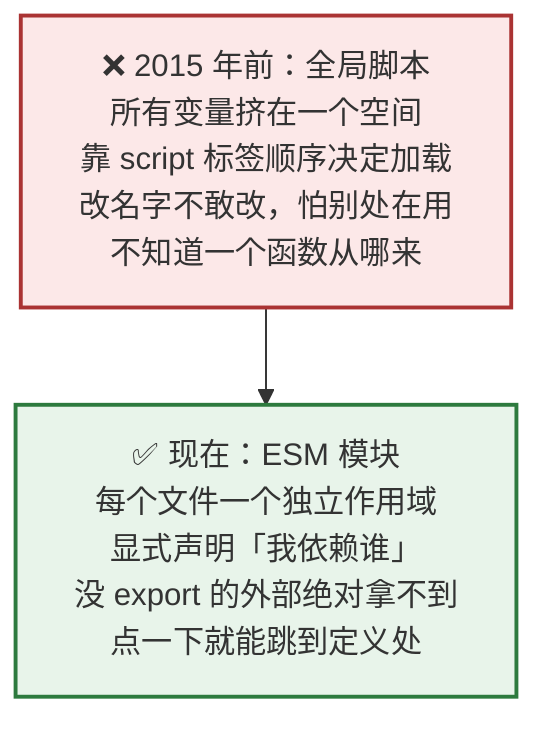
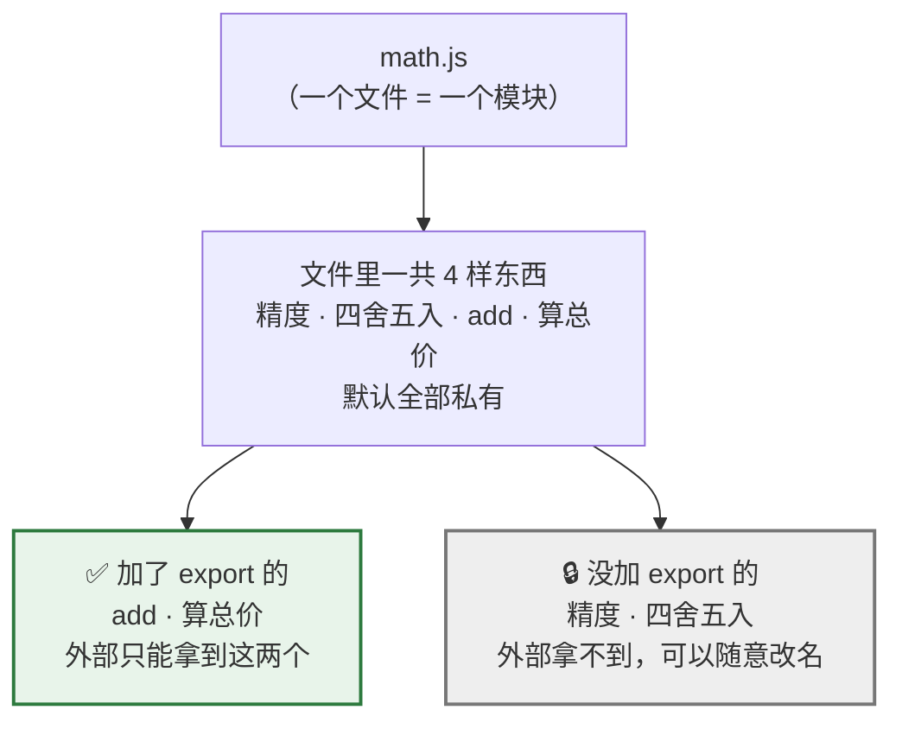
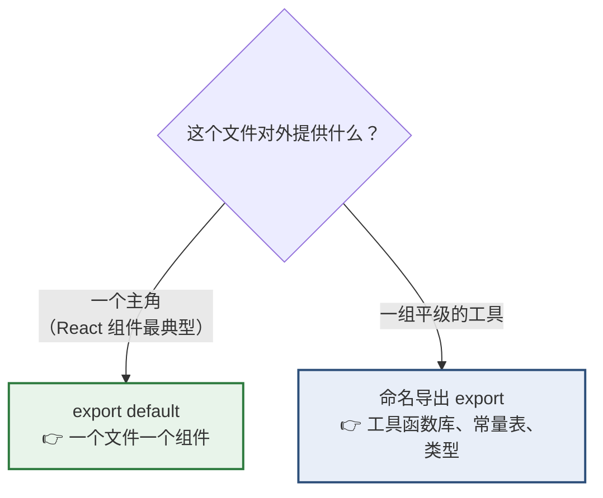
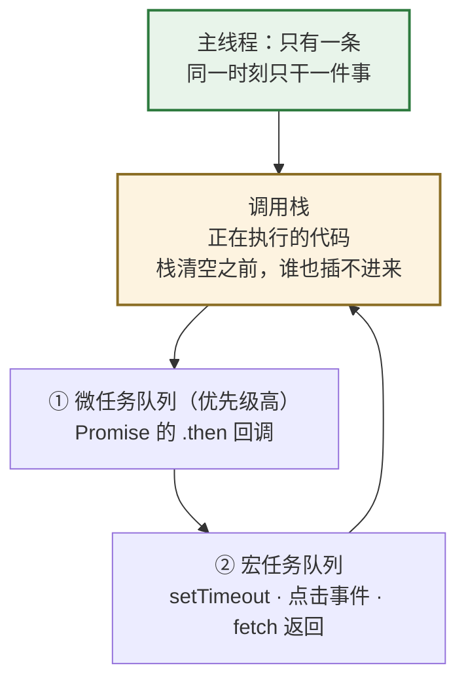
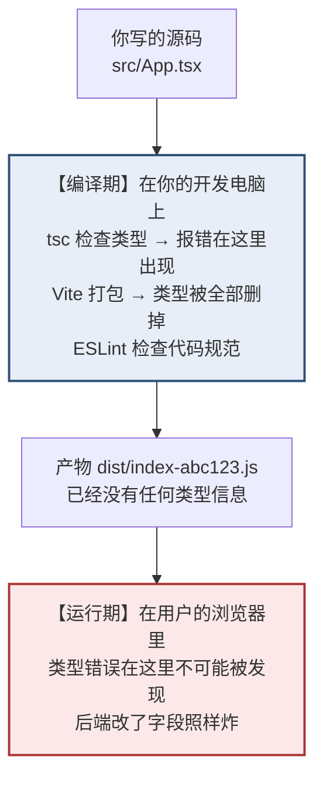
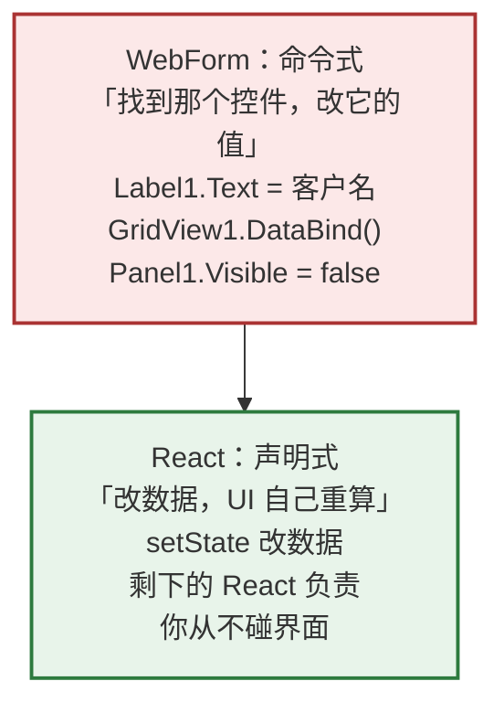

# Day 2 — 模块系统 + 心智模型

> **今天的定位**：学会 `import` / `export`（今后每个文件的第一行都是它），并建立三个贯穿全程的心智模型。
>
> **时间**：2 小时
> **前置**：Day 1 已装好 Node，`my-first-app` 项目还留着
> **今天写的代码**：纯 JavaScript，不涉及 TypeScript 语法

## 今天结束时你应该能做到

- [ ] 说清楚「一个文件就是一个模块，没 `export` 的东西外部绝对拿不到」
- [ ] 熟练写命名导出和默认导出，知道 `import` 什么时候要花括号、什么时候不要
- [ ] 知道 `import` 后面的字符串什么时候要写 `./`、什么时候不写
- [ ] 能解释 JS 里为什么没有 `namespace`、没有 `using`、没有 dll
- [ ] 认得出循环依赖，知道它为什么比普通报错更难查
- [ ] 能预测这段代码的打印顺序，并解释为什么
- [ ] 记住 `UI = f(state)`，并能说出它和 `Label1.Text = "x"` 的根本区别
- [ ] 打开 `my-first-app` 的 `main.tsx`，**每一行 `import` 都看得懂**

## 时间分配

| 时段 | 内容 | 时长 |
| --- | --- | --- |
| 1 | 为什么需要模块 | 10 分钟 |
| 2 | 建练习项目（含故意踩一个坑） | 15 分钟 |
| 3 | 命名导出 | 20 分钟 |
| 4 | 默认导出 | 15 分钟 |
| 5 | 路径规则 | 10 分钟 |
| 6 | 和 C# 的根本差别 | 10 分钟 |
| 7 | 循环依赖 | 10 分钟 |
| 8 | 三个心智模型 | 20 分钟 |
| 9 | `UI = f(state)` | 5 分钟 |
| 10 | 回到真实项目，读懂第一行 | 5 分钟 |

---

# 第 1 节：为什么需要模块（10 分钟）

## 1.1 2015 年之前的 JS 是这样的

那时候 JS 没有模块。想拆分代码，只能在 HTML 里排 `<script>` 标签：

```html
<script src="jquery.js"></script>
<script src="utils.js"></script>
<script src="page.js"></script>
```

**所有文件里的变量全部挤在同一个全局空间里。** 后果：

```js
// utils.js（同事写的）
var count = 0
function format(x) { return x.toFixed(2) }

// page.js（你写的）
var count = 100          // 💥 悄悄覆盖了同事的 count，没有任何报错
function format(x) { return x + '元' }   // 💥 又覆盖了他的 format
```

实际项目里的痛苦：

- **改名字不敢改**。`utils.js` 里有个函数叫 `check`，你想改成 `validateForm`，但你不知道全项目还有谁在用它 —— 因为**没有任何地方显式声明「我依赖它」**
- **顺序改了就崩**。`page.js` 用到 `utils.js` 的东西，那 `utils.js` 的 `<script>` 就必须排在前面。几十个文件时，顺序本身成了一份隐形文档
- **不知道一个变量从哪来**。看到 `formatMoney(x)`，它定义在哪个文件？只能全局搜索

## 1.2 你在 C# 里从没遇到过这个问题

因为 .NET 从第一天就有 `namespace` 和程序集（assembly），**作用域隔离是内建的**。

```csharp
namespace MyApp.Utils {
    public class Helper {
        private int count = 0;      // private 就是外面绝对拿不到
    }
}
```

JS 直到 **2015 年（ES6）** 才有官方模块方案。这中间的十几年，社区自己造了好几套方案（CommonJS、AMD、UMD），这就是为什么你在网上会看到好几种不同写法 —— 它们是不同年代的产物。

> **今天只学一种：ESM（ES Modules）**，也就是 `import` / `export`。这是唯一的官方标准，也是 React 项目里唯一该用的。其他的看得懂就行（第 8 节会提一句）。

## 1.3 模块解决了三件事



| 解决的问题 | 怎么解决的 |
| --- | --- |
| 命名冲突 | 每个文件独立作用域，你的 `count` 和我的 `count` 互不干扰 |
| 依赖关系看不见 | `import` 就写在文件开头，一眼看清这个文件依赖谁 |
| 不敢重构 | 没 `export` 的东西外部一定拿不到，可以放心改名删除 |

---

# 第 2 节：建练习项目（15 分钟）

今天我们**不在 Vite 项目里练**，而是单独建一个纯 JS 的小项目，用 `node` 直接跑。

**为什么**：Vite 项目是 TypeScript 的，会掺进类型检查的干扰。今天要专注模块本身，等第 10 节再回到真实项目。

## 2.1 建项目

```bash
d:
cd \code
mkdir day2-modules
cd day2-modules
npm init -y
```

（路径保持纯英文无空格 —— 这条 Day 1 讲过。）

## 2.2 故意踩第一个坑

新建文件 `math.js`：

```js
export function add(a, b) {
  return a + b
}
```

新建文件 `index.js`：

```js
import { add } from './math.js'

console.log('2 + 3 =', add(2, 3))
```

现在跑它：

```bash
node index.js
```

**你会看到报错：**

```
(node:12345) Warning: To load an ES module, set "type": "module" in the
package.json or use the .mjs extension.

SyntaxError: Cannot use import statement outside a module
    at ...
```

### 这个报错在说什么

Node 需要知道「这个 `.js` 文件是新的 ESM 模块，还是老的 CommonJS」。**默认它按老的 CommonJS 解释**，而 CommonJS 不认识 `import` 这个词。

### 修好它

打开 `package.json`，加一行 `"type": "module"`：

```json
{
  "name": "day2-modules",
  "version": "1.0.0",
  "type": "module",
  "main": "index.js",
  "scripts": {
    "test": "echo \"Error: no test specified\" && exit 1"
  }
}
```

再跑：

```bash
node index.js
```

```
2 + 3 = 5
```

✅ 成功。

### 三种做法对照

| 做法 | 效果 | 用在哪 |
| --- | --- | --- |
| `package.json` 里加 `"type": "module"` | 整个项目的 `.js` 都按 ESM 解释 | ✅ **新项目用这个** |
| 文件改名成 `.mjs` | 只有这个文件按 ESM 解释 | 老项目里想局部用 ESM 时 |
| 什么都不加 | 按 CommonJS 解释，必须用 `require` | 老项目 |

> **好消息**：Vite / React 项目**完全不用操心这件事**。Vite 天生就是 ESM，`my-first-app` 里直接写 `import` 就能用。
>
> 那为什么还要让你踩这个坑？因为**你将来一定会遇到这个报错** —— 比如写个小脚本处理数据、或者接手一个老项目。到时候你就知道去 `package.json` 里找 `"type"` 了。

---

# 第 3 节：命名导出（20 分钟）

## 3.1 核心规则：默认全部私有

把 `math.js` 改成这样，注意**只有两个函数带 `export`**：

```js
// math.js

// ① 没有 export —— 这是模块内部的私有常量
const 精度 = 2

// ② 没有 export —— 私有辅助函数
function 四舍五入(数值) {
  return Number(数值.toFixed(精度))
}

// ③ 有 export —— 外部可以用
export function add(a, b) {
  return 四舍五入(a + b)
}

// ④ 有 export —— 外部可以用
export function 算总价(单价, 数量, 税率) {
  return 四舍五入(单价 * 数量 * (1 + 税率))
}
```

> **顺带说明**：JS 的变量名和函数名**可以用中文**。生产项目里一般不这么写（团队协作、输入法切换都麻烦），但今天为了让你一眼看清哪个是我造的名字、哪个是语言关键字，我故意用中文。你练习时用中文或英文都行。



**这一点非常重要，请记牢**：

> **`export` 是一份「对外承诺清单」。** 没写在清单上的东西，外面的世界压根不知道它存在。所以你可以任意重命名 `四舍五入`、删掉 `精度`，**保证不会破坏任何其他文件**。

对照 C#：`export` ≈ `public`，不写 `export` ≈ `private`。区别是 JS 的默认值是 private，而且**作用域单位是文件，不是类**。

## 3.2 动手验证私有性

改 `index.js`：

```js
import { add, 算总价, 精度 } from './math.js'

console.log(add(1.111, 2.222))
```

跑一下：

```bash
node index.js
```

```
SyntaxError: The requested module './math.js' does not provide an export named '精度'
```

**报错了 —— 这正是我们想要的。** `精度` 确实存在于 `math.js` 里，但没 `export`，所以外部拿不到。

把 `精度` 从 import 里删掉，就正常了：

```js
import { add, 算总价 } from './math.js'

console.log('add(1.111, 2.222) =', add(1.111, 2.222))
console.log('算总价(100, 3, 0.13) =', 算总价(100, 3, 0.13))
```

```
add(1.111, 2.222) = 3.33
算总价(100, 3, 0.13) = 339
```

## 3.3 `export` 的两种写法

**写法一：在声明处直接加**（推荐，一眼看出哪些是公开的）

```js
export const 税率 = 0.13
export function add(a, b) { return a + b }
export class 客户 { }
```

**写法二：在文件末尾集中导出**

```js
const 税率 = 0.13
function add(a, b) { return a + b }

export { 税率, add }
```

两种完全等价。**写法一更常见**，因为改代码时不容易忘。写法二的好处是「对外清单」集中在一处，一眼看全。

> 注意写法二末尾的 `export { ... }` **不是对象字面量**，虽然长得像。它是专门的导出语法，里面只能写名字，不能写 `export { a: 1 }`。

## 3.4 花括号是强制的，名字必须对上

命名导出的 `import` **必须用花括号，且名字必须完全一致**：

```js
import { add } from './math.js'          // ✅ 正确
import add from './math.js'              // ❌ 拿不到（这是默认导出的语法）
import { Add } from './math.js'          // ❌ 大小写不符
import { plus } from './math.js'         // ❌ 名字不存在
```

**好消息**：VS Code 会自动补全和报红，你不用死记。打错了会立刻有波浪线。

## 3.5 重命名：`as`

名字冲突时，用 `as` 改个名：

```js
// 假设两个模块都导出了 format
import { format as 格式化金额 } from './money.js'
import { format as 格式化日期 } from './date.js'

console.log(格式化金额(1234.5))
console.log(格式化日期(new Date()))
```

`as` 只影响**当前文件**里的叫法，不影响原模块。

## 3.6 一次性全拿：`import * as`

```js
import * as 数学 from './math.js'

console.log(数学.add(2, 3))
console.log(数学.算总价(100, 3, 0.13))
```

这会把该模块所有导出打包成一个对象。

**但实务中很少用**，两个原因：

1. 打包工具没法「摇树」（tree-shaking）—— 就算你只用了一个函数，整个模块都会被打包进产物，白白增大体积
2. 代码里到处 `数学.xxx`，比直接写 `add(...)` 啰嗦

> 用得最多的场景是导入一整套配置或常量表。日常写业务代码时，**优先用花括号按需导入**。

## 3.7 和 C# 的对照

| C# | JS（ESM） |
| --- | --- |
| `public` | `export` |
| `private`（默认） | 不写 `export`（默认） |
| `using MyApp.Utils;`（引入整个命名空间） | `import { add } from './math.js'`（**只引入具体的东西**） |
| `using Alias = MyApp.Utils.Helper;` | `import { Helper as Alias } from './x.js'` |
| 作用域单位 = 类 / 命名空间 | 作用域单位 = **文件** |

**注意最关键的那一行**：C# 的 `using` 是「打开一个命名空间，里面所有 public 的东西都能直接用」；JS 的 `import` 是「**逐个点名**要哪几样东西」。这是习惯上最大的差别 —— JS 里没有「引入一整个命名空间然后随便用」这回事。

---

# 第 4 节：默认导出（15 分钟）

## 4.1 一个文件只能有一个 `export default`

```js
// 新建 customer.js
export default function 格式化客户(客户) {
  return `${客户.编号} - ${客户.名称}`
}
```

导入时**不用花括号，而且名字随你起**：

```js
import 格式化客户 from './customer.js'
import 随便叫什么 from './customer.js'    // 也合法！拿到的是同一个东西
```

**这是默认导出和命名导出最大的差别：**

| | 命名导出 | 默认导出 |
| --- | --- | --- |
| 导出写法 | `export function add() {}` | `export default function add() {}` |
| 一个文件能有几个 | 任意多个 | **只能一个** |
| 导入写法 | `import { add } from '...'` | `import add from '...'` |
| 花括号 | **必须有** | **不能有** |
| 名字 | 必须和导出的一致 | **随便起** |

## 4.2 什么时候用哪个



**React 生态的实际惯例：**

| 文件类型 | 用哪个 | 例子 |
| --- | --- | --- |
| React 组件 | `export default` | `export default function 客户列表() {}` |
| 工具函数集合 | 命名导出 | `export function 格式化金额() {}` |
| 常量 / 配置 | 命名导出 | `export const 分页大小 = 20` |
| 自定义 Hook | 命名导出 | `export function use客户数据() {}` |
| 类型定义（学到 TS 后） | 命名导出 | `export type 客户 = { ... }` |

一句话记法：**「这个文件是一个东西」用 default，「这个文件是一堆东西」用命名导出。**

## 4.3 两种可以混用

```js
// customer.js

// 主角：组件
export default function 客户列表() { /* ... */ }

// 配角：这个组件相关的常量和工具
export const 默认分页大小 = 20
export function 校验客户编号(编号) { /* ... */ }
```

导入时：

```js
import 客户列表, { 默认分页大小, 校验客户编号 } from './customer.js'
//     ↑默认导出   ↑命名导出（花括号里）
```

**顺序是固定的**：默认导出写在前面、不带花括号；命名导出跟在后面、带花括号。

## 4.4 默认导出的两个坑

**坑一：名字可以乱起，所以容易乱**

```js
// 同一个组件，三个文件里三个名字
import 客户列表 from './CustomerList.js'
import 列表 from './CustomerList.js'
import CL from './CustomerList.js'
```

三种写法都合法，但全局搜索时你会崩溃。

> **团队约定**：默认导出的导入名，**必须和文件名一致**。文件叫 `CustomerList.js`，导入就叫 `CustomerList`。ESLint 有规则可以强制这一点。

**坑二：`export default` 可以不写名字**

```js
export default function () { }        // 匿名函数，合法
export default 42                    // 直接导出一个值，合法
export default { a: 1, b: 2 }        // 导出一个对象，合法
```

匿名的问题是**调试时调用栈里显示 `anonymous`**，看不出是哪个函数出错。所以即使用 default，也**建议给函数起名字**。

---

# 第 5 节：路径规则（10 分钟）

`import ... from` 后面那个字符串，只有三种情况：

## 5.1 三种来源

```js
// ① 相对路径 —— 你自己项目里的文件，必须以 ./ 或 ../ 开头
import { add } from './math.js'
import { add } from '../utils/math.js'

// ② 包名 —— node_modules 里的第三方库，不带 ./
import { useState } from 'react'
import dayjs from 'dayjs'

// ③ 包的子路径
import { createRoot } from 'react-dom/client'
```

| 写法 | 含义 | 去哪找 |
| --- | --- | --- |
| `'./math.js'` | 同目录下的 `math.js` | 当前文件所在文件夹 |
| `'../utils/math.js'` | 上一级目录的 `utils/math.js` | 往上一层再进 utils |
| `'react'` | 第三方包 | `node_modules/react` |
| `'react-dom/client'` | 包内的子模块 | `node_modules/react-dom/client` |

## 5.2 `./` 不能省

```js
import { add } from 'math.js'      // ❌ Node 会去 node_modules 里找一个叫 math.js 的包
import { add } from './math.js'    // ✅ 正确
```

**只差两个字符，含义完全不同。** 记住：**自己的文件一定带 `./` 或 `../`，第三方包一定不带。**

## 5.3 扩展名要不要写

这里有个恼人的不一致：

| 环境 | 要不要写 `.js` |
| --- | --- |
| **Node 原生跑 ESM** | **必须写**，`'./math'` 会报 `ERR_MODULE_NOT_FOUND` |
| **Vite / React 项目** | **不用写**，`'./App'` 就行，Vite 会自动补 `.ts` `.tsx` `.js` `.jsx` |

所以你今天在 `day2-modules` 里必须写 `'./math.js'`，但明天在 Vite 项目里写 `'./App'` 就够了。

> **别纠结这个**。VS Code 的自动补全会帮你写对，写错了立刻报红。

## 5.4 `index.js` 的约定

如果 import 的是个**文件夹**，会自动去找里面的 `index.js`：

```
src/utils/
├── index.js
├── money.js
└── date.js
```

```js
import { 格式化金额 } from './utils'        // 实际找的是 ./utils/index.js
```

而 `index.js` 通常只做一件事 —— 把同目录的东西转手再导出一遍：

```js
// utils/index.js
export { 格式化金额, 解析金额 } from './money.js'
export { 格式化日期 } from './date.js'
```

这种文件叫 **barrel file（桶文件）**，作用是给外部提供一个统一入口，外部不用关心内部怎么分文件。

> 注意 `export { x } from './y.js'` 这个写法：**转手再导出**，不需要先 import 进来。

## 5.5 路径别名（预告）

真实项目里，深层嵌套会出现这种东西：

```js
import { 格式化金额 } from '../../../utils/money'
```

数点点数到眼花。解决办法是配路径别名：

```js
import { 格式化金额 } from '@/utils/money'
```

`@` 代表 `src` 目录。**配置方法在阶段 4 第 5 周学**（关键提醒：要同时配 `tsconfig.json` 和 `vite.config.ts` 两处，只配一个会出现「能编译但运行报错」）。今天认得这个写法就行。

---

# 第 6 节：和 C# 的根本差别（10 分钟）

这一节没有代码，但**对你比任何语法都重要** —— 因为你 20 年的心智模型在这里需要换一套。

## 6.1 三样东西在 JS 里不存在

| C# 里有 | JS 里 | 说明 |
| --- | --- | --- |
| `namespace` | **不存在** | 没有命名空间这一层。文件路径就是唯一的身份 |
| dll / 程序集 | **不存在** | 没有「引用一个 dll」这件事。npm 包也是一堆源码文件 |
| `using MyApp.Utils;` | **不存在** | `import` 是逐个点名，不是「打开一个命名空间」 |

## 6.2 一个思想实验

**假设 C# 突然取消了 `namespace`，只能靠文件路径互相引用**，会变成什么样？

```csharp
// 假想的 C#
import { Helper } from "./Utils/Helper.cs";     // 不再 using MyApp.Utils
import { Customer } from "../Models/Customer.cs";
```

- 你不再需要想「这个类该放哪个命名空间」，只需要想「这个文件该放哪个文件夹」
- 两个不同文件夹里可以有同名的类，互不冲突 —— 因为身份是路径，不是名字
- 想用什么就写路径去拿，不需要先「引入命名空间」

**这就是 JS 的模块系统。** 它更简单，但也意味着：

> **目录结构就是你的架构。** 在 C# 里，命名空间和文件夹可以不一致（虽然不推荐）；在 JS 里，**文件夹就是唯一的组织手段**，所以目录怎么分变得格外重要。
>
> 这也是为什么学习计划的 Day 21 里专门有一条「按功能（feature）分目录，而不是按类型分目录」。

## 6.3 一个具体的好处

C# 里改一个 `public` 方法名，你得靠 IDE 全局搜索确认没人用。
JS 里改一个**没 `export`** 的东西，你**根本不用搜** —— 因为语言层面保证了外部拿不到。

这个保证让重构变得便宜。所以 JS 项目里的一条实践原则是：**默认不 `export`，只有确实要给外部用时才加。** 不要图省事把所有东西都导出。

---

# 第 7 节：循环依赖（10 分钟）

## 7.1 什么是循环依赖

A 需要 B，B 又需要 A。

在 `day2-modules` 里新建两个文件试试。

`a.js`：

```js
import { b值 } from './b.js'

export const a值 = 'A'

console.log('a.js 看到的 b值 =', b值)
```

`b.js`：

```js
import { a值 } from './a.js'

export const b值 = 'B'

console.log('b.js 看到的 a值 =', a值)
```

把 `index.js` 改成：

```js
import './a.js'
```

跑一下：

```bash
node index.js
```

```
ReferenceError: Cannot access 'a值' before initialization
    at file:///d:/code/day2-modules/b.js:5:31
```

## 7.2 为什么会这样

执行顺序是这样的：

1. `index.js` 要加载 `a.js`
2. `a.js` 第一行说「我需要 `b.js`」→ 转去加载 `b.js`
3. `b.js` 第一行说「我需要 `a.js`」→ 但 `a.js` **正在加载中还没执行完**
4. 于是 `b.js` 拿到的是一个**还没初始化的空壳**
5. `b.js` 试图打印 `a值` → 💥

## 7.3 为什么它比普通 bug 更难查

看看那条报错：`Cannot access 'a值' before initialization`。

**它完全没提「循环依赖」四个字。** 你看到的只是「某个变量还没初始化」，很容易往别的方向排查。

更阴险的是：**有时候它不报错，反而"能跑"**。

```js
// 如果导出的是函数声明（而不是 const），因为函数会被提升，
// 这段代码可能正常工作，也可能在某些执行顺序下拿到 undefined
export function 计算() { }
```

于是就出现「我本地是好的，一上线就 `xxx is not a function`」这种最难查的问题 —— 因为打包工具改变了模块的执行顺序。

## 7.4 怎么避免

**做法一：抽出共同依赖到第三个文件**

```
❌ a.js ⇄ b.js（互相依赖）

✅ a.js ──┐
          ├──> shared.js
   b.js ──┘
```

**做法二：保持依赖单向流动**

给你的目录定一个层级，规定**只能向下依赖**：

```
页面（pages）
   ↓ 只能往下引
组件（components）
   ↓
工具（utils）· 常量（constants）
```

`utils` 绝对不许 import `components`，`components` 绝对不许 import `pages`。这条纪律能从结构上杜绝循环依赖。

> **实际信号**：如果你发现自己想让 `utils/money.js` 去 import 某个组件，**几乎一定是设计有问题**。正确做法是把那部分逻辑挪到调用方，或者用参数传进去。

**做法三：装个 ESLint 规则自动检查**

`eslint-plugin-import` 里有 `import/no-cycle` 规则，能在编码时就报出来。阶段 3 Day 20 会配。

---

# 第 8 节：两个认得就行的写法（5 分钟）

## 8.1 动态 `import()` ★

前面所有 `import` 都写在文件顶部，**在代码运行前就确定了**。有时候你想「用到的时候再加载」：

```js
// 注意：这里的 import 是个函数，返回 Promise
const 模块 = await import('./math.js')
console.log(模块.add(1, 2))
```

**用途**：React 的路由懒加载。一个后台系统有 50 个页面，用户进来只看首页 —— 没必要把 50 个页面的代码一次性下载完。

```jsx
// 阶段 4 第 5 周会写到的样子
const 客户管理 = lazy(() => import('./pages/CustomerList'))
```

这叫 **代码分割（code splitting）**，能显著缩短首屏加载时间。今天知道有这回事就够。

## 8.2 CommonJS `require` ☆

这是 Node 早年的模块方案，**你会在老代码和配置文件里见到**：

```js
// CommonJS —— 老写法，自己别写
const math = require('./math.js')
module.exports = { add }
```

```js
// ESM —— 现代写法，一律用这个
import { add } from './math.js'
export { add }
```

| | CommonJS | ESM |
| --- | --- | --- |
| 导入 | `require()` | `import` |
| 导出 | `module.exports` / `exports.x` | `export` |
| 加载时机 | 运行时，可以写在 `if` 里 | 编译期确定（顶层） |
| 能否摇树优化 | ❌ 不能 | ✅ 能 |
| 现在还用吗 | 只在老项目和某些配置文件里 | ✅ 新代码一律用这个 |

**为什么 ESM 能摇树、CommonJS 不能**：ESM 的依赖关系在**代码运行前**就能静态分析出来，打包工具能确定「这个函数没人用，删掉」。CommonJS 的 `require()` 可以放在 `if` 里、路径可以是变量，工具无法预先分析。

> 看到 `require` 不用慌，知道它是老写法就行。**你自己一行都不要写。**

---

# 第 9 节：三个心智模型（20 分钟）

这一节没有练习，但会解释很多你后面会遇到的「为什么」。

## 9.1 模型一：JS 没有独立的编译步骤

**C# 的流程：**

```
你写 .cs → 编译成 IL（.dll）→ 运行时 JIT 成机器码 → 执行
             ↑
        编译失败的话，程序根本生不出来
```

**JS 的流程：**

```
你写 .js → 浏览器边解析边执行（内部有 JIT 优化）
             ↑
        没有「生成失败」这一步
```

### 关键推论

**JS 里连拼写错误都要到运行时才发现。**

```js
function 计算总价(单价, 数量) {
  return 单价 * 数昚          // 打错字了：数昚
}
```

C# 里这行代码**编译不过**，你根本没机会发布。
JS 里这段代码**可以正常上线**，直到某个用户点了那个按钮，才在他的浏览器里报 `数昚 is not defined`。

### 这解释了三件事

| 现象 | 原因 |
| --- | --- |
| 为什么前端这么依赖 ESLint | 语言本身不做检查，得靠工具补 |
| 为什么要用 TypeScript | 把「运行时才发现」提前到「写代码时就发现」 |
| 为什么 `npm run typecheck` 必须进 CI | 这是你唯一的「编译失败」关卡（Day 15 详讲） |

> **换个角度看**：你 20 年习惯的「编译器帮我兜底」这件事，在原生 JS 里**完全不存在**。TypeScript 就是把这份兜底给补回来 —— 这也是为什么学习计划坚持让你早点用上 TS。

## 9.2 模型二：单线程 + 事件循环

**JS 只有一个线程。** 没有多线程，没有锁，没有 `lock`，没有线程安全问题。

那异步是怎么做到的？靠排队。



规则只有三条：

1. **先把当前代码跑完**（调用栈清空）
2. 然后清空**微任务队列**（Promise 回调）
3. 再取**一个**宏任务（setTimeout、事件回调）来执行，然后回到第 2 步

### 动手：预测打印顺序

新建 `loop.js`：

```js
console.log('① 同步代码')

setTimeout(() => {
  console.log('② setTimeout（宏任务）')
}, 0)

Promise.resolve().then(() => {
  console.log('③ Promise（微任务）')
})

console.log('④ 同步代码')
```

**先在纸上写下你猜的顺序**，然后跑：

```bash
node loop.js
```

<details>
<summary>点开看答案和解释</summary>

```
① 同步代码
④ 同步代码
③ Promise（微任务）
② setTimeout（宏任务）
```

**解释：**

1. `①` 和 `④` 是同步代码，直接执行 —— 所以它们最先，而且按书写顺序
2. `setTimeout(..., 0)` 里的 `0` **不代表"立刻执行"**，只代表"最少等 0 毫秒后放进宏任务队列"
3. `Promise.then` 进的是**微任务**队列，优先级高于宏任务
4. 同步代码跑完 → 清微任务（`③`）→ 再取宏任务（`②`）

**最反直觉的一点**：`setTimeout(fn, 0)` 并不是"马上执行"，它一定排在所有同步代码和所有微任务之后。

</details>

### 三个关键推论

**推论一：不能有阻塞操作**

```js
// 💀 这一行会让整个页面卡死 3 秒：按钮点不动、动画停住、连滚动都不行
const 结束 = Date.now() + 3000
while (Date.now() < 结束) { }
```

因为只有一个线程，它忙着转圈，就没法处理任何点击和渲染。

**对照**：C# 里你可以开个后台线程干重活，UI 线程照常响应。JS 里没有这个选项（有个叫 Web Worker 的东西，但很少用，也不在本学习计划内）。

**推论二：不需要考虑并发安全**

```js
let 计数 = 0
function 增加() {
  计数 = 计数 + 1     // 绝对不会有另一个线程同时改它
}
```

C# 里这段代码在多线程下要加锁（或用 `Interlocked`）。JS 里完全不用 —— **这是单线程唯一的好处**。

**推论三：`async/await` 不代表并行**

```js
await 取客户列表()      // 等这个完成
await 取订单列表()      // 再等这个完成 —— 总耗时是两者之和
```

这两个请求是**串行**的。想让它们同时发出，得用 `Promise.all`（Day 10 讲）。

> **和 C# `async/await` 的对照**：语法几乎一样，但底下的模型不同 —— C# 的 `await` 背后有线程池，JS 的 `await` 只是「把后面的代码登记成一个回调，让出主线程」。没有 `ConfigureAwait`，没有 `Task.Run`，也没有死锁。

## 9.3 模型三：编译期 vs 运行期



| 发生在编译期（你的电脑） | 发生在运行期（用户浏览器） |
| --- | --- |
| TypeScript 类型检查 | 所有实际的计算 |
| Vite 打包、压缩 | 网络请求 |
| ESLint 检查 | 用户交互 |
| 类型被**完全删除** | 只有 JS，不知道类型存在过 |

### 一个必须现在就记住的推论

**TypeScript 的类型在运行时完全不存在。**

所以：

```ts
// 你标注了类型
const 客户列表: 客户[] = await 取数据()
```

这行代码**不会**在运行时校验后端返回的数据长什么样。它只是你对编译器的一句**承诺**。后端某天把 `客户名称` 改成了 `customerName`，TypeScript **一声不响**，代码照样上线，用户看到一片 `undefined`。

> 这个问题的解法叫 **Zod**（运行时校验），在阶段 4 第 4 周学。今天先建立这个认知：**类型标注 ≠ 运行时保证**。

**对照 C#**：你可以在运行时 `typeof(T)`、可以反射、可以 `Activator.CreateInstance<T>()`。TS 里这些**全都不行**，因为类型信息在编译时就被擦掉了。这是 TS 和 C# 最大的能力差异。

---

# 第 10 节：`UI = f(state)`（5 分钟）

这是整个 React 的一句话总结，也是你从 WebForm 转过来**最需要换掉的思维**。



## 具体对照：把客户名显示到页面上

**WebForm 的思路** —— 我去操作那个控件：

```csharp
protected void 查询按钮_Click(object sender, EventArgs e) {
    var 客户 = 取客户(编号);
    客户名标签.Text = 客户.名称;              // 手动改这个
    客户等级标签.Text = 客户.等级;            // 手动改那个
    详情面板.Visible = true;                  // 手动显示面板
    加载中图标.Visible = false;               // 手动隐藏图标
}
```

**React 的思路** —— 我只改数据，界面自己跟上：

```jsx
// 我只做这一件事
setClient(取到的客户)

// 界面是「根据数据算出来的」，我不需要动它
// React 自己会算出：名称要显示什么、面板该不该出现、图标该不该隐藏
```

## WebForm 的四样东西在 React 里都不存在

| WebForm | React | 说明 |
| --- | --- | --- |
| **PostBack（回发）** | ❌ 不存在 | 页面从不重新加载，一切在浏览器里完成 |
| **ViewState** | ❌ 不存在 | 状态就是内存里的 JS 变量，不往服务器来回搬 |
| **服务器控件**（`<asp:GridView>`） | ❌ 不存在 | 只有普通 HTML 标签和你自己写的组件 |
| **`Page_Load` / `IsPostBack`** | ❌ 不存在 | 没有页面生命周期这个概念 |

## 今天只要记住这一句

> **你永远不「改界面」，你只改数据。界面是数据的一个函数。**

今天不用会写任何 React 代码。但从明天开始，每次你冒出「我怎么把这个文字改掉」的念头时，请立刻纠正成：**「哪个数据变了，才导致这段文字应该不一样？」**

这个思维转换比任何语法都难，也比任何语法都重要。它会贯穿你后面整个学习过程。

---

# 第 11 节：回到真实项目，读懂第一行（5 分钟）

现在回到 Day 1 建的 `my-first-app`，用 VS Code 打开 `src/main.tsx`：

```tsx
import { StrictMode } from 'react'
import { createRoot } from 'react-dom/client'
import './index.css'
import App from './App.tsx'

createRoot(document.getElementById('root')!).render(
  <StrictMode>
    <App />
  </StrictMode>,
)
```

**昨天这几行你完全看不懂。现在逐行拆开：**

| 行 | 拆解 |
| --- | --- |
| `import { StrictMode } from 'react'` | **花括号** → 命名导出；**不带 `./`** → 第三方包，来自 `node_modules/react` |
| `import { createRoot } from 'react-dom/client'` | 命名导出；`react-dom` 包的 **`client` 子路径** |
| `import './index.css'` | ⬅️ **注意：没有 `from`，也没有导入任何名字** |
| `import App from './App.tsx'` | **没有花括号** → 默认导出；**带 `./`** → 自己项目的文件 |

## 那个没有 `from` 的 import 是什么

```js
import './index.css'
```

这叫**副作用导入（side-effect import）**：「把这个文件执行一遍，我不需要它导出的任何东西」。

对 CSS 来说，"执行一遍"的效果就是「把这些样式加到页面上」。

> 这也解释了 `App.tsx` 里的 `import './App.css'` —— 组件把自己的样式一起带进来，这样删组件时样式也一起没了，不会留垃圾。

再看 `src/App.tsx` 的开头：

```tsx
import { useState } from 'react'
import reactLogo from './assets/react.svg'
import viteLogo from '/vite.svg'
import './App.css'
```

| 行 | 拆解 |
| --- | --- |
| `import { useState } from 'react'` | 命名导出，第三方包 |
| `import reactLogo from './assets/react.svg'` | **导入一张图片**？—— 这是 Vite 的能力，把图片路径当模块导入，`reactLogo` 拿到的是最终 URL 字符串 |
| `import viteLogo from '/vite.svg'` | 以 **`/` 开头** = `public` 目录下的绝对路径（不是 `./`，也不是包名，这是第四种情况） |
| `import './App.css'` | 副作用导入 |

再看文件最后一行：

```tsx
export default App
```

**默认导出** —— 这就是为什么 `main.tsx` 里可以写 `import App from './App.tsx'` 而不用花括号。

## 一个观察题

`App.tsx` 里的 `function App()` 前面**没有** `export`，只在文件末尾写了 `export default App`。

**问**：如果把最后那行 `export default App` 删掉，会怎样？

<details>
<summary>点开看答案</summary>

`main.tsx` 会报错：`The requested module './App.tsx' does not provide an export named 'default'`。

因为 `App` 函数虽然存在，但**没有列在对外承诺清单上**，`main.tsx` 拿不到它 —— 就是第 3 节我们用 `精度` 验证过的同一条规则。

**试一下**（改完记得改回来）：

1. 注释掉 `export default App`
2. 保存，看浏览器
3. 页面变白屏，按 F12 看 Console 里的红色报错

这就是昨天说的「白屏 90% 能在 Console 里找到原因」。

</details>

---

# 今日验收清单

- [ ] `day2-modules` 项目建好了，`package.json` 里有 `"type": "module"`
- [ ] **亲手看过** `Cannot use import statement outside a module` 这个报错，并知道怎么修
- [ ] `math.js` 写好了，里面有 export 的和没 export 的东西
- [ ] **亲手验证过**：import 一个没 `export` 的东西会报 `does not provide an export named 'xxx'`
- [ ] 会写命名导出的两种形式（声明处 / 文件末尾集中）
- [ ] 用过 `as` 重命名
- [ ] 写过一个 `export default`，并验证过「导入时名字可以随便起」
- [ ] 能不查资料说出：命名导出和默认导出，import 时哪个要花括号
- [ ] 知道 `'./math.js'` 和 `'math.js'` 的区别
- [ ] **亲手制造过一次循环依赖**，看到了那条不提"循环依赖"的报错
- [ ] `loop.js` 跑过了，能解释为什么是 ①④③② 而不是 ①②③④
- [ ] 能说出「`setTimeout(fn, 0)` 不是马上执行」
- [ ] 能说出「TypeScript 的类型在运行时不存在」意味着什么风险
- [ ] 能默写 `UI = f(state)`，并举一个 WebForm 的反例
- [ ] **`main.tsx` 的 4 行 import 全部能逐行解释**
- [ ] 做过那个「删掉 `export default App` 会怎样」的实验

---

# 常见问题排查

## `Cannot use import statement outside a module`

`package.json` 里加 `"type": "module"`。见 2.2。

## `ERR_MODULE_NOT_FOUND: Cannot find module '.../math'`

用 Node 直接跑 ESM 时，**扩展名必须写全**：`'./math.js'`，不能写 `'./math'`。见 5.3。

（Vite 项目里不用写，这个不一致确实很烦。）

## `does not provide an export named 'xxx'`

三种可能：

1. 那个东西**忘了加 `export`**（最常见）
2. 名字拼错了、大小写不符
3. 它是**默认导出**，你却用了花括号 —— 改成 `import xxx from '...'`

## `The requested module does not provide an export named 'default'`

对方是**命名导出**，你却没写花括号。改成 `import { xxx } from '...'`。

## `ReferenceError: Cannot access 'xxx' before initialization`

大概率是**循环依赖**。顺着 import 链条找一圈，看是不是 A 引 B、B 又引 A。见第 7 节。

## 中文变量名报错或乱码

确认文件是 **UTF-8 编码**保存的（VS Code 右下角能看到，默认就是 UTF-8）。命令行乱码用 `chcp 65001`。

**或者干脆全用英文名** —— 中文名只是今天为了教学清晰，不是必须。

---

# 今天不需要理解的东西

| 你会看到 | 什么时候学 |
| --- | --- |
| `main.tsx` 里 `document.getElementById('root')!` 结尾那个 `!` | Day 18（TS 的非空断言） |
| `<StrictMode>` `<App />` 这种写在 JS 里的标签 | 阶段 4 第 1 周（JSX） |
| `useState` 到底是什么 | Day 8 学数组解构，阶段 4 第 1 周学 Hook |
| `createRoot(...).render(...)` 的原理 | 不用学，模板写好了永远不用改 |
| 微任务/宏任务的完整规范细节 | **永远不用**，今天的直觉级理解够用一辈子 |
| `lazy()` / 代码分割怎么配 | 阶段 4 第 5 周 |

---

# 作业（20 分钟）

## 作业 1：搭一个三层结构

在 `day2-modules` 里建出这个结构，并让它跑起来：

```
day2-modules/
├── package.json
├── index.js
├── constants.js        ← 常量（不依赖任何人）
├── utils/
│   ├── index.js        ← barrel file
│   ├── money.js        ← 依赖 constants.js
│   └── date.js
└── customer.js         ← 依赖 utils/
```

要求：

1. `constants.js` 命名导出 `税率 = 0.13` 和 `分页大小 = 20`
2. `utils/money.js` 命名导出 `格式化金额(数值)`（返回 `"1,234.50 元"` 这种格式，提示：先用 `toFixed(2)`，千分位下周学 `Intl` 时再补）和 `含税价(单价)`（用到 `税率`）
3. `utils/date.js` 命名导出 `今天()`（返回 `"2026-07-30"` 格式的字符串）
4. `utils/index.js` 做 barrel file，把上面两个文件的东西转手导出
5. `customer.js` **默认导出**一个 `格式化客户(客户)` 函数，内部用到 `utils` 里的东西
6. `index.js` 导入并调用，打印结果
7. **依赖必须单向**：`constants` ← `utils` ← `customer` ← `index`，不许反向

**检查点**：`utils/money.js` 里应该有至少一个**没有 `export`** 的私有辅助函数。

## 作业 2：制造并修复一次循环依赖

1. 故意让 `utils/money.js` 去 `import` `customer.js` 里的东西
2. 跑起来，**记录下报错信息原文**
3. 想清楚为什么会报这个错
4. 用「抽出第三个文件」或「改成参数传入」的办法修掉它

这个练习的目的：**让你以后见到那条报错时，第一反应就是"去查循环依赖"**，而不是在别的方向浪费半天。

## 作业 3：预测打印顺序（不许运行，先写答案）

```js
console.log('A')

setTimeout(() => console.log('B'), 0)

Promise.resolve()
  .then(() => console.log('C'))
  .then(() => console.log('D'))

setTimeout(() => console.log('E'), 0)

console.log('F')
```

先在纸上写下你的答案，再跑 `node` 验证。

<details>
<summary>点开看答案</summary>

```
A
F
C
D
B
E
```

**解释：**

1. `A`、`F` 是同步代码，最先，按书写顺序
2. 然后清空**所有**微任务。`C` 执行完，它的 `.then` 又产生一个新微任务 `D`，也在这一轮一起清掉 —— **微任务会一直清到队列空，包括执行过程中新产生的**
3. 最后才轮到宏任务，`B` 和 `E` 按登记顺序执行

**最容易错的地方**：很多人以为链式 `.then` 的第二环 `D` 要等到下一轮，其实微任务队列会被一次性清空。

</details>

## 作业 4：一句话回答（写在笔记里）

1. 我有个函数只在当前文件内部用，该不该加 `export`？为什么？
2. `import { App } from './App.tsx'` 和 `import App from './App.tsx'`，哪个对？取决于什么？
3. 我在 `.tsx` 里写了 `const 客户: 客户类型 = 后端数据`，后端某天改了字段名，TypeScript 会报错吗？

<details>
<summary>点开看参考答案</summary>

1. **不该加**。不加 `export` 就是私有的，外部拿不到，你以后可以随意改名或删除而不用担心影响别人。反过来，凡是 `export` 出去的东西都成了「对外承诺」，改动成本立刻变高。**默认不导出，需要时再加。**

2. **取决于 `App.tsx` 里用的是命名导出还是默认导出。** 如果是 `export default App`，用第二种（不带花括号）；如果是 `export function App`，用第一种（带花括号）。Vite 模板用的是 `export default`，所以是第二种。

3. **不会报错。** 类型标注只在编译期存在，运行时被完全擦除，它不会去校验后端真实返回的数据。代码会正常上线，然后用户看到一片 `undefined`。解法是用 Zod 做运行时校验（阶段 4 第 4 周）。

</details>

---

# 明天预告：Day 3 — 变量、原始类型、引用相等

明天进入 JavaScript 语法本身，三个重点：

1. **`const` / `let`**，以及为什么 `var` 要彻底忘掉
2. **`number` 只有一种** —— 没有 `int`、没有 `decimal`。Day 1 那个 `0.1 + 0.2 = 0.30000000000000004` 明天会讲清楚，以及做金额计算该怎么办
3. **值语义 vs 引用语义**，以及 `Object.is` —— 这是 React「不可变更新」的**成因**。明天把这一条搞懂，后面 Day 7 和 Day 9 的所有写法你都能自己推导出来，不用背

`day2-modules` 这个文件夹明天用不到了，但先留着，作业还没检查。`my-first-app` 一直留着。

---

## 参考来源

- [MDN：JavaScript 模块](https://developer.mozilla.org/zh-CN/docs/Web/JavaScript/Guide/Modules)
- [Node.js 官方文档：ECMAScript 模块](https://nodejs.org/api/esm.html)
- [Vite 官方文档](https://vite.dev/guide/)
- [React 官方文档](https://react.dev/learn)

> 上述来源的内容已经过改写与归纳，以符合许可要求。
