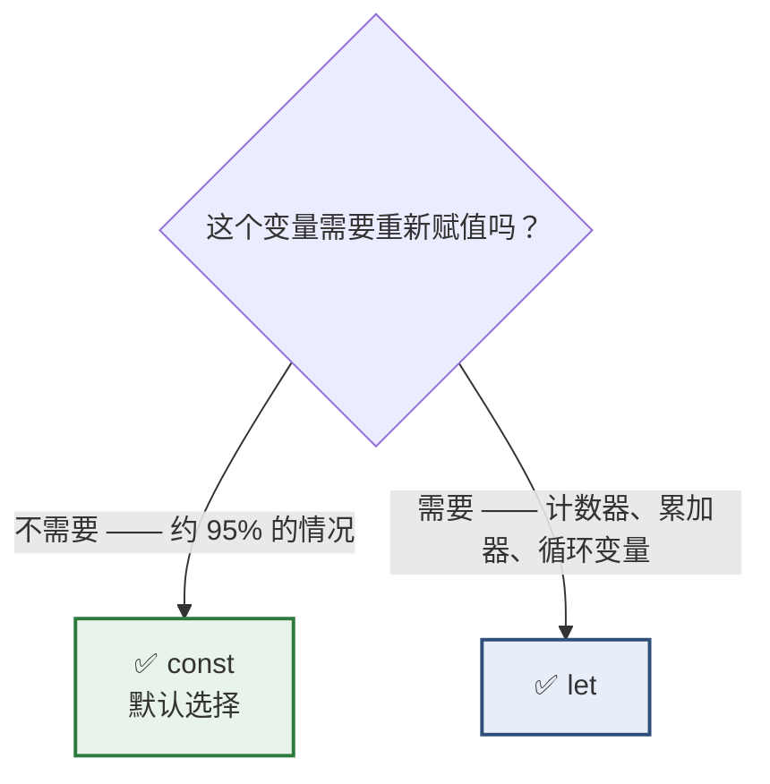
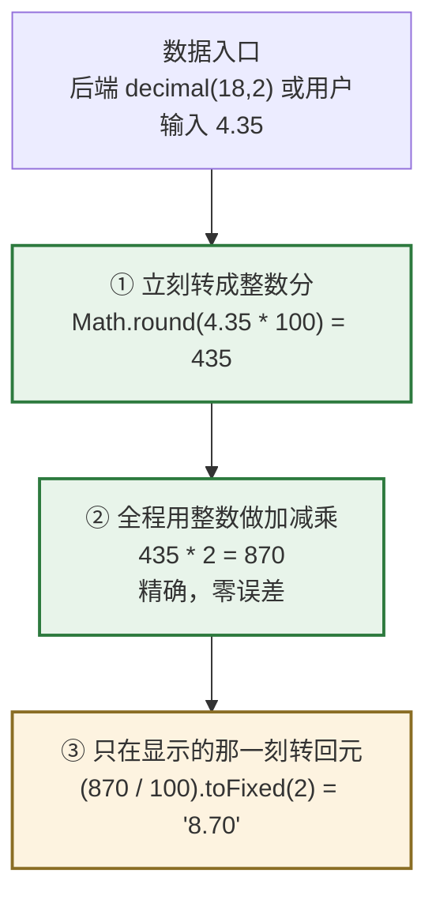
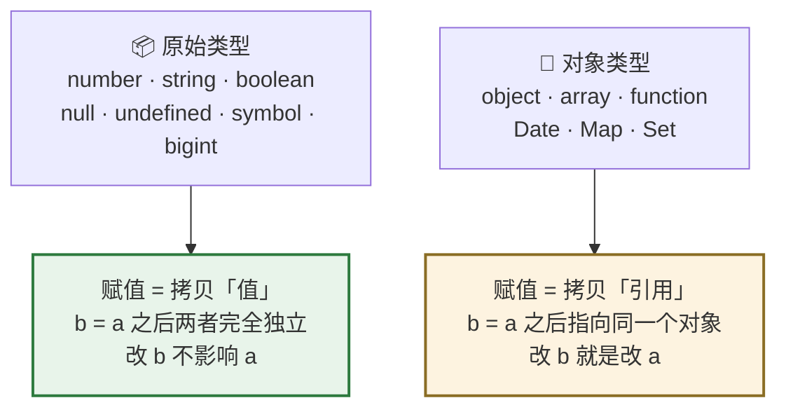
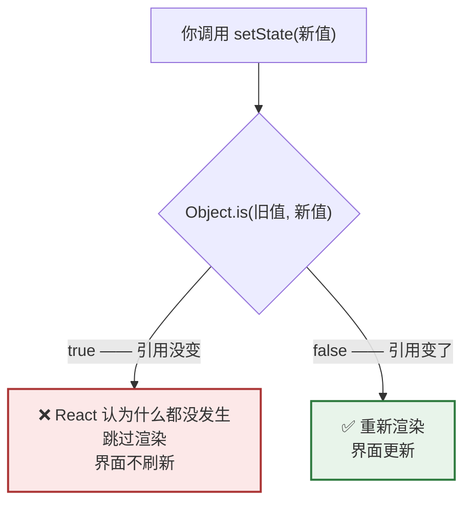

# Day 3 — 变量、原始类型、引用相等

> **今天的定位**：正式进入 JavaScript 语法。今天有两块内容对你**格外重要**：
> 1. **`number` 只有一种** —— 没有 `decimal`。这不是趣味知识，是生产事故来源，今天给出可落地的解法
> 2. **引用相等与 `Object.is`** —— 这是 React「不可变更新」的**成因**。今天搞懂它，Day 7 和 Day 9 的所有写法你都能自己推导，不用背
>
> **时间**：2 小时
> **前置**：Day 2 的 `day2-modules` 项目留着，今天继续用它
> **今天写的代码**：纯 JavaScript

## 今天结束时你应该能做到

- [ ] 一律用 `const`，只在确实要重新赋值时用 `let`，永远不用 `var`
- [ ] 解释 `const obj = {}` 之后 `obj.x = 1` 为什么合法
- [ ] 说出 7 种原始类型，知道 `typeof null === 'object'` 是个历史 bug
- [ ] **能写出一套正确的金额计算工具函数**，并解释为什么不能直接用小数
- [ ] 知道 SQL Server 的 `bigint` 主键直接传给前端会出什么事
- [ ] 区分 `null` 和 `undefined`，知道 `JSON.stringify` 会悄悄丢掉 `undefined` 属性
- [ ] **能用 `Object.is` 解释 React 为什么不刷新界面**
- [ ] 能预测一段涉及对象引用的代码输出

## 时间分配

| 时段 | 内容 | 时长 |
| --- | --- | --- |
| 1 | `const` / `let` / 永别 `var` | 20 分钟 |
| 2 | 7 种原始类型与 `typeof` | 15 分钟 |
| 3 | **`number` 只有一种 —— 金额陷阱与解法** | 30 分钟 |
| 4 | `null` vs `undefined` | 15 分钟 |
| 5 | **值语义 vs 引用语义 + `Object.is`** | 30 分钟 |
| 6 | 命名规范 + 收口 | 10 分钟 |

---

# 第 1 节：`const` / `let` / 永别 `var`（20 分钟）

## 1.1 三个关键词的历史

| 关键词 | 出现年份 | 现在该用吗 |
| --- | --- | --- |
| `var` | 1995（JS 诞生） | ❌ **永远不用** |
| `let` | 2015（ES6） | ✅ 需要重新赋值时 |
| `const` | 2015（ES6） | ✅ **默认选择** |

## 1.2 `var` 的致命缺陷：作用域是函数，不是块

在 `day2-modules` 里新建 `vars.js`：

```js
function 测试() {
  if (true) {
    var a = '我是 var'
    let b = '我是 let'
  }
  console.log(a)    // '我是 var'   ← 花括号外面还能访问到！
  console.log(b)    // 💥 ReferenceError: b is not defined
}
测试()
```

```bash
node vars.js
```

**`var` 声明的变量会「泄漏」出花括号。** 它只认函数边界，不认 `if` / `for` / `while` 的花括号。

对照 C#：

```csharp
if (true) {
    var a = "test";
}
Console.WriteLine(a);   // C# 编译错误：a 在此上下文中不可用
```

C# 的 `var` 是**块级作用域**（而且只是类型推断的语法糖），和 JS 的 `var` **完全是两回事**。名字一样、行为不同，这是最容易混淆的地方之一。

## 1.3 最经典的 `var` 坑（结合昨天学的事件循环）

新建 `loop-var.js`：

```js
console.log('--- 用 var ---')
for (var i = 0; i < 3; i++) {
  setTimeout(() => console.log(i), 0)
}

console.log('--- 用 let ---')
for (let j = 0; j < 3; j++) {
  setTimeout(() => console.log(j), 0)
}
```

**先猜答案再跑。**

<details>
<summary>点开看答案和解释</summary>

```
--- 用 var ---
--- 用 let ---
3
3
3
0
1
2
```

**为什么 `var` 版本打出三个 `3`：**

`var i` 只有**一份**（函数级作用域）。三个 `setTimeout` 回调都记住了「那个 `i`」。

按昨天学的事件循环：同步代码先跑完 —— 循环三次结束，此时 `i` 已经变成 `3`。然后才轮到宏任务，三个回调依次执行，都去读那**同一个** `i`，都读到 `3`。

**为什么 `let` 版本正常：**

`let j` 在**每次循环迭代都是一个新变量**。三个回调分别记住了三个不同的 `j`，所以是 `0 1 2`。

> 这个坑在 jQuery 时代坑倒了无数人（「为什么我循环绑定的事件都拿到最后一个值」）。用 `let` 就自动没有这个问题。这也是**闭包**的第一次亮相 —— Day 6 会花整天讲它。

</details>

## 1.4 `const` 只锁「绑定」，不锁「内容」

**这是新手最容易误解的一点。**

```js
const 客户 = { 名称: '张三', 等级: 'A' }

客户.名称 = '李四'        // ✅ 合法！改的是对象内部
客户.电话 = '123456'      // ✅ 合法！加新属性也行
console.log(客户)         // { 名称: '李四', 等级: 'A', 电话: '123456' }

客户 = { 名称: '王五' }   // 💥 TypeError: Assignment to constant variable
```

```js
const 列表 = [1, 2, 3]
列表.push(4)              // ✅ 合法
列表 = []                 // 💥 报错
```

**`const` 保证的是「这个名字永远指向同一个东西」，不保证「那个东西内部不变」。**

**对照 C#**：这和 `readonly` 字段的行为**完全一样**：

```csharp
readonly List<int> 列表 = new List<int>();
列表.Add(1);              // ✅ 合法
列表 = new List<int>();   // ❌ 编译错误
```

> 你已有的 `readonly` 直觉在这里是对的，直接用。

**如果真想冻结内容**，用 `Object.freeze()`：

```js
const 配置 = Object.freeze({ 分页大小: 20 })
配置.分页大小 = 50
// 💥 TypeError: Cannot assign to read only property '分页大小' of object
```

> **注意会报错，不是静默失败。** 因为**模块代码天生是严格模式**（`"type": "module"` 或 `.mjs`，以及 Vite 项目里的所有文件）。
>
> 你在网上会看到「`Object.freeze` 后赋值会静默失败」的说法 —— 那是非严格模式下的老行为。你的项目里一律会抛 `TypeError`。

`Object.freeze` 也只冻一层（嵌套对象仍可改）—— 这个「只有一层」的主题会在 Day 7 反复出现。

## 1.5 该用哪个



**实务比例**：真实的 React 项目里，`const` 大约占 95%，`let` 占 5%，`var` 是 0。

`let` 的合理场景：

```js
let 合计 = 0
for (const 项 of 明细) {
  合计 += 项.金额          // 需要重新赋值 → 用 let
}

let 状态 = '待审核'
if (条件) {
  状态 = '已通过'          // 需要重新赋值 → 用 let
}
```

> **一个好习惯**：先写 `const`，等真的需要改的时候再改成 `let`。这样能让「哪些东西是会变的」在代码里一目了然。

## 1.6 TDZ（了解就行）

```js
console.log(a)      // 💥 ReferenceError: Cannot access 'a' before initialization
const a = 1
```

`let` / `const` 在声明之前不能访问，这段区间叫 **TDZ（暂时性死区）**。

**你只需要记一句：变量必须先声明再使用。** 这本来就是常识，不用深究。

（`var` 反而不会报错，会给你一个 `undefined` —— 又一个 `var` 该被淘汰的理由。）

---

# 第 2 节：7 种原始类型与 `typeof`（15 分钟）

## 2.1 七种原始类型

| 类型 | 例子 | 对照 C# | 常用度 |
| --- | --- | --- | --- |
| `string` | `'张三'` `"abc"` | `string` | ★★★ |
| `number` | `42` `3.14` `-1` | **`int`+`long`+`double`+`decimal` 全在这** | ★★★ |
| `boolean` | `true` `false` | `bool` | ★★★ |
| `undefined` | `undefined` | 无对应物 | ★★★ |
| `null` | `null` | `null` | ★★★ |
| `symbol` | `Symbol('id')` | 无对应物 | ☆ |
| `bigint` | `9007199254740993n` | `System.Numerics.BigInteger` | ☆ |

**原始类型之外的一切都是「对象」** —— 对象、数组、函数、`Date`、`Map`、`Set`，全都是对象。

前 5 个是你天天用的。`symbol` 和 `bigint` 今天只需要认识名字。

## 2.2 `typeof` 及其著名的坑

```js
console.log(typeof '张三')         // 'string'
console.log(typeof 42)             // 'number'
console.log(typeof true)           // 'boolean'
console.log(typeof undefined)      // 'undefined'
console.log(typeof Symbol())       // 'symbol'
console.log(typeof 10n)            // 'bigint'

console.log(typeof { a: 1 })       // 'object'
console.log(typeof [1, 2])         // 'object'   ← 数组也是 object！
console.log(typeof function () {}) // 'function' ← 特例
console.log(typeof new Date())     // 'object'

console.log(typeof null)           // 'object'   ← 💥 这是个 bug
```

**`typeof null === 'object'` 是 1995 年的一个实现 bug。** 它已经被写进标准，因为修掉会让海量老网站崩溃，所以**永远不会修**。

## 2.3 正确的类型判断方法

`typeof` 不够用，这张表是实务标准：

| 想判断 | ❌ 错误写法 | ✅ 正确写法 |
| --- | --- | --- |
| 是不是数组 | `typeof x === 'array'`（根本不存在） | **`Array.isArray(x)`** |
| 是不是 `null` | `typeof x === 'null'`（永远为假） | **`x === null`** |
| 是不是 `NaN` | `x === NaN`（永远为假） | **`Number.isNaN(x)`** |
| 是不是普通对象 | `typeof x === 'object'`（`null` 和数组也过） | `typeof x === 'object' && x !== null && !Array.isArray(x)` |
| 是不是字符串 | — | `typeof x === 'string'` ✅ 这个可以 |
| 是不是数字 | — | `typeof x === 'number'` ✅ 可以（但 `NaN` 也算） |
| 是不是 `Date` | — | `x instanceof Date` |

> **不用背这张表。** 这些判断在 TypeScript 里会变得容易得多（Day 17 的「类型收窄」），而且真正常用的只有 `Array.isArray` 和 `x === null` 两个。

---

# 第 3 节：`number` 只有一种（30 分钟）★ 重点

> **这一节对你的工作最重要。** 你做了 20 年 `decimal(18,2)` 的业务系统，而 JS 里**没有 `decimal`**。不搞清楚这一节，你会写出算错钱的代码，而且测试时很可能发现不了。

## 3.1 一个类型顶替所有数值类型

| C# / SQL Server | JS |
| --- | --- |
| `int` / `Int32` | `number` |
| `long` / `bigint` | `number`（⚠️ **有精度上限**，见 3.2） |
| `float` / `real` | `number` |
| `double` | `number` |
| **`decimal` / `decimal(18,2)`** | **❌ 没有对应物** |

JS 的 `number` 全部是 **64 位双精度浮点（IEEE 754）**，等同于 C# 的 `double`。

**关键推论：你在 SQL Server 里习惯的 `decimal` 精确十进制运算，在 JS 里完全不存在。**

## 3.2 ⚠️ 第一个坑：`bigint` 主键会精度丢失

这是**真实的生产事故来源**，而且很多人踩过。

```js
// 安全整数上限
console.log(Number.MAX_SAFE_INTEGER)      // 9007199254740991  （2^53 - 1）

// SQL Server bigint 上限
// 9223372036854775807                     （2^63 - 1）
```

**JS 只能精确表示到 2^53，而 SQL Server 的 `bigint` 是 2^63。** 超过 2^53 的整数在 JS 里会被悄悄改掉：

```js
console.log(9007199254740993)             // 9007199254740992   ← 末位被改了！

// 更可怕的是从 JSON 解析时
const 数据 = JSON.parse('{"申请单号": 9223372036854775807}')
console.log(数据.申请单号)                 // 9223372036854776000  ← 完全变了个号
```

### 这意味着什么

如果你们的数据库主键是 `bigint`（或者用了雪花算法这类分布式 ID），直接以数字形式传给前端，**前端拿到的单号可能和数据库里的不是同一个**。然后你拿这个错误的 ID 去调删除接口……

### 解法

| 方案 | 做法 |
| --- | --- |
| ✅ **后端把 `bigint` 序列化成字符串** | JSON 里传 `"申请单号": "9223372036854775807"`，前端当字符串处理 |
| ✅ 前端只把 ID 当**标识符**，不做运算 | ID 本来就不需要加减乘除，字符串完全够用 |
| 🔸 用 `BigInt` 类型 | `9007199254740993n`（末尾加 `n`）。能精确，但不能和普通 `number` 混算，麻烦，一般不用 |

> **今天的行动项**：如果你们的接口正在以数字形式返回 `bigint` 主键，**这是个待修的隐患**。和后端确认一下。
>
> `int`（2^31）远小于 2^53，**完全安全**，不用担心。

## 3.3 第二个坑：浮点误差

在 `node` REPL 里跑这几行：

```js
0.1 + 0.2                    // 0.30000000000000004
0.1 + 0.2 === 0.3            // false

1.1 * 3                      // 3.3000000000000003
4.35 * 3                     // 13.049999999999999
19.99 * 7                    // 139.92999999999998

0.07 * 100                   // 7.000000000000001
4.35 * 100                   // 434.99999999999994   ← 记住这一个，3.4 节要用

(1.005).toFixed(2)           // '1.00'   ← 不是 '1.01'！
(2.675).toFixed(2)           // '2.67'   ← 不是 '2.68'！
```

> **注意不是每个乘法都出错。** `19.99 * 3` 恰好等于 `59.97`（精确），但 `19.99 * 7` 就错了。
>
> **这种「有时对有时错」正是它最危险的地方** —— 你测了几个数发现没问题，就以为可以直接用小数算钱了。

### 为什么

因为二进制无法精确表示 `0.1`。

这不是 JS 的缺陷，是**所有用二进制浮点的语言共有的**（C# 的 `double` 一样，`0.1 + 0.2` 也不等于 `0.3`）。C# 之所以没坑到你，是因为你一直用 `decimal` —— 而 JS 没有 `decimal`。

**类比**：十进制无法精确表示 `1/3`（`0.333...` 除不尽）。同理，二进制无法精确表示 `1/10`。

`(1.005).toFixed(2)` 得到 `'1.00'` 的原因：`1.005` 在内存里实际存的是 `1.00499999999999989...`，四舍五入自然是 `1.00`。

### 这在业务系统里会怎样

新建 `bad-money.js` 亲手跑一遍：

```js
// 一张价格申请单，三行明细
const 明细 = [
  { 名称: '项目A', 单价: 8.65, 数量: 3 },
  { 名称: '项目B', 单价: 0.07, 数量: 100 },
  { 名称: '项目C', 单价: 4.35, 数量: 2 },
]

let 合计 = 0
for (const 行 of 明细) {
  console.log(`${行.名称}: ${行.单价} * ${行.数量} = ${行.单价 * 行.数量}`)
  合计 += 行.单价 * 行.数量
}

console.log('合计       =', 合计)
console.log('显示       =', 合计.toFixed(2))
console.log('合计===41.65?', 合计 === 41.65)
console.log('含税 13%   =', 合计 * 1.13)
console.log('税额       =', 合计 * 1.13 - 合计)
```

**实际输出：**

```
项目A: 8.65 * 3 = 25.950000000000003
项目B: 0.07 * 100 = 7.000000000000001
项目C: 4.35 * 2 = 8.7
合计       = 41.650000000000006
显示       = 41.65
合计===41.65? false
含税 13%   = 47.0645
税额       = 5.414499999999997
```

### 四个具体危害

| 危害 | 从上面的输出看 |
| --- | --- |
| **界面上看不出问题** | `toFixed(2)` 显示成 `41.65`，帮你把误差藏起来了 |
| **相等判断会失效** | `合计 === 41.65` 是 **`false`**。任何 `if (金额 === 某值)` 都可能意外为假 |
| **和后端对不上账** | 后端 `decimal` 算出 `41.65`，你算出 `41.650000000000006`，差一分钱的争议由此而来 |
| **误差会传染放大** | `税额 = 5.414499999999997`，再往下算、再累加几千行，误差会浮出水面 |

**最危险的是第一条**：页面上一切正常，你根本不知道有问题。直到财务对账时发现差了几分钱。

## 3.4 ✅ 正确做法：一律用整数分



**核心思想**：**整数运算在 JS 里是精确的**（只要不超过 2^53）。所以把金额从「元」换算成「分」，就变成了整数运算。

在 `day2-modules` 里新建 `money.js`：

```js
// money.js —— 金额工具函数

/**
 * 元 → 分。数据进入系统时立刻调用。
 * @param {number|string} 元 - 可以是 19.99 或 '19.99'
 * @returns {number} 整数分
 */
export function 元转分(元) {
  return Math.round(Number(元) * 100)
  //     ↑ Math.round 不是可选的，见下面的说明
}

/**
 * 分 → 元字符串。只在显示时调用。
 * @param {number} 分 - 整数分
 * @returns {string} 例如 '59.97'
 */
export function 分转元(分) {
  return (分 / 100).toFixed(2)
}

/**
 * 按税率加价。乘法结果必须 Math.round 回整数。
 */
export function 含税(分, 税率) {
  return Math.round(分 * (1 + 税率))
}

/**
 * 合计。整数相加，绝对精确。
 */
export function 合计(分数组) {
  return 分数组.reduce((和, 当前) => 和 + 当前, 0)
}
```

> `reduce` 是 Day 8 的内容，今天照抄就行 —— 它做的就是「把数组里的数字全加起来」。

### ⚠️ 为什么 `元转分` 里的 `Math.round` 不能省

还记得 3.3 节让你记住的那一行吗：

```js
4.35 * 100                   // 434.99999999999994   ← 不是 435！
```

所以：

```js
Math.round(4.35 * 100)       // 435  ✅ 正确
Math.trunc(4.35 * 100)       // 434  ❌ 少了一分钱
Math.floor(4.35 * 100)       // 434  ❌ 少了一分钱
parseInt(4.35 * 100)         // 434  ❌ 少了一分钱
```

**如果你用截断（`trunc` / `floor` / `parseInt`）而不是四舍五入，`4.35 元` 会变成 `4.34 元`。** 一分钱的 bug，而且只在特定数值上出现，测试极难覆盖。

**规矩：任何小数 → 整数分的转换，一律用 `Math.round`。**

### 动手验证

新建 `test-money.js`：

```js
import { 元转分, 分转元, 含税, 合计 } from './money.js'

console.log('=== 元转分 ===')
console.log('4.35 * 100 原始 :', 4.35 * 100)      // 434.99999999999994
console.log('元转分(4.35)    :', 元转分(4.35))     // 435   ✅ Math.round 救了它
console.log('元转分(8.65)    :', 元转分(8.65))     // 865
console.log('元转分(0.07)    :', 元转分(0.07))     // 7

console.log('\n=== 同一张申请单，用整数分重算 ===')
const 明细 = [
  { 名称: '项目A', 单价分: 元转分(8.65), 数量: 3 },
  { 名称: '项目B', 单价分: 元转分(0.07), 数量: 100 },
  { 名称: '项目C', 单价分: 元转分(4.35), 数量: 2 },
]

const 各行金额 = 明细.map((行) => 行.单价分 * 行.数量)
console.log('各行（分）:', 各行金额)

const 总分 = 合计(各行金额)
console.log('合计（分）:', 总分)
console.log('合计（元）:', 分转元(总分))
console.log('合计 === 4165 ?', 总分 === 4165)

const 税后分 = 含税(总分, 0.13)
console.log('含税（元）:', 分转元(税后分))
console.log('税额（元）:', 分转元(税后分 - 总分))
```

```bash
node test-money.js
```

**实际输出：**

```
=== 元转分 ===
4.35 * 100 原始 : 434.99999999999994
元转分(4.35)    : 435
元转分(8.65)    : 865
元转分(0.07)    : 7

=== 同一张申请单，用整数分重算 ===
各行（分）: [ 2595, 700, 870 ]
合计（分）: 4165
合计（元）: 41.65
合计 === 4165 ? true
含税（元）: 47.06
税额（元）: 5.41
```

**和 3.3 节的小数版逐项对比：**

| | 小数版 | 整数分版 |
| --- | --- | --- |
| 项目A（8.65×3） | `25.950000000000003` | `2595` 分 |
| 项目B（0.07×100） | `7.000000000000001` | `700` 分 |
| 合计 | `41.650000000000006` | **`4165` 分** |
| 相等判断 | `合计 === 41.65` → **`false`** | `总分 === 4165` → **`true`** ✅ |
| 税额 | `5.414499999999997` | **`5.41`** 元 |

**注意最后两行**：整数分版的相等判断是可靠的，税额（`4706 - 4165 = 541` 分）是精确的整数相减。这就是全部收益。

### 三条规矩

| 规矩 | 说明 |
| --- | --- |
| **数据一进来就转分** | 从接口拿到、从输入框读到，第一件事就是 `元转分()` |
| **中间全程用分** | 加减乘除、比较、存 state，全部用整数分 |
| **只在显示时转元** | 渲染那一刻才 `分转元()`，而且结果是**字符串** |

**乘法的注意点**：`分 × 整数` 仍是整数，安全。但 `分 × 税率`（小数）会产生小数，**必须 `Math.round` 回整数**：

```js
const 含税分 = Math.round(不含税分 * 1.13)     // ✅ 别忘了 Math.round
```

**上限够用吗**：安全整数上限 9007199254740991 分 ≈ **90 万亿元**。企业业务绝对够。

## 3.5 什么时候该上专门的库

整数分方案适用于「加减 + 乘整数」，覆盖绝大多数业务。如果遇到：

- 复杂的分摊、按比例拆分（要处理「分不尽的那一分给谁」）
- 多币种、多种小数位（有些币种是 3 位小数）
- 需要和后端 `decimal` 做位级一致的比对

那就装 **`decimal.js`** 或 **`big.js`**：

```js
import Decimal from 'decimal.js'

new Decimal(0.1).plus(0.2).toString()      // '0.3'  精确
```

代价是所有数值都得包一层对象，代码变啰嗦。**先用整数分，遇到解决不了的再上库。**

## 3.6 `number` 的其他知识点

### `NaN`（Not a Number）

```js
Number('abc')          // NaN
0 / 0                  // NaN
Math.sqrt(-1)          // NaN

NaN === NaN            // false  ← 它连自己都不等于！
Number.isNaN(NaN)      // true   ✅ 正确的判断方式

// 老的全局 isNaN 会先做类型转换，行为不对
isNaN('abc')           // true   ← 'abc' 不是 NaN，但它说是
Number.isNaN('abc')    // false  ✅ 正确
```

**规则：一律用 `Number.isNaN()`，不用全局 `isNaN()`。**

`NaN` 有传染性 —— 一旦某个环节出现，后面全变 `NaN`：

```js
const 数量 = Number('')     // 咦，这里是 0
const 数量2 = Number('两个') // NaN
console.log(19.99 * 数量2)   // NaN  → 页面上显示 "NaN"，用户一脸问号
```

### `Infinity`：除以 0 不报错

```js
1 / 0                  // Infinity
-1 / 0                 // -Infinity
0 / 0                  // NaN
```

**⚠️ 和 C# 的重要差别**：C# 里 `1 / 0`（整数除法）会抛 `DivideByZeroException`，你的 `try/catch` 抓得到。

JS **不抛异常**，静静给你一个 `Infinity`，然后这个 `Infinity` 一路流到页面上显示成 `"Infinity"`。

```js
const 单价 = 总金额 / 数量      // 数量为 0 时得到 Infinity，无任何提示
```

**所以做除法前必须自己判断分母**：

```js
const 单价 = 数量 > 0 ? 总金额 / 数量 : 0
```

### 字符串转数字

| 写法 | `'42'` | `' 42 '` | `'42px'` | `''` | `null` | `undefined` |
| --- | --- | --- | --- | --- | --- | --- |
| `Number(x)` | `42` | `42` | **`NaN`** | **`0`** ⚠️ | **`0`** ⚠️ | `NaN` |
| `parseInt(x)` | `42` | `42` | **`42`** | `NaN` | `NaN` | `NaN` |
| `parseFloat(x)` | `42` | `42` | `42` | `NaN` | `NaN` | `NaN` |
| `+x` | `42` | `42` | `NaN` | **`0`** ⚠️ | **`0`** ⚠️ | `NaN` |

**两个要留意的**：

- **`Number('') === 0`** 和 **`Number(null) === 0`** —— 空输入框会变成 0，不是 `NaN`。做表单校验时这个很坑
- **`parseInt('42px') === 42`** —— 它会「能读多少读多少」。读用户输入的带单位数据时有用，但也容易掩盖脏数据

**实务建议**：

```js
// 表单里读数字，要区分「没填」和「填了 0」
const 原始值 = 输入框值.trim()
if (原始值 === '') {
  // 用户没填
} else {
  const 数量 = Number(原始值)
  if (Number.isNaN(数量)) {
    // 填的不是数字
  }
}
```

### `toFixed` 返回**字符串**

```js
const x = (59.97).toFixed(2)
console.log(x)              // '59.97'
console.log(typeof x)       // 'string'   ← 注意！

console.log(x * 2)          // 119.94  （JS 会隐式转回数字，能算）
console.log(x + 1)          // '59.971' ← 💥 字符串拼接了！
```

**`+` 遇到字符串会变成拼接**，这是最容易中招的地方。所以 `toFixed` 的结果**只用来显示，绝不参与运算**。

---

# 第 4 节：`null` vs `undefined`（15 分钟）

C# 只有一个 `null`，JS 有两个「空」。

## 4.1 `undefined` 出现的六种场合

```js
// ① 声明了但没赋值
let a
console.log(a)                          // undefined

// ② 访问对象上不存在的属性
const 客户 = { 名称: '张三' }
console.log(客户.电话)                   // undefined

// ③ 访问数组越界
const 列表 = [1, 2]
console.log(列表[5])                     // undefined

// ④ 函数没写 return
function f() { }
console.log(f())                         // undefined

// ⑤ 该传的参数没传
function g(x) { console.log(x) }
g()                                      // undefined

// ⑥ 显式赋值（不推荐这么写）
let b = undefined
```

**共同点：`undefined` 表示「这里本来就没有东西」。**

## 4.2 `null` 表示「明确地空」

```js
let 选中的客户 = null       // 我明确表示：现在没有选中任何客户
```

**`null` 是你（或后端）主动放进去的。** 它的含义是「这个位置应该有个东西，但现在是空的」。

## 4.3 对照表

| | `undefined` | `null` |
| --- | --- | --- |
| 谁产生的 | **语言自动产生** | **人主动赋的值** |
| 含义 | 「压根没有」 | 「有这个位置，但是空的」 |
| `typeof` | `'undefined'` | `'object'`（历史 bug） |
| `JSON.stringify` | **属性会被删掉** ⚠️ | 保留为 `null` |
| 数据库里对应 | 无对应物 | `NULL` |

## 4.4 ⚠️ `JSON.stringify` 会悄悄吃掉 `undefined`

**这一条在调接口时会咬人：**

```js
console.log(JSON.stringify({ 名称: '张三', 备注: undefined }))
// '{"名称":"张三"}'          ← 备注这个字段整个消失了！

console.log(JSON.stringify({ 名称: '张三', 备注: null }))
// '{"名称":"张三","备注":null}'   ← 保留了
```

### 为什么这是个问题

假设你要「清空某个客户的备注」，提交给后端：

```js
// ❌ 你以为在告诉后端「把备注清空」
提交({ 名称: '张三', 备注: undefined })
// 实际发出去的是 {"名称":"张三"} —— 后端看不到备注字段，
// 通常会理解成「这个字段不用改」，于是旧备注还在

// ✅ 明确告诉后端「设为空」
提交({ 名称: '张三', 备注: null })
// 发出去 {"名称":"张三","备注":null}
```

**这正是「PATCH 语义」的核心区别**：字段不存在 = 不修改；字段为 `null` = 改成空。你做后台系统一定会遇到。

## 4.5 实务约定

| 场景 | 用哪个 |
| --- | --- |
| 自己代码里的「暂时没有」 | `undefined`（或者干脆不赋值） |
| 要明确告诉后端「设为空」 | **`null`** |
| 后端返回的空值 | 通常是 `null`，你被动接受 |
| 组件的可选属性没传 | 自动是 `undefined` |

**建议**：自己写代码时**尽量只用 `undefined`**，把 `null` 留给「和外部系统交互时明确表达空」。少一种状态少一种 bug。

## 4.6 同时判断两个空

```js
// ❌ 啰嗦
if (x === null || x === undefined) { }

// ✅ 唯一被允许使用 == 的场景
if (x == null) { }     // 同时匹配 null 和 undefined
```

> **等等，Day 4 不是说「一律用 `===`」吗？**
>
> 是的，`x == null` 是**唯一的例外**，而且是被广泛接受的惯例 —— ESLint 的 `eqeqeq` 规则专门有个 `allow: ['null']` 选项放行它。
>
> 但更常用的其实是下面两个（Day 4 详讲）：

```js
const 备注 = 客户.备注 ?? '无'         // null 或 undefined 时取 '无'
const 城市 = 客户?.地址?.城市          // 中途任何一层是空就返回 undefined，不报错
```

---

# 第 5 节：值语义 vs 引用语义 + `Object.is`（30 分钟）★ 重点

> **今天最重要的一节。** 学习计划里 Day 7（嵌套展开）、Day 9（不可变更新五式）的所有写法，**全部是这一节的推论**。搞懂这里，后面不用背。

## 5.1 两类不同的赋值行为



新建 `refs.js`，动手跑一遍：

```js
// ===== 原始类型：拷贝值 =====
let a = 10
let b = a
b = 20
console.log('a =', a, ' b =', b)          // a = 10  b = 20   ✅ 互不影响

// ===== 对象：拷贝引用 =====
const 客户1 = { 名称: '张三' }
const 客户2 = 客户1
客户2.名称 = '李四'
console.log('客户1 =', 客户1.名称)         // 李四  ⚠️ 客户1 也变了！
console.log('客户2 =', 客户2.名称)         // 李四
console.log('是同一个吗？', 客户1 === 客户2) // true

// ===== 数组同理（数组就是对象）=====
const 列表1 = [1, 2, 3]
const 列表2 = 列表1
列表2.push(4)
console.log('列表1 =', 列表1)              // [ 1, 2, 3, 4 ]  ⚠️
```

**你已有的 C# 直觉在这里是对的。** C# 里值类型（`int`、`struct`）传副本，引用类型（`class`）传引用 —— JS 是同一套逻辑，只是分类线画在「原始类型 vs 对象」上。

## 5.2 函数参数也遵循同一规则

这里有个细微但重要的区别：

```js
// ① 修改对象「内部」→ 影响外部
function 改名(客户) {
  客户.名称 = '王五'        // 顺着引用改到了原对象
}
const c1 = { 名称: '张三' }
改名(c1)
console.log(c1.名称)        // 王五   ⚠️ 外面被改了

// ② 给参数「重新赋值」→ 不影响外部
function 换人(客户) {
  客户 = { 名称: '赵六' }    // 只是让本地这个名字指向新对象
}
const c2 = { 名称: '张三' }
换人(c2)
console.log(c2.名称)        // 张三   ✅ 外面没变
```

**区别在于**：`客户.名称 = x` 是**顺着引用去改那个对象**；`客户 = {...}` 只是**让函数内的局部名字改指向别处**，原来的对象毫发无损。

**对照 C#**：这和 C# 传引用类型（不加 `ref`）的行为**完全一致**。JS 没有 `ref` / `out` 参数，所以只有这一种行为。

## 5.3 `Object.is` 与 React 的重渲染判定 ★ 核心

现在把上面的知识和 React 连起来。

**React 判断「要不要重新渲染」的方式，就是拿新旧 state 做 `Object.is` 比较。**



在 `refs.js` 里追加：

```js
console.log('\n===== Object.is 演示 =====')

const 原客户 = { 名称: '张三', 等级: 'A' }

// ❌ 做法一：直接改属性
const 改法1 = 原客户
改法1.名称 = '李四'
console.log('改法1 引用变了吗？', !Object.is(原客户, 改法1))
// false —— 引用没变！React 会认为「没变化」，界面不刷新

// ✅ 做法二：创建新对象
const 改法2 = { ...原客户, 名称: '李四' }
console.log('改法2 引用变了吗？', !Object.is(原客户, 改法2))
// true —— 新对象、新引用，React 会重新渲染
```

> `{ ...原客户 }` 这个展开语法是 Day 7 的内容，今天只需要知道「它创建了一个新对象」。

### 三条推论（React 的全部「不可变」规则都从这里来）

| 推论 | 说明 |
| --- | --- |
| **改属性没用** | `客户.名称 = 'x'` 后引用不变 → 界面不刷新 |
| **必须造新对象** | `{ ...客户, 名称: 'x' }` → 新引用 → 刷新 |
| **原地修改数组的方法都不能用** | `push` / `splice` / `sort` / `reverse` 都不换引用 |

### 现在你可以自己推导 Day 9 的「不可变更新五式」

**不用背，用这一条规则推：**

| 想做什么 | 为什么不能这样 | 该怎么做 |
| --- | --- | --- |
| 加一项 | `arr.push(x)` —— 引用没变 | `[...arr, x]` |
| 删一项 | `arr.splice(i, 1)` —— 引用没变 | `arr.filter(...)` |
| 改一项 | `arr[0].done = true` —— 引用没变 | `arr.map(...)` |
| 排序 | `arr.sort()` —— **原地改，引用没变** | `[...arr].sort()` |

**每一条的理由都是同一个：`Object.is` 判定引用没变。**

> 这就是为什么我把这一节放在 Day 3 而不是 Day 9 —— **先有原理，后面的写法就是常识，不是要背的清单。**

## 5.4 `Object.is` 和 `===` 的差别（了解就行）

两者几乎一样，只有两个例外：

```js
NaN === NaN                  // false
Object.is(NaN, NaN)          // true    ← Object.is 更符合直觉

0 === -0                     // true
Object.is(0, -0)             // false   ← Object.is 区分正负零
```

**日常写代码一律用 `===`**。`Object.is` 你只需要知道「React 内部用它」这一件事。

## 5.5 浅拷贝也只解决一层（Day 7 预告）

```js
const 申请单 = {
  单号: 'A001',
  申请人: { 姓名: '张三', 部门: '超声科' },
}

const 副本 = { ...申请单 }              // 只拷了一层

副本.单号 = 'A002'                      // ✅ 影响不到原来的（第一层是新的）
副本.申请人.姓名 = '李四'               // ⚠️ 原来的也变了！（申请人还是同一个引用）

console.log(申请单.单号)                // 'A001'  ✅
console.log(申请单.申请人.姓名)         // '李四'  ⚠️
```

**`{ ...x }` 只在第一层创建新对象，嵌套的对象仍然是同一个引用。**

正确做法是**每一层都新建**：

```js
const 副本 = {
  ...申请单,
  申请人: { ...申请单.申请人, 姓名: '李四' },
}
```

Day 7 会专门讲这个。今天只要能用 `Object.is` 解释「为什么第二层没被隔离」就够了。

---

# 第 6 节：命名规范（10 分钟）

你 20 年的 C# 肌肉记忆在这里需要调整。

| 对象 | C# 习惯 | JS / TS 惯例 |
| --- | --- | --- |
| 变量 | `customerName` | `customerName` ✅ 相同 |
| **函数 / 方法** | `GetCustomer()` **Pascal** | **`getCustomer()` camel** ⚠️ 要改 |
| 类 | `Customer` Pascal | `Customer` Pascal ✅ 相同 |
| **React 组件** | — | **`CustomerList` Pascal（必须）** |
| 普通常量 | `MaxCount` / `MAX_COUNT` | `maxCount` camel |
| 全局配置常量 | `MAX_COUNT` | `MAX_COUNT` ✅ 可以 |
| **接口 / 类型** | `ICustomer` **带 I 前缀** | **`Customer` 不带 I** ⚠️ 要改 |
| 私有成员 | `_name` / `private` | 不 `export` 就是私有；类里用 `#name` |
| 布尔值 | `IsValid` | `isValid` / `hasError` / `canEdit` |
| 文件名 | `CustomerList.cs` Pascal | 组件用 `CustomerList.tsx` Pascal<br/>其他用 `formatMoney.ts` camel |

## 三条最容易犯的

**① 函数名要小写开头**

```js
function GetCustomer() { }     // ❌ 看起来像 C#
function getCustomer() { }     // ✅ JS 惯例
```

**② React 组件名必须大写开头 —— 这不是风格问题，是语法要求**

```jsx
function customerList() { }    // ❌ 小写会被 React 当成 HTML 标签，渲染不出来
function CustomerList() { }    // ✅
```

**③ TS 的接口不加 `I` 前缀**

```ts
interface ICustomer { }        // ❌ C# 习惯，TS 社区不用
interface Customer { }         // ✅
type Customer = { }            // ✅ 更常见
```

> **不用刻意记**。Day 20 配好 ESLint 后，命名不合规会直接报黄。今天知道「函数名小写开头」「组件名大写开头」这两条就够。

---

# 今日验收清单

- [ ] `vars.js` 跑过了，看到 `var` 泄漏出花括号、`let` 不会
- [ ] `loop-var.js` 跑过了，**能解释为什么 `var` 版本打出三个 `3`**
- [ ] 能解释 `const 客户 = {}` 之后 `客户.名称 = 'x'` 为什么合法
- [ ] 知道 `Object.freeze` 后赋值在你的项目里会**抛 `TypeError`**（模块代码天生严格模式）
- [ ] 说得出 7 种原始类型
- [ ] 知道 `typeof null === 'object'`，知道判断数组要用 `Array.isArray`
- [ ] 亲手跑过 `0.1 + 0.2`、`4.35 * 100`、`(1.005).toFixed(2)`
- [ ] 理解「不是每个乘法都出错」—— `19.99 * 3` 精确但 `19.99 * 7` 出错，**这种随机性才是最危险的**
- [ ] **`bad-money.js` 跑过了**，看到 `合计 === 41.65` 居然是 `false`
- [ ] **`money.js` 写好了，`test-money.js` 跑通了**
- [ ] 能说出「金额三条规矩」：进来就转分 / 全程用分 / 只在显示时转元
- [ ] **知道 `元转分` 里为什么必须用 `Math.round` 而不能用 `Math.floor`**（`4.35` 会变成 `4.34`）
- [ ] 知道 `分 × 税率` 之后必须 `Math.round`
- [ ] **知道 SQL Server `bigint` 主键直接以数字传前端会精度丢失**
- [ ] 知道 JS 里 `1 / 0` 不抛异常而是给 `Infinity`
- [ ] 知道 `Number('') === 0`（不是 `NaN`）
- [ ] 知道 `toFixed()` 返回字符串，不能参与 `+` 运算
- [ ] 能说出 `JSON.stringify` 对 `undefined` 属性和 `null` 属性的不同处理
- [ ] `refs.js` 跑过了，看到「改 `客户2` 导致 `客户1` 也变」
- [ ] **能用 `Object.is` 解释 React 为什么不刷新界面**
- [ ] 能自己推导出「为什么不能用 `arr.push()` 改 React 状态」
- [ ] 知道 `{ ...x }` 只拷一层

---

# 常见问题排查

## 页面上显示 `NaN`

某个环节的数字变成了 `NaN`，而且会一路传染。排查顺序：

1. 是不是 `Number('两个')` 这类转换失败
2. 是不是某个字段后端返回了 `null`，参与了运算（`null * 2` 是 `0`，但 `undefined * 2` 是 `NaN`）
3. 是不是 `undefined` 参与了运算 —— 通常意味着**字段名写错了**

## 页面上显示 `Infinity`

除法的分母是 0。JS 不报错，加个判断：`数量 > 0 ? 总额 / 数量 : 0`

## 金额差一分钱，和后端对不上

两个可能：

1. 用了小数直接算 → 改成整数分方案（3.4 节）
2. 元转分时用了 `Math.floor` / `Math.trunc` / `parseInt` 截断 → **一律改成 `Math.round`**（`4.35 * 100` 是 `434.99999999999994`，截断会变成 `434`）

## `if (金额 === 某值)` 明明相等却判为假

小数的浮点误差。`41.650000000000006 === 41.65` 是 `false`。

**整数分方案顺带解决了这个** —— 整数之间的 `===` 永远可靠。

## 数字变成了字符串拼接：`'59.971'`

`toFixed()` 的结果参与了 `+` 运算。`toFixed` 只用于显示。

## ID 对不上、删错了记录

`bigint` 主键精度丢失。让后端把 ID 序列化成字符串（3.2 节）。

## `Assignment to constant variable`

给 `const` 变量整体重新赋值了。要么改成 `let`，要么改属性而不是改整体。

## 改了对象但界面不刷新（React 阶段）

改属性没换引用。用 `{ ...obj, 字段: 新值 }` 造新对象。这是今天第 5 节的核心。

---

# 今天不需要理解的东西

| 你会看到 | 什么时候学 |
| --- | --- |
| `{ ...原客户, 名称: 'x' }` 展开语法的细节 | Day 7 |
| `reduce` 怎么工作 | Day 8 |
| `?.` 和 `??` 的完整规则 | Day 4 |
| `arr.map` / `arr.filter` | Day 8 |
| IEEE 754 浮点数的位级表示 | **永远不用** |
| `symbol` / `bigint` 的实际用法 | 基本用不到 |
| `Object.freeze` 的深层细节 | 用不到 |

---

# 作业（25 分钟）

## 作业 1：补全金额工具函数

在 `money.js` 里增加三个函数：

```js
/** 折扣。折扣率如 0.85 表示八五折。结果必须是整数分 */
export function 打折(分, 折扣率) {
  // TODO
}

/** 按数量算行金额 */
export function 行金额(单价分, 数量) {
  // TODO
}

/** 安全除法：分母为 0 时返回 0，不返回 Infinity */
export function 安全除(被除数, 除数) {
  // TODO
}
```

写完后自测这几个用例：

| 调用 | 期望结果 |
| --- | --- |
| `打折(元转分(19.99), 0.85)` | `1699`（`1999 × 0.85 = 1699.15` → 四舍五入） |
| `行金额(元转分(0.07), 100)` | `700` |
| `安全除(100, 0)` | `0`（**不是** `Infinity`） |
| `分转元(打折(元转分(100), 0.85))` | `'85.00'` |

## 作业 2：找出并修复 6 个问题

下面这段代码有 6 个今天讲过的问题，**逐个找出并修复**：

```js
function 计算申请单(明细) {
  var 合计 = 0

  for (var i = 0; i < 明细.length; i++) {
    合计 = 合计 + 明细[i].单价 * 明细[i].数量
  }

  var 含税 = 合计 * 1.13
  var 均价 = 合计 / 明细.length

  if (typeof 明细 === 'array') {
    console.log('是数组')
  }

  return {
    合计: 合计.toFixed(2),
    含税: 含税.toFixed(2),
    均价: 均价.toFixed(2),
    差额: 含税.toFixed(2) + 1,
  }
}
```

<details>
<summary>点开看答案</summary>

| # | 问题 | 修复 |
| --- | --- | --- |
| 1 | 三处用了 `var` | 全改成 `const` / `let`（`合计` 要累加，用 `let`；`i` 用 `let`） |
| 2 | **用小数直接算金额**，会有浮点误差 | 改成整数分方案 |
| 3 | `合计 * 1.13` 结果是小数，没有 `Math.round` | `Math.round(合计分 * 1.13)` |
| 4 | `明细.length` 可能为 0 → `均价` 变 `Infinity` | 先判断 `明细.length > 0` |
| 5 | `typeof 明细 === 'array'` **永远为假**，不存在这个返回值 | 用 `Array.isArray(明细)` |
| 6 | `含税.toFixed(2) + 1` —— 字符串拼接，得到 `'87.20 1'` 这种东西 | `toFixed` 结果不参与运算；要算就用数字，要显示才转字符串 |

**参考修复版：**

```js
import { 元转分, 分转元 } from './money.js'

function 计算申请单(明细) {
  if (!Array.isArray(明细) || 明细.length === 0) {
    return { 合计: '0.00', 含税: '0.00', 均价: '0.00' }
  }

  // 全程用整数分
  let 合计分 = 0
  for (const 行 of 明细) {
    合计分 += 元转分(行.单价) * 行.数量
  }

  const 含税分 = Math.round(合计分 * 1.13)     // 乘小数后取整
  const 均价分 = Math.round(合计分 / 明细.length)

  // 只在返回给界面时转成字符串
  return {
    合计: 分转元(合计分),
    含税: 分转元(含税分),
    均价: 分转元(均价分),
    税额: 分转元(含税分 - 合计分),             // 整数相减，精确
  }
}
```

注意最后那个 `税额` —— 因为全程是整数分，`含税分 - 合计分` 是**整数相减，精确无误差**。

对比一下 3.3 节小数版算同一个税额的结果：`5.414499999999997`。整数分版是干净的 `541` 分 = `5.41` 元。

</details>

## 作业 3：预测输出（先写答案，再运行）

```js
const 申请单 = {
  单号: 'A001',
  金额分: 1999,
  申请人: { 姓名: '张三' },
}

const 副本 = { ...申请单 }

副本.单号 = 'A002'
副本.金额分 = 2999
副本.申请人.姓名 = '李四'

console.log('①', 申请单.单号)
console.log('②', 申请单.金额分)
console.log('③', 申请单.申请人.姓名)
console.log('④', Object.is(申请单, 副本))
console.log('⑤', Object.is(申请单.申请人, 副本.申请人))
```

<details>
<summary>点开看答案</summary>

```
① A001
② 1999
③ 李四      ← 被改了！
④ false
⑤ true      ← 同一个对象
```

**逐条解释：**

- **①②** `单号` 和 `金额分` 是**原始类型**（字符串、数字），`{ ...申请单 }` 时拷的是值，所以改副本不影响原对象
- **③** `申请人` 是**对象**，展开时拷的是**引用**。副本和原对象指向**同一个** `申请人` 对象，所以改了副本的姓名，原对象也变了
- **④** `副本` 是新建的对象，引用不同 → `false`
- **⑤** 两个 `申请人` 是同一个对象 → `true`

**这就是「浅拷贝只解决一层」的完整含义。** 而 ⑤ 那个 `true` 正是问题所在 —— 在 React 里，如果你只改了嵌套层的东西，最外层的引用可能变了（能刷新），但嵌套层没隔离干净，会造成难查的 bug。

</details>

## 作业 4：一句话回答（写在笔记里）

1. 我们系统的申请单主键是 SQL Server 的 `bigint`，接口直接返回数字。有风险吗？为什么？
2. `const 列表 = []` 之后 `列表.push(1)` 合法吗？那在 React 里能用 `push` 改状态吗？为什么这两个答案不一样？
3. 我要清空客户的备注字段提交给后端，该传 `undefined` 还是 `null`？
4. 页面上显示出了 `Infinity`，最可能是什么原因？

<details>
<summary>点开看参考答案</summary>

1. **有风险。** `bigint` 上限是 2^63，JS 的安全整数上限只有 2^53。超过 2^53 的单号在 JS 里会被静默改掉末几位，你拿这个错误的 ID 去调接口就会操作错记录。解法：让后端把 ID 序列化成**字符串**。

2. **`push` 合法**，因为 `const` 只锁「这个名字指向哪个数组」，不锁数组内容。
   **但在 React 里不能用 `push` 改状态**，因为 `push` 是原地修改，数组的**引用没变**，`Object.is(旧, 新)` 为 `true`，React 认为什么都没发生，界面不刷新。要用 `[...列表, 新项]` 造新数组。
   **两个答案不矛盾**：`const` 管的是「语法上允不允许」，React 管的是「引用变没变」，是两个不同层面的问题。

3. **传 `null`。** 如果传 `undefined`，`JSON.stringify` 会把整个字段删掉，后端收到的 JSON 里没有「备注」这个 key，通常会理解成「这个字段不用改」，旧备注还在。传 `null` 才能明确表达「设为空」。

4. **除法的分母是 0。** JS 不像 C# 那样抛 `DivideByZeroException`，而是静静返回 `Infinity`，一路流到界面上。做除法前要判断分母。

</details>

---

# 明天预告：Day 4 — 字符串、运算符、真值假值

明天的内容和今天紧密相连，有三个高频坑：

1. **模板字符串** —— JSX 里拼接动态 class、拼 URL 全靠它
2. **`&&` 短路渲染的坑** —— `{count && <span/>}` 当 `count` 为 0 时，页面上会真的出现一个 `0`。这是 React 新手头号 bug，明天讲清它的两条成因
3. **`??` vs `||`** —— `props.pageSize || 20` 在传 `0` 时会变成 `20`（错），`?? ` 才对。这个坑和今天的 `Number('') === 0` 是同一类问题：**「假值」和「空值」不是一回事**

另外明天会补上今天欠的一块：`Object.is` 在 **`useEffect` 依赖数组**里的应用 —— 为什么依赖数组里放对象等于没写依赖。

`money.js` 明天还要用，别删。

---

## 参考来源

- [MDN：JavaScript 数据类型](https://developer.mozilla.org/zh-CN/docs/Web/JavaScript/Guide/Data_structures)
- [MDN：Object.is](https://developer.mozilla.org/zh-CN/docs/Web/JavaScript/Reference/Global_Objects/Object/is)
- [MDN：Number.MAX_SAFE_INTEGER](https://developer.mozilla.org/zh-CN/docs/Web/JavaScript/Reference/Global_Objects/Number/MAX_SAFE_INTEGER)
- [React 官方文档](https://react.dev/learn)

> 上述来源的内容已经过改写与归纳，以符合许可要求。
