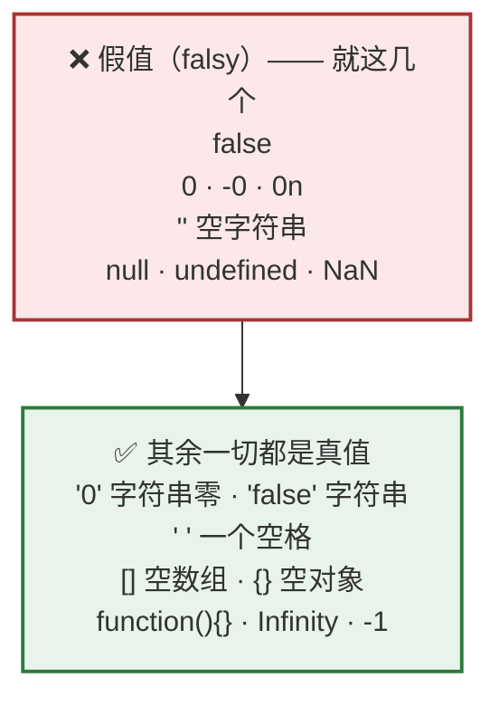
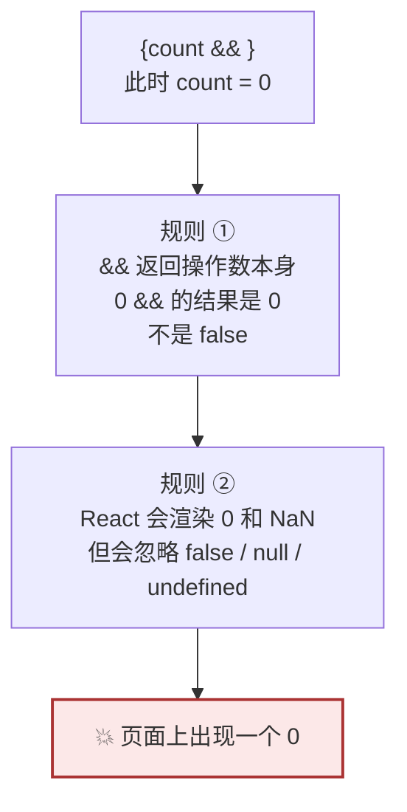
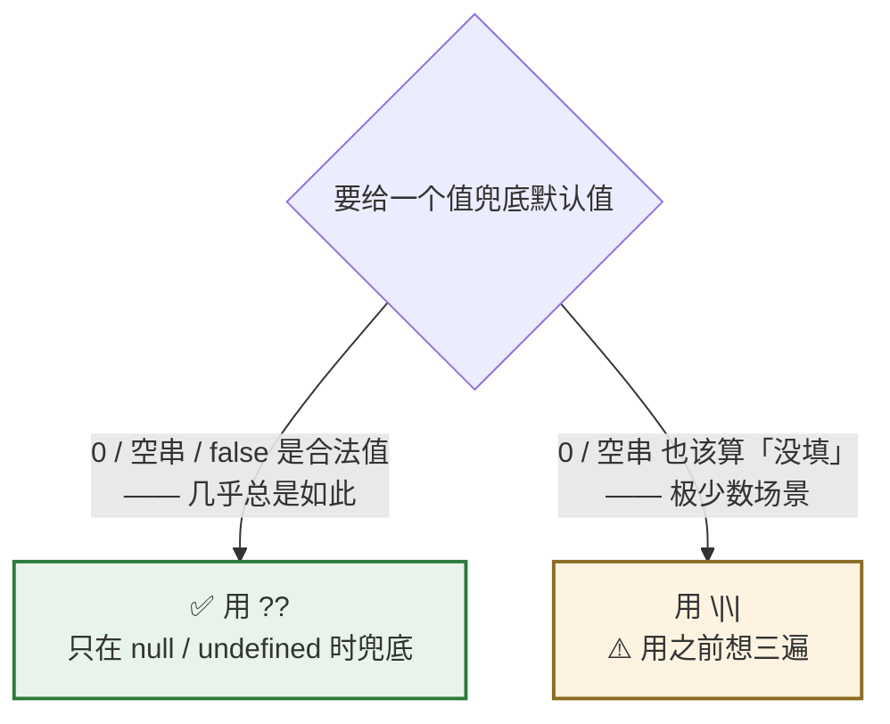
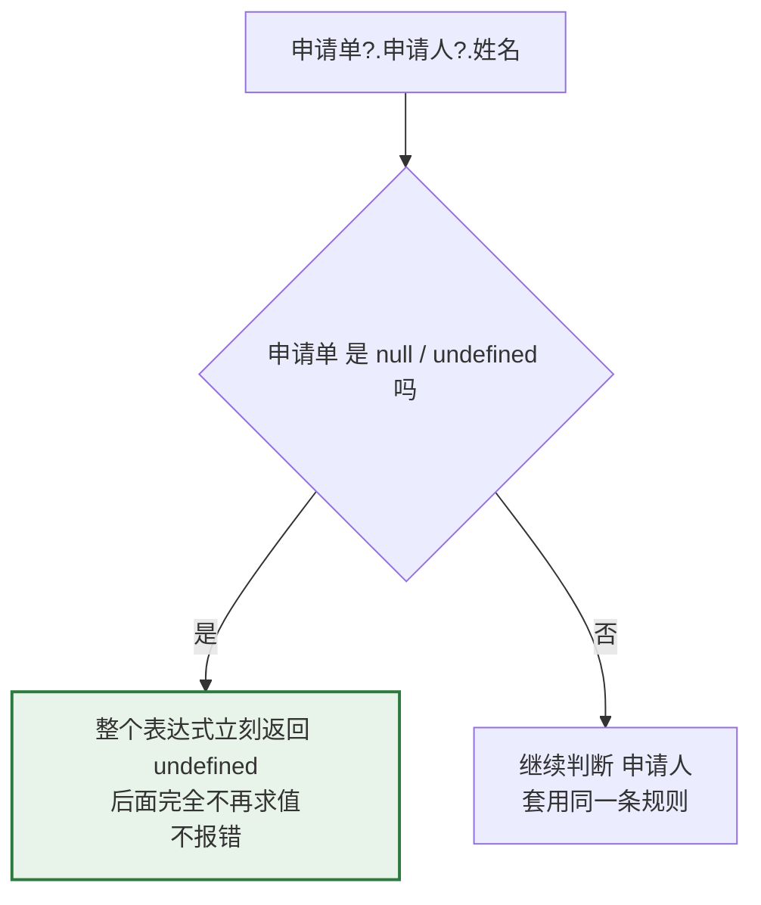

# Day 4 — 字符串、运算符、真值假值

> **今天的定位**：三个 React 新手最高频的坑，全在今天。
> 1. **`&&` 短路渲染** —— `{count && <span/>}` 当 `count` 为 0 时页面上真的出现一个 `0`。**React 新手头号 bug**
> 2. **`??` vs `||`** —— `props.pageSize || 20` 传 `0` 时会变成 `20`（错）
> 3. **依赖数组用 `Object.is` 比引用** —— 补上 Day 3 欠的那块
>
> 后两个和 Day 3 的 `Number('') === 0` 是同一类问题：**「假值」和「空值」不是一回事**。
>
> **时间**：2 小时
> **前置**：`day2-modules` 项目留着，`money.js` 今天还要用
> **本文所有输出均经 Node.js 24 实测**

## 今天结束时你应该能做到

- [ ] 熟练用模板字符串拼接，不再用 `+`
- [ ] 说出全部假值，并知道 `'0'`、`' '`、`[]`、`{}` 都是**真值**
- [ ] **能解释 `{count && <span/>}` 为什么会渲染出 `0`**，并说出两条成因
- [ ] 知道取默认值一律用 `??`，能说出 `||` 什么时候会出错
- [ ] 会用 `?.` 防御后端返回的空数据
- [ ] **能解释为什么 `useEffect` 依赖数组里放对象等于没写依赖**
- [ ] 知道中文姓名 `sort()` 排出来的顺序是错的，以及怎么修

## 时间分配

| 时段 | 内容 | 时长 |
| --- | --- | --- |
| 1 | 模板字符串 | 15 分钟 |
| 2 | 字符串常用方法 | 20 分钟 |
| 3 | `===` / `Object.is` / 依赖数组 | 20 分钟 |
| 4 | 真值与假值 | 15 分钟 |
| 5 | **`&&` 短路渲染的坑** | 20 分钟 |
| 6 | **`??` vs `\|\|`** | 15 分钟 |
| 7 | `?.` 可选链与其余运算符 | 15 分钟 |

---

# 第 1 节：模板字符串（15 分钟）

## 1.1 基本用法

用**反引号**（`` ` ``，键盘左上角、`Tab` 上面那个键）包裹，`${}` 里放任意表达式：

```js
const 客户 = '张三'
const 金额 = 41.65

// ❌ 老写法：用 + 拼接
const 旧 = '客户 ' + 客户 + ' 应付 ' + 金额 + ' 元'

// ✅ 模板字符串
const 新 = `客户 ${客户} 应付 ${金额} 元`

console.log(新)      // 客户 张三 应付 41.65 元
```

**对照 C#**：这就是 C# 6 的字符串内插 `$"客户 {客户} 应付 {金额} 元"`。用法几乎一样，只是符号不同：

| C# | JS |
| --- | --- |
| `$"..."` 前缀 `$` | 反引号 `` `...` `` |
| `{变量}` | `${变量}` |

## 1.2 `${}` 里能放任意表达式

```js
const 数量 = 3
const 单价分 = 435

console.log(`小计 ${单价分 * 数量} 分`)                    // 小计 1305 分
console.log(`状态 ${数量 > 0 ? '有货' : '缺货'}`)          // 状态 有货
console.log(`大写 ${客户.toUpperCase()}`)                  // 能调方法
console.log(`第一项 ${[1, 2, 3][0]}`)                      // 能取下标
```

**但不要在里面塞太复杂的东西** —— 三层嵌套三元运算符会让人看不懂。复杂逻辑先算到变量里。

## 1.3 天然支持多行

```js
const 邮件 = `尊敬的 ${客户}：

您的价格申请单已通过审核。
金额：${金额} 元

审核部门`

console.log(邮件)
```

**换行直接写就行**，不需要 `\n`。这在拼 SQL、拼邮件正文、拼多行提示语时很方便。

> **注意缩进会被原样保留**。如果你把模板字符串写在缩进很深的函数里，多余的空格会跟着进字符串。

## 1.4 React 里最常见的两个用途

```jsx
// ① 拼动态 className —— 这是模板字符串在 React 里的头号用途
<div className={`按钮 ${是否禁用 ? '禁用态' : ''} ${尺寸}`}>

// ② 拼 URL
const 地址 = `/api/申请单/${单号}?页码=${页码}&每页=${每页}`
```

> 拼 URL 更规范的做法是用 `URLSearchParams`（Day 13 讲），因为它会自动处理特殊字符转义。但模板字符串在简单场景下够用。

## 1.5 ⚠️ 反引号不能省

```js
const a = "客户 ${客户}"       // ❌ 双引号里 ${} 不生效，原样输出
const b = `客户 ${客户}`       // ✅
```

新手常犯的错：习惯性打了双引号，然后困惑「为什么 `${}` 没被替换」。

---

# 第 2 节：字符串常用方法（20 分钟）

## 2.1 字符串是不可变的

```js
const 单号 = 'a001'
单号.toUpperCase()
console.log(单号)                      // 'a001'   ← 没变！

const 大写 = 单号.toUpperCase()        // ✅ 必须接住返回值
console.log(大写)                      // 'A001'
```

**所有字符串方法都返回新字符串，原字符串永不改变。** 这和 C# 的 `string` 完全一样，你已有的直觉是对的。

## 2.2 高频方法速查

在 `day2-modules` 里新建 `str.js` 跑一遍：

```js
const s = '  A001-价格申请  '

// ===== 清理 =====
console.log(s.trim())                       // 'A001-价格申请'
console.log('  x  '.trimStart())            // 'x  '
console.log('  x  '.trimEnd())              // '  x'

// ===== 查找（返回布尔）=====
const t = 'A001-价格申请'
console.log(t.includes('价格'))              // true
console.log(t.startsWith('A'))               // true
console.log(t.endsWith('申请'))              // true
console.log(t.indexOf('-'))                  // 4    找不到返回 -1

// ===== 截取 =====
console.log(t.slice(0, 4))                   // 'A001'
console.log(t.slice(5))                      // '价格申请'
console.log(t.slice(-2))                     // '申请'   ← 负数从末尾算
console.log(t.at(-1))                        // '请'     ← 取最后一个字符

// ===== 替换 =====
console.log(t.replace('-', '_'))             // 'A001_价格申请'   只换第一个
console.log('a-b-c'.replace('-', '_'))       // 'a_b-c'          注意！
console.log('a-b-c'.replaceAll('-', '_'))    // 'a_b_c'          ✅ 全换

// ===== 拆分与拼接 =====
console.log(t.split('-'))                    // [ 'A001', '价格申请' ]
console.log(['A', 'B', 'C'].join('-'))       // 'A-B-C'

// ===== 补齐（生成单号常用）=====
console.log(String(7).padStart(4, '0'))      // '0007'
console.log('7'.padEnd(4, '*'))              // '7***'

// ===== 大小写 =====
console.log(t.toUpperCase())                 // 'A001-价格申请'
console.log(t.toLowerCase())                 // 'a001-价格申请'

// ===== 重复 =====
console.log('='.repeat(20))                  // '===================='
```

## 2.3 `slice` vs `substring`：只用 `slice`

```js
const t = 'A001-价格申请'

console.log(t.slice(2, 0))        // ''      参数颠倒时返回空
console.log(t.substring(2, 0))    // 'A0'    ← 它悄悄把参数换了个顺序！
console.log(t.slice(-2))          // '申请'   负数从末尾算
console.log(t.substring(-2))      // 整个串   ← 负数被当成 0
```

**`substring` 的行为反直觉。一律用 `slice`。** 记一个就够。

## 2.4 ⚠️ 中文排序：`sort()` 的结果是错的

**这条对做中文业务系统的你很重要。**

```js
const 客户 = ['张三', '李四', '王五', '陈六', '赵七']

// ❌ 默认排序：按 UTF-16 编码值排，不是拼音
console.log([...客户].sort())
// [ '张三', '李四', '王五', '赵七', '陈六' ]   ← 完全不是拼音顺序

// ✅ 按中文拼音排序
console.log([...客户].sort((a, b) => a.localeCompare(b, 'zh-CN')))
// [ '陈六', '李四', '王五', '张三', '赵七' ]   ← 陈 李 王 张 赵，正确
```

> `[...客户]` 是先复制一份再排 —— 因为 `sort()` 会**原地修改**原数组（Day 3 讲过的引用问题）。Day 8 会详细讲。

**大量数据排序时用 `Intl.Collator` 更快**（它把排序规则预编译了一次）：

```js
const 比较器 = new Intl.Collator('zh-CN')
const 已排序 = [...客户].sort(比较器.compare)
```

**对照 SQL Server**：你在数据库里用 `ORDER BY 客户名` 时，排序结果取决于列的 **collation**（比如 `Chinese_PRC_CI_AS` 会按拼音排）。**前端 `sort()` 默认不按拼音**，所以「数据库查出来是对的，前端重排一下就乱了」这种问题就是这么来的。

## 2.5 ⚠️ `.length` 和数据库字段长度不是一回事

```js
console.log('张三'.length)              // 2
console.log('abc'.length)               // 3
console.log('👍'.length)                // 2   ← 一个 emoji 算 2！
console.log([...'👍'].length)           // 1   ← 用展开才是 1 个字符
```

**对照 SQL Server**：

| 数据库列 | 能存 | JS `.length` 算法 |
| --- | --- | --- |
| `nvarchar(50)` | 50 个字符（中文也算 1 个） | ✅ 基本对得上 |
| `varchar(50)` | 50 **字节**，中文占 2 字节 → 只能存 25 个汉字 | ❌ **对不上** |

所以如果你的字段是 `varchar(50)`，前端写 `if (值.length > 50)` 校验是**不够的** —— 用户填 30 个汉字就会在数据库那边被截断或报错。

> **实务建议**：让数据库字段统一用 `nvarchar`，这样前后端长度概念一致。已有的 `varchar` 字段，前端校验要按字节算。

## 2.6 `+` 遇到字符串会变成拼接

Day 3 讲 `toFixed` 时提过一次，这里正式说清：

```js
console.log(1 + 2)              // 3         数字相加
console.log('1' + 2)            // '12'      ← 字符串拼接！
console.log(1 + '2')            // '12'      ← 顺序不影响
console.log('1' - 2)            // -1        ← 减号反而会转成数字
console.log('3' * '4')          // 12        ← 乘号也会
```

**只有 `+` 有这个歧义**，因为它同时是「加法」和「拼接」。`-` `*` `/` 都会强制转成数字。

**实务后果**：从输入框读到的值**永远是字符串**：

```js
const 数量 = 输入框.value        // 假设用户输入 5，这里是字符串 '5'

console.log(数量 + 1)            // '51'   💥
console.log(Number(数量) + 1)    // 6      ✅
```

**规矩：从 DOM / 接口读到的数字，先 `Number()` 转换再运算。**

---

# 第 3 节：`===` / `Object.is` / 依赖数组（20 分钟）

## 3.1 一律用 `===`

```js
console.log(1 === 1)                // true
console.log(1 === '1')              // false   类型不同就是 false
console.log(1 == '1')               // true    ← == 会先转类型
```

`==` 的转换规则很绕，会产生一堆反直觉结果：

```js
console.log('' == 0)                // true    💥
console.log('0' == 0)               // true
console.log('' == '0')              // false   💥 前两个都 true，这个居然 false
console.log([] == false)            // true    💥
console.log([] == 0)                // true
console.log(null == 0)              // false
console.log(null == undefined)      // true    ← 这条有用，见 Day 3 的 x == null
```

**注意前三行**：`'' == 0` 是 `true`，`'0' == 0` 是 `true`，但 `'' == '0'` 是 `false`。**`==` 连传递性都不满足。**

**规矩：一律用 `===` 和 `!==`。唯一例外是 Day 3 讲的 `x == null`（同时判 `null` 和 `undefined`）。**

## 3.2 `Object.is` 和 `===` 的关系

Day 3 讲过，复习一遍：

```js
console.log(Object.is(1, 1))            // true    和 === 一样
console.log(Object.is('a', 'a'))        // true
console.log(Object.is(NaN, NaN))        // true    ← === 是 false
console.log(Object.is(0, -0))           // false   ← === 是 true
```

**只有 `NaN` 和 `±0` 两处不同，其余完全一致。** 日常用 `===`。

## 3.3 ⭐ 补上 Day 3 欠的：`useEffect` 依赖数组

**React 的 `useEffect` 用 `Object.is` 逐项比较依赖数组。**

```jsx
useEffect(() => {
  取数据()
}, [依赖1, 依赖2])      // ← React 拿这一项一项和上次渲染的比
```

结合 Day 3 学的「对象每次都是新引用」：

```jsx
// ❌ 每次渲染都创建新对象 → Object.is 永远是 false → 每次都触发
useEffect(() => {
  查询(条件)
}, [{ 状态: '待审核' }])

// ❌ 同样的问题：查询条件是个对象
const 条件 = { 状态: '待审核', 页码: 1 }    // 每次渲染都是新对象
useEffect(() => {
  查询(条件)
}, [条件])                                   // 每次都触发，可能导致无限循环

// ✅ 依赖数组里只放原始值
useEffect(() => {
  查询({ 状态, 页码 })
}, [状态, 页码])                             // 字符串和数字比较值，正确
```

在 `day2-modules` 里新建 `deps.js` 验证：

```js
// 模拟两次渲染各自创建的「条件对象」
const 第一次渲染的条件 = { 状态: '待审核', 页码: 1 }
const 第二次渲染的条件 = { 状态: '待审核', 页码: 1 }

console.log('内容一样吗？   看起来一样')
console.log('Object.is 结果：', Object.is(第一次渲染的条件, 第二次渲染的条件))
// false  ← React 会认为「依赖变了」，重新执行 effect

// 原始值就没这个问题
console.log(Object.is('待审核', '待审核'))     // true
console.log(Object.is(1, 1))                   // true
```

### 三条实务规矩

| 规矩 | 说明 |
| --- | --- |
| **依赖数组里只放原始值** | `[状态, 页码, 客户Id]`，不要放 `[条件对象]` |
| **函数也是对象** | 每次渲染重新定义的函数，引用都不同。需要放进依赖时要用 `useCallback` |
| **数组同理** | `[列表]` 每次都是新引用。要么放 `列表.length`，要么放具体的原始值 |

> Day 20 会装 `eslint-plugin-react-hooks`，它能自动检查依赖数组的问题，价值极高。今天先理解**为什么**。

---

# 第 4 节：真值与假值（15 分钟）

JS 里任何值放到 `if` 里都能判断真假。**假值的清单是固定的、有限的。**

## 4.1 假值全表



**实务上只需记住 6 个**：`false` · `0` · `''` · `null` · `undefined` · `NaN`

另外三个是边角情况：`-0`（负零）、`0n`（BigInt 零）、`document.all`（远古兼容遗留）。

## 4.2 ⚠️ 四个和直觉相反的真值

新建 `truthy.js`：

```js
console.log(Boolean('0'))            // true   ← 字符串 '0' 是真值！
console.log(Boolean('false'))        // true   ← 字符串 'false' 也是真值！
console.log(Boolean(' '))            // true   ← 一个空格是真值
console.log(Boolean([]))             // true   ← 空数组是真值！
console.log(Boolean({}))             // true   ← 空对象是真值
console.log(Boolean(-1))             // true   ← 负数是真值
console.log(Boolean(Infinity))       // true
```

### `[]` 是真值 —— 这条最容易出事

```js
const 列表 = []

if (列表) {
  console.log('这里一定会执行')       // 空数组是真值，进来了
}

// ❌ 想判断「有没有数据」，这样写永远为真
if (列表) { 渲染列表() }

// ✅ 判断数组有没有内容，要看 length
if (列表.length > 0) { 渲染列表() }
```

**对照 C#**：C# 里 `if (列表)` 压根编译不过（`List<T>` 不能隐式转 `bool`），编译器帮你挡住了。JS 不会挡，所以这个错要靠你自己记住。

### 字符串 `'0'` 是真值

这条在处理接口数据时会咬人：

```js
// 后端返回的状态码是字符串
const 状态 = '0'        // '0' 表示「待审核」

if (状态) {
  console.log('进来了')  // 字符串 '0' 是真值，进来了
}

// 如果后端某天改成返回数字 0
const 状态2 = 0
if (状态2) {
  console.log('这次进不来')   // 数字 0 是假值
}
```

**同一个业务含义，字符串和数字的真假相反。** 所以判断状态**永远要显式比较**：

```js
if (状态 === '0') { }          // ✅ 明确
if (状态 !== undefined) { }    // ✅ 明确
```

## 4.3 转成布尔的三种写法

```js
const 值 = '张三'

console.log(Boolean(值))        // true   最清楚
console.log(!!值)               // true   最常见（两个感叹号）
console.log(值 ? true : false)  // true   最啰嗦，别用
```

`!!x` 读法：第一个 `!` 取反变布尔，第二个 `!` 再取反变回来。**实务中 `!!` 最常见**，看到不要慌。

---

# 第 5 节：`&&` 短路渲染的坑（20 分钟）★ 重点

> **React 新手头号 bug。** 我在学习计划里把它标为最优先要讲清的一条。

## 5.1 先搞清 `&&` 和 `||` 返回什么

**关键认知：`&&` 和 `||` 返回的不是布尔值，是操作数本身。**

新建 `logic.js`：

```js
// ===== && 返回什么 =====
console.log(1 && 2)              // 2       都真 → 返回最后一个
console.log(0 && 2)              // 0       ← 返回的是 0，不是 false！
console.log('' && 'x')           // ''      ← 返回空串
console.log(null && 'x')         // null    ← 返回 null

// ===== || 返回什么 =====
console.log(1 || 2)              // 1       第一个真值就返回
console.log(0 || 2)              // 2       第一个假 → 返回第二个
console.log(0 || '')             // ''      都假 → 返回最后一个
```

**规则：**

| 运算符 | 行为 |
| --- | --- |
| `a && b` | `a` 为**假值**就返回 `a`（不再看 `b`）；否则返回 `b` |
| `a \|\| b` | `a` 为**真值**就返回 `a`（不再看 `b`）；否则返回 `b` |

**「不再看后面」这个特性叫短路求值**，它有个实用价值：

```js
// 安全地调用可能不存在的函数
onClick && onClick()          // onClick 为空时不会报错
```

## 5.2 React 里的条件渲染

JSX 里**不能写 `if`**，所以条件渲染靠三种手段：

```jsx
// ① && —— 「满足条件才显示」
{有权限 && <button>删除</button>}

// ② 三元 —— 「二选一」
{已登录 ? <控制台 /> : <登录表单 />}

// ③ 提前 return —— 复杂情况
if (加载中) return <加载动画 />
```

## 5.3 💥 那个坑

```jsx
{count && <span>{count} 条待审核</span>}
```

**当 `count` 为 `0` 时，页面上会出现一个孤零零的 `0`。**

## 5.4 两条独立规则叠加造成的



**规则 ①**（第 5.1 节验证过）：`0 && 任何东西` 的结果是 `0`。

**规则 ②**：React 对不同的值有不同处理：

| 值 | React 渲染成什么 |
| --- | --- |
| `false` | 什么都不渲染 ✅ |
| `null` | 什么都不渲染 ✅ |
| `undefined` | 什么都不渲染 ✅ |
| **`0`** | **渲染出 `0`** 💥 |
| **`NaN`** | **渲染出 `NaN`** 💥 |
| `''` 空串 | 什么都不渲染（看不见） |

**所以两条一叠加**：`&&` 把 `0` 交给 React，React 老老实实把 `0` 画出来了。

## 5.5 会中招的三种典型写法

```jsx
{count && <span>{count}</span>}                  // count 为 0 → 显示 "0"
{items.length && <列表 />}                        // 空数组 → length 是 0 → 显示 "0"
{金额 && <span>{金额} 元</span>}                  // 金额为 0 → 显示 "0"
```

**第二个最常见** —— 「有数据才显示列表」，结果空列表时页面上多个 `0`。

## 5.6 ✅ 正确写法

**规矩：`&&` 左边必须是真正的布尔表达式。**

```jsx
// ✅ 显式比较
{count > 0 && <span>{count} 条待审核</span>}
{items.length > 0 && <列表 />}
{金额 > 0 && <span>{金额} 元</span>}

// ✅ 用 !! 转布尔
{!!count && <span>{count}</span>}

// ✅ 用三元，兜底给 null
{count ? <span>{count}</span> : null}
```

**推荐第一种（显式比较）** —— 它的意图最清楚，别人一看就知道你在判断什么。

> **一个记忆口诀**：`&&` 左边只放 `>` `<` `===` `!==` `!!` 这些**一定产出布尔值**的东西。绝不放裸的数字、字符串、`.length`。

## 5.7 顺带一提：字符串也有类似问题

```jsx
{备注 && <p>{备注}</p>}
```

`备注` 为空串 `''` 时，`&&` 返回 `''`，React 渲染空串 → **看不见任何东西，行为正常**。

**所以空串是安全的，只有 `0` 和 `NaN` 会露出来。** 但为了统一，建议一律显式判断：

```jsx
{备注 !== '' && <p>{备注}</p>}
// 或者
{!!备注 && <p>{备注}</p>}
```

---

# 第 6 节：`??` vs `||`（15 分钟）★ 重点

## 6.1 `??` 只认两个空

```js
// ?? 只在左边是 null 或 undefined 时才取右边
console.log(null ?? '默认')          // '默认'
console.log(undefined ?? '默认')     // '默认'
console.log(0 ?? '默认')             // 0        ← 保留了 0
console.log('' ?? '默认')            // ''       ← 保留了空串
console.log(false ?? '默认')         // false    ← 保留了 false

// || 会把所有假值都当成「没有」
console.log(null || '默认')          // '默认'
console.log(0 || '默认')             // '默认'   💥 0 被吞了
console.log('' || '默认')            // '默认'   💥 空串被吞了
console.log(false || '默认')         // '默认'   💥 false 被吞了
```

**一句话区别：**

| 运算符 | 什么时候取右边 |
| --- | --- |
| `\|\|` | 左边是**任何假值**（`0` `''` `false` `NaN` 也算） |
| `??` | 左边是 `null` 或 `undefined`（**仅此两个**） |

## 6.2 三个会出错的真实场景

```js
// 场景一：分页大小
const 每页 = props.每页 || 20
// 调用方明确传了 0（表示「不分页」），结果被改成 20 💥

// 场景二：用户清空了备注
const 备注 = 表单.备注 || '无'
// 用户故意清空（''），结果显示成「无」，用户以为没保存成功 💥

// 场景三：布尔开关
const 显示合计 = 配置.显示合计 || true
// 用户明确设为 false，结果永远是 true —— 这个开关等于坏了 💥
```

**全部改成 `??` 就对了：**

```js
const 每页 = props.每页 ?? 20            // 传 0 就是 0 ✅
const 备注 = 表单.备注 ?? '无'           // 空串保留 ✅
const 显示合计 = 配置.显示合计 ?? true    // false 保留 ✅
```

## 6.3 决策图



**规矩：取默认值一律用 `??`。** 想用 `||` 时，先问自己「`0` 和空串在这里真的该被替换掉吗」。

## 6.4 `||` 还有用的场景

```js
// 「随便给个非空的显示值」—— 这时候 || 反而合适
const 显示名 = 昵称 || 姓名 || '匿名用户'
// 昵称是空串时确实该退到姓名，这里 || 是对的
```

区别在于：**这个场景里「空串」和「没有」的业务含义相同**。当两者含义相同时用 `||`，不同时用 `??`。

## 6.5 ⚠️ `??` 不能和 `||` `&&` 混写

```js
const x = a || b ?? c          // 💥 SyntaxError
```

这是**语法错误**，不是逻辑问题 —— JS 强制你加括号，避免歧义：

```js
const x = (a || b) ?? c        // ✅
const y = a || (b ?? c)        // ✅ 含义不同，所以必须你自己指明
```

> 这是个好设计。C# 的 `??` 和 `||` 混写时靠优先级规则，容易读错；JS 直接不让你写。

## 6.6 三个逻辑赋值运算符

```js
let a = null
a ??= '默认'                    // a 是 null/undefined 才赋值
console.log(a)                  // '默认'

let b = 0
b ||= 99                        // b 是假值就赋值（0 会被覆盖）
console.log(b)                  // 99

let c = 1
c &&= 5                         // c 是真值才赋值
console.log(c)                  // 5
```

**最常用的是 `??=`**，用于「没设置过就给个默认值」。

`||=` 有和 `||` 一样的坑，谨慎。

---

# 第 7 节：`?.` 可选链与其余运算符（15 分钟）

## 7.1 `?.` 解决什么问题

后端返回的数据经常缺字段：

```js
const 申请单 = { 单号: 'A001' }        // 没有 申请人 字段

// ❌ 直接访问深层属性
console.log(申请单.申请人.姓名)
// 💥 TypeError: Cannot read properties of undefined (reading '姓名')
```

**这是前端最常见的运行时错误**，通常导致整页白屏。

```js
// ❌ 老写法：层层判断
const 姓名 = 申请单 && 申请单.申请人 && 申请单.申请人.姓名

// ✅ 可选链
const 姓名 = 申请单?.申请人?.姓名
console.log(姓名)                      // undefined，不报错
```

## 7.2 短路规则



**一旦遇到 `null` / `undefined`，整个链条立刻停止，返回 `undefined`。**

## 7.3 三种形态

```js
const 对象 = { a: { b: 1 }, 列表: [10, 20], 方法: () => '结果' }

// ① 属性访问
console.log(对象?.a?.b)                // 1
console.log(对象?.x?.y)                // undefined

// ② 下标访问 —— 注意点在方括号前面
console.log(对象?.列表?.[0])           // 10
console.log(对象?.不存在?.[0])         // undefined

// ③ 函数调用 —— 注意点在括号前面
console.log(对象.方法?.())             // '结果'
console.log(对象.不存在方法?.())       // undefined，不报错
```

**`?.[` 和 `?.(` 这两个形态的点容易忘写**，记住「问号点」是一个整体，后面才是 `[` 或 `(`。

## 7.4 和 `??` 配合是标准搭配

```js
const 城市 = 申请单?.申请人?.地址?.城市 ?? '未填写'
```

**读法**：一路安全地取下去，取不到就用 `'未填写'`。

**这一行是你今后写业务代码最高频的组合**，请记牢。

## 7.5 ⚠️ 不要滥用 `?.`

```js
// ❌ 到处撒问号，掩盖了真正的问题
const 名 = a?.b?.c?.d?.e?.f

// ✅ 该有的数据就该有。用 ?. 是因为「这里真的可能没有」
const 名 = 申请单.申请人?.姓名      // 申请单一定有，申请人可能没填
```

**滥用 `?.` 的后果**：数据缺失时不再报错，而是静默变成 `undefined`，然后页面上一片空白，你查不到原因。

**判断标准**：只在「这个字段业务上确实可能为空」的地方用。

## 7.6 三元运算符

```js
const 状态文字 = 已审核 ? '已通过' : '待审核'
```

JSX 里不能写 `if`，所以三元是「二选一」的唯一手段：

```jsx
{已登录 ? <控制台 /> : <登录页 />}
```

**不要嵌套超过一层：**

```jsx
// ❌ 看不懂
{a ? (b ? <X /> : <Y />) : (c ? <Z /> : <W />)}

// ✅ 多分支用查表法（Day 20 会讲 Record 类型）
const 状态组件 = {
  待审核: <待审核图标 />,
  已通过: <通过图标 />,
  已驳回: <驳回图标 />,
}
{状态组件[状态]}
```

## 7.7 其余运算符速查

```js
// ===== in：判断属性存在（注意：值为 undefined 也算存在）=====
const o = { a: 1, b: undefined }
console.log('a' in o)              // true
console.log('b' in o)              // true    ← 值是 undefined，但键存在
console.log('c' in o)              // false
console.log(o.b === undefined)     // true    ← 分不出「没这个键」和「值是 undefined」

// ===== instanceof：判断是不是某个类的实例 =====
console.log(new Date() instanceof Date)      // true
console.log([] instanceof Array)             // true（但判数组还是用 Array.isArray）

// ===== delete：删除属性（React 里基本不用）=====
const p = { a: 1, b: 2 }
delete p.a
console.log(p)                     // { b: 2 }
// React 里要「删字段」应该用解构：const { a, ...其余 } = p
```

**几乎用不到的（认得就行）**：`void`、逗号运算符、位运算 `&` `|` `^` `<<` `>>`。

位运算在前端偶尔用于权限位图（和你 C# 里的 `[Flags]` 枚举同理），但**注意 JS 的位运算会把数字转成 32 位整数**，超过 2^31 就出错 —— 又一个「JS 只有一种 number」的后遗症。

---

# 今日验收清单

- [ ] 会用反引号写模板字符串，知道双引号里 `${}` 不生效
- [ ] `str.js` 跑过了，`slice` / `replaceAll` / `padStart` / `at(-1)` 都用过
- [ ] 知道一律用 `slice` 不用 `substring`
- [ ] **知道中文 `sort()` 不按拼音排，会用 `localeCompare(b, 'zh-CN')` 修**
- [ ] 知道 `varchar(50)` 和 JS `.length` 对不上
- [ ] 知道 `'1' + 2` 是 `'12'`，输入框读到的值要先 `Number()`
- [ ] 能背出 6 个假值，知道 `'0'` `' '` `[]` `{}` 都是**真值**
- [ ] **知道 `if (列表)` 对空数组永远为真，要用 `列表.length > 0`**
- [ ] `logic.js` 跑过了，**看到 `0 && 2` 返回的是 `0` 而不是 `false`**
- [ ] **能说出 `{count && <span/>}` 渲染出 `0` 的两条成因**
- [ ] 知道 React 渲染 `0` 和 `NaN`，但忽略 `false` / `null` / `undefined`
- [ ] 知道 `&&` 左边只放一定产出布尔值的表达式
- [ ] **能举出三个 `||` 取默认值出错的场景，并改成 `??`**
- [ ] 知道 `??` 不能和 `||` 混写（语法错误）
- [ ] 会写 `a?.b?.[0]` 和 `fn?.()`
- [ ] 记住 `申请单?.申请人?.姓名 ?? '未填写'` 这个标准组合
- [ ] **能解释为什么依赖数组里放对象等于没写依赖**
- [ ] `deps.js` 跑过了

---

# 常见问题排查

## 页面上莫名出现一个 `0`

`{数字 && <组件/>}` 且数字为 0。改成 `{数字 > 0 && <组件/>}`。第 5 节。

## 页面上出现 `NaN`

同上，或者某个运算产生了 `NaN`（Day 3 第 3.6 节）。

## 明确传了 `0`，却被换成了默认值

用了 `||` 取默认值。改成 `??`。第 6 节。

## `Cannot read properties of undefined (reading 'xxx')`

访问了空对象的属性。用 `?.`。但**先想清楚这个字段为什么是空的** —— 可能是字段名写错，或者接口没返回。

## 空数组时列表组件还是渲染了

`if (列表)` 对空数组为真。用 `列表.length > 0`。第 4.2 节。

## `SyntaxError` 且代码里有 `??`

`??` 和 `||` / `&&` 混写了，必须加括号。第 6.5 节。

## 数字变成了字符串拼接

`+` 遇到字符串会拼接。输入框的值先 `Number()`。第 2.6 节。

## 中文列表排序顺序不对

`sort()` 默认按编码值排。用 `localeCompare(b, 'zh-CN')`。第 2.4 节。

## `useEffect` 无限循环执行

依赖数组里放了对象、数组或函数（每次渲染都是新引用）。只放原始值。第 3.3 节。

---

# 今天不需要理解的东西

| 你会看到 | 什么时候学 |
| --- | --- |
| `{列表.map(...)}` 渲染列表 | Day 8 |
| `useCallback` 怎么用 | 阶段 4 第 3 周 |
| `Record<状态, 组件>` 查表法的类型写法 | Day 20 |
| `URLSearchParams` | Day 13 |
| 正则表达式 | Day 14 |
| `==` 的完整转换算法 | **永远不用**，用 `===` 就行 |
| Unicode 码点、代理对的细节 | 用不到 |

---

# 作业（25 分钟）

## 作业 1：写四个字符串工具函数

新建 `str-utils.js`：

```js
/** 手机号脱敏：'13812345678' → '138****5678' */
export function 脱敏手机(号码) {
  // TODO
}

/** 生成单号：('A', 7) → 'A0007'（数字部分补到 4 位） */
export function 生成单号(前缀, 序号) {
  // TODO
}

/** 截断长文本：('这是一段很长的备注文字', 6) → '这是一段很长…' */
export function 截断(文本, 最大长度) {
  // TODO：超长才加省略号，不超长原样返回
}

/** 按中文拼音排序（不修改原数组） */
export function 中文排序(数组) {
  // TODO
}
```

自测用例：

| 调用 | 期望 |
| --- | --- |
| `脱敏手机('13812345678')` | `'138****5678'` |
| `生成单号('A', 7)` | `'A0007'` |
| `生成单号('A', 1234)` | `'A1234'` |
| `截断('这是一段很长的备注文字', 6)` | `'这是一段很长…'` |
| `截断('短文本', 6)` | `'短文本'`（不加省略号） |
| `中文排序(['张三','李四','陈六'])` | `['陈六','李四','张三']` |

<details>
<summary>提示（卡住了再看）</summary>

- 脱敏：`slice(0, 3)` + `'****'` + `slice(-4)`
- 单号：`前缀 + String(序号).padStart(4, '0')`
- 截断：先判断 `文本.length > 最大长度`
- 排序：`[...数组].sort((a, b) => a.localeCompare(b, 'zh-CN'))`

</details>

## 作业 2：找出并修复 7 个问题

```jsx
function 申请单卡片({ 申请单, 配置 }) {
  const 每页 = 配置.每页 || 20
  const 显示合计 = 配置.显示合计 || true
  const 备注 = 申请单.备注 || '无备注'
  const 申请人姓名 = 申请单.申请人.姓名

  const 明细数 = 申请单.明细.length

  return (
    <div className={'卡片 ' + (申请单.已审核 ? '已审核' : '')}>
      <h3>{申请人姓名}</h3>
      {明细数 && <span>{明细数} 条明细</span>}
      {申请单.金额 && <span>{申请单.金额} 元</span>}
      <p>{备注}</p>
      {申请单.明细 && <明细表 数据={申请单.明细} />}
    </div>
  )
}
```

<details>
<summary>点开看答案</summary>

| # | 问题 | 修复 |
| --- | --- | --- |
| 1 | `配置.每页 \|\| 20` —— 传 `0` 会变 `20` | `配置.每页 ?? 20` |
| 2 | `配置.显示合计 \|\| true` —— 传 `false` 永远是 `true`，开关失效 | `配置.显示合计 ?? true` |
| 3 | `申请单.备注 \|\| '无备注'` —— 用户清空后显示「无备注」，误导 | `申请单.备注 ?? '无备注'` |
| 4 | `申请单.申请人.姓名` —— 申请人为空时整页崩 | `申请单.申请人?.姓名 ?? '未填写'` |
| 5 | `申请单.明细.length` —— 明细为空时崩 | `申请单.明细?.length ?? 0` |
| 6 | `{明细数 && ...}` 和 `{申请单.金额 && ...}` —— 为 `0` 时渲染出 `0` | 改成 `明细数 > 0 &&`、`申请单.金额 > 0 &&` |
| 7 | `{申请单.明细 && <明细表/>}` —— **空数组是真值**，空列表也会渲染 | `申请单.明细?.length > 0 &&` |

**顺带一个非错误但该改的**：`className={'卡片 ' + (...)}` 用字符串拼接，改成模板字符串更清楚：

```jsx
className={`卡片 ${申请单.已审核 ? '已审核' : ''}`}
```

**参考修复版：**

```jsx
function 申请单卡片({ 申请单, 配置 }) {
  const 每页 = 配置.每页 ?? 20
  const 显示合计 = 配置.显示合计 ?? true
  const 备注 = 申请单.备注 ?? '无备注'
  const 申请人姓名 = 申请单.申请人?.姓名 ?? '未填写'
  const 明细数 = 申请单.明细?.length ?? 0

  return (
    <div className={`卡片 ${申请单.已审核 ? '已审核' : ''}`}>
      <h3>{申请人姓名}</h3>
      {明细数 > 0 && <span>{明细数} 条明细</span>}
      {申请单.金额 > 0 && <span>{申请单.金额} 元</span>}
      <p>{备注}</p>
      {明细数 > 0 && <明细表 数据={申请单.明细} />}
    </div>
  )
}
```

注意最后一行复用了 `明细数 > 0` —— 比重复写一遍判断更好。

</details>

## 作业 3：预测输出（先写答案，再运行）

```js
console.log('①', 0 || '默认')
console.log('②', 0 ?? '默认')
console.log('③', '' || '默认')
console.log('④', '' ?? '默认')
console.log('⑤', 0 && '结果')
console.log('⑥', 1 && '结果')
console.log('⑦', Boolean([]))
console.log('⑧', [].length > 0)
console.log('⑨', Boolean('0'))
console.log('⑩', null ?? undefined ?? '兜底')
console.log('⑪', ({}).a?.b)
console.log('⑫', '1' + 2 - 3)
```

<details>
<summary>点开看答案</summary>

```
① 默认        0 是假值，|| 取右边
② 0           ?? 只认 null/undefined，0 被保留
③ 默认        '' 是假值
④ ''          空串被保留（输出看起来是空的）
⑤ 0           && 左边为假就返回左边本身 —— 不是 false！
⑥ 结果        && 左边为真就返回右边
⑦ true        空数组是真值
⑧ false       长度是 0
⑨ true        字符串 '0' 是真值
⑩ 兜底        两个都是空，一路取到最后
⑪ undefined   ?. 短路，不报错
⑫ 9           '1'+2 先拼成 '12'，'12'-3 再转数字 = 9
```

**最该记住的是 ⑤**：`0 && '结果'` 返回 `0`，这就是 React 里渲染出 `0` 的直接原因。

**⑫ 是个综合题**：`+` 拼接、`-` 转数字，两个行为在一行里同时出现。

</details>

## 作业 4：一句话回答（写在笔记里）

1. `{申请单.明细 && <明细表 />}` 在明细是空数组 `[]` 时会渲染明细表吗？为什么？
2. 我有个配置项 `允许编辑`，默认 `true`。写 `配置.允许编辑 || true` 有什么问题？
3. `useEffect(() => {...}, [查询条件])`，其中 `查询条件` 是个对象。会有什么问题？
4. 我从输入框读到数量，`数量 + 1` 得到 `'51'`。为什么？

<details>
<summary>点开看参考答案</summary>

1. **会渲染。** 空数组 `[]` 是**真值**，`&&` 左边为真就返回右边，所以明细表照样渲染（然后显示一个空表格）。应该写 `申请单.明细?.length > 0 &&`。

2. **这个开关永远打不开「关」。** 用户明确传 `false` 时，`false || true` 得到 `true`，等于这个配置项失效了。必须用 `??`：`配置.允许编辑 ?? true`。

3. **effect 每次渲染都会执行，可能造成无限循环。** 因为对象每次渲染都是新创建的，引用不同，`Object.is(旧, 新)` 为 `false`，React 认为依赖变了。应该把对象拆开，依赖数组里只放原始值：`[状态, 页码]`。

4. **因为输入框的 `value` 永远是字符串**，`'5' + 1` 触发的是字符串拼接而不是加法。要先转换：`Number(数量) + 1`。

</details>

---

# 明天预告：Day 5 — 函数（上）

明天进入函数，四个重点：

1. **箭头函数** `() => {}` —— React 里的默认选择，含一个高频坑：**返回对象字面量必须加括号** `() => ({ id: 1 })`
2. **参数解构 + 默认值** `function Card({ title, size = 'md' })` —— React 组件接收 props 的标准写法，必须写熟
3. **`{...rest}` 属性透传** —— 封装可复用 `Input` / `Button` 组件的核心手法，做企业后台一定用得上
4. **纯函数** —— React 组件必须是纯函数，这是硬要求

`str-utils.js` 和 `money.js` 明天还要用，别删。

---

## 参考来源

- [MDN：模板字符串](https://developer.mozilla.org/zh-CN/docs/Web/JavaScript/Reference/Template_literals)
- [MDN：假值 Falsy](https://developer.mozilla.org/zh-CN/docs/Glossary/Falsy)
- [MDN：空值合并运算符 ??](https://developer.mozilla.org/zh-CN/docs/Web/JavaScript/Reference/Operators/Nullish_coalescing)
- [MDN：可选链 ?.](https://developer.mozilla.org/zh-CN/docs/Web/JavaScript/Reference/Operators/Optional_chaining)
- [React 官方文档：条件渲染](https://react.dev/learn/conditional-rendering)

> 上述来源的内容已经过改写与归纳，以符合许可要求。
