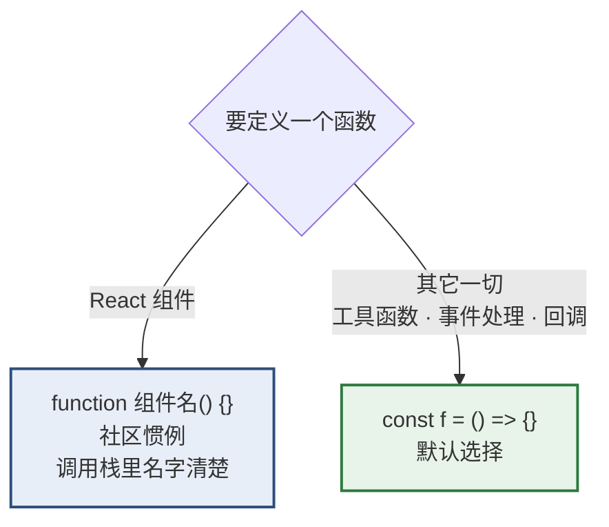
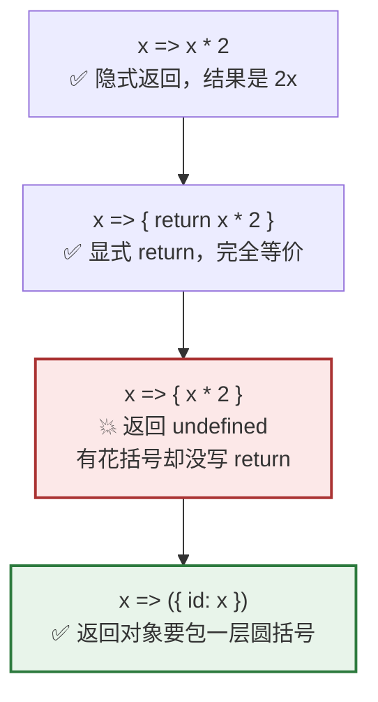
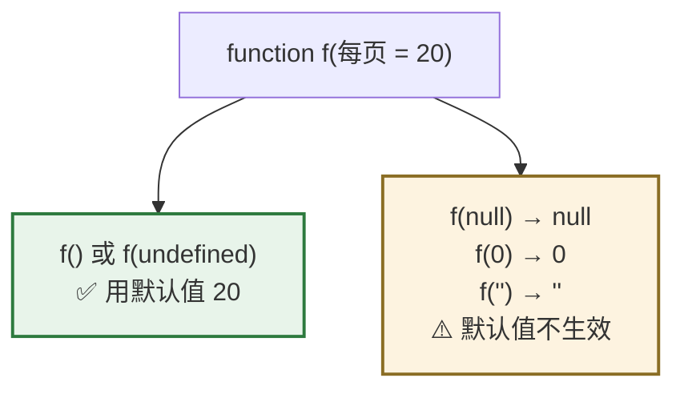
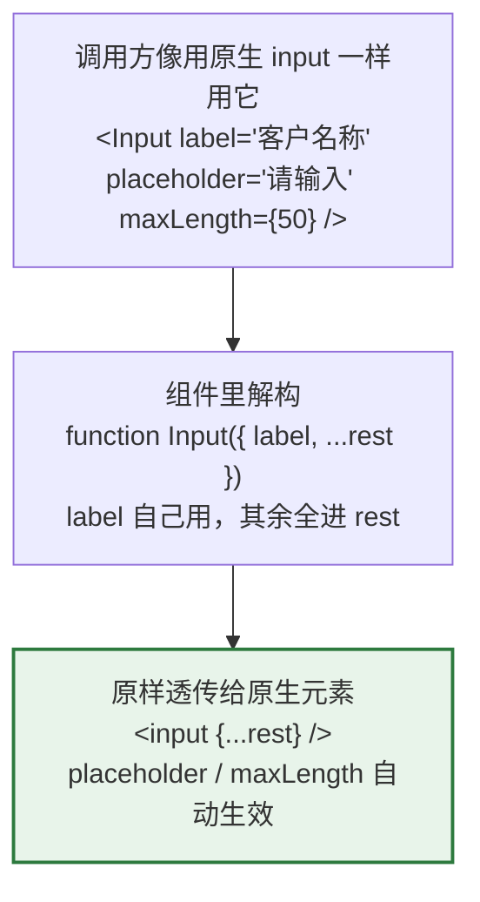
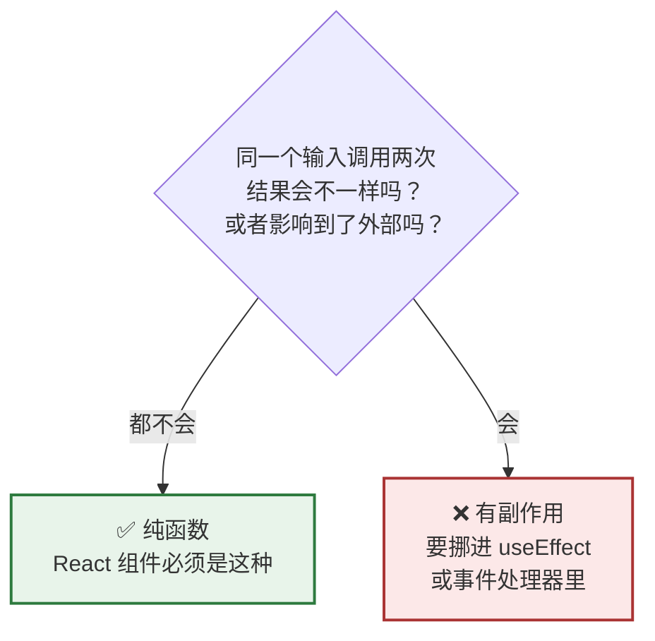

# Day 5 — 函数（上）

> **今天的定位**：函数是 React 的全部 —— 组件是函数、事件处理是函数、Hook 是函数。今天四个重点：
> 1. **箭头函数的三个坑**，尤其 `() => ({ id: 1 })` 返回对象必须加括号
> 2. **参数解构 + 默认值** —— React 组件接 props 的标准写法，必须写熟
> 3. **`{...rest}` 属性透传** —— 封装企业后台统一样式的 `Input` / `Button` 全靠它
> 4. **纯函数** —— React 组件的硬要求，不是建议
>
> **时间**：2 小时
> **前置**：`day2-modules` 项目，`money.js` 和 `str-utils.js` 留着
> **本文所有输出均经 Node.js 24 实测**

## 今天结束时你应该能做到

- [ ] 知道什么时候用 `function`、什么时候用箭头函数
- [ ] **能说出 `x => { x * 2 }` 为什么返回 `undefined`**
- [ ] **会写 `() => ({ id: 1 })`**，并解释为什么要加括号
- [ ] 熟练写 `function Card({ title, size = 'md' })`
- [ ] **知道默认参数只在 `undefined` 时生效，传 `null` 不会用默认值**
- [ ] 知道 `function f({ a = 1 } = {})` 末尾那个 `= {}` 是干什么的
- [ ] **会用 `{...rest}` 封装一个能透传原生属性的 `Input` 组件**
- [ ] 知道 `{...rest}` 放在前面还是后面会导致完全不同的结果
- [ ] **能说出 `onClick={删除()}` 和 `onClick={() => 删除()}` 的区别**
- [ ] 能判断一个函数纯不纯，知道 React 为什么强制要求纯

## 时间分配

| 时段 | 内容 | 时长 |
| --- | --- | --- |
| 1 | 三种定义方式与提升 | 15 分钟 |
| 2 | **箭头函数的三个坑** | 20 分钟 |
| 3 | **参数：默认值与解构** | 25 分钟 |
| 4 | **剩余参数与 `{...rest}` 透传** | 25 分钟 |
| 5 | 函数是一等公民 | 20 分钟 |
| 6 | **纯函数** | 15 分钟 |

---

# 第 1 节：三种定义方式与提升（15 分钟）

## 1.1 三种写法

```js
// ① 函数声明
function 加(a, b) {
  return a + b
}

// ② 函数表达式（赋值给变量）
const 减 = function (a, b) {
  return a - b
}

// ③ 箭头函数 ← React 里的默认选择
const 乘 = (a, b) => a * b
```

三者调用方式完全一样：`加(1, 2)`、`减(3, 1)`、`乘(2, 3)`。

## 1.2 唯一的实质差别：提升（hoisting）

新建 `fn.js`：

```js
// ✅ 函数声明会「提升」—— 可以在定义之前调用
console.log(声明版(1, 2))        // 3

function 声明版(a, b) {
  return a + b
}

// ❌ 箭头函数不会提升
console.log(箭头版(1, 2))        // 💥 ReferenceError: Cannot access '箭头版' before initialization

const 箭头版 = (a, b) => a + b
```

**原因**：`function` 声明在代码执行前就被整体「搬到」作用域顶部；而 `const 箭头版 = ...` 是普通的变量声明，受 Day 3 讲的 **TDZ** 约束。

> **实务上这个差别几乎无所谓** —— 正常人不会在定义前调用函数。但你会在报错信息里见到 `Cannot access 'xxx' before initialization`，这是它的一种成因（另一种是 Day 2 的循环依赖）。

## 1.3 该用哪个



**React 项目里的实际惯例：**

```jsx
// 组件用 function
export default function 申请单列表() {
  // 内部的一切用箭头函数
  const 处理提交 = () => { /* ... */ }
  const 格式化 = (x) => x.toFixed(2)

  return <div onClick={处理提交}>...</div>
}
```

**为什么组件用 `function`**：调用栈和 React DevTools 里显示的名字更清楚，出错时好定位。**函数表达式 `const f = function() {}` 基本不用**，箭头函数完全替代了它。

## 1.4 和 C# 的对照

| C# | JS |
| --- | --- |
| 方法（必须在类里） | 函数（可以是顶层，不需要类） |
| `Func<int, int, int>` | 就是普通函数 |
| lambda `(a, b) => a + b` | **箭头函数，语法几乎一样** |
| 方法重载 | ❌ **不存在**（见第 3.5 节） |
| `ref` / `out` 参数 | ❌ **不存在** |
| 命名参数 `f(b: 2)` | ❌ 不存在，用对象参数模拟 |
| 可选参数 `f(int a = 1)` | ✅ 默认参数，写法一样 |
| `params int[] args` | ✅ 剩余参数 `...args` |

> 好消息：箭头函数的语法和 C# lambda 几乎一致，你不需要重新学。要注意的是**下面三个坑**。

---

# 第 2 节：箭头函数的三个坑（20 分钟）★

## 2.1 坑一：有花括号就必须写 `return`



在 `fn.js` 里验证：

```js
const 隐式 = (x) => x * 2
const 显式 = (x) => { return x * 2 }
const 忘了 = (x) => { x * 2 }          // 💥 少了 return

console.log(隐式(5))      // 10
console.log(显式(5))      // 10
console.log(忘了(5))      // undefined   ← 静默返回 undefined，不报错
```

**规则**：

| 写法 | 含义 |
| --- | --- |
| `x => 表达式` | **隐式返回**这个表达式的值 |
| `x => { 语句 }` | 花括号是**函数体**，必须自己 `return` |

**危险在于它不报错**，只是静默给你 `undefined`。然后你在页面上看到一片空白，或者 `Cannot read properties of undefined`。

## 2.2 坑二：返回对象字面量必须加圆括号 ⚠️ 高频

```js
// ❌ 你以为在返回一个对象
const 建对象错 = (id) => { id: id }
console.log(建对象错(1))               // undefined

// ✅ 包一层圆括号
const 建对象对 = (id) => ({ id: id })
console.log(建对象对(1))               // { id: 1 }
```

**为什么**：JS 解析 `=>` 后面的 `{` 时，会把它当成**函数体的开始**，而不是对象字面量。加上圆括号 `({ ... })` 就明确告诉它「这是一个表达式，不是代码块」。

> 顺带说明：`{ id: id }` 被当成函数体后，`id:` 被解析成了一个**标签（label）**，所以不报错，只是什么都没返回。这就是它静默失败的原因。

### 这个坑在哪里出现

**在 `map` 里转换数据结构时，几乎每次都会遇到**（Day 8 的主战场）：

```js
const 明细 = [
  { 名称: '项目A', 单价分: 865, 数量: 3 },
  { 名称: '项目B', 单价分: 7, 数量: 100 },
]

// ❌ 忘了括号
const 错 = 明细.map((行) => { 名称: 行.名称, 小计: 行.单价分 * 行.数量 })
// 💥 这行连语法都过不了（多个「标签」不合法）

// ✅ 加括号
const 对 = 明细.map((行) => ({
  名称: 行.名称,
  小计: 行.单价分 * 行.数量,
}))
console.log(对)
// [ { 名称: '项目A', 小计: 2595 }, { 名称: '项目B', 小计: 700 } ]

// ✅ 或者用花括号函数体 + 显式 return（属性多时更好读）
const 也对 = 明细.map((行) => {
  return {
    名称: 行.名称,
    小计: 行.单价分 * 行.数量,
  }
})
```

**记法**：`=> (` 后面跟对象，`=> {` 后面跟语句。

## 2.3 坑三：单参数省略括号（风格问题，不是错误）

```js
const a = (x) => x * 2        // ✅ 带括号
const b = x => x * 2          // ✅ 也合法
const c = () => 42            // 无参数必须有空括号
const d = (x, y) => x + y     // 多参数必须有括号
```

**建议一律带括号**，三个理由：

1. 加类型标注时必须有括号（TS 阶段：`(x: number) => x * 2`）
2. 加第二个参数时不用回头补括号
3. Prettier 默认就会给你加上

## 2.4 `this`（今天只需知道一件事）

```js
// 箭头函数没有自己的 this，继承外层
// 普通函数的 this 取决于「怎么调用」，不是在哪定义
```

**React 函数组件里几乎不用 `this`**，所以今天不深究。你只需要知道：

> 这曾是 React class 组件的巨大痛点（满屏 `.bind(this)`），**箭头函数 + 函数组件已经彻底绕开了它**。看到老教程里的 `this.handleClick = this.handleClick.bind(this)`，直接跳过。

---

# 第 3 节：参数：默认值与解构（25 分钟）★

## 3.1 默认参数

```js
function 分页(页码, 每页 = 20) {
  return { 页码, 每页 }
}

console.log(分页(1))            // { 页码: 1, 每页: 20 }
console.log(分页(1, 50))        // { 页码: 1, 每页: 50 }
```

> `{ 页码, 每页 }` 是**属性简写**（Day 7 会讲），等价于 `{ 页码: 页码, 每页: 每页 }`。

**默认值可以是任意表达式，甚至引用前面的参数：**

```js
function 建单号(前缀, 序号, 完整 = 前缀 + String(序号).padStart(4, '0')) {
  return 完整
}
console.log(建单号('A', 7))     // 'A0007'
```

## 3.2 ⚠️ 默认值只在 `undefined` 时生效

**这一条和 Day 4 的 `??` 是同一套语义，非常重要：**



```js
function f(每页 = 20) {
  return 每页
}

console.log(f())               // 20     没传
console.log(f(undefined))      // 20     显式传 undefined 也算「没传」
console.log(f(null))           // null   ⚠️ 不是 20！
console.log(f(0))              // 0      ⚠️ 不是 20（这通常是对的）
console.log(f(''))             // ''     ⚠️ 不是 20
```

**记法：默认参数 = `??` 的行为，只认 `undefined`（外加「没传」）。**

> 但注意**它比 `??` 还严一点**：`??` 认 `null` 和 `undefined` 两个，默认参数**只认 `undefined`**。
>
> **实务影响**：后端返回的空值通常是 `null`。如果你写 `function f(每页 = 20)` 然后传了后端的 `null` 进去，**默认值不会生效**。这时要自己补：

```js
function f(每页) {
  const 实际每页 = 每页 ?? 20      // ✅ 同时兜住 null 和 undefined
}
```

## 3.3 参数解构 —— React 接 props 的标准写法

```js
// ❌ 啰嗦写法
function 卡片(props) {
  return `${props.标题} (${props.尺寸})`
}

// ✅ 参数解构 —— React 组件的标准写法
function 卡片({ 标题, 尺寸 = 'md' }) {
  return `${标题} (${尺寸})`
}

console.log(卡片({ 标题: '价格申请' }))              // '价格申请 (md)'
console.log(卡片({ 标题: '价格申请', 尺寸: 'lg' }))  // '价格申请 (lg)'
```

**在 React 里就是这样：**

```jsx
function 申请单卡片({ 单号, 金额分, 已审核 = false, 尺寸 = 'md' }) {
  return (
    <div className={`卡片 ${尺寸}`}>
      {单号} — {已审核 ? '已通过' : '待审核'}
    </div>
  )
}

// 调用方
<申请单卡片 单号="A001" 金额分={4165} />
```

**这个写法必须练到不用想。** 它有三个好处：

1. 一眼看清这个组件接受哪些属性（相当于 C# 的方法签名）
2. 默认值直接写在签名里
3. 函数体里直接用 `单号`，不用到处写 `props.单号`

## 3.4 ⚠️ 解构参数的空对象兜底 `= {}`

```js
function 分页1({ 页码 = 1, 每页 = 20 }) {
  return { 页码, 每页 }
}

console.log(分页1({ 页码: 2 }))     // ✅ { 页码: 2, 每页: 20 }
console.log(分页1())                // 💥 TypeError: Cannot destructure property '页码' of undefined
```

**因为不传参数时，JS 要对 `undefined` 做解构，而 `undefined` 上没有任何属性。**

修法是**在整个解构后面再加一个默认值 `= {}`**：

```js
function 分页2({ 页码 = 1, 每页 = 20 } = {}) {
  //                                ↑ 这个 = {} 是关键
  return { 页码, 每页 }
}

console.log(分页2())                // ✅ { 页码: 1, 每页: 20 }
console.log(分页2({ 页码: 2 }))     // ✅ { 页码: 2, 每页: 20 }
```

**读法**：「如果整个参数没传，就当成 `{}`；然后再从 `{}` 里解构，各字段用各自的默认值」。

> **React 组件不需要写 `= {}`** —— 因为 React 保证 props 一定是一个对象（哪怕是空对象）。但**你自己写的工具函数需要**，尤其是「所有参数都可选」的那种。

## 3.5 JS 没有方法重载

C# 里你可以这样：

```csharp
void 查询(int id) { }
void 查询(string 单号) { }
void 查询(int id, bool 含明细) { }
```

**JS 里后定义的会直接覆盖前面的**：

```js
function 查询(id) { return 'A' }
function 查询(单号) { return 'B' }
console.log(查询(1))            // 'B'   ← 第一个被覆盖了，无任何警告
```

### 替代方案：对象参数

```js
// ✅ 用一个对象参数，配合解构和默认值
function 查询({ id, 单号, 含明细 = false, 每页 = 20 } = {}) {
  if (id !== undefined) return `按 id 查 ${id}`
  if (单号 !== undefined) return `按单号查 ${单号}`
  return '查全部'
}

console.log(查询({ id: 1 }))                    // '按 id 查 1'
console.log(查询({ 单号: 'A001', 含明细: true })) // '按单号查 A001'
console.log(查询())                              // '查全部'
```

**这个模式同时解决了三件 C# 特性缺失的事：**

| C# 特性 | JS 的对象参数怎么替代 |
| --- | --- |
| 方法重载 | 一个函数 + 判断哪些字段有值 |
| 命名参数 `f(含明细: true)` | `f({ 含明细: true })` —— 天然就是命名的 |
| 可选参数顺序限制 | 对象的键无所谓顺序 |

**实务建议**：参数超过 **2 个**，或者有 **3 个以上可选参数**时，就改用对象参数。这也是为什么 React 的 props 是一个对象。

## 3.6 没有 `ref` / `out`

```js
// ❌ JS 没有 out 参数
function 尝试解析(文本, out 结果) { }        // 语法错误

// ✅ 返回一个对象
function 尝试解析(文本) {
  const 数值 = Number(文本)
  return { 成功: !Number.isNaN(数值), 值: 数值 }
}

const { 成功, 值 } = 尝试解析('42')
console.log(成功, 值)                        // true 42
```

**返回对象 + 解构接收**，这就是 JS 版的多返回值。

---

# 第 4 节：剩余参数与 `{...rest}` 透传（25 分钟）★ 重点

## 4.1 剩余参数 `...args`

```js
// 收集任意个数的参数成一个数组
function 合计(...各项) {
  return 各项.reduce((和, x) => 和 + x, 0)
}

console.log(合计(1, 2, 3))              // 6
console.log(合计(2595, 700, 870))       // 4165
console.log(合计())                      // 0
```

**对照 C#**：这就是 `params int[] args`，行为一致。

**两条规则：**

1. **必须是最后一个参数**：`function f(a, ...rest)` ✅ / `function f(...rest, a)` ❌ 语法错误
2. **收集到的是真正的数组**，可以直接用 `map` / `filter` / `reduce`

> ☆ 老代码里会看到 `arguments` 这个类数组对象。**自己别用** —— 它不是真数组，箭头函数里也没有它。用 `...rest` 替代。

## 4.2 剩余解构：`{ label, ...rest }`

**这是今天最重要的一个手法。**

```js
const 属性 = {
  label: '客户名称',
  placeholder: '请输入',
  maxLength: 50,
  disabled: true,
}

const { label, ...rest } = 属性

console.log(label)      // '客户名称'
console.log(rest)       // { placeholder: '请输入', maxLength: 50, disabled: true }
```

**含义**：「把 `label` 单独拿出来，其余的全部打包进 `rest`」。

## 4.3 属性透传：封装企业后台组件的核心手法



### 完整例子

```jsx
// ❌ 不透传：每加一个原生属性，都要改一次组件
function 输入框差({ label, placeholder, maxLength, disabled }) {
  return (
    <label className="表单项">
      <span>{label}</span>
      <input
        className="输入框"
        placeholder={placeholder}
        maxLength={maxLength}
        disabled={disabled}
      />
    </label>
  )
}
// 明天需要 type="number"？改组件。需要 onBlur？改组件。
// 原生 input 有几十个属性，你要转发到什么时候？
```

```jsx
// ✅ 透传：一次写好，永远不用改
function 输入框({ label, ...rest }) {
  return (
    <label className="表单项">
      <span>{label}</span>
      <input className="输入框" {...rest} />
    </label>
  )
}

// 调用方可以用 input 的任何原生属性，组件不用动
<输入框 label="客户名称" placeholder="请输入" maxLength={50} />
<输入框 label="数量" type="number" min={0} step={1} />
<输入框 label="备注" onBlur={校验} autoFocus readOnly />
```

**这就是做企业后台的必备手法。** 你要封一整套统一风格的 `输入框` / `下拉框` / `按钮` / `日期选择`，全靠它。否则每个组件都要手工转发几十个原生属性。

## 4.4 ⚠️ `{...rest}` 的位置决定谁覆盖谁

**这是个真实会踩的坑**：JSX 属性和对象展开一样，**后面的覆盖前面的**（Day 7 会正式讲）。

```jsx
// 情况 A：rest 在后 —— 调用方可以覆盖组件的默认设置
<input className="输入框" {...rest} />
// 调用方传 className="自定义" → 会覆盖掉 "输入框"，组件样式丢失

// 情况 B：rest 在前 —— 组件的设置一定生效，调用方覆盖不了
<input {...rest} className="输入框" />
// 调用方传的 className 被忽略
```

**两种都不完美。实务做法是合并而不是覆盖：**

```jsx
function 输入框({ label, className, ...rest }) {
  return (
    <label className="表单项">
      <span>{label}</span>
      {/* 把 className 单独拿出来，手工合并 */}
      <input className={`输入框 ${className ?? ''}`} {...rest} />
    </label>
  )
}
```

**注意这里用了 `?? ''`** —— 调用方没传 `className` 时它是 `undefined`，直接拼进模板字符串会变成字面的 `"undefined"`：

```js
const className = undefined
console.log(`输入框 ${className}`)          // '输入框 undefined'   💥
console.log(`输入框 ${className ?? ''}`)    // '输入框 '            ✅
```

> Day 4 的 `??` 在这里第一次派上实战用途。

**同样需要单独拿出来合并的属性**：`className`、`style`、`onChange`（你可能想在调用方的处理之外再做点事）。

## 4.5 一个必须记住的顺序规则

事件处理器也有覆盖问题：

```jsx
// ❌ rest 在后，调用方传的 onChange 会覆盖掉组件内部的校验逻辑
<input onChange={内部校验} {...rest} />

// ✅ 两个都要执行时，手工合并
function 输入框({ label, onChange, ...rest }) {
  const 处理变化 = (e) => {
    内部校验(e)
    onChange?.(e)        // ← Day 4 的 ?.() ：调用方没传就不调
  }
  return <input onChange={处理变化} {...rest} />
}
```

`onChange?.(e)` 这个写法在这里非常自然：**调用方传了就调，没传就跳过，不报错**。

## 4.6 类型写法在哪里学

上面全是 JS。等学到 TS 后，透传的类型写法是：

```ts
type 输入框属性 = { label: string } & React.ComponentProps<'input'>
```

**这在阶段 4 第 6 周学**（`ComponentProps` + `Omit`）。今天先把 JS 层面的手法练熟。

---

# 第 5 节：函数是一等公民（20 分钟）

## 5.1 函数可以像值一样传递

```js
// 赋值给变量
const f = (x) => x * 2

// 放进数组
const 操作 = [(x) => x + 1, (x) => x * 2]
console.log(操作[1](5))                  // 10

// 放进对象
const 工具 = { 翻倍: (x) => x * 2 }
console.log(工具.翻倍(5))                // 10

// 作为参数传给别的函数 ← 最常用
const 列表 = [1, 2, 3]
console.log(列表.map((x) => x * 2))      // [ 2, 4, 6 ]
```

**对照 C#**：这就是 `Func<>` / `Action<>` / 委托，只是 JS 里不需要声明类型，随手就传。

## 5.2 ⚠️ 传函数 vs 调用函数 —— React 最高频的错误

```js
const 删除 = () => console.log('删除了')

// 这是「函数本身」
console.log(typeof 删除)         // 'function'

// 这是「调用它得到的结果」
console.log(typeof 删除())       // 先打印「删除了」，然后是 'undefined'
```

**在 React 里这个区别是致命的：**

```jsx
// ✅ 传函数本身：点击时才执行
<button onClick={处理删除}>删除</button>

// ❌ 立刻调用：渲染时就执行了，onClick 拿到的是它的返回值 undefined
<button onClick={处理删除()}>删除</button>
```

**第二种的后果**：

- 页面一加载就执行了删除
- 如果它里面调了 `setState`，会触发重渲染 → 再次执行 → **无限循环**
- 点按钮反而没反应

### 需要传参数时怎么办

```jsx
// ❌ 想传 id，就写成了立刻调用
<button onClick={处理删除(申请单.id)}>删除</button>

// ✅ 用箭头函数包一层
<button onClick={() => 处理删除(申请单.id)}>删除</button>
```

**读法**：`() => 处理删除(id)` 是「一个新函数，它被调用时才去执行 `处理删除(id)`」。

**记法**：`onClick={` 后面只能跟**函数名**或**箭头函数**，绝不能跟带括号的调用。

## 5.3 高阶函数：返回函数的函数

```js
// 一个「单号生成器工厂」
const 创建生成器 = (前缀) => (序号) => 前缀 + String(序号).padStart(4, '0')

const 申请单号 = 创建生成器('SQ')
const 审核单号 = 创建生成器('SH')

console.log(申请单号(7))        // 'SQ0007'
console.log(申请单号(1234))     // 'SQ1234'
console.log(审核单号(7))        // 'SH0007'
```

**`创建生成器('SQ')` 返回的那个函数「记住」了 `前缀`** —— 这就是**闭包**，明天（Day 6）花整天讲。

### 在 React 里的用途：事件处理器工厂

```jsx
const 创建删除处理器 = (id) => () => 处理删除(id)

// 用法
<button onClick={创建删除处理器(申请单.id)}>删除</button>
```

效果和 `onClick={() => 处理删除(id)}` 一样。**行内箭头函数更常见、更好读**，工厂写法用于逻辑复杂时。

## 5.4 接收函数的函数

```js
// 自己写一个高阶函数
const 重试 = (次数, 操作) => {
  for (let i = 0; i < 次数; i++) {
    const 结果 = 操作(i)
    if (结果 !== null) return 结果
  }
  return null
}

console.log(重试(3, (i) => (i === 2 ? '第三次成功' : null)))    // '第三次成功'
```

**Day 8 学的数组方法全是高阶函数**：`map` / `filter` / `find` / `reduce` 都接收一个函数作为参数。今天先建立「函数可以当参数传」这个直觉。

## 5.5 ★ 立即执行与递归（了解即可）

```js
// 立即执行函数（IIFE）—— 模块时代基本不需要了
;(() => {
  console.log('定义完立刻执行')
})()

// 递归 —— 处理树形结构时会用到（比如部门树、菜单树）
const 统计节点数 = (节点) => {
  let 数量 = 1
  for (const 子 of 节点.子节点 ?? []) {
    数量 += 统计节点数(子)
  }
  return 数量
}

const 部门树 = {
  名称: '总院',
  子节点: [
    { 名称: '超声科', 子节点: [{ 名称: '一组' }, { 名称: '二组' }] },
    { 名称: '放射科' },
  ],
}
console.log(统计节点数(部门树))         // 5
```

**递归在企业后台有一个真实场景：渲染部门树、菜单树、组织架构。** 注意 `节点.子节点 ?? []` —— 又是 `??`，避免叶子节点没有 `子节点` 字段时崩掉。

---

# 第 6 节：纯函数（15 分钟）★ React 的硬要求

## 6.1 什么是纯函数

**两个条件：**

1. **同样的输入，永远得到同样的输出**
2. **不改变任何外部的东西**（没有副作用）



## 6.2 对照表

```js
// ===== ✅ 纯函数 =====
const 含税 = (分, 税率) => Math.round(分 * (1 + 税率))
const 分转元 = (分) => (分 / 100).toFixed(2)
const 筛选待审 = (列表) => 列表.filter((x) => x.状态 === '待审核')

// ===== ❌ 不纯：改了外部变量 =====
let 计数 = 0
const 不纯1 = () => { 计数++ }              // 改了外部的 计数

// ===== ❌ 不纯：改了参数（这个最隐蔽）=====
const 不纯2 = (列表) => {
  列表.sort()                                // 原地修改了调用方的数组！
  return 列表
}

// ===== ❌ 不纯：每次结果不同 =====
const 不纯3 = () => Math.random()
const 不纯4 = () => new Date()
const 不纯5 = () => Date.now()

// ===== ❌ 不纯：读写外部世界 =====
const 不纯6 = () => localStorage.getItem('token')
const 不纯7 = () => fetch('/api/x')
const 不纯8 = (x) => { console.log(x); return x }   // console.log 也是副作用
```

**注意 `不纯2`** —— 它看起来只是「排个序然后返回」，但 `sort()` 会**原地修改**调用方的数组（Day 3 讲的引用问题）。这是最容易写出来的不纯函数。

```js
// ✅ 纯版本：先复制再排
const 纯排序 = (列表) => [...列表].sort((a, b) => a - b)
```

## 6.3 React 为什么强制要求纯

**React 组件就是一个函数：输入 props，输出 UI。**

```jsx
function 申请单卡片({ 单号, 金额分 }) {
  return <div>{单号} — {分转元(金额分)}</div>
}
```

React 保留了**随时、多次、以任意顺序调用你的组件函数**的权利，用于：

- 并发渲染时中断和重启渲染
- 开发模式下的 `StrictMode` 检查
- 未来的优化（React Compiler）

**所以如果组件函数不纯，行为会变得不可预测。**

### 一个具体的例子

```jsx
// ❌ 不纯的组件
let 渲染次数 = 0
function 差组件({ 列表 }) {
  渲染次数++                          // 改外部变量
  列表.sort()                         // 改了 props！
  const 现在 = new Date()             // 每次结果不同
  return <div>{渲染次数} — {现在.toISOString()}</div>
}
```

三个问题各自的后果：

| 问题 | 后果 |
| --- | --- |
| 改外部 `渲染次数` | `StrictMode` 下渲染两次，计数翻倍，数字乱跳 |
| `列表.sort()` 改了 props | **修改了父组件的数据**，父组件莫名其妙地变了 |
| `new Date()` | 每次渲染结果不同，React 无法优化 |

## 6.4 ⚠️ `StrictMode` 会故意调用两次

Day 1 建的项目里，`main.tsx` 有这个：

```jsx
<StrictMode>
  <App />
</StrictMode>
```

**开发模式下，`StrictMode` 会故意把每个组件函数调用两次**，就是为了帮你发现不纯的代码。

**所以你会遇到这种困惑**：

> 「我在组件里写了 `console.log('渲染')`，为什么打印了两遍？」

**这不是 bug，是 React 在提醒你。** 如果两次调用结果一样（纯函数），你什么都不会察觉；如果不一样（不纯），问题就会暴露出来。

> 生产构建里不会调两次。**不要因为看到两遍日志就去删掉 `StrictMode`** —— 那等于关掉安全检查。

## 6.5 副作用该放哪

副作用是必需的（总要发请求、总要存 localStorage）。**只是不能放在组件函数体里**：

| 副作用 | 该放哪 |
| --- | --- |
| 发请求取数据 | `useEffect`，或（更好）TanStack Query |
| 响应用户点击 | 事件处理函数 `onClick={...}` |
| 写 localStorage | 事件处理函数或 `useEffect` |
| 订阅/定时器 | `useEffect` + 清理函数 |

**这些都在阶段 4 学。** 今天只要记住这条判断标准：

> **组件函数体里，只能有「根据 props 和 state 计算出 UI」的代码。** 其他任何东西都要挪走。

## 6.6 和 C# 的对照

C# 里没有任何机制强制方法纯净 —— 你的 `Page_Load` 里可以查数据库、写日志、改全局状态，全都合法。

**React 的这个要求对你是新约束。** 但它换来的是：组件可测试、可复用、可被框架自动优化。

> 从今天起养成一个习惯：写任何函数时问自己一句 **「这个函数调用两次会有区别吗？」**

---

# 今日验收清单

- [ ] `fn.js` 跑过了，看到函数声明能提前调用、箭头函数不能
- [ ] 知道 React 组件用 `function`、其余用箭头函数
- [ ] **亲手跑过 `(x) => { x * 2 }`，看到它返回 `undefined`**
- [ ] **会写 `(id) => ({ id })`**，能解释为什么要圆括号
- [ ] 在 `map` 里写过返回对象的箭头函数
- [ ] 会写 `function 卡片({ 标题, 尺寸 = 'md' })`
- [ ] **验证过 `f(null)` 不会用默认值，`f(undefined)` 会**
- [ ] 知道后端传来的 `null` 要用 `?? 默认值` 兜，不能靠默认参数
- [ ] **知道 `function f({ a = 1 } = {})` 末尾 `= {}` 的作用**，并见过不加时的 `Cannot destructure` 报错
- [ ] 知道 JS 没有方法重载，会用对象参数替代
- [ ] 会用 `...args` 收集不定参数
- [ ] **会写 `function 输入框({ label, ...rest })` + `<input {...rest} />`**
- [ ] **知道 `{...rest}` 放前面和放后面的区别**
- [ ] 知道 `className` 要单独拿出来合并，且要 `?? ''`
- [ ] **能说出 `onClick={删除()}` 会立刻执行、可能造成无限循环**
- [ ] 知道要传参数时写 `onClick={() => 删除(id)}`
- [ ] 写过一个返回函数的高阶函数
- [ ] **能判断一个函数纯不纯**，尤其认得出 `列表.sort()` 是不纯的
- [ ] 知道 `StrictMode` 故意调用两次，看到日志打印两遍不要慌

---

# 常见问题排查

## 函数返回 `undefined`，但我明明写了逻辑

箭头函数用了花括号却没写 `return`。第 2.1 节。

## `(x) => { a: 1 }` 什么都没返回

返回对象要写 `(x) => ({ a: 1 })`。第 2.2 节。

## `Cannot destructure property 'xxx' of undefined`

解构参数时没传参，且没写 `= {}` 兜底。第 3.4 节。

## 传了 `null`，默认参数没生效

默认参数只认 `undefined`。用 `参数 ?? 默认值`。第 3.2 节。

## 页面一加载就执行了删除 / 无限循环

`onClick={处理删除()}` 写成了立刻调用。改成 `onClick={处理删除}` 或 `onClick={() => 处理删除(id)}`。第 5.2 节。

## 组件里的 `className` 显示成 `"输入框 undefined"`

模板字符串里拼了 `undefined`。用 `${className ?? ''}`。第 4.4 节。

## 我给组件传了 `className`，但样式没生效

`{...rest}` 的位置问题，或者 `className` 被覆盖了。要单独解构出来手工合并。第 4.4 节。

## `console.log` 在组件里打印了两遍

`StrictMode` 在开发模式下故意调用两次，用来帮你发现不纯的代码。**这是正常的，不要删 `StrictMode`。** 第 6.4 节。

## 父组件的数据莫名其妙变了

某个子组件修改了 props（比如对 props 里的数组调了 `sort()` / `push()`）。第 6.2 节。

## 两个同名函数，第一个不起作用了

JS 没有重载，后定义的覆盖前面的。第 3.5 节。

---

# 今天不需要理解的东西

| 你会看到 | 什么时候学 |
| --- | --- |
| 闭包到底怎么工作 | **明天 Day 6，整天** |
| `map` / `filter` / `reduce` 的细节 | Day 8 |
| `{ 页码, 每页 }` 属性简写、对象展开的完整规则 | Day 7 |
| `useEffect` 怎么用 | 阶段 4 第 2 周 |
| `React.ComponentProps<'input'>` 类型写法 | 阶段 4 第 6 周 |
| `this` 的完整绑定规则 | Day 6 简单提一下，之后基本不用 |
| 柯里化、函数组合等函数式概念 | 用不到 |

---

# 作业（25 分钟）

## 作业 1：写四个函数

新建 `fn-utils.js`：

```js
/**
 * 单号生成器工厂。
 * 创建生成器('SQ') 返回一个函数，该函数接收序号返回完整单号
 * 用法：创建生成器('SQ')(7) → 'SQ0007'
 */
export function 创建生成器(前缀) {
  // TODO
}

/**
 * 分页参数，全部可选。
 * 建分页() → { 页码: 1, 每页: 20, 排序: 'id' }
 * 建分页({ 每页: 50 }) → { 页码: 1, 每页: 50, 排序: 'id' }
 */
export function 建分页(参数) {
  // TODO：注意「完全不传参数」也要能工作
}

/**
 * 合并任意多个配置对象，后面的覆盖前面的。
 * 合并配置({a:1}, {b:2}, {a:9}) → { a: 9, b: 2 }
 */
export function 合并配置(...各配置) {
  // TODO：提示 Object.assign({}, ...各配置)
}

/**
 * 安全兜底：值为 null / undefined 时用默认值，0 和空串要保留。
 * 兜底(0, 20) → 0
 * 兜底(null, 20) → 20
 */
export function 兜底(值, 默认值) {
  // TODO
}
```

自测用例：

| 调用 | 期望 |
| --- | --- |
| `创建生成器('SQ')(7)` | `'SQ0007'` |
| `建分页()` | `{ 页码: 1, 每页: 20, 排序: 'id' }` |
| `建分页({ 每页: 50 })` | `{ 页码: 1, 每页: 50, 排序: 'id' }` |
| `合并配置({a:1}, {b:2}, {a:9})` | `{ a: 9, b: 2 }` |
| `兜底(0, 20)` | `0` |
| `兜底(null, 20)` | `20` |
| `兜底('', '默认')` | `''` |

<details>
<summary>提示（卡住了再看）</summary>

- 生成器：`(前缀) => (序号) => 前缀 + String(序号).padStart(4, '0')`
- 分页：`function 建分页({ 页码 = 1, 每页 = 20, 排序 = 'id' } = {})` —— 注意末尾的 `= {}`
- 合并：`Object.assign({}, ...各配置)`
- 兜底：`值 ?? 默认值`

</details>

## 作业 2：找出并修复 6 个问题

```jsx
function 申请单行({ 申请单, onDelete, className }) {
  const 格式化 = (分) => { (分 / 100).toFixed(2) }

  const 明细摘要 = 申请单.明细.map((行) => { 名称: 行.名称, 小计: 行.单价分 * 行.数量 })

  return (
    <tr className={`表格行 ${className}`}>
      <td>{申请单.单号}</td>
      <td>{格式化(申请单.金额分)}</td>
      <td>{明细摘要.length} 项</td>
      <td>
        <button onClick={onDelete(申请单.id)}>删除</button>
      </td>
    </tr>
  )
}

function 明细表({ 数据 }) {
  数据.sort((a, b) => a.单价分 - b.单价分)
  return <div>{数据.length} 条</div>
}
```

<details>
<summary>点开看答案</summary>

| # | 问题 | 修复 |
| --- | --- | --- |
| 1 | `格式化` 有花括号却没 `return` → 永远返回 `undefined` | `(分) => (分 / 100).toFixed(2)` |
| 2 | `map` 的箭头函数返回对象忘了圆括号 → 语法错误 | `(行) => ({ 名称: ..., 小计: ... })` |
| 3 | `${className}` 未传时拼出 `"表格行 undefined"` | `${className ?? ''}` |
| 4 | `onClick={onDelete(申请单.id)}` **渲染时就执行删除** | `onClick={() => onDelete(申请单.id)}` |
| 5 | `申请单.明细` 可能不存在 → 崩 | `申请单.明细?.map(...) ?? []` |
| 6 | `明细表` 里 `数据.sort()` **原地修改了 props**，不纯 | `[...数据].sort(...)`，或者根本不需要在这里排序 |

**参考修复版：**

```jsx
function 申请单行({ 申请单, onDelete, className }) {
  const 格式化 = (分) => (分 / 100).toFixed(2)

  const 明细摘要 = 申请单.明细?.map((行) => ({
    名称: 行.名称,
    小计: 行.单价分 * 行.数量,
  })) ?? []

  return (
    <tr className={`表格行 ${className ?? ''}`}>
      <td>{申请单.单号}</td>
      <td>{格式化(申请单.金额分)}</td>
      <td>{明细摘要.length} 项</td>
      <td>
        <button onClick={() => onDelete(申请单.id)}>删除</button>
      </td>
    </tr>
  )
}

function 明细表({ 数据 }) {
  const 已排序 = [...数据].sort((a, b) => a.单价分 - b.单价分)
  return <div>{已排序.length} 条</div>
}
```

**第 4 个和第 6 个是最严重的** —— 前者会在页面加载时删数据，后者会悄悄改掉父组件的数组。两个都不会报错。

</details>

## 作业 3：预测输出（先写答案，再运行）

```js
const a = (x) => x * 2
const b = (x) => { x * 2 }
const c = (x) => ({ 值: x })
const d = (x) => { 值: x }

console.log('①', a(5))
console.log('②', b(5))
console.log('③', c(5))
console.log('④', d(5))

function f(每页 = 20) { return 每页 }
console.log('⑤', f())
console.log('⑥', f(undefined))
console.log('⑦', f(null))
console.log('⑧', f(0))

const 合 = (...项) => 项.length
console.log('⑨', 合(1, 2, 3))
console.log('⑩', 合())

const 对象 = { a: 1, b: 2, c: 3 }
const { a: 甲, ...其余 } = 对象
console.log('⑪', 甲, JSON.stringify(其余))

const 前 = { x: 1, y: 2 }
console.log('⑫', JSON.stringify({ ...前, y: 99 }))
console.log('⑬', JSON.stringify({ y: 99, ...前 }))
```

<details>
<summary>点开看答案</summary>

```
① 10                    隐式返回
② undefined             有花括号没 return
③ { 值: 5 }             加了圆括号，返回对象
④ undefined             没加括号，{ 值: x } 被当函数体
⑤ 20                    没传，用默认值
⑥ 20                    显式传 undefined 也算没传
⑦ null                  ⚠️ 默认参数只认 undefined
⑧ 0                     0 是有效值，不用默认值
⑨ 3                     收集了 3 个参数
⑩ 0                     没传参数，rest 是空数组
⑪ 1 {"b":2,"c":3}       a 单独取出，其余进 其余
⑫ {"x":1,"y":99}        后面的 y:99 覆盖了前面
⑬ {"y":2,"x":1}         ⚠️ ...前 在后面，前.y=2 覆盖了 y:99
```

**⑫ 和 ⑬ 是同一个坑的两面** —— 这就是第 4.4 节讲的 `{...rest}` 位置问题。展开运算符**永远是后面覆盖前面**。

**⑦ 最容易错** —— 很多人以为 `null` 也会触发默认值。

</details>

## 作业 4：一句话回答（写在笔记里）

1. `<button onClick={保存()}>` 有什么问题？会发生什么？
2. 我封装了 `<输入框>` 组件，调用方传了 `type="number"`，但没生效。可能是什么原因？
3. 后端返回 `{ 每页: null }`，我写 `function f({ 每页 = 20 })`。`每页` 会是多少？
4. 这个函数纯吗：`const 排序 = (列表) => 列表.sort()`？为什么？

<details>
<summary>点开看参考答案</summary>

1. **它在渲染时就立刻执行了 `保存()`**，而 `onClick` 拿到的是 `保存()` 的返回值（通常是 `undefined`）。后果：页面一加载就保存一次；如果 `保存` 里调了 `setState`，会触发重渲染 → 再次执行 → **无限循环**；而且点按钮反而没反应。正确写法：`onClick={保存}`，需要传参时 `onClick={() => 保存(id)}`。

2. **两种可能**：① 组件里没有写 `{...rest}` 透传，只手工转发了固定的几个属性；② 写了 `{...rest}` 但位置不对，被组件自己的属性覆盖了，或者 `type` 被单独解构出来后没用上。

3. **`每页` 会是 `null`，不是 `20`。** 默认参数**只在值为 `undefined` 时生效**，`null` 是一个「有值」的状态。要兜住 `null` 得自己写 `const 实际 = 每页 ?? 20`。

4. **不纯。** `sort()` 会**原地修改**传进来的数组 —— 也就是修改了调用方的数据。在 React 里如果 `列表` 来自 props，这等于偷偷改了父组件的 state。纯版本：`(列表) => [...列表].sort()`。

</details>

---

# 明天预告：Day 6 — 闭包（整天只学一个概念）

明天**整整 2 小时只学「闭包」一件事**，因为它是 React Hooks 的全部地基。

今天第 5.3 节那个 `创建生成器('SQ')` 返回的函数「记住了前缀」，就是闭包。明天要讲清：

1. **闭包是什么** —— 手写计数器工厂、防抖函数
2. **和 C# 的关键差别** —— C# 闭包捕获的是**变量**；React 里每次渲染产生**全新一套变量**，闭包捕获的是**「那一次渲染的快照」**。**你已有的 C# 直觉在这里会主动帮倒忙**
3. **stale closure（过期闭包）** —— `useEffect` / `setTimeout` 里读到旧值，React 新手第二号 bug

Day 3 那个 `var` 循环打印三个 `3` 的例子，明天会用闭包彻底解释清楚。

`fn-utils.js` 明天要用，别删。

---

## 参考来源

- [MDN：箭头函数](https://developer.mozilla.org/zh-CN/docs/Web/JavaScript/Reference/Functions/Arrow_functions)
- [MDN：默认参数](https://developer.mozilla.org/zh-CN/docs/Web/JavaScript/Reference/Functions/Default_parameters)
- [MDN：剩余参数](https://developer.mozilla.org/zh-CN/docs/Web/JavaScript/Reference/Functions/rest_parameters)
- [React 官方文档：保持组件纯粹](https://react.dev/learn/keeping-components-pure)

> 上述来源的内容已经过改写与归纳，以符合许可要求。
