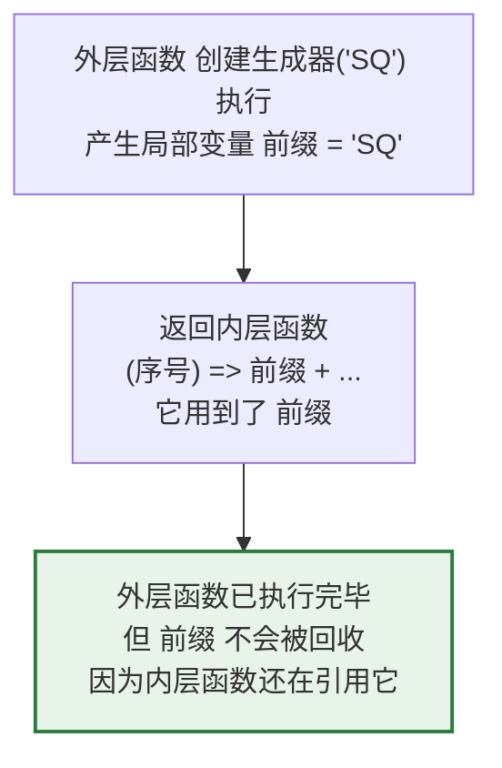
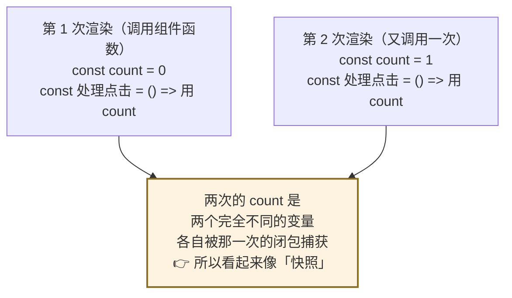
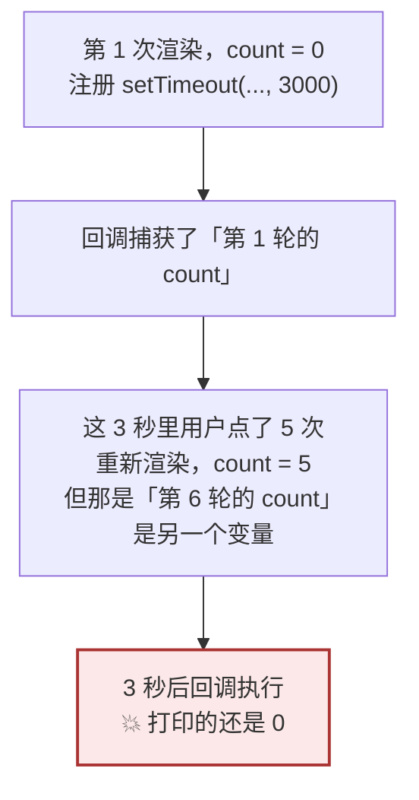
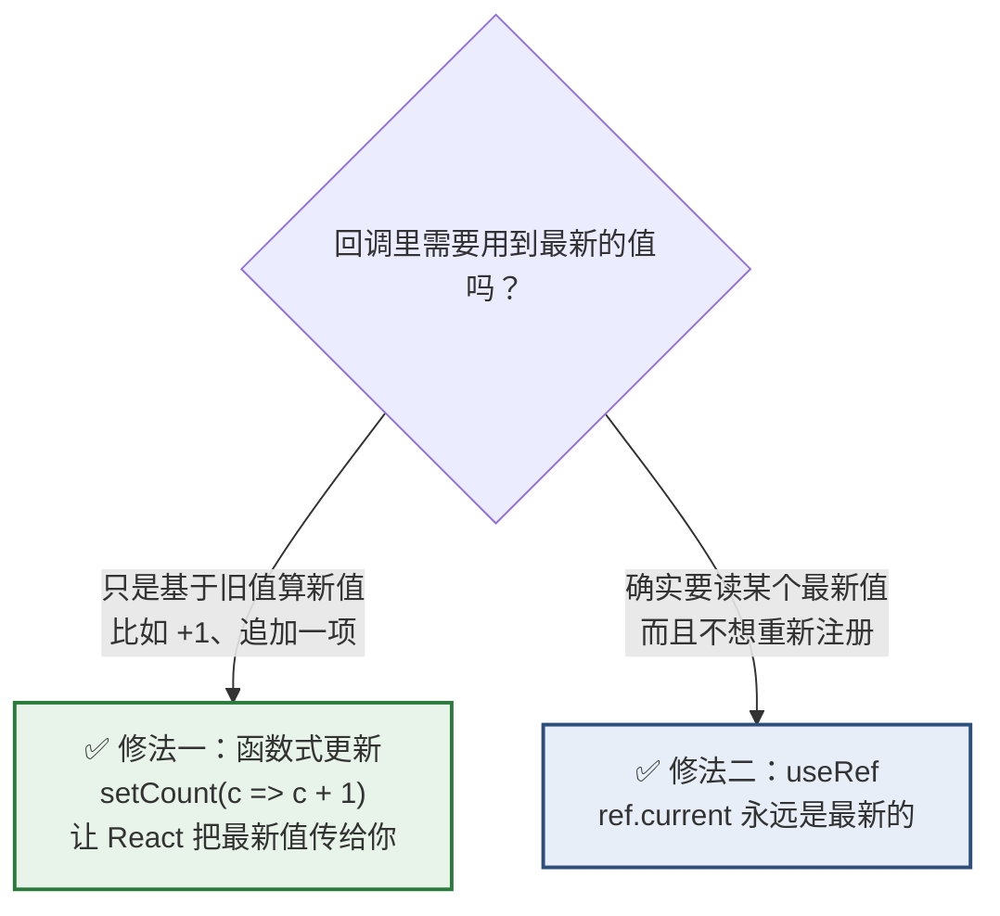

# Day 6 — 函数（下）：闭包

> **今天整整 2 小时只学一个概念。**
>
> 为什么值得花一整天：**闭包是 React Hooks 的全部地基**。`useState` 为什么能记住值、`useEffect` 为什么会读到旧数据、为什么要写 `setCount(c => c + 1)` 而不是 `setCount(count + 1)` —— 全部由闭包解释。
>
> **而且你已有的 C# 直觉在这里会主动帮倒忙。** 今天第 4 节专门处理这件事。
>
> **时间**：2 小时
> **前置**：`day2-modules` 项目，`fn-utils.js` 留着
> **本文所有输出均经 Node.js 24 实测**

## 今天结束时你应该能做到

- [ ] 用一句话说出闭包是什么
- [ ] 手写计数器工厂、防抖函数，不看资料
- [ ] **能解释 Day 3 那个 `var` 循环为什么打印三个 `3`**，`let` 为什么打印 `0 1 2`
- [ ] **能说出「C# 闭包捕获变量」和「React 每次渲染新建一套变量」的区别**
- [ ] 能预测 stale closure 的输出，并说出三种修法
- [ ] 知道为什么 React 推荐 `setCount(c => c + 1)`
- [ ] 知道闭包可能造成内存泄漏，以及 React 里最常见的泄漏来源

## 时间分配

| 时段 | 内容 | 时长 |
| --- | --- | --- |
| 1 | 闭包是什么 | 15 分钟 |
| 2 | 三个经典闭包（手写） | 30 分钟 |
| 3 | 闭包与循环：解开 Day 3 的谜题 | 20 分钟 |
| 4 | **C# 与 React 的关键差别** | 25 分钟 |
| 5 | **stale closure 与三种修法** | 25 分钟 |
| 6 | `this` / 内存 / 杂项 | 5 分钟 |

---

# 第 1 节：闭包是什么（15 分钟）

## 1.1 从昨天那个生成器说起

Day 5 第 5.3 节写过这个：

```js
const 创建生成器 = (前缀) => (序号) => 前缀 + String(序号).padStart(4, '0')

const 申请单号 = 创建生成器('SQ')
console.log(申请单号(7))        // 'SQ0007'
console.log(申请单号(88))       // 'SQ0088'
```

**注意一件怪事**：`创建生成器('SQ')` 这次调用**早就执行完了**，它的局部变量 `前缀` 按理说应该被回收了。

**但 `申请单号(7)` 还能读到 `前缀`。**

这就是闭包。

## 1.2 定义

> **闭包 = 一个函数 + 它被创建时所在的那个作用域。**
>
> 只要这个函数还活着，它用到的那些外层变量就不会被回收。



## 1.3 你已经天天在用闭包了

```js
const 税率 = 0.13

// 这个箭头函数用到了外层的 税率 —— 它就是一个闭包
const 含税 = (分) => Math.round(分 * (1 + 税率))
```

**只要函数里用到了「不是自己参数、也不是自己内部声明」的变量，它就是闭包。**

所以：

- 你昨天写的每个用到外层变量的箭头函数，都是闭包
- React 里每个事件处理函数，都是闭包（因为它们要用到 `count`、`props` 这些）
- **闭包不是什么高级技巧，它是 JS 的默认行为**

## 1.4 对照 C#

C# 里完全一样：

```csharp
Func<int, string> 创建生成器(string 前缀) {
    return 序号 => 前缀 + 序号.ToString("D4");   // 捕获了 前缀
}
```

**C# 的 lambda 捕获局部变量，和 JS 闭包是同一件事。** 你已有的直觉在这一层是对的。

**差别在第 4 节，不在这里。** 先把基础打牢。

---

# 第 2 节：三个经典闭包（30 分钟）

新建 `closure.js`，三个都手敲一遍。

## 2.1 计数器工厂

```js
function 创建计数器(起始 = 0) {
  let 当前 = 起始              // ← 这个变量被下面的函数「圈住」了

  return {
    加一: () => ++当前,
    减一: () => --当前,
    读取: () => 当前,
    重置: () => { 当前 = 起始 },
  }
}

const 计数器A = 创建计数器()
const 计数器B = 创建计数器(100)

console.log(计数器A.加一())      // 1
console.log(计数器A.加一())      // 2
console.log(计数器A.读取())      // 2

console.log(计数器B.加一())      // 101
console.log(计数器A.读取())      // 2      ← A 和 B 互不干扰
```

**两个关键点：**

1. **`当前` 是真正私有的** —— 外面拿不到它，只能通过那四个方法操作
2. **每次调用 `创建计数器()` 都产生一套全新的 `当前`** —— A 和 B 是两个独立的闭包

> 第 2 点在第 4 节会变成理解 React 的钥匙，先记住它。

### 验证私有性

```js
console.log(计数器A.当前)        // undefined  ← 拿不到
console.log(Object.keys(计数器A)) // [ '加一', '减一', '读取', '重置' ]
```

**对照 C#**：这相当于一个只暴露方法、字段全 `private` 的类。区别是不需要写 `class`。

## 2.2 私有状态：模块模式

```js
const 单号服务 = (() => {
  // 这两个变量对外完全不可见
  let 序号 = 0
  const 前缀 = 'SQ'

  const 补零 = (n) => String(n).padStart(4, '0')     // 私有辅助函数

  return {
    下一个: () => 前缀 + 补零(++序号),
    已生成数: () => 序号,
  }
})()

console.log(单号服务.下一个())      // 'SQ0001'
console.log(单号服务.下一个())      // 'SQ0002'
console.log(单号服务.已生成数())    // 2
console.log(单号服务.序号)          // undefined
```

外面那层 `(() => { ... })()` 是**立即执行函数**（Day 5 提过）—— 定义完马上调用，只为了创造一个私有作用域。

### ⚠️ 但这个模式现在基本不用了

**因为 Day 2 学的 ESM 模块已经天然提供了私有性：**

```js
// 单号服务.js —— 更现代、更清楚的写法
let 序号 = 0
const 前缀 = 'SQ'
const 补零 = (n) => String(n).padStart(4, '0')      // 没 export，外部拿不到

export const 下一个 = () => 前缀 + 补零(++序号)
export const 已生成数 = () => 序号
```

> **为什么还要教你模块模式？** 因为你会在 2015 年之前的老代码里大量见到 `(function(){ ... })()` 这个形状。**认得出来就行，自己写用 ESM。**

## 2.3 防抖（debounce）—— 最实用的一个

**场景**：企业后台的搜索框。用户输入「价格申请」四个字，如果每按一个键就发一次请求，会发 4 次。防抖让它**只在用户停下来之后**发一次。

```js
function 防抖(函数, 延迟 = 300) {
  let 定时器 = null                 // ← 被闭包圈住，跨多次调用保持

  return (...参数) => {
    clearTimeout(定时器)            // 每次新调用，先取消上一次的计划
    定时器 = setTimeout(() => 函数(...参数), 延迟)
  }
}
```

**核心就是那个 `定时器`**：它必须在多次调用之间**保持**，所以不能声明在返回的函数里面 —— 必须在外层，靠闭包留住。

### 动手验证

```js
const 搜索 = (关键词) => console.log('发请求搜索：', 关键词)
const 防抖搜索 = 防抖(搜索, 300)

// 模拟用户快速输入
防抖搜索('价')
防抖搜索('价格')
防抖搜索('价格申')
防抖搜索('价格申请')

// 300ms 后只会打印一次：发请求搜索： 价格申请
```

```bash
node closure.js
```

**只输出一次，而且是最后那个完整的关键词。** 前三次都被 `clearTimeout` 取消了。

### 顺带一提：节流（throttle）

| | 防抖 debounce | 节流 throttle |
| --- | --- | --- |
| 行为 | **停下来才执行**，中途一直取消 | **固定频率执行**，比如最多每 300ms 一次 |
| 场景 | 搜索框输入、表单校验、窗口缩放 | 滚动加载、按钮防连点 |

**实务上直接用现成的**：`lodash-es` 的 `debounce` / `throttle`，或者 React 生态里的 `useDebounce` Hook。**自己写一遍是为了理解闭包，不是为了造轮子。**

---

# 第 3 节：闭包与循环 —— 解开 Day 3 的谜题（20 分钟）

Day 3 第 1.3 节留了个悬案：

```js
for (var i = 0; i < 3; i++) {
  setTimeout(() => console.log(i), 0)
}
// 输出：3 3 3

for (let j = 0; j < 3; j++) {
  setTimeout(() => console.log(j), 0)
}
// 输出：0 1 2
```

**现在用闭包彻底讲通。**

## 3.1 `var` 版本：三个闭包共享同一个变量

`var i` 是**函数级作用域** —— 整个循环只有**一个** `i`。

```js
// 等价于这样（把 var 提到外面）
var i
for (i = 0; i < 3; i++) {
  setTimeout(() => console.log(i), 0)    // 三个回调都指向同一个 i
}
```

执行顺序（用 Day 2 学的事件循环）：

| 步骤 | 发生了什么 | 此时 `i` |
| --- | --- | --- |
| 1 | 循环三次，注册三个 `setTimeout` | 0 → 1 → 2 → **3** |
| 2 | 同步代码结束，循环已完成 | **3** |
| 3 | 事件循环取出第 1 个回调，读 `i` | **3** |
| 4 | 第 2 个回调，读同一个 `i` | **3** |
| 5 | 第 3 个回调，读同一个 `i` | **3** |

**三个闭包捕获的是同一个变量，而它最终的值是 `3`。**

## 3.2 `let` 版本：每次迭代一个新变量

**`for (let j = ...)` 有个特殊规则：每次迭代都创建一个全新的 `j`。**

```js
// 概念上等价于（实际由 JS 引擎完成）
{ let j = 0; setTimeout(() => console.log(j), 0) }   // 第 1 个 j
{ let j = 1; setTimeout(() => console.log(j), 0) }   // 第 2 个 j（不同变量）
{ let j = 2; setTimeout(() => console.log(j), 0) }   // 第 3 个 j
```

**三个闭包各自捕获了一个不同的变量**，所以输出 `0 1 2`。

## 3.3 亲手验证「同一个 vs 不同个」

在 `closure.js` 里追加：

```js
console.log('--- var：收集三个闭包 ---')
const var版 = []
for (var a = 0; a < 3; a++) {
  var版.push(() => a)
}
console.log(var版.map((f) => f()))       // [ 3, 3, 3 ]

console.log('--- let：收集三个闭包 ---')
const let版 = []
for (let b = 0; b < 3; b++) {
  let版.push(() => b)
}
console.log(let版.map((f) => f()))       // [ 0, 1, 2 ]
```

**这段代码没有 `setTimeout`，纯同步。** 说明这个差别和异步无关，**纯粹是「几个变量」的问题**。

## 3.4 这条知识的实际价值

在 jQuery 时代，「循环里绑事件，结果全都拿到最后一个值」是最著名的坑，无数人栽在这里。

**现在只要一律用 `let` / `const`，这个坑自动消失。**

> 但**理解它很重要** —— 因为它是理解第 4 节和第 5 节（React 的 stale closure）的前提。

---

# 第 4 节：C# 与 React 的关键差别（25 分钟）★ 核心

> **这一节是今天的重点。** 网上很多中文教程会说「JS 闭包捕获的是值的快照」—— **这是错的**，而且这个错误理解会让你后面完全搞不懂 React。

## 4.1 先破除一个误解：闭包捕获的是变量，不是快照

```js
let 计数 = 0
const 读取 = () => 计数         // 闭包捕获了 计数 这个变量

计数 = 5                        // 后来改了

console.log(读取())             // 5   ← 看到的是最新值，不是创建时的 0
```

**闭包捕获的是「变量本身」，不是「当时的值」。** 变量后来变了，闭包看到的也变。

**C# 完全一样：**

```csharp
int 计数 = 0;
Func<int> 读取 = () => 计数;
计数 = 5;
Console.WriteLine(读取());       // 5   ← 同样看到最新值
```

**所以：闭包的语义，C# 和 JS 是一致的。** 你的直觉没错。

## 4.2 那 React 里为什么感觉像「快照」

**因为差别不在闭包，在 React 的执行模型。**

> **React 每次渲染，都会把整个组件函数从头到尾重新执行一遍。**
>
> 于是每次渲染都产生一套**全新的局部变量**。



**关键区分：**

| 说法 | 对不对 |
| --- | --- |
| 「JS 闭包捕获值的快照」 | ❌ **错**。闭包捕获变量，能看到最新值 |
| 「React 每次渲染产生新变量，每个闭包捕获自己那轮的变量」 | ✅ **对**。效果看起来像快照，机制完全不同 |

**为什么这个区分重要**：如果你以为「闭包捕获快照」，就无法解释第 3.1 节 `var` 版本为什么打印 `3`（那里闭包明明看到了最新值）。**两个现象必须用同一套规则解释，那套规则就是「捕获变量」。**

## 4.3 用纯 JS 模拟 React 的渲染

**React 我们还没学，但可以完全用 JS 模拟它的模型。**

在 `closure.js` 里追加：

```js
console.log('--- 模拟 React 渲染 ---')

// 把「一次渲染」建模成「调用一次组件函数」
function 模拟组件(count) {
  // 每次调用，这里都产生一个全新的 处理点击
  const 处理点击 = () => console.log(`我这一轮看到的 count = ${count}`)
  return 处理点击
}

// React 渲染了三次，count 分别是 0、1、2
const 第一轮的处理点击 = 模拟组件(0)
const 第二轮的处理点击 = 模拟组件(1)
const 第三轮的处理点击 = 模拟组件(2)

第一轮的处理点击()      // 我这一轮看到的 count = 0
第二轮的处理点击()      // 我这一轮看到的 count = 1
第三轮的处理点击()      // 我这一轮看到的 count = 2
```

**三个 `处理点击` 是三个不同的函数，各自捕获了三个不同的 `count`。**

**第一轮的那个函数，永远只能看到 `0`** —— 不是因为它「拍了快照」，而是因为**它捕获的那个 `count` 变量，值就是 0，而且再也不会被改**（React 不会回头去改旧一轮的变量）。

## 4.4 对照真实的 React 代码

```jsx
function 计数器() {
  const [count, setCount] = useState(0)      // 每次渲染，这是一个新的 const

  const 处理点击 = () => {
    console.log('点击时我看到的 count =', count)     // 捕获这一轮的 count
    setCount(count + 1)
  }

  return <button onClick={处理点击}>{count}</button>
}
```

每次渲染发生的事，和上面的 `模拟组件` 一模一样：

| 渲染轮次 | 这一轮的 `count` | 这一轮的 `处理点击` 能看到 |
| --- | --- | --- |
| 第 1 次 | `0` | 永远是 `0` |
| 第 2 次 | `1` | 永远是 `1` |
| 第 3 次 | `2` | 永远是 `2` |

**这个模型有个正式的名字叫「渲染快照」（render snapshot）。** 它不是缺陷，而是 React 的核心设计：**每一次渲染都是一个独立、不变的世界。** 这保证了 UI 的确定性。

## 4.5 一个立刻能用上的推论

**为什么连续调用两次 `setCount(count + 1)` 只加了 1：**

```jsx
const 处理点击 = () => {
  setCount(count + 1)      // count 是 0 → 请求把 count 设成 1
  setCount(count + 1)      // count 还是 0（同一轮！）→ 又请求设成 1
}
// 结果只加了 1，不是 2
```

**因为这两行在同一轮渲染里，`count` 是同一个变量、同一个值 `0`。**

用 JS 验证这个逻辑：

```js
const count = 0                     // 模拟这一轮的 count
console.log(count + 1)              // 1
console.log(count + 1)              // 1   ← 两次都是 1，不是 1 和 2
```

**正确写法（函数式更新）：**

```jsx
setCount((c) => c + 1)      // 不读闭包里的 count，让 React 把最新值传进来
setCount((c) => c + 1)      // 这次真的加了 2
```

> **这就是 React 官方推荐 `setCount(c => c + 1)` 的全部原因。** 第 5 节会展开。

---

# 第 5 节：stale closure 与三种修法（25 分钟）★

## 5.1 什么是 stale closure（过期闭包）

**当一个闭包在「它那一轮渲染」结束很久之后才执行，它读到的就是过期的值。**

典型场景：`setTimeout`、`setInterval`、`useEffect` 里注册的回调、网络请求的回调。



## 5.2 用纯 JS 复现

在 `closure.js` 里追加：

```js
console.log('--- 模拟 stale closure ---')

function 模拟组件2(count) {
  const 延迟提示 = () => {
    setTimeout(() => {
      console.log(`定时器里的 count = ${count}   ← 这就是过期值`)
    }, 100)
  }
  return 延迟提示
}

// 第 1 轮渲染，count 是 0，注册了定时器
const 第一轮 = 模拟组件2(0)
第一轮()

// 之后"重新渲染"了很多次，count 变成 5
const 第六轮 = 模拟组件2(5)

// 100ms 后：定时器里的 count = 0
// 即使"现在"的 count 已经是 5
```

**输出是 `0`，不是 `5`。** 因为那个定时器回调捕获的是**第一轮的** `count`。

## 5.3 真实的 React 场景

```jsx
function 计数器() {
  const [count, setCount] = useState(0)

  // ❌ 经典 bug：这个定时器永远只加到 1
  useEffect(() => {
    const 定时器 = setInterval(() => {
      setCount(count + 1)      // count 永远是第 1 轮的 0 → 永远设成 1
    }, 1000)
    return () => clearInterval(定时器)
  }, [])                       // 依赖数组是空的 → effect 只跑一次
}
```

**页面上的数字会变成 1，然后再也不动。** 每秒都在执行 `setCount(0 + 1)`。

## 5.4 三种修法



### 修法一：函数式更新（最常用，优先考虑）

```jsx
useEffect(() => {
  const 定时器 = setInterval(() => {
    setCount((c) => c + 1)     // ✅ 不读闭包里的 count
  }, 1000)
  return () => clearInterval(定时器)
}, [])
```

**原理**：`setCount` 接受一个函数时，React 会**把当前最新的值传给它**。你完全不碰闭包里那个过期的 `count`，所以没有过期问题。

**适用**：新值只依赖旧值。这覆盖了绝大多数场景（计数、追加列表项、切换开关）。

### 修法二：`useRef` 存一份最新值

```jsx
const countRef = useRef(count)
countRef.current = count       // 每次渲染都更新

useEffect(() => {
  const 定时器 = setInterval(() => {
    console.log('最新的 count 是', countRef.current)   // ✅ 永远最新
  }, 1000)
  return () => clearInterval(定时器)
}, [])
```

**原理**：`useRef` 返回的对象在所有渲染之间是**同一个对象**（引用不变，Day 3 的知识）。所以往它里面塞的值不受「每轮新变量」影响。

**适用**：确实要读最新值，但不希望因为值变化就重新注册定时器/订阅。

### 修法三：把值写进依赖数组（让闭包重新创建）

```jsx
useEffect(() => {
  const 定时器 = setTimeout(() => {
    console.log('count 是', count)     // ✅ 每次都是新一轮的
  }, 1000)
  return () => clearTimeout(定时器)
}, [count])                            // ← count 变化就重新执行 effect
```

**原理**：`count` 变了 → effect 重新执行 → 产生一个**新的**闭包，捕获**新一轮的** `count`。

**代价**：`count` 每变一次，定时器就被销毁重建一次。对 `setInterval` 来说这通常不是你想要的。

### 怎么选

| 场景 | 用哪个 |
| --- | --- |
| 计数、追加列表项、切换开关 | **修法一（函数式更新）** |
| 定时器/订阅里要读最新值，但不想重建 | 修法二（`useRef`） |
| 值变化时本来就该重新执行副作用 | 修法三（写进依赖数组） |

> **实务顺序**：先试修法一。它解决 80% 的情况，而且最简单。

## 5.5 一个判断信号

> **当你在回调里读一个「外面的变量」，而这个回调可能在很久之后才执行时，就要警惕 stale closure。**

具体触发词：`setTimeout`、`setInterval`、`addEventListener`、`.then()`、`await` 之后的代码、WebSocket 回调。

**Day 20 会装 `eslint-plugin-react-hooks`**，它的 `exhaustive-deps` 规则能自动检查出大部分这类问题。今天先理解**为什么**。

---

# 第 6 节：`this` / 内存 / 杂项（5 分钟）

## 6.1 `this`：知道一件事就够

```js
// 普通函数：this 取决于「怎么调用」，不是「在哪定义」
// 箭头函数：没有自己的 this，继承外层
```

**React 函数组件里几乎用不到 `this`。**

你只需要知道：这曾是 React class 组件的巨大痛点（满屏 `this.handleClick = this.handleClick.bind(this)`），**箭头函数 + 函数组件已经彻底绕开了它**。看到老教程里的 `.bind(this)`，直接跳过。

## 6.2 ☆ `call` / `apply` / `bind`（认得就行）

```js
function 打招呼(问候) { return `${问候}，${this.名称}` }
const 客户 = { 名称: '张三' }

console.log(打招呼.call(客户, '你好'))       // '你好，张三'   逐个传参
console.log(打招呼.apply(客户, ['您好']))    // '您好，张三'   数组传参
const 已绑定 = 打招呼.bind(客户)
console.log(已绑定('嗨'))                    // '嗨，张三'     返回新函数
```

**你自己一行都不用写。** 只是读老代码时要认得出来。

## 6.3 闭包与内存泄漏

**闭包会让被捕获的变量无法回收。** 通常这没问题，但两种情况要小心：

```js
// ① 忘了清理定时器 —— 闭包一直活着，它捕获的东西也一直活着
setInterval(() => { /* 用到了一个很大的数组 */ }, 1000)
// 组件卸载了但定时器还在跑 → 泄漏

// ② 忘了移除事件监听
window.addEventListener('resize', 处理缩放)
// 组件卸载了但监听还在 → 泄漏
```

**React 里的解法是 `useEffect` 的清理函数：**

```jsx
useEffect(() => {
  const 定时器 = setInterval(处理, 1000)
  return () => clearInterval(定时器)      // ← 组件卸载时执行清理
}, [])
```

**这是阶段 4 第 2 周的内容。** 今天只要记住：**凡是「注册」了什么东西，就一定要有对应的「注销」。**

> 这条原则你在 C# 里已经很熟了 —— `IDisposable` / `using` / 取消事件订阅 `-=`，是同一件事。

---

# 今日验收清单

- [ ] 能用一句话说出闭包是什么（函数 + 它被创建时的作用域）
- [ ] 知道「用到了外层变量的函数就是闭包」，闭包不是高级技巧
- [ ] `closure.js` 里手写过计数器工厂，验证过 `计数器A.当前` 拿不到
- [ ] 认得出 `(function(){...})()` 这个老写法，知道现在用 ESM 替代
- [ ] **手写过防抖函数**，理解 `定时器` 为什么必须放在外层
- [ ] **能解释 `var` 循环打印三个 `3`：三个闭包共享同一个变量**
- [ ] **能解释 `let` 循环打印 `0 1 2`：每次迭代一个新变量**
- [ ] 跑过 `var版` / `let版` 那段纯同步代码，知道这个差别与异步无关
- [ ] **知道「闭包捕获值的快照」这个说法是错的**，正确说法是捕获变量
- [ ] **能说出 React 是「每次渲染产生全新一套变量」**，效果像快照但机制不同
- [ ] 跑过 `模拟组件` 那段，看到三轮各看到自己的 `count`
- [ ] **能解释为什么连续两次 `setCount(count + 1)` 只加 1**
- [ ] 跑过 stale closure 的模拟，看到定时器里读到的是 `0`
- [ ] **能说出三种修法，并知道优先用函数式更新 `setCount(c => c + 1)`**
- [ ] 知道 `useRef` 为什么能存最新值（引用在所有渲染间不变）
- [ ] 知道「凡是注册了什么，就要有对应的注销」

---

# 常见问题排查

## React 里 `setCount(count + 1)` 连写两次只加了 1

同一轮渲染里 `count` 是同一个值。用 `setCount(c => c + 1)`。第 4.5 节。

## `setInterval` 里的计数只变了一次就不动了

stale closure。`setCount(count + 1)` 里的 `count` 永远是第一轮的值。用函数式更新。第 5.3 节。

## `useEffect` 里读到的数据是旧的

同上。三种修法见第 5.4 节。

## 循环里绑事件，回调全都拿到最后一个值

用了 `var`。改成 `let`。第 3 节。

## 页面切走了但请求/定时器还在跑

忘了清理。`useEffect` 要 `return` 一个清理函数。第 6.3 节。

## `this is undefined`

在普通函数里用了 `this`。React 函数组件里不该用 `this`，检查是不是抄了 class 组件的老代码。第 6.1 节。

---

# 今天不需要理解的东西

| 你会看到 | 什么时候学 |
| --- | --- |
| `useState` / `useEffect` / `useRef` 怎么用 | 阶段 4 第 1–3 周 |
| `useCallback` 与闭包的关系 | 阶段 4 第 3 周 |
| React 的「渲染快照」官方术语与并发渲染 | 阶段 4 第 2 周 |
| 作用域链、执行上下文的规范细节 | **永远不用** |
| `call` / `apply` / `bind` 的实际写法 | 认得就行，不用写 |
| 柯里化、偏应用等函数式术语 | 用不到 |

---

# 作业（25 分钟）

## 作业 1：写三个闭包函数

在 `fn-utils.js` 里追加：

```js
/**
 * 限次调用：包装一个函数，让它最多只能被调用 N 次，之后调用直接返回 undefined
 * 用法：const f = 限次(() => '执行了', 2)
 *      f() → '执行了'
 *      f() → '执行了'
 *      f() → undefined
 */
export function 限次(函数, 最多次数) {
  // TODO
}

/**
 * 记忆化：缓存计算结果，同样的参数第二次调用直接返回缓存
 * 用法：const f = 记忆化((x) => { console.log('算了一次'); return x * 2 })
 *      f(5) → 打印「算了一次」，返回 10
 *      f(5) → 不打印，直接返回 10
 */
export function 记忆化(函数) {
  // TODO：提示用一个对象或 Map 当缓存，键用参数
}

/**
 * 累加器：每次调用把参数加到内部总和上，返回当前总和
 * 用法：const 加 = 创建累加器()
 *      加(100) → 100
 *      加(50)  → 150
 */
export function 创建累加器(起始 = 0) {
  // TODO
}
```

自测：

| 调用序列 | 期望 |
| --- | --- |
| `限次(() => 'ok', 2)` 调三次 | `'ok'`, `'ok'`, `undefined` |
| `记忆化(f)(5)` 两次 | 第二次不重新计算 |
| `创建累加器()` 依次传 100、50 | `100`, `150` |

<details>
<summary>提示（卡住了再看）</summary>

- 限次：外层 `let 已调用 = 0`，返回的函数里判断并自增
- 记忆化：外层 `const 缓存 = new Map()`，键用 `String(参数)` 或 `JSON.stringify(参数)`
- 累加器：外层 `let 总和 = 起始`

三个的共同点：**要跨多次调用保持的东西，一律放在返回的函数外面。**

</details>

## 作业 2：找出 stale closure 问题

下面是伪 React 代码（不用真跑，读出问题即可）：

```jsx
function 申请单列表() {
  const [列表, setList] = useState([])
  const [关键词, setKeyword] = useState('')

  // 问题一
  useEffect(() => {
    const 定时器 = setInterval(() => {
      console.log('当前有', 列表.length, '条')
    }, 5000)
    return () => clearInterval(定时器)
  }, [])

  // 问题二
  const 追加一条 = (新项) => {
    setList([...列表, 新项])
  }

  const 批量追加 = () => {
    追加一条({ id: 1 })
    追加一条({ id: 2 })
    追加一条({ id: 3 })
  }

  // 问题三
  const 搜索 = 防抖(() => {
    console.log('搜索：', 关键词)
  }, 300)

  return <div onClick={批量追加}>...</div>
}
```

<details>
<summary>点开看答案</summary>

**问题一：定时器里的 `列表` 永远是第一轮的空数组**

依赖数组是 `[]`，effect 只跑一次，闭包捕获了第一轮的 `列表`（`[]`）。5 秒一次永远打印「当前有 0 条」。

修法二（`useRef`）：
```jsx
const 列表Ref = useRef(列表)
列表Ref.current = 列表
useEffect(() => {
  const 定时器 = setInterval(() => {
    console.log('当前有', 列表Ref.current.length, '条')
  }, 5000)
  return () => clearInterval(定时器)
}, [])
```

**问题二：`批量追加` 只会加进最后一条**

三次 `追加一条` 都在同一轮渲染里，`列表` 是同一个值（比如 `[]`），所以三次都在算 `[...[], 新项]`，最后一次覆盖前面。**结果只有 `{id:3}`。**

修法一（函数式更新）：
```jsx
const 追加一条 = (新项) => {
  setList((旧) => [...旧, 新项])      // ✅ 拿最新的
}
```

**问题三：`防抖` 每次渲染都被重新创建，防抖失效**

`防抖(...)` 在组件函数体里调用，**每次渲染都产生一个全新的防抖函数**，里面那个 `定时器` 也是全新的 `null`。于是 `clearTimeout(null)` 什么都没取消，防抖完全不起作用。

而且它捕获的 `关键词` 也是那一轮的。

修法（阶段 4 会正式学）：用 `useMemo` / `useCallback` 让防抖函数在多次渲染间保持同一个，或者直接用现成的 `useDebounce` Hook。

**这三个问题的根源是同一个**：闭包捕获的是「那一轮渲染的变量」。

</details>

## 作业 3：预测输出（先写答案，再运行）

```js
// 第一组
const 收集 = []
for (var i = 0; i < 3; i++) 收集.push(() => i)
console.log('①', 收集.map((f) => f()))

const 收集2 = []
for (let j = 0; j < 3; j++) 收集2.push(() => j)
console.log('②', 收集2.map((f) => f()))

// 第二组
let x = 1
const 读x = () => x
x = 99
console.log('③', 读x())

// 第三组
function 造(值) {
  return () => 值
}
const f1 = 造(1)
const f2 = 造(2)
console.log('④', f1(), f2())

// 第四组
function 计数器() {
  let n = 0
  return () => ++n
}
const c1 = 计数器()
const c2 = 计数器()
console.log('⑤', c1(), c1(), c1())
console.log('⑥', c2())
```

<details>
<summary>点开看答案</summary>

```
① [ 3, 3, 3 ]      var：三个闭包共享同一个 i，循环结束时 i 是 3
② [ 0, 1, 2 ]      let：每次迭代一个新的 j
③ 99               闭包捕获的是变量，能看到最新值（不是快照！）
④ 1 2              两次调用 造()，产生两套独立的 值
⑤ 1 2 3            同一个闭包，n 持续累加
⑥ 1                c2 是另一套闭包，自己的 n 从 0 开始
```

**② 和 ③ 放在一起看是关键**：

- ③ 说明闭包**能看到变量的最新值**（不是快照）
- ② 说明 `let` 循环里**每次是不同的变量**

**两个现象用同一条规则解释：闭包捕获变量。** 变量是同一个就看到最新值（① ③），变量是不同的就各看各的（② ④ ⑤⑥）。

**如果你以为「闭包捕获快照」，③ 就解释不通。**

</details>

## 作业 4：一句话回答（写在笔记里）

1. 我在 React 里写 `setCount(count + 1); setCount(count + 1)`，为什么只加了 1？
2. 「JS 闭包捕获的是值的快照」这句话对吗？
3. 我写的防抖函数不起作用，`定时器` 变量放在了返回的函数**里面**。为什么不行？
4. `useEffect` 依赖数组写 `[]`，里面的回调读到的 state 永远是旧的。为什么？

<details>
<summary>点开看参考答案</summary>

1. **因为这两行在同一轮渲染里，`count` 是同一个变量、同一个值。** 假设是 `0`，两行都在算 `0 + 1 = 1`，第二次覆盖第一次。用函数式更新 `setCount(c => c + 1)` 就对了 —— 它不读闭包里的 `count`，而是让 React 把最新值传进来。

2. **不对。** 闭包捕获的是**变量本身**，变量后来变了闭包能看到（`let x = 1; const f = () => x; x = 99; f()` 得到 `99`）。React 里之所以像快照，是因为**每次渲染都重新执行组件函数、产生一套全新的变量**，每个闭包捕获的是自己那一轮的变量 —— 而那个变量之后再也不会被改。

3. **因为放在里面的话，每次调用都会创建一个全新的 `定时器 = null`**，`clearTimeout(null)` 什么都没取消，所以每次调用都会正常触发，防抖失效。需要跨多次调用保持的东西必须放在外层，靠闭包留住。

4. **因为 `[]` 表示「只在挂载时执行一次」**，那个回调捕获的是第一轮渲染的 state 变量。之后 state 更新会产生新的变量，但 effect 不再重新执行，所以旧闭包一直用着旧变量。三种修法：函数式更新、`useRef`、或者把值写进依赖数组。

</details>

---

# 明天预告：Day 7 — 对象

明天回到数据操作，四个重点：

1. **计算属性名 `{ [key]: value }`** —— 一个 `onChange` 处理整张表单的所有输入框
2. **解构的五种形态** —— 重命名、默认值、嵌套、剩余
3. **浅拷贝 ≠ 深拷贝** —— Day 3 埋的伏笔，明天讲透嵌套更新怎么写
4. **不可变更新对象** —— 从 Day 3 的 `Object.is` 直接推导出来，不用背

`closure.js` 和 `fn-utils.js` 留着。

---

## 参考来源

- [MDN：闭包](https://developer.mozilla.org/zh-CN/docs/Web/JavaScript/Guide/Closures)
- [React 官方文档：State 作为快照](https://react.dev/learn/state-as-a-snapshot)
- [React 官方文档：把一系列 state 更新加入队列](https://react.dev/learn/queueing-a-series-of-state-updates)
- [React 官方文档：使用 ref 引用值](https://react.dev/learn/referencing-values-with-refs)

> 上述来源的内容已经过改写与归纳，以符合许可要求。
