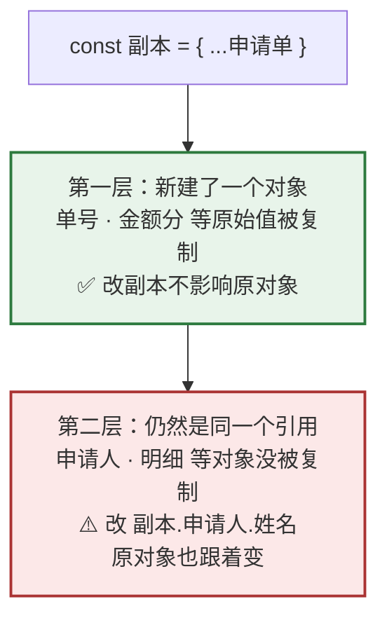
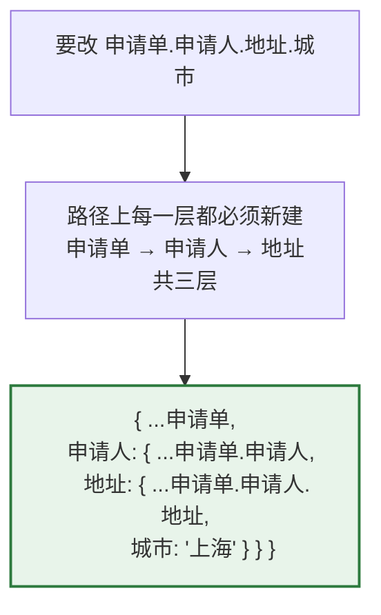
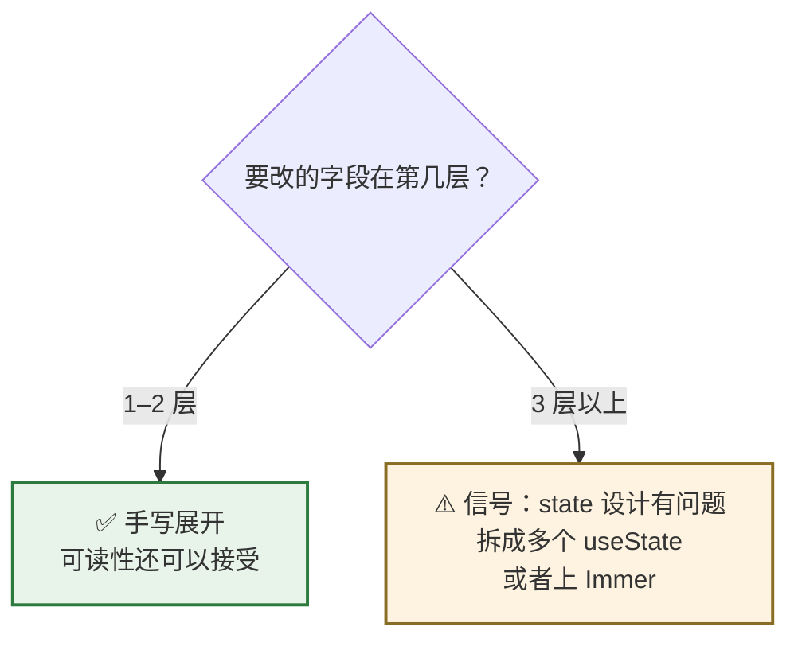

# Day 7 — 对象

> **今天的定位**：对象是 React 状态的载体。props 是对象、state 常常是对象、后端返回的是对象。今天四个重点：
> 1. **计算属性名 `{ [key]: value }`** —— 一个 `onChange` 处理整张表单的所有输入框，做企业后台必用
> 2. **解构的五种形态** —— 重命名、默认值、嵌套、剩余
> 3. **浅拷贝 ≠ 深拷贝** —— Day 3 埋的伏笔，今天讲透嵌套更新怎么写
> 4. **不可变更新对象** —— 不用背，从 Day 3 的 `Object.is` 直接推导
>
> **时间**：2 小时
> **前置**：`day2-modules` 项目，`money.js` 今天还要用
> **本文所有输出均经 Node.js 24 实测**

## 今天结束时你应该能做到

- [ ] 熟练用属性简写 `{ data, loading }` 和计算属性名 `{ [键]: 值 }`
- [ ] **会写「一个 `onChange` 处理整张表单」的写法**
- [ ] 五种解构形态都能写：基础 / 重命名 / 默认值 / 嵌套 / 剩余
- [ ] **能说出 `{ ...a, ...b }` 里谁覆盖谁**
- [ ] **能解释为什么 `{ ...申请单 }` 之后改 `副本.申请人.姓名` 原对象也变了**
- [ ] 会写两层、三层的嵌套不可变更新
- [ ] 知道 `structuredClone` 能干什么、不能干什么
- [ ] **知道为什么不要用 `JSON.parse(JSON.stringify(x))` 做深拷贝**
- [ ] 会用 `Object.entries` + `map` 渲染一张统计表

## 时间分配

| 时段 | 内容 | 时长 |
| --- | --- | --- |
| 1 | 创建与访问 · **计算属性名** | 20 分钟 |
| 2 | **解构的五种形态** | 25 分钟 |
| 3 | 展开与合并 | 15 分钟 |
| 4 | **浅拷贝 ≠ 深拷贝** | 25 分钟 |
| 5 | **不可变更新对象** | 20 分钟 |
| 6 | `Object` 静态方法与 JSON | 15 分钟 |

---

# 第 1 节：创建与访问（20 分钟）

## 1.1 字面量与属性简写

新建 `obj.js`：

```js
const 单号 = 'SQ0001'
const 金额分 = 4165

// ❌ 啰嗦
const 申请单差 = { 单号: 单号, 金额分: 金额分 }

// ✅ 属性简写：键名和变量名相同时可以只写一次
const 申请单 = { 单号, 金额分 }

console.log(申请单)          // { 单号: 'SQ0001', 金额分: 4165 }
```

**这个写法在两个地方天天用：**

```js
// ① 自定义 Hook 的返回值（阶段 4 会写很多）
return { 数据, 加载中, 错误 }

// ② 组装请求参数
const 参数 = { 页码, 每页, 关键词 }
```

**对照 C#**：这相当于 C# 9 的目标类型化 `new`，但更省 —— C# 里 `new { 单号 = 单号 }` 还是要写两遍。

## 1.2 方法简写

```js
const 计算器 = {
  税率: 0.13,
  含税(分) {                       // ✅ 方法简写，等价于 含税: function (分) {}
    return Math.round(分 * (1 + this.税率))
  },
}
console.log(计算器.含税(4165))     // 4706
```

> **注意这里用了 `this`** —— 对象方法里 `this` 指向这个对象。这是少数几个 `this` 有用的场合。但**在 React 里你几乎不写对象方法**，所以别在这上面花时间。

## 1.3 `.` 访问 vs `[]` 访问

```js
const 申请单 = { 单号: 'SQ0001', 金额分: 4165 }

// 字段名写死时用点
console.log(申请单.单号)                   // 'SQ0001'

// 字段名是变量时必须用方括号
const 字段 = '金额分'
console.log(申请单[字段])                   // 4165
console.log(申请单.字段)                    // undefined  ← 它去找名叫「字段」的属性了
```

**规则：字段名是变量 → 用 `[]`；字段名写死 → 用 `.`。**

### 一个实用场景：动态排序

```js
const 列表 = [
  { 单号: 'SQ0002', 金额分: 700 },
  { 单号: 'SQ0001', 金额分: 4165 },
]

// 用户点了哪个表头，就按哪个字段排
const 按字段排序 = (数组, 字段) => [...数组].sort((a, b) => (a[字段] > b[字段] ? 1 : -1))

console.log(按字段排序(列表, '单号').map((x) => x.单号))     // [ 'SQ0001', 'SQ0002' ]
console.log(按字段排序(列表, '金额分').map((x) => x.金额分)) // [ 700, 4165 ]
```

**做后台表格的「点表头排序」就是这么实现的。**

## 1.4 ⭐ 计算属性名 `{ [键]: 值 }`

**这是今天第一个重点。**

```js
const 字段名 = '状态'
const 值 = '待审核'

const 条件 = { [字段名]: 值 }              // 键名由变量决定
console.log(条件)                          // { 状态: '待审核' }
```

**注意方括号在键的位置**，不是在值的位置。没有方括号就完全不同：

```js
console.log({ 字段名: 值 })                // { 字段名: '待审核' }  ← 键名字面就是「字段名」
console.log({ [字段名]: 值 })              // { 状态: '待审核' }    ← 键名是变量的值
```

### 它解决什么问题：一个 `onChange` 管整张表单

**企业后台的表单动辄二三十个字段。** 如果每个输入框写一个处理函数：

```jsx
// ❌ 二十个字段就要写二十个函数
const 改单号 = (e) => setForm({ ...form, 单号: e.target.value })
const 改金额 = (e) => setForm({ ...form, 金额: e.target.value })
const 改备注 = (e) => setForm({ ...form, 备注: e.target.value })
// ... 还有十七个
```

**用计算属性名，一个函数搞定：**

```jsx
// ✅ 一个函数管所有字段
const 处理变化 = (e) => {
  setForm({ ...form, [e.target.name]: e.target.value })
  //                  ↑ 键名来自 input 的 name 属性
}

// 每个输入框只要 name 对上就行
<input name="单号" value={form.单号} onChange={处理变化} />
<input name="金额" value={form.金额} onChange={处理变化} />
<input name="备注" value={form.备注} onChange={处理变化} />
```

**这个写法必须记住。** 它是 React 表单最基础的组织方式。

> **对照 WebForm**：你原来每个控件一个 `TextChanged` 事件，或者在 `Button_Click` 里逐个读 `TextBox1.Text`。React 里是「一个处理函数 + 数据驱动」。

### 用纯 JS 验证一下

```js
// 模拟三次输入事件
let 表单 = { 单号: '', 金额: '', 备注: '' }

const 处理变化 = (字段, 新值) => {
  表单 = { ...表单, [字段]: 新值 }
}

处理变化('单号', 'SQ0001')
处理变化('金额', '41.65')
处理变化('备注', '加急')

console.log(表单)
// { 单号: 'SQ0001', 金额: '41.65', 备注: '加急' }
```

## 1.5 ★ 属性遍历顺序有个坑

```js
const 状态表 = { b: '乙', 2: '二', a: '甲', 1: '一' }
console.log(Object.keys(状态表))          // [ '1', '2', 'b', 'a' ]
```

**看清楚：`1` `2` 跑到前面去了，而且是升序；`b` `a` 保持了书写顺序。**

**规则**：**整数样式的键**永远排在最前面并按数值升序，其余字符串键按插入顺序。

### 什么时候会咬人

**用状态码当键的时候：**

```js
// ❌ 用数字状态码当键 —— 顺序被强制改成升序
const 状态文案错 = { 3: '已驳回', 1: '待审核', 2: '已通过' }
console.log(Object.keys(状态文案错))       // [ '1', '2', '3' ]  被重排了

// ✅ 用字符串键 —— 保持你写的顺序
const 状态文案 = { 待审核: '待审核', 已通过: '已通过', 已驳回: '已驳回' }
console.log(Object.keys(状态文案))         // [ '待审核', '已通过', '已驳回' ]
```

**实务规矩：需要保证顺序时，别用数字当键。** 要么用字符串键，要么用数组（数组顺序永远可靠），要么用 `Map`（Day 9 讲）。

---

# 第 2 节：解构的五种形态（25 分钟）★

Day 5 已经用过参数解构，今天系统过一遍。**五种形态，都在 `obj.js` 里敲一遍。**

## 2.1 形态一：基础

```js
const 申请单 = { 单号: 'SQ0001', 金额分: 4165, 状态: '待审核' }

const { 单号, 金额分 } = 申请单
console.log(单号, 金额分)                  // SQ0001 4165
```

**读法**：「从 `申请单` 里取出 `单号` 和 `金额分`，各自建一个同名变量」。

**不存在的字段得到 `undefined`，不报错：**

```js
const { 不存在 } = 申请单
console.log(不存在)                        // undefined
```

## 2.2 形态二：重命名 `:`

```js
const { 单号: 编号, 状态: 当前状态 } = 申请单
console.log(编号, 当前状态)                // SQ0001 待审核
```

**注意冒号的方向**：`原名: 新名`。这和对象字面量里的 `键: 值` 方向感觉相反，容易写错。

**什么时候需要**：名字冲突时。

```js
// 两个申请单都想解构出「单号」
const { 单号: 主单号 } = 主申请单
const { 单号: 关联单号 } = 关联申请单
```

## 2.3 形态三：默认值 `=`

```js
const { 备注 = '无', 状态 = '草稿' } = 申请单
console.log(备注, 状态)                    // 无 待审核
```

`备注` 不存在 → 用 `'无'`；`状态` 存在 → 用它自己的值。

### ⚠️ 和 Day 5 的默认参数同一条规则：只认 `undefined`

```js
const 数据 = { a: null, b: undefined, c: 0 }
const { a = '默认', b = '默认', c = '默认' } = 数据

console.log(a)     // null      ⚠️ 不是「默认」
console.log(b)     // '默认'    ✅
console.log(c)     // 0         ⚠️ 不是「默认」（这通常是对的）
```

**后端返回的空值通常是 `null`，所以解构默认值兜不住它。** 要兜住得用 `??`：

```js
const { a } = 数据
const 实际a = a ?? '默认'                  // ✅ 同时兜住 null 和 undefined
console.log(实际a)                         // '默认'
```

> Day 4 学的 `??`、Day 5 学的默认参数、今天的解构默认值 —— **三者是同一套「只认 undefined」的语义**，`??` 是唯一同时认 `null` 的。

## 2.4 形态四：嵌套解构

```js
const 完整单 = {
  单号: 'SQ0001',
  申请人: { 姓名: '张三', 部门: '超声科' },
}

// 一次取到第二层
const { 申请人: { 姓名, 部门 } } = 完整单
console.log(姓名, 部门)                    // 张三 超声科
```

**注意**：这样写之后，**`申请人` 这个变量并不存在** —— 冒号后面是「继续往里解构」，不是「重命名」。

```js
// console.log(申请人)    // 💥 ReferenceError: 申请人 is not defined
```

**两个都要的话，写两次：**

```js
const { 申请人, 申请人: { 姓名: 申请人姓名 } } = 完整单
console.log(申请人)                        // { 姓名: '张三', 部门: '超声科' }
console.log(申请人姓名)                    // 张三
```

### ⚠️ 嵌套解构没有安全网

```js
const 空单 = { 单号: 'SQ0002' }            // 没有 申请人

// const { 申请人: { 姓名 } } = 空单
// 💥 TypeError: Cannot destructure property '姓名' of undefined
```

**解法：给中间层加默认值 `= {}`**（和 Day 5 的 `= {}` 是同一个手法）：

```js
const { 申请人: { 姓名: 姓名2 } = {} } = 空单
console.log(姓名2)                         // undefined，不报错
```

**但实务上更推荐直接用 `?.`，可读性好得多：**

```js
const 姓名3 = 空单.申请人?.姓名 ?? '未填写'
console.log(姓名3)                         // '未填写'
```

> **实务规矩：嵌套超过一层，就别用嵌套解构了，改用 `?.`。** 嵌套解构写起来短，但读起来累，而且没有安全网。

## 2.5 形态五：剩余 `...rest`

Day 5 讲过，这里补两个用途：

```js
const 表单数据 = { 单号: 'SQ0001', 金额分: 4165, 密码: 'abc123', 内部备注: 'xx' }

// ① 排除敏感字段后再提交
const { 密码, 内部备注, ...可提交 } = 表单数据
console.log(可提交)                        // { 单号: 'SQ0001', 金额分: 4165 }

// ② 这就是「不可变地删除字段」的标准写法
```

**注意 `密码` 和 `内部备注` 这两个变量被创建了但你不用它们** —— ESLint 会报「未使用的变量」。规范做法是加下划线前缀或配置忽略：

```js
const { 密码: _密码, 内部备注: _内部备注, ...可提交2 } = 表单数据
```

## 2.6 五种形态速查

| 形态 | 写法 | 用途 |
| --- | --- | --- |
| 基础 | `const { a } = o` | 取字段 |
| 重命名 | `const { a: b } = o` | 名字冲突时 |
| 默认值 | `const { a = 1 } = o` | 字段可能不存在（**只认 `undefined`**） |
| 嵌套 | `const { a: { b } } = o` | 取深层字段（**建议改用 `?.`**） |
| 剩余 | `const { a, ...rest } = o` | 排除字段 / 属性透传 |

**可以组合：**

```js
const { 申请人: { 姓名: 名字 = '未填' } = {}, ...其余 } = 完整单
console.log(名字)                          // 张三
```

> 但**这种一行写完的做法可读性很差**。真实项目里拆成两三行更好。

---

# 第 3 节：展开与合并（15 分钟）

## 3.1 复制一层

```js
const 原单 = { 单号: 'SQ0001', 金额分: 4165 }
const 副本 = { ...原单 }

console.log(副本)                          // { 单号: 'SQ0001', 金额分: 4165 }
console.log(Object.is(原单, 副本))         // false  ← 新对象，新引用
```

**这就是 Day 3 说的「造新引用」** —— React 靠它判断「数据变了」。

## 3.2 合并：后面的覆盖前面的

```js
const 默认配置 = { 页码: 1, 每页: 20, 排序: 'id' }
const 用户配置 = { 每页: 50 }

console.log({ ...默认配置, ...用户配置 })
// { 页码: 1, 每页: 50, 排序: 'id' }        ← 每页 被覆盖成 50 了

console.log({ ...用户配置, ...默认配置 })
// { 每页: 20, 页码: 1, 排序: 'id' }        ⚠️ 反过来 每页 又变回 20，用户配置失效
```

**规则：从左到右，后面的覆盖前面的。**

> **注意第二行输出里 `每页` 跑到最前面了。** 因为**键的顺序由「第一次出现的位置」决定** —— `用户配置` 先展开，`每页` 就占了第一个位置；后来 `默认配置` 只是把它的**值**改成 `20`，不会把它挪到后面去。
>
> 键顺序一般不影响逻辑，但 `JSON.stringify` 的结果会不一样。做接口签名、缓存 key 时要留意。

**记法：「默认值在前，用户值在后」** —— 这样用户传的才能生效。

> **这条规则和 Day 5 的 `{...rest}` 位置问题是同一件事。** JSX 属性 `<input className="x" {...rest} />` 也遵循它。

## 3.3 展开 + 单独指定字段

```js
// 改一个字段
console.log({ ...原单, 金额分: 9999 })
// { 单号: 'SQ0001', 金额分: 9999 }

// ⚠️ 顺序反了就没用
console.log({ 金额分: 9999, ...原单 })
// { 金额分: 4165, 单号: 'SQ0001' }         ← 被原单的值覆盖回去了
```

**要覆盖的字段必须写在展开的后面。** 这是最容易犯的错之一。

## 3.4 `Object.assign` —— 老写法，但有个用途

```js
// 等价于 { ...a, ...b }
console.log(Object.assign({}, 默认配置, 用户配置))
// { 页码: 1, 每页: 50, 排序: 'id' }
```

**⚠️ 注意第一个参数会被修改：**

```js
const 目标 = { a: 1 }
Object.assign(目标, { b: 2 })
console.log(目标)                          // { a: 1, b: 2 }  ← 原地改了！
```

**所以第一个参数一定要传 `{}`**，否则就是不可变更新的反面。

**实务：日常用 `{ ...a, ...b }`。** `Object.assign` 只在「要合并不定个数的对象」时有用：

```js
const 合并全部 = (...各配置) => Object.assign({}, ...各配置)
console.log(合并全部({ a: 1 }, { b: 2 }, { a: 9 }))    // { a: 9, b: 2 }
```

---

# 第 4 节：浅拷贝 ≠ 深拷贝（25 分钟）★ 重点

> **Day 3 第 5.5 节埋的伏笔，今天讲透。** 这是所有人写 React 时翻车最多的地方。

## 4.1 `{ ...x }` 只拷第一层



在 `obj.js` 里验证：

```js
const 申请单2 = {
  单号: 'SQ0001',
  金额分: 4165,
  申请人: { 姓名: '张三', 部门: '超声科' },
  明细: [{ 名称: '项目A', 单价分: 865 }],
}

const 副本2 = { ...申请单2 }

副本2.单号 = 'SQ0002'                  // 第一层：原始值
副本2.申请人.姓名 = '李四'             // 第二层：对象
副本2.明细.push({ 名称: '项目B' })     // 第二层：数组

console.log('原单号  :', 申请单2.单号)              // 'SQ0001'  ✅ 没变
console.log('原姓名  :', 申请单2.申请人.姓名)       // '李四'    ⚠️ 变了！
console.log('原明细数:', 申请单2.明细.length)       // 2         ⚠️ 变了！

console.log(Object.is(申请单2, 副本2))              // false  第一层是新的
console.log(Object.is(申请单2.申请人, 副本2.申请人)) // true   第二层是同一个
```

**最后两行是关键**：第一层引用变了（所以 React 会重渲染），但第二层没隔离干净。

## 4.2 为什么这在 React 里是个严重问题

**因为你「偷偷改了别人的数据」。**

```jsx
// 父组件的 state
const [申请单, set申请单] = useState({ 申请人: { 姓名: '张三' } })

// 子组件里
function 子组件({ 申请单 }) {
  const 处理 = () => {
    const 副本 = { ...申请单 }
    副本.申请人.姓名 = '李四'          // 💥 父组件的 state 被直接改了
    set申请单(副本)
  }
}
```

**后果**：父组件的 state 在你调用 `set申请单` 之前就已经变了。React 的「旧值 vs 新值」比较失去意义，可能出现界面不更新、或者需要点两次才生效这类玄学问题。

> 这正是 Day 5 第 6 节讲的「组件必须是纯函数」—— 不能修改 props。

## 4.3 ✅ 正确做法：从根到目标，逐层新建



```js
const 深单 = {
  单号: 'SQ0001',
  申请人: {
    姓名: '张三',
    地址: { 省: '江苏', 城市: '南京' },
  },
}

// ✅ 改第三层的 城市
const 新单 = {
  ...深单,
  申请人: {
    ...深单.申请人,
    地址: {
      ...深单.申请人.地址,
      城市: '上海',
    },
  },
}

console.log(新单.申请人.地址.城市)         // '上海'
console.log(深单.申请人.地址.城市)         // '南京'  ✅ 原对象没被碰
console.log(Object.is(深单.申请人, 新单.申请人))   // false  ✅ 每层都是新的
```

**记法：「改哪一层，就把从根到那一层的路径全部展开一遍」。**

## 4.4 ⚠️ 嵌套超过三层就该拆 state 了



**三层展开已经很难读了，四层没人能维护。** 遇到这种情况有两个方向：

**方向一：拆分 state（首选）**

```jsx
// ❌ 一个大对象
const [申请单, set申请单] = useState({ 基本信息: {...}, 申请人: {...}, 明细: [...] })

// ✅ 拆开
const [基本信息, set基本信息] = useState({})
const [申请人, set申请人] = useState({})
const [明细, set明细] = useState([])
```

**方向二：用 Immer**

`immer` 这个库让你「像直接改一样写」，它在背后帮你生成不可变更新：

```js
// 用 Immer 的写法（阶段 4 可选）
const 新单 = produce(深单, (草稿) => {
  草稿.申请人.地址.城市 = '上海'          // 看起来是直接改，实际生成了新对象
})
```

> **今天不用装 Immer。** 先把手写展开练熟 —— 你必须理解它在做什么，才有资格用工具偷懒。

## 4.5 真正的深拷贝：`structuredClone`

```js
const 深拷贝 = structuredClone(深单)

深拷贝.申请人.地址.城市 = '广州'
console.log(深单.申请人.地址.城市)         // '南京'  ✅ 完全隔离
console.log(Object.is(深单.申请人, 深拷贝.申请人))   // false
```

**`structuredClone` 是浏览器和 Node 原生提供的，不用装库。**

### 它能处理什么

| 类型 | 支持 |
| --- | --- |
| 对象、数组、原始值 | ✅ |
| `Date` | ✅ 仍是 `Date` |
| `Map` / `Set` | ✅ |
| 正则 | ✅ |
| **循环引用** | ✅ |
| **函数** | ❌ **抛异常** |
| `Symbol` | ❌ 抛异常 |
| DOM 节点 / class 实例的原型 | ❌ 丢失原型 |

```js
// 函数会直接抛错
try {
  structuredClone({ f: () => 1 })
} catch (e) {
  console.log(e.name)                    // 'DataCloneError'
  console.log(e.constructor.name)        // 'DOMException'  ← 注意这两个不一样
}
```

> **顺带记一条**：判断异常种类时，**`e.name` 比 `e.constructor.name` 可靠**。像 `DataCloneError` 这种，它是 `DOMException` 这一个类的不同 `name`，构造函数名看不出区别。Day 10 讲错误处理时会再用到。

### ⚠️ 但在 React 里很少用它

**因为深拷贝违背了 React 的性能模型。** React 靠「引用没变 = 没变化」来跳过不必要的渲染。全量深拷贝等于告诉 React「所有东西都变了」，白白浪费渲染。

**实务规矩：**

| 场景 | 用什么 |
| --- | --- |
| React 状态更新 | **逐层展开**（只新建改动路径上的层） |
| 需要一份完全独立的副本（比如表单「重置」功能存初始值） | `structuredClone` |
| 深层嵌套且路径多变 | Immer |

## 4.6 ❌ 为什么不要用 `JSON.parse(JSON.stringify(x))`

这是网上流传最广的「深拷贝一行流」，**但它会静默损坏数据**：

```js
const 原始 = {
  日期: new Date('2026-07-30'),
  空值: undefined,
  函数: () => 1,
  非数: NaN,
  无穷: Infinity,
  集合: new Set([1, 2]),
  金额: 4165,
}

const 坏拷贝 = JSON.parse(JSON.stringify(原始))
console.log(坏拷贝)
```

**实际输出：**

```
{
  日期: '2026-07-30T00:00:00.000Z',    ← 变成字符串了！不再是 Date
  非数: null,                          ← NaN 变 null
  无穷: null,                          ← Infinity 变 null
  集合: {},                            ← Set 变成空对象
  金额: 4165
}
```

**四种损坏：**

| 原值 | 变成 | 后果 |
| --- | --- | --- |
| `Date` | ISO 字符串 | 之后调 `.getTime()` 直接崩 |
| `undefined` 属性 | **整个键消失** | 和 Day 3 讲的 `JSON.stringify` 吃掉 `undefined` 是同一回事 |
| 函数属性 | 整个键消失 | 回调丢失 |
| `NaN` / `Infinity` | `null` | 数值判断出错 |
| `Map` / `Set` | `{}` 空对象 | 数据全丢 |

**而且它慢** —— 序列化再反序列化，比 `structuredClone` 慢好几倍。

> **实务规矩：需要深拷贝就用 `structuredClone`，永远不要用 JSON 往返。**

---

# 第 5 节：不可变更新对象（20 分钟）★

> **这一节不需要背。** 全部从 Day 3 的一条规则推导：**React 用 `Object.is` 比较引用，引用没变就不重渲染。**

## 5.1 四种操作

```js
const 单 = { 单号: 'SQ0001', 金额分: 4165, 状态: '待审核', 备注: 'xx' }

// ① 改一个字段
const 改后 = { ...单, 状态: '已通过' }

// ② 改多个字段
const 改多 = { ...单, 状态: '已通过', 金额分: 5000 }

// ③ 加一个字段
const 加后 = { ...单, 审核人: '李四' }

// ④ 删一个字段 —— 用剩余解构
const { 备注, ...删后 } = 单

console.log(改后.状态)                     // '已通过'
console.log(加后.审核人)                   // '李四'
console.log(删后)                          // { 单号: 'SQ0001', 金额分: 4165, 状态: '待审核' }
console.log(单.状态)                       // '待审核'  ✅ 原对象始终没变
```

## 5.2 为什么不能直接改

```js
// ❌ 在 React 里这样写，界面不会刷新
单.状态 = '已通过'
set申请单(单)
// Object.is(旧单, 单) === true  → React 认为什么都没发生
```

**推导过程（Day 3 学的）：**

1. `单.状态 = 'x'` 改的是对象内部，**`单` 这个引用没变**
2. React 拿 `Object.is(旧值, 新值)` 比较 → 得到 `true`
3. React 判定「没变化」→ 跳过渲染
4. 界面不刷新

**验证一下：**

```js
const 原 = { 状态: '待审核' }
const 直接改 = 原
直接改.状态 = '已通过'
console.log(Object.is(原, 直接改))         // true   ← 界面不会刷新

const 展开改 = { ...原, 状态: '已驳回' }
console.log(Object.is(原, 展开改))         // false  ← 界面会刷新
```

## 5.3 动态字段名 + 不可变更新

**把第 1 节的计算属性名和这里结合起来，就是表单处理的完整写法：**

```js
const 改字段 = (对象, 字段, 值) => ({ ...对象, [字段]: 值 })

let 表单2 = { 单号: '', 金额: '', 状态: '草稿' }
表单2 = 改字段(表单2, '单号', 'SQ0001')
表单2 = 改字段(表单2, '状态', '待审核')

console.log(表单2)
// { 单号: 'SQ0001', 金额: '', 状态: '待审核' }
```

在 React 里就是：

```jsx
const 处理变化 = (e) => {
  const { name, value } = e.target        // 顺带用了解构
  setForm((旧) => ({ ...旧, [name]: value }))
  //      ↑ Day 6 学的函数式更新，避免 stale closure
}
```

**这一行里有今天和前两天的四个知识点：** 函数式更新（Day 6）、展开（今天第 3 节）、计算属性名（今天第 1 节）、解构（今天第 2 节）。

> 注意箭头函数返回对象**加了圆括号** `({ ... })` —— Day 5 第 2.2 节的坑。

## 5.4 ★ `Object.freeze` 只冻一层

```js
const 配置 = Object.freeze({
  每页: 20,
  高级: { 超时: 3000 },
})

// 第一层被冻住了
try {
  配置.每页 = 50
} catch (e) {
  console.log(e.constructor.name)        // 'TypeError'
}

// ⚠️ 第二层没冻
配置.高级.超时 = 9999
console.log(配置.高级.超时)               // 9999  ← 改成功了
```

**又是「只有一层」的主题。** 想全冻需要递归（叫深冻结），但实务上很少这么做。

> **注意会抛 `TypeError`，不是静默失败** —— 因为模块代码天生是严格模式（Day 3 第 1.4 节讲过）。

---

# 第 6 节：`Object` 静态方法与 JSON（15 分钟）

## 6.1 三兄弟：`keys` / `values` / `entries`

```js
const 统计 = { 待审核: 12, 已通过: 45, 已驳回: 3 }

console.log(Object.keys(统计))             // [ '待审核', '已通过', '已驳回' ]
console.log(Object.values(统计))           // [ 12, 45, 3 ]
console.log(Object.entries(统计))
// [ [ '待审核', 12 ], [ '已通过', 45 ], [ '已驳回', 3 ] ]
```

`entries` 返回的是**「键值对数组」的数组**，每一项是 `[键, 值]` 两元素数组。

### ⭐ 用它渲染一张统计表

**这是企业后台的高频需求 —— 后端返回一个统计对象，前端渲染成表格：**

```jsx
{Object.entries(统计).map(([状态, 数量]) => (
  <tr key={状态}>
    <td>{状态}</td>
    <td>{数量}</td>
  </tr>
))}
```

**注意 `([状态, 数量])` 这个写法**：参数位置上对 `[键, 值]` 做了**数组解构**（Day 8 会正式讲），再包一层圆括号因为它是箭头函数的单个参数。

用纯 JS 验证：

```js
const 行 = Object.entries(统计).map(([状态, 数量]) => `${状态}: ${数量} 条`)
console.log(行)
// [ '待审核: 12 条', '已通过: 45 条', '已驳回: 3 条' ]
```

### 配套的 `Object.fromEntries`：反向变回对象

```js
// 筛出数量大于 10 的
const 大项 = Object.fromEntries(
  Object.entries(统计).filter(([, 数量]) => 数量 > 10)
)
console.log(大项)                          // { 待审核: 12, 已通过: 45 }
```

**`([, 数量])` 里那个逗号前的空位**是「跳过第一个元素」（Day 8 讲）。

**这个「entries → 数组操作 → fromEntries」的组合，是对象版的 map/filter。** 因为对象本身没有 `map` 和 `filter`。

## 6.2 判断属性存在

```js
const 单3 = { 单号: 'SQ0001', 备注: undefined }

// 三种方式，行为不同
console.log('备注' in 单3)                          // true   键存在
console.log(单3.备注 !== undefined)                 // false  分不出「没这个键」和「值是 undefined」
console.log(Object.hasOwn(单3, '备注'))             // true   ✅ 推荐
console.log(Object.hasOwn(单3, '不存在'))           // false
```

**`Object.hasOwn` 是现代写法**，替代老的 `obj.hasOwnProperty(k)`（后者在某些边界情况会出问题）。

**实务上你几乎只需要 `?.` 和 `??`**，`in` / `hasOwn` 只在「必须区分『键不存在』和『值是 undefined』」时才用 —— 比如实现 PATCH 语义（Day 3 第 4.4 节讲过）。

## 6.3 `delete`：能用但别用

```js
const 单4 = { a: 1, b: 2 }
delete 单4.a
console.log(单4)                           // { b: 2 }
```

**在 React 里不要用 `delete`** —— 它是原地修改，引用不变。用剩余解构：

```js
const { a, ...没有a } = 单4               // ✅ 不可变地「删除」
```

## 6.4 JSON 序列化

```js
const 单5 = { 单号: 'SQ0001', 金额分: 4165 }

console.log(JSON.stringify(单5))
// '{"单号":"SQ0001","金额分":4165}'

// 第三个参数是缩进，调试时很有用
console.log(JSON.stringify(单5, null, 2))
// {
//   "单号": "SQ0001",
//   "金额分": 4165
// }

console.log(JSON.parse('{"单号":"SQ0002"}'))
// { 单号: 'SQ0002' }
```

### 不可序列化的值（复习 + 补充）

Day 3 讲过 `undefined`，这里给全表：

```js
console.log(JSON.stringify({
  正常: 1,
  空值: undefined,
  函数: () => 1,
  非数: NaN,
  无穷: Infinity,
  空: null,
  集合: new Set([1]),
  映射: new Map([['a', 1]]),
  日期: new Date('2026-07-30'),
}))
```

**实际输出：**

```json
{"正常":1,"非数":null,"无穷":null,"空":null,"集合":{},"映射":{},"日期":"2026-07-30T00:00:00.000Z"}
```

| 原值 | 序列化结果 |
| --- | --- |
| `undefined` | **键被删掉** |
| 函数 | **键被删掉** |
| `NaN` / `Infinity` | `null` |
| `Set` / `Map` | `{}`（数据全丢） |
| `Date` | ISO 字符串 |
| `null` | `null`（正常保留） |

> **这张表解释了第 4.6 节为什么不能用 JSON 往返做深拷贝** —— 上面每一行都是一处数据损坏。

### ★ `toJSON` 与第二个参数（了解）

```js
// 对象可以自定义序列化行为
const 金额对象 = {
  分: 4165,
  toJSON() { return (this.分 / 100).toFixed(2) },
}
console.log(JSON.stringify({ 金额: 金额对象 }))     // '{"金额":"41.65"}'
```

`Date` 之所以变成 ISO 字符串，就是因为它内置了 `toJSON`。

**第二个参数可以筛选字段：**

```js
console.log(JSON.stringify({ a: 1, 密码: 'x' }, ['a']))    // '{"a":1}'
```

**实务上很少用**，知道有这回事就行。

## 6.5 ☆ getter / setter（认得就行）

```js
const 申请单6 = {
  金额分: 4165,
  get 金额元() { return (this.金额分 / 100).toFixed(2) },
  set 金额元(值) { this.金额分 = Math.round(Number(值) * 100) },
}

console.log(申请单6.金额元)                // '41.65'   像属性一样读
申请单6.金额元 = '99.99'                   // 像属性一样写
console.log(申请单6.金额分)                // 9999
```

**对照 C#**：这就是 C# 的属性（`get` / `set`）。

**但 React 里基本不用**，因为：

1. 它是「隐藏的计算逻辑」，读一个属性却执行了代码，容易造成困惑
2. `JSON.stringify` 会执行 getter，但 `structuredClone` 不会 —— 行为不一致
3. React 更推崇「显式计算」：需要 `金额元` 就直接调 `分转元(金额分)`

---

# 今日验收清单

- [ ] `obj.js` 建好了，属性简写 `{ 单号, 金额分 }` 写过
- [ ] 知道字段名是变量时必须用 `[]` 访问
- [ ] **写过计算属性名 `{ [字段名]: 值 }`**，知道方括号在键的位置
- [ ] **能写出「一个 `处理变化` 管所有输入框」的写法**
- [ ] 知道整数样式的键会被强制排到最前面并升序 —— 需要顺序时别用数字当键
- [ ] 五种解构形态都写过：基础 / 重命名 / 默认值 / 嵌套 / 剩余
- [ ] 知道解构默认值**只认 `undefined`**，`null` 兜不住，要用 `??`
- [ ] 知道嵌套解构没有安全网，实务上改用 `?.`
- [ ] **能说出 `{ ...a, ...b }` 是后面覆盖前面**，要覆盖的字段写在展开后面
- [ ] 知道**键的位置由「第一次出现时」决定**，后来的展开只改值不挪位置
- [ ] 知道 `Object.assign` 第一个参数会被原地修改，所以要传 `{}`
- [ ] **跑过 4.1 那段，看到 `Object.is(原.申请人, 副本.申请人)` 是 `true`**
- [ ] **会写三层嵌套的不可变更新**（从根到目标逐层展开）
- [ ] 知道嵌套超过三层是「state 设计有问题」的信号
- [ ] 知道 `structuredClone` 能拷 `Date`/`Map`/`Set`/循环引用，**但函数会抛异常**
- [ ] **知道 `JSON.parse(JSON.stringify(x))` 会损坏 `Date`/`undefined`/函数/`NaN`/`Set`**
- [ ] 能用 `Object.is` 解释「为什么 `单.状态 = 'x'` 之后界面不刷新」
- [ ] 会用剩余解构不可变地「删除」字段
- [ ] 知道 `Object.freeze` 只冻一层，且赋值会抛 `TypeError`
- [ ] **会用 `Object.entries(统计).map(([键, 值]) => ...)` 渲染统计表**
- [ ] 知道「entries → filter/map → fromEntries」是对象版的数组操作

---

# 常见问题排查

## 改了 state 对象但界面不刷新

直接改了属性，引用没变。用 `{ ...旧, 字段: 新值 }`。第 5.2 节。

## 改了副本，原对象也跟着变了

浅拷贝只拷一层，你改的是第二层。要从根到目标逐层展开。第 4.1 / 4.3 节。

## 父组件的数据莫名其妙变了

子组件修改了 props 里的嵌套对象。同上。第 4.2 节。

## `Cannot destructure property 'xxx' of undefined`

嵌套解构时中间层不存在。加 `= {}` 兜底，或改用 `?.`。第 2.4 节。

## `{ [字段名]: 值 }` 写成了 `{ 字段名: 值 }`

少了方括号，键名变成了字面的「字段名」。第 1.4 节。

## 合并配置时用户传的值不生效

展开顺序反了。默认值在前，用户值在后。第 3.2 节。

## 深拷贝后 `Date` 对象调 `.getTime()` 报错

用了 `JSON.parse(JSON.stringify(x))`，`Date` 已经变成字符串。改用 `structuredClone`。第 4.6 节。

## `structuredClone` 报 `DataCloneError`

对象里有函数（或 Symbol、DOM 节点）。先把这些字段剔除。第 4.5 节。

## 状态码当键的对象，顺序被打乱了

整数样式的键会被强制升序。改用字符串键或数组。第 1.5 节。

## 解构出来的变量提示「未使用」

用剩余解构排除字段时会产生这种情况。加下划线前缀或配置 ESLint 忽略。第 2.5 节。

---

# 今天不需要理解的东西

| 你会看到 | 什么时候学 |
| --- | --- |
| `arr.map` / `filter` 的细节 | **明天 Day 8** |
| `[键, 值]` 这种数组解构 | 明天 Day 8 |
| `Map` / `Set` 怎么用 | Day 9 |
| `useState` / `setForm` 怎么用 | 阶段 4 第 1 周 |
| Immer 的 `produce` | 阶段 4（可选） |
| `Object.defineProperty` / 属性描述符 | **永远不用** |
| 原型链、`Object.create` | Day 12 简述，之后不用 |
| `Reflect` / `Proxy` | 用不到 |

---

# 作业（25 分钟）

## 作业 1：写四个对象工具函数

新建 `obj-utils.js`：

```js
/**
 * 不可变地改一个字段
 * 改字段({a:1,b:2}, 'b', 9) → { a:1, b:9 }（原对象不变）
 */
export function 改字段(对象, 字段, 值) {
  // TODO
}

/**
 * 不可变地删除多个字段
 * 删字段({a:1,b:2,c:3}, ['b','c']) → { a:1 }
 */
export function 删字段(对象, 字段数组) {
  // TODO：提示用 Object.entries + filter + fromEntries
}

/**
 * 深层改一个字段（只需支持两层）
 * 改嵌套({申请人:{姓名:'张三',部门:'超声科'}}, '申请人', '姓名', '李四')
 *   → { 申请人: { 姓名:'李四', 部门:'超声科' } }
 * 要求：原对象完全不变，且两层都是新引用
 */
export function 改嵌套(对象, 外层字段, 内层字段, 值) {
  // TODO
}

/**
 * 挑出指定字段（对象版的 SELECT）
 * 挑字段({a:1,b:2,c:3}, ['a','c']) → { a:1, c:3 }
 * 不存在的字段直接忽略
 */
export function 挑字段(对象, 字段数组) {
  // TODO
}
```

自测：

| 调用 | 期望 |
| --- | --- |
| `改字段({a:1,b:2}, 'b', 9)` | `{ a:1, b:9 }`，且原对象仍是 `{a:1,b:2}` |
| `删字段({a:1,b:2,c:3}, ['b','c'])` | `{ a:1 }` |
| `改嵌套(单, '申请人', '姓名', '李四')` | 两层都是新引用，原对象不变 |
| `挑字段({a:1,b:2,c:3}, ['a','c'])` | `{ a:1, c:3 }` |
| `挑字段({a:1}, ['a','不存在'])` | `{ a:1 }` |

<details>
<summary>提示（卡住了再看）</summary>

- 改字段：`({ ...对象, [字段]: 值 })` —— 注意箭头函数返回对象要加圆括号
- 删字段：`Object.fromEntries(Object.entries(对象).filter(([k]) => !字段数组.includes(k)))`
- 改嵌套：`{ ...对象, [外层字段]: { ...对象[外层字段], [内层字段]: 值 } }`
- 挑字段：`Object.fromEntries(字段数组.filter(k => k in 对象).map(k => [k, 对象[k]]))`

**四个的共同点：全部返回新对象，一次都不碰原对象。**

</details>

## 作业 2：找出并修复 7 个问题

```jsx
function 申请单编辑({ 申请单, onSave }) {
  const [表单, setForm] = useState(申请单)

  // 问题区域
  const 处理变化 = (e) => {
    表单[e.target.name] = e.target.value
    setForm(表单)
  }

  const 改申请人姓名 = (新姓名) => {
    const 副本 = { ...表单 }
    副本.申请人.姓名 = 新姓名
    setForm(副本)
  }

  const 重置 = () => {
    setForm(JSON.parse(JSON.stringify(申请单)))
  }

  const 删除备注 = () => {
    delete 表单.备注
    setForm({ ...表单 })
  }

  const 提交 = () => {
    const 配置 = { ...{ 每页: 20, 超时: 3000 }, ...表单.配置 }
    onSave({ 配置: 配置, 表单: 表单 })
  }

  const 城市 = 表单.申请人.地址.城市

  return <div>{城市}</div>
}
```

<details>
<summary>点开看答案</summary>

| # | 问题 | 修复 |
| --- | --- | --- |
| 1 | `表单[e.target.name] = ...` **直接改 state 对象**，引用不变 → 界面不刷新 | `setForm((旧) => ({ ...旧, [e.target.name]: e.target.value }))` |
| 2 | `副本.申请人.姓名 = 新姓名` —— 浅拷贝只拷一层，**改到了原 state 甚至父组件的数据** | 逐层展开：`{ ...表单, 申请人: { ...表单.申请人, 姓名: 新姓名 } }` |
| 3 | `JSON.parse(JSON.stringify(...))` 会损坏 `Date` / `undefined` / 函数 | `structuredClone(申请单)` |
| 4 | `delete 表单.备注` 原地修改了 state | 用剩余解构：`const { 备注, ...其余 } = 表单; setForm(其余)` |
| 5 | `{ ...{每页:20}, ...表单.配置 }` —— 若 `表单.配置` 是 `undefined`，展开 `undefined` 虽然合法（得到空），但**默认值写成内联对象字面量每次都新建**，可读性差 | 把默认配置提到组件外的常量 |
| 6 | `{ 配置: 配置, 表单: 表单 }` 没用属性简写 | `{ 配置, 表单 }` |
| 7 | `表单.申请人.地址.城市` 三层直接访问，任一层为空就崩 | `表单.申请人?.地址?.城市 ?? '未填写'` |

**参考修复版：**

```jsx
const 默认配置 = { 每页: 20, 超时: 3000 }        // 提到组件外

function 申请单编辑({ 申请单, onSave }) {
  const [表单, setForm] = useState(申请单)

  const 处理变化 = (e) => {
    const { name, value } = e.target
    setForm((旧) => ({ ...旧, [name]: value }))
  }

  const 改申请人姓名 = (新姓名) => {
    setForm((旧) => ({
      ...旧,
      申请人: { ...旧.申请人, 姓名: 新姓名 },
    }))
  }

  const 重置 = () => {
    setForm(structuredClone(申请单))
  }

  const 删除备注 = () => {
    setForm((旧) => {
      const { 备注: _备注, ...其余 } = 旧
      return 其余
    })
  }

  const 提交 = () => {
    const 配置 = { ...默认配置, ...表单.配置 }
    onSave({ 配置, 表单 })
  }

  const 城市 = 表单.申请人?.地址?.城市 ?? '未填写'

  return <div>{城市}</div>
}
```

**第 1、2、4 个是同一类错误** —— 都在原地修改 state。**第 2 个最隐蔽**，因为它看起来「已经拷贝过了」。

</details>

## 作业 3：预测输出（先写答案，再运行）

```js
const 原 = {
  单号: 'SQ0001',
  申请人: { 姓名: '张三' },
}
const 副 = { ...原 }
副.单号 = 'SQ0002'
副.申请人.姓名 = '李四'

console.log('①', 原.单号)
console.log('②', 原.申请人.姓名)
console.log('③', Object.is(原, 副))
console.log('④', Object.is(原.申请人, 副.申请人))

const 默认 = { a: 1, b: 2 }
const 用户 = { b: 9 }
console.log('⑤', JSON.stringify({ ...默认, ...用户 }))
console.log('⑥', JSON.stringify({ ...用户, ...默认 }))
console.log('⑦', JSON.stringify({ ...默认, b: 99 }))
console.log('⑧', JSON.stringify({ b: 99, ...默认 }))

const 数据 = { x: null, y: undefined, z: 0 }
const { x = '默认', y = '默认', z = '默认' } = 数据
console.log('⑨', x, y, z)

console.log('⑩', JSON.stringify(Object.keys({ b: 1, 2: 2, a: 3, 1: 4 })))

const 统计 = { 待审核: 12, 已通过: 45 }
console.log('⑪', JSON.stringify(Object.entries(统计)))

console.log('⑫', JSON.stringify({ a: 1, b: undefined, c: NaN }))
```

<details>
<summary>点开看答案</summary>

```
① SQ0001                          第一层是原始值，副本独立
② 李四                            ⚠️ 第二层共享引用，原对象被改了
③ false                           展开产生了新对象
④ true                            ⚠️ 申请人 是同一个对象
⑤ {"a":1,"b":9}                   后面的 用户 覆盖了 b
⑥ {"b":2,"a":1}                   ⚠️ 顺序反了，默认值覆盖了用户值（注意 b 的位置也变了）
⑦ {"a":1,"b":99}                  b:99 写在展开后面，生效
⑧ {"b":2,"a":1}                   ⚠️ b:99 被 ...默认 覆盖回去了
⑨ null 默认 0                     ⚠️ 只有 undefined 触发默认值
⑩ ["1","2","b","a"]               ⚠️ 整数键被提前并升序
⑪ [["待审核",12],["已通过",45]]     每项是 [键, 值] 二元数组
⑫ {"a":1,"c":null}                ⚠️ undefined 键消失，NaN 变 null
```

**② 和 ④ 是今天第 4 节的核心** —— 浅拷贝只解决第一层。

**⑤⑥⑦⑧ 四个一起看**，就完全掌握了「后面覆盖前面」这条规则：要覆盖的东西必须放在后面。

**⑥⑧ 还藏着一个细节**：输出里 `b` 跑到了 `a` 前面。**键的位置由「第一次出现时」决定**，后来的展开只改值、不挪位置。所以 `{...用户, ...默认}` 里 `b` 先出现（来自 `用户`），值被 `默认` 改成 `2`，但位置留在第一位。

**⑫ 一行里有两处损坏**，这就是不能用 JSON 往返做深拷贝的原因。

</details>

## 作业 4：一句话回答（写在笔记里）

1. 我写了 `const 副本 = { ...申请单 }` 然后 `副本.明细.push(新行)`，为什么父组件的数据也变了？
2. 我要给配置对象设默认值，`{ ...用户配置, ...默认配置 }` 和 `{ ...默认配置, ...用户配置 }` 哪个对？
3. 后端返回 `{ 备注: null }`，我写 `const { 备注 = '无' } = 数据`。`备注` 是什么？
4. 我用 `JSON.parse(JSON.stringify(申请单))` 深拷贝，之后 `申请单.创建时间.getTime()` 报错了。为什么？
5. 我有个统计对象 `{ 待审核: 12, 已通过: 45 }`，想渲染成表格的两列，怎么写？

<details>
<summary>点开看参考答案</summary>

1. **因为 `{ ...申请单 }` 只拷第一层。** `明细` 是个数组（对象），副本和原对象的 `明细` 是**同一个引用**，`push` 直接改到了原数组上。正确写法：`{ ...申请单, 明细: [...申请单.明细, 新行] }` —— 把 `明细` 这一层也新建。

2. **`{ ...默认配置, ...用户配置 }` 对。** 展开是「后面覆盖前面」，用户配置要写在后面才能覆盖默认值。反过来写会导致用户传的值永远失效。

3. **`备注` 是 `null`，不是 `'无'`。** 解构默认值和默认参数一样，**只在值为 `undefined` 时生效**。要兜住 `null` 得用 `??`：`const 备注 = 数据.备注 ?? '无'`。

4. **因为 JSON 往返会把 `Date` 变成 ISO 字符串**，拷贝出来的 `创建时间` 已经是普通字符串，没有 `getTime` 方法。改用 `structuredClone(申请单)`，它能正确保留 `Date`。

5. **`Object.entries` + `map` + 数组解构：**
   ```jsx
   {Object.entries(统计).map(([状态, 数量]) => (
     <tr key={状态}><td>{状态}</td><td>{数量}</td></tr>
   ))}
   ```
   注意 `key` 要给，参数用 `([键, 值])` 形式解构。

</details>

---

# 明天预告：Day 8 — 数组（一）：读与变换

数组是 React 里最核心的一块，安排两天。明天四个重点：

1. **`map`** —— **React 渲染列表 100% 靠它**，今天 `Object.entries().map()` 已经用过一次
2. **`filter` / `find` / `some` / `every`** —— 筛选与查找
3. **`reduce`** —— 求和、分组统计。初学者最难的一个，会多练三个例子
4. **`sort` 的两个坑** —— 默认按**字符串**排序（`[10, 9, 1].sort()` 得 `[1, 10, 9]`），而且它会**原地修改原数组**

`obj-utils.js` 和 `money.js` 明天都要用，别删。

---

## 参考来源

- [MDN：对象初始化器](https://developer.mozilla.org/zh-CN/docs/Web/JavaScript/Reference/Operators/Object_initializer)
- [MDN：解构赋值](https://developer.mozilla.org/zh-CN/docs/Web/JavaScript/Reference/Operators/Destructuring_assignment)
- [MDN：structuredClone](https://developer.mozilla.org/zh-CN/docs/Web/API/Window/structuredClone)
- [React 官方文档：更新 state 中的对象](https://react.dev/learn/updating-objects-in-state)

> 上述来源的内容已经过改写与归纳，以符合许可要求。
