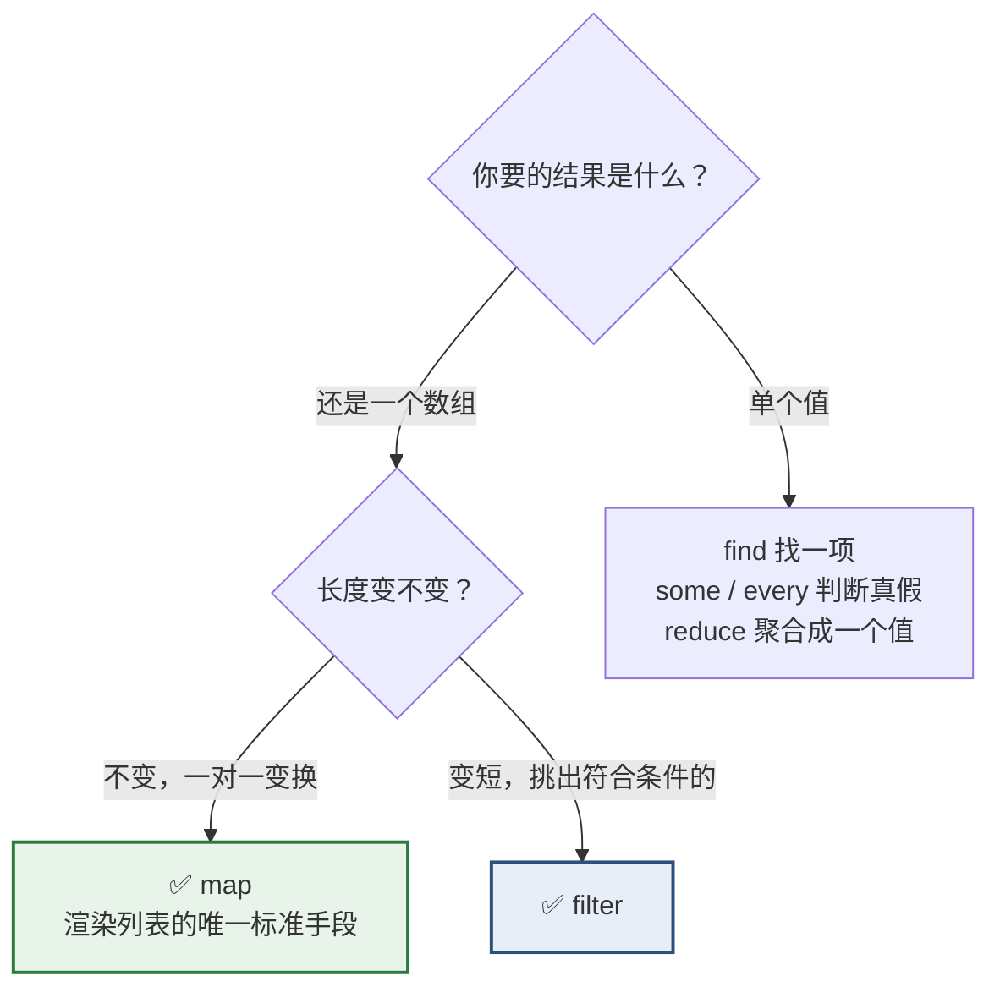
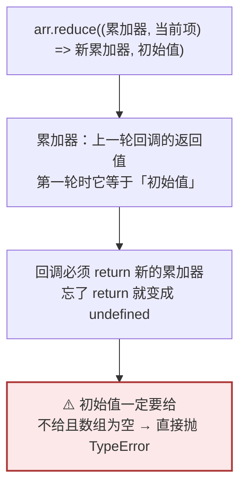
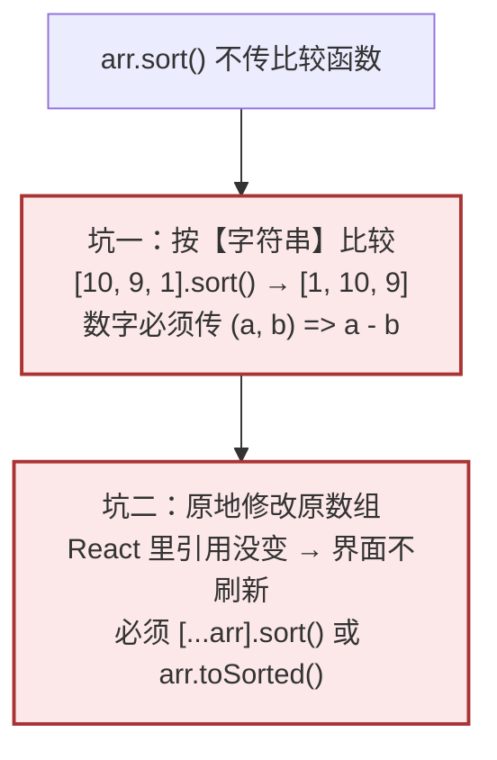

# Day 8 — 数组（一）：读与变换

> **今天的定位**：数组是 React 里最核心的一块，安排两天。今天学「读」，明天学「改」。四个重点：
> 1. **`map`** —— **React 渲染列表 100% 靠它**，没有第二种手段
> 2. **`filter` / `find` / `some` / `every`** —— 筛选与查找，含一个空数组的坑
> 3. **`reduce`** —— 求和、分组统计。初学者最难的一个，今天练三个例子
> 4. **`sort` 的两个坑** —— 默认按**字符串**排序，而且它会**原地修改原数组**。几乎所有教程都不提
>
> **时间**：2 小时
> **前置**：`day2-modules` 项目，`money.js` 和 `obj-utils.js` 今天要用
> **本文所有输出均经 Node.js 24 实测**

## 今天结束时你应该能做到

- [ ] **闭着眼写出 `列表.map((项) => ...)`**
- [ ] 知道 `map` 的第二个参数是索引，以及为什么不该用它当 `key`
- [ ] 熟练用 `filter` / `find` / `findIndex`，知道 `find` 和 `filter[0]` 的区别
- [ ] **知道空数组上 `every` 返回 `true`**（这是个真实的坑）
- [ ] **会用 `reduce` 做求和、分组、转对象三件事**
- [ ] 知道 `reduce` 的初始值为什么一定要给
- [ ] **能说出 `[10, 9, 1].sort()` 为什么得到 `[1, 10, 9]`**
- [ ] **知道 `sort` 会原地修改原数组**，React 里必须先复制
- [ ] 区分 `slice`（不改原）和 `splice`（改原）
- [ ] 知道 `new Array(3).fill([])` 有什么陷阱
- [ ] 会写数组解构：`const [第一, 第二] = 列表`，以及 `useState` 为什么这么接

## 时间分配

| 时段 | 内容 | 时长 |
| --- | --- | --- |
| 1 | 基础与访问 | 15 分钟 |
| 2 | **`map` —— 渲染列表的唯一手段** | 25 分钟 |
| 3 | `filter` / `find` / `some` / `every` | 20 分钟 |
| 4 | **`reduce`** | 25 分钟 |
| 5 | **`sort` 的两个坑** | 20 分钟 |
| 6 | 其余方法与数组解构 | 15 分钟 |

---

# 第 1 节：基础与访问（15 分钟）

## 1.1 创建与读取

新建 `arr.js`，今天全程用这份测试数据：

```js
// 一张价格申请单的明细（金额一律用整数分，Day 3 的规矩）
export const 明细 = [
  { id: 1, 名称: '超声检查A', 单价分: 865, 数量: 3, 状态: '待审核' },
  { id: 2, 名称: '超声检查B', 单价分: 7, 数量: 100, 状态: '已通过' },
  { id: 3, 名称: '超声检查C', 单价分: 435, 数量: 2, 状态: '待审核' },
  { id: 4, 名称: '超声检查D', 单价分: 1200, 数量: 1, 状态: '已驳回' },
]

console.log(明细.length)              // 4
console.log(明细[0].名称)             // '超声检查A'
console.log(明细[99])                 // undefined   ← 越界不报错
```

**越界返回 `undefined` 而不是抛异常** —— 这和 C# 的 `IndexOutOfRangeException` 完全不同。

```js
// ❌ C# 思维：以为越界会抛异常，所以不检查
console.log(明细[99].名称)            // 💥 TypeError: Cannot read properties of undefined
```

**所以取数组元素后要防御**，尤其是「取第一条」这种场景：

```js
console.log(明细[0]?.名称 ?? '无数据')          // '超声检查A'
console.log([][0]?.名称 ?? '无数据')            // '无数据'
```

## 1.2 `at()` —— 取倒数第几个

```js
console.log(明细.at(-1).名称)         // '超声检查D'   最后一个
console.log(明细.at(-2).名称)         // '超声检查C'   倒数第二个
console.log(明细.at(0).名称)          // '超声检查A'

// 老写法，容易写错
console.log(明细[明细.length - 1].名称)         // '超声检查D'
```

**`at(-1)` 比 `arr[arr.length - 1]` 清爽得多**，现代环境直接用。

## 1.3 判断是不是数组

```js
console.log(typeof 明细)              // 'object'   ← 没用（Day 3 讲过）
console.log(Array.isArray(明细))      // true       ✅ 唯一正确的方式
console.log(Array.isArray('abc'))     // false
```

**Day 3 那张「正确的类型判断」表里，这是最常用的一条。**

## 1.4 ⚠️ `length` 可以被赋值（截断数组）

```js
const 临时 = [1, 2, 3, 4, 5]
临时.length = 3
console.log(临时)                     // [ 1, 2, 3 ]   ← 被截断了
```

**这是原地修改，React 里绝对不要用。** 提一下是因为你可能在老代码里见到 `arr.length = 0` 这种「清空数组」的写法。

**React 里清空数组：`setList([])`。**

## 1.5 对照 C#

| C# | JS |
| --- | --- |
| `List<T>` / `T[]` | `Array`（**不区分定长和变长**） |
| `Count` / `Length` | `length` |
| 越界抛 `IndexOutOfRangeException` | **返回 `undefined`，不抛异常** |
| `arr[^1]`（C# 8 索引运算符） | `arr.at(-1)` |
| LINQ `Select` | `map` |
| LINQ `Where` | `filter` |
| LINQ `First` / `FirstOrDefault` | `find` |
| LINQ `Any` / `All` | `some` / `every` |
| LINQ `Aggregate` | `reduce` |
| LINQ **延迟执行** | ❌ **立即执行，每一步都产生真实的新数组** |

> **最后一行值得注意。** LINQ 的 `Where().Select()` 是延迟的，只在枚举时才计算一次。JS 的 `filter().map()` 会**真的产生两个数组** —— 第一个中间数组用完就丢。
>
> 对几百条数据完全无所谓。**上万条时才需要考虑**（那时候通常改用 `reduce` 一次搞定，或者干脆在后端处理）。

---

# 第 2 节：`map` —— 渲染列表的唯一手段（25 分钟）★

## 2.1 三个核心方法的定位



## 2.2 `map` 基础

**`map` 做的事：把 N 项变成另外 N 项，长度永远不变。**

```js
// 取出所有名称
console.log(明细.map((行) => 行.名称))
// [ '超声检查A', '超声检查B', '超声检查C', '超声检查D' ]

// 算每行小计（整数分，精确）
console.log(明细.map((行) => 行.单价分 * 行.数量))
// [ 2595, 700, 870, 1200 ]
```

**`map` 返回新数组，原数组不变：**

```js
const 名称们 = 明细.map((行) => 行.名称)
console.log(明细.length)              // 4   原数组毫发无损
console.log(Object.is(明细, 名称们))  // false
```

## 2.3 返回对象要加圆括号（Day 5 的坑，在这里最常遇到）

```js
// ❌ 忘了圆括号 —— 多个属性时直接语法报错
// const 错 = 明细.map((行) => { 名称: 行.名称, 小计: 行.单价分 * 行.数量 })

// ✅ 加圆括号
const 摘要 = 明细.map((行) => ({
  名称: 行.名称,
  小计分: 行.单价分 * 行.数量,
}))
console.log(摘要[0])                  // { 名称: '超声检查A', 小计分: 2595 }

// ✅ 或者用花括号 + 显式 return（属性多时更好读）
const 摘要2 = 明细.map((行) => {
  return { 名称: 行.名称, 小计分: 行.单价分 * 行.数量 }
})
```

**这是 Day 5 第 2.2 节讲的坑。** 在 `map` 里做「数据结构转换」是它最高频的发生地。

## 2.4 ⚠️ 忘写 `return` 会得到一数组 `undefined`

```js
// ❌ 有花括号却没 return
const 坏结果 = 明细.map((行) => { 行.名称 })
console.log(坏结果)                   // [ undefined, undefined, undefined, undefined ]
```

**不报错，只是全变 `undefined`。** 在 React 里的表现是：列表渲染出来一片空白，控制台没有任何错误。

## 2.5 第二个参数是索引

```js
console.log(明细.map((行, 下标) => `${下标 + 1}. ${行.名称}`))
// [ '1. 超声检查A', '2. 超声检查B', '3. 超声检查C', '4. 超声检查D' ]
```

**用途**：显示行号。**注意行号要 `下标 + 1`**，因为下标从 0 开始。

## 2.6 在 React 里渲染列表

```jsx
<tbody>
  {明细.map((行) => (
    <tr key={行.id}>
      <td>{行.名称}</td>
      <td>{行.数量}</td>
      <td>{分转元(行.单价分 * 行.数量)}</td>
    </tr>
  ))}
</tbody>
```

**三个必须注意的点：**

| 点 | 说明 |
| --- | --- |
| **箭头函数返回 JSX 要加圆括号** | `(行) => (<tr>...</tr>)`，和第 2.3 节同一条规则 |
| **必须给 `key`** | 用数据的唯一 id，**不要用索引** |
| **`map` 是唯一手段** | JSX 里不能写 `for` 循环 |

**为什么不能用索引当 `key`**：明天 Day 9 会详细讲，简短版是「删除中间一项后，输入框里的值会串到别的行上」。**做可编辑表格必然撞上。**

## 2.7 对照 WebForm

| WebForm | React |
| --- | --- |
| `GridView1.DataSource = 明细; DataBind()` | `明细.map(...)` |
| `<ItemTemplate>` 模板 | 就是 `map` 里返回的 JSX |
| 服务器控件帮你生成 `<tr>` | **你自己写 `<tr>`** |
| 回发后重新绑定 | 数据变了自动重渲染 |

> **心理调整**：WebForm 的 `GridView` 帮你做了太多事（分页、排序、编辑模板）。React 里这些都要自己组合，或者用 Ant Design 的 `Table` 组件（阶段 4 第 6 周）。**但底层永远是 `map`。**

---

# 第 3 节：`filter` / `find` / `some` / `every`（20 分钟）

## 3.1 `filter`：筛选

```js
// 筛出待审核的
const 待审核 = 明细.filter((行) => 行.状态 === '待审核')
console.log(待审核.length)            // 2
console.log(待审核.map((行) => 行.名称))   // [ '超声检查A', '超声检查C' ]

// 筛出金额大于 1000 分的
console.log(明细.filter((行) => 行.单价分 * 行.数量 > 1000).map((行) => 行.名称))
// [ '超声检查A', '超声检查D' ]
```

**回调返回真值就保留，假值就丢掉。** 返回的是新数组，原数组不变。

### 一个实用技巧：`filter(Boolean)` 去掉空值

```js
const 有空值的 = ['A001', null, 'A002', undefined, '', 'A003']
console.log(有空值的.filter(Boolean))
// [ 'A001', 'A002', 'A003' ]
```

**原理**：`Boolean` 作为回调，把每项转成布尔值，假值全被过滤掉（Day 4 的假值表）。

**⚠️ 但要小心**：如果数组里有合法的 `0`，它也会被干掉。

```js
console.log([1, 0, 2, null].filter(Boolean))       // [ 1, 2 ]   ← 0 被误删了
console.log([1, 0, 2, null].filter((x) => x != null))  // [ 1, 0, 2 ]   ✅
```

> `x != null` 是 Day 3 讲的「唯一允许用 `==` 的场景」，同时排除 `null` 和 `undefined`。

## 3.2 `find` / `findIndex`：找第一个

```js
console.log(明细.find((行) => 行.id === 3))
// { id: 3, 名称: '超声检查C', 单价分: 435, 数量: 2, 状态: '待审核' }

console.log(明细.findIndex((行) => 行.id === 3))   // 2

console.log(明细.find((行) => 行.id === 999))      // undefined   找不到
console.log(明细.findIndex((行) => 行.id === 999)) // -1          找不到
```

**注意「找不到」的返回值不一样**：`find` 给 `undefined`，`findIndex` 给 `-1`。

### `find` vs `filter(...)[0]`

```js
// 两者结果一样
console.log(明细.find((行) => 行.状态 === '待审核').名称)          // '超声检查A'
console.log(明细.filter((行) => 行.状态 === '待审核')[0].名称)     // '超声检查A'
```

**但 `find` 更好，两个理由：**

1. **`find` 找到就停**，`filter` 会遍历完整个数组
2. **意图更清楚** —— 一看就知道你只要一条

**规矩：只要一条用 `find`，要多条用 `filter`。**

### ★ `findLast` / `findLastIndex`（ES2023）

```js
console.log(明细.findLast((行) => 行.状态 === '待审核').名称)      // '超声检查C'
console.log(明细.findLastIndex((行) => 行.状态 === '待审核'))      // 2
```

从后往前找。**用途**：找「最近一条记录」（假设列表按时间正序）。

## 3.3 `some` / `every`：判断真假

```js
console.log(明细.some((行) => 行.状态 === '已驳回'))     // true    有任一条被驳回
console.log(明细.every((行) => 行.状态 === '已通过'))    // false   不是全部通过
console.log(明细.every((行) => 行.数量 > 0))            // true    全部数量大于 0
```

**对照 C#**：`some` = LINQ 的 `Any`，`every` = `All`。行为一致。

**实务用途**：

```js
// 「全选」复选框的状态
const 全选 = 明细.every((行) => 行.已选中)

// 「提交」按钮能不能点
const 可提交 = 明细.length > 0 && 明细.every((行) => 行.数量 > 0)

// 有没有未保存的改动
const 有改动 = 明细.some((行) => 行.已修改)
```

## 3.4 ⚠️ 空数组上 `every` 返回 `true`

**这是一个真实会出事的坑：**

```js
console.log([].every((行) => 行.数量 > 0))      // true    ⚠️ 空数组「全部满足」
console.log([].some((行) => 行.数量 > 0))       // false   空数组「没有任何一个满足」
```

**数学上这叫「空集上的全称命题恒为真」。** 逻辑没错，但业务上会出问题：

```js
// ❌ 一张明细为空的申请单，居然通过了校验
const 可提交错 = 明细.every((行) => 行.数量 > 0)
// 明细 = [] 时，可提交错 是 true → 允许提交一张空单
```

**修法：先判长度。**

```js
const 可提交 = 明细.length > 0 && 明细.every((行) => 行.数量 > 0)
```

> **规矩：用 `every` 做校验时，一定要配一个 `length > 0`。**

## 3.5 链式调用

```js
// 待审核的行，算出小计，再格式化
const 结果 = 明细
  .filter((行) => 行.状态 === '待审核')
  .map((行) => ({ 名称: 行.名称, 小计分: 行.单价分 * 行.数量 }))
  .map((行) => `${行.名称}: ${(行.小计分 / 100).toFixed(2)} 元`)

console.log(结果)
// [ '超声检查A: 25.95 元', '超声检查C: 8.70 元' ]
```

**因为每一步都返回新数组，所以能一直链下去。**

**注意顺序**：`filter` 放前面能减少后续处理量。

---

# 第 4 节：`reduce`（25 分钟）★

> **初学者最难的一个方法。** 但它是「把一堆东西聚合成一个东西」的通用工具，值得花 25 分钟。

## 4.1 它的形状



## 4.2 例子一：求和（最简单的形态）

```js
// 算所有行的小计总额
const 总额分 = 明细.reduce((累计, 行) => 累计 + 行.单价分 * 行.数量, 0)
//                                                                    ↑ 初始值
console.log(总额分)                   // 5365
console.log((总额分 / 100).toFixed(2))    // '53.65'
```

**逐轮拆解：**

| 轮次 | `累计`（进来时） | `行` | 返回值 |
| --- | --- | --- | --- |
| 1 | `0`（初始值） | A：865×3 | `2595` |
| 2 | `2595` | B：7×100 | `3295` |
| 3 | `3295` | C：435×2 | `4165` |
| 4 | `4165` | D：1200×1 | `5365` |

**最后一轮的返回值就是 `reduce` 的结果。**

**对照 C#**：这就是 LINQ 的 `Aggregate(0, (acc, x) => acc + ...)`，参数顺序都一样。

## 4.3 例子二：按状态分组（企业后台高频）

**需求**：后端返回一个平铺的明细列表，前端要按状态分组显示。

```js
const 按状态分组 = 明细.reduce((分组, 行) => {
  const 键 = 行.状态
  if (!分组[键]) 分组[键] = []          // 这个状态第一次出现，先建个空数组
  分组[键].push(行.名称)
  return 分组                           // ← 别忘了 return
}, {})                                  // ← 初始值是空对象

console.log(按状态分组)
// {
//   待审核: [ '超声检查A', '超声检查C' ],
//   已通过: [ '超声检查B' ],
//   已驳回: [ '超声检查D' ]
// }
```

**注意这里累加器是一个对象，不是数字。** `reduce` 的累加器可以是任何类型。

### ⚠️ 这个写法有个瑕疵：它在修改累加器

`分组[键].push(...)` 是原地修改。**在 `reduce` 内部这是可以接受的**，因为那个累加器是 `reduce` 自己创建的（初始值 `{}`），外面没人持有它。

**但如果你想写得更「纯」：**

```js
const 按状态分组纯 = 明细.reduce(
  (分组, 行) => ({
    ...分组,
    [行.状态]: [...(分组[行.状态] ?? []), 行.名称],
  }),
  {}
)
console.log(按状态分组纯)
// 结果完全一样
```

**这一行里有四个知识点**：展开（Day 7）、计算属性名（Day 7）、`??`（Day 4）、箭头函数返回对象加圆括号（Day 5）。

> **实务选哪个？** 数据量小（几百条以内）两者都行，**第一种更好读、更快**。第二种每轮都新建整个对象，上万条会明显变慢。

### 现代替代品：`Object.groupBy`

```js
const 分组新 = Object.groupBy(明细, (行) => 行.状态)
console.log(Object.keys(分组新))       // [ '待审核', '已通过', '已驳回' ]
console.log(分组新.待审核.length)      // 2
```

**Node 21+ / 现代浏览器已支持。** 分组是如此常见，语言直接内置了。

> **但仍然要会 `reduce`** —— 因为分组只是它的一个用途，而且你会在大量现有代码里见到 `reduce` 分组的写法。

## 4.4 例子三：转成「id → 对象」的查找表

**需求**：有了明细列表，要能按 id 快速取到某一行（避免每次都 `find` 遍历）。

```js
const 按id索引 = 明细.reduce((表, 行) => {
  表[行.id] = 行
  return 表
}, {})

console.log(按id索引[3].名称)          // '超声检查C'
console.log(Object.keys(按id索引))     // [ '1', '2', '3', '4' ]
```

**注意 `Object.keys` 出来是字符串** —— 对象的键永远是字符串（Day 7 第 1.5 节讲过整数键的顺序问题）。

**更好的做法是用 `Map`**（明天 Day 9 讲）：

```js
const 按idMap = new Map(明细.map((行) => [行.id, 行]))
console.log(按idMap.get(3).名称)       // '超声检查C'
```

`Map` 的键保持原类型（数字还是数字），而且顺序可靠。

## 4.5 ⚠️ 初始值不给会出事

```js
// 不给初始值时，第一项被当成初始值
console.log([1, 2, 3].reduce((a, b) => a + b))         // 6    能用
console.log([5].reduce((a, b) => a + b))               // 5    只有一项，直接返回它

// 💥 但空数组会抛异常
try {
  [].reduce((a, b) => a + b)
} catch (e) {
  console.log(e.constructor.name)      // 'TypeError'
  // Reduce of empty array with no initial value
}

// ✅ 给了初始值就安全
console.log([].reduce((a, b) => a + b, 0))             // 0
```

**规矩：`reduce` 永远给初始值。** 空数组在业务里太常见了（新建的申请单、搜索无结果），不给初始值就是埋雷。

## 4.6 ⚠️ 忘写 `return` 的后果

```js
const 坏的 = 明细.reduce((累计, 行) => {
  累计 + 行.单价分                      // 忘了 return
}, 0)
console.log(坏的)                      // undefined
```

**第一轮返回 `undefined`，第二轮累加器就是 `undefined`，一路错到底。**

## 4.7 什么时候不该用 `reduce`

**`reduce` 很强大，所以容易被滥用。**

```js
// ❌ 用 reduce 做 map 能做的事 —— 可读性差
const 名称1 = 明细.reduce((acc, 行) => [...acc, 行.名称], [])

// ✅ 直接用 map
const 名称2 = 明细.map((行) => 行.名称)
```

**规矩：能用 `map` / `filter` 表达的，就不要用 `reduce`。** `reduce` 只在「输出不是数组」时才是最佳选择 —— 求和、分组、转对象、算最大值。

---

# 第 5 节：`sort` 的两个坑（20 分钟）★



## 5.1 坑一：默认按字符串排序

```js
console.log([10, 9, 1, 100, 2].sort())
// [ 1, 10, 100, 2, 9 ]     💥 完全不是数字顺序
```

**为什么**：不传比较函数时，`sort` 把每一项**转成字符串**再按字典序比较。`'10' < '2'`，因为第一个字符 `'1' < '2'`。

**修法：数字必须传比较函数。**

```js
console.log([10, 9, 1, 100, 2].sort((a, b) => a - b))       // [ 1, 2, 9, 10, 100 ]   升序
console.log([10, 9, 1, 100, 2].sort((a, b) => b - a))       // [ 100, 10, 9, 2, 1 ]   降序
```

**比较函数的约定**（和 C# 的 `IComparer` 一样）：

| 返回值 | 含义 |
| --- | --- |
| 负数 | `a` 排在 `b` 前面 |
| `0` | 两者顺序不变 |
| 正数 | `a` 排在 `b` 后面 |

**所以 `a - b` 是升序**（`a` 小则返回负数，`a` 靠前），`b - a` 是降序。**记法：`a - b` 升序。**

## 5.2 坑二：`sort` 原地修改原数组

```js
const 原始 = [3, 1, 2]
const 排序后 = 原始.sort((a, b) => a - b)

console.log(原始)                     // [ 1, 2, 3 ]   ⚠️ 原数组被改了！
console.log(排序后)                   // [ 1, 2, 3 ]
console.log(Object.is(原始, 排序后))  // true          ⚠️ 是同一个数组
```

**`sort` 返回的就是原数组本身**，不是新数组。

### 在 React 里的后果

```jsx
// ❌ 点表头排序，界面不刷新
const 处理排序 = () => {
  明细.sort((a, b) => a.单价分 - b.单价分)
  set明细(明细)      // Object.is 判定「没变化」→ 不重渲染
}
```

**而且更糟**：如果 `明细` 来自 props，你还偷偷改了父组件的数据（Day 5 第 6 节讲的「不纯」）。

### ✅ 两种修法

```js
// 修法一：先复制再排（兼容性最好）
const 安全排序1 = [...原始].sort((a, b) => a - b)

// 修法二：toSorted（ES2023，直接返回新数组）
const 安全排序2 = 原始.toSorted((a, b) => a - b)
```

```js
const 数据 = [3, 1, 2]
const 新的 = [...数据].sort((a, b) => a - b)
console.log(数据)                     // [ 3, 1, 2 ]   ✅ 原数组没被碰
console.log(新的)                     // [ 1, 2, 3 ]
```

**明天 Day 9 会把 `toSorted` 和其他不可变方法一起讲。**

## 5.3 按对象字段排序

```js
// 按单价升序
console.log([...明细].sort((a, b) => a.单价分 - b.单价分).map((行) => 行.单价分))
// [ 7, 435, 865, 1200 ]

// 按名称排序（字符串用 localeCompare）
console.log([...明细].sort((a, b) => a.名称.localeCompare(b.名称, 'zh-CN')).map((行) => 行.名称))
// [ '超声检查A', '超声检查B', '超声检查C', '超声检查D' ]
```

**中文排序必须用 `localeCompare(b, 'zh-CN')`** —— Day 4 第 2.4 节讲过，默认按 UTF-16 编码排，不是拼音。

## 5.4 多字段排序

**需求**：先按状态排，状态相同的按金额降序。

```js
const 状态顺序 = { 待审核: 1, 已通过: 2, 已驳回: 3 }

const 多字段 = [...明细].sort((a, b) => {
  // 第一优先级：状态
  const 状态差 = 状态顺序[a.状态] - 状态顺序[b.状态]
  if (状态差 !== 0) return 状态差

  // 第二优先级：金额降序
  return b.单价分 * b.数量 - a.单价分 * a.数量
})

console.log(多字段.map((行) => `${行.状态}-${行.单价分 * 行.数量}`))
// [ '待审核-2595', '待审核-870', '已通过-700', '已驳回-1200' ]
```

**模式**：按优先级依次比较，前一级分不出胜负（差为 0）才看下一级。

> **注意 `状态顺序` 这张表** —— 因为「待审核 / 已通过 / 已驳回」的业务顺序不等于拼音顺序，必须自己定义权重。做后台的状态列排序基本都要这么干。

## 5.5 ★ `sort` 是稳定的

```js
// 相同排序键的项，保持原有相对顺序
const 稳定测试 = [
  { 名: 'a', 组: 1 },
  { 名: 'b', 组: 1 },
  { 名: 'c', 组: 1 },
]
console.log([...稳定测试].sort((x, y) => x.组 - y.组).map((v) => v.名))
// [ 'a', 'b', 'c' ]   ✅ 顺序没被打乱
```

**ES2019 起标准要求 `sort` 稳定**，所有现代环境都满足。这意味着「先按 A 排，再按 B 排」可以分两次做（虽然一次写清楚更好）。

---

# 第 6 节：其余方法与数组解构（15 分钟）

## 6.1 `slice`（不改原）vs `splice`（改原）

**名字像，行为完全相反。**

```js
const 原 = [1, 2, 3, 4, 5]

// slice(起, 止) —— 截取，不含止，不改原数组
console.log(原.slice(1, 3))           // [ 2, 3 ]
console.log(原.slice(-2))             // [ 4, 5 ]     负数从末尾算
console.log(原)                       // [ 1,2,3,4,5 ] ✅ 没变

// splice(起, 删几个, ...插入) —— 原地修改！
const 原2 = [1, 2, 3, 4, 5]
const 被删 = 原2.splice(1, 2)
console.log(被删)                     // [ 2, 3 ]     返回的是被删掉的
console.log(原2)                      // [ 1, 4, 5 ]  ⚠️ 原数组变了
```

| | `slice` | `splice` |
| --- | --- | --- |
| 改原数组 | ❌ 不改 | ✅ **原地改** |
| 返回 | 截取出来的新数组 | **被删掉的那些** |
| React 能用吗 | ✅ 能 | ❌ **不能** |

**记法：`splice` 多一个字母 `p`，可以联想成 "**p**ollute"（污染原数组）。**

## 6.2 `forEach`：只做副作用

```js
// forEach 返回 undefined，不能链式，不能 break
明细.forEach((行) => {
  console.log(行.名称)                // 只是打印，不产出新数据
})

console.log(明细.forEach((行) => 行.名称))     // undefined
```

**什么时候用 `forEach`**：只做副作用（打印日志、往外部推数据），不需要返回值。

**什么时候不用**：

| 想做的事 | 用什么 |
| --- | --- |
| 产出新数组 | `map` |
| 筛选 | `filter` |
| 聚合成一个值 | `reduce` |
| **需要提前退出** | **`for...of` + `break`** |

```js
// ❌ forEach 里不能 break
// 明细.forEach((行) => { if (行.id === 2) break })     // 语法错误

// ✅ 用 for...of
for (const 行 of 明细) {
  if (行.id === 2) {
    console.log('找到了，退出')
    break
  }
}
```

## 6.3 `includes` / `indexOf` / `join`

```js
const 状态列表 = ['待审核', '已通过', '已驳回']

console.log(状态列表.includes('已通过'))      // true
console.log(状态列表.indexOf('已通过'))       // 1
console.log(状态列表.indexOf('不存在'))       // -1
console.log(状态列表.join(' / '))             // '待审核 / 已通过 / 已驳回'
console.log(状态列表.join(''))                // '待审核已通过已驳回'
```

### ⚠️ `NaN` 的差别

```js
console.log([NaN].includes(NaN))       // true    ✅
console.log([NaN].indexOf(NaN))        // -1      ⚠️ 找不到
```

**因为 `indexOf` 用 `===` 比较，而 `NaN !== NaN`**（Day 3 讲过）；`includes` 用的是类似 `Object.is` 的算法。

**规矩：判断「在不在」一律用 `includes`。**

## 6.4 `flat` / `flatMap`

```js
console.log([1, [2, [3, [4]]]].flat())         // [ 1, 2, [ 3, [ 4 ] ] ]   默认只拍平一层
console.log([1, [2, [3, [4]]]].flat(2))        // [ 1, 2, 3, [ 4 ] ]
console.log([1, [2, [3, [4]]]].flat(Infinity)) // [ 1, 2, 3, 4 ]           全拍平

// flatMap = map 之后自动 flat 一层
const 所有标签 = [
  { 名称: 'A', 标签: ['急', '重要'] },
  { 名称: 'B', 标签: ['普通'] },
]
console.log(所有标签.flatMap((x) => x.标签))   // [ '急', '重要', '普通' ]
console.log(所有标签.map((x) => x.标签))       // [ [ '急', '重要' ], [ '普通' ] ]
```

**`flatMap` 的用途**：「每项展开成 0 到多项」。比如把所有明细的标签汇总去重。

## 6.5 `Array.from` 与 `fill` 的陷阱

```js
// 生成 0..4
console.log(Array.from({ length: 5 }, (_, i) => i))     // [ 0, 1, 2, 3, 4 ]

// 生成分页页码 1..5
console.log(Array.from({ length: 5 }, (_, i) => i + 1)) // [ 1, 2, 3, 4, 5 ]

// 字符串转字符数组
console.log(Array.from('abc'))                          // [ 'a', 'b', 'c' ]
console.log([...'abc'])                                 // [ 'a', 'b', 'c' ]  展开也行
```

### ⚠️ `fill` 填对象时是同一个引用

```js
const 三个数组 = new Array(3).fill([])
三个数组[0].push('x')
console.log(三个数组)
// [ [ 'x' ], [ 'x' ], [ 'x' ] ]     💥 三个是同一个数组！

// ✅ 用 Array.from 每次新建
const 独立三个 = Array.from({ length: 3 }, () => [])
独立三个[0].push('x')
console.log(独立三个)
// [ [ 'x' ], [], [] ]               ✅ 互相独立
```

**`fill` 只是把同一个值放进每个位置** —— 对象是引用（Day 3），所以三个位置指向同一个对象。

**规矩：填原始值（`0`、`''`、`null`）用 `fill`；填对象或数组一律用 `Array.from`。**

## 6.6 数组解构

```js
const [第一, 第二] = 明细
console.log(第一.名称, 第二.名称)     // 超声检查A 超声检查B

// 跳过某些位置（逗号占位）
const [, , 第三] = 明细
console.log(第三.名称)                // '超声检查C'

// 剩余
const [头, ...尾] = 明细
console.log(头.名称, 尾.length)       // 超声检查A 3

// 默认值
const [甲 = '默认', 乙 = '默认'] = ['只有一个']
console.log(甲, 乙)                   // 只有一个 默认

// 交换两个变量（不需要临时变量）
let x = 1, y = 2
;[x, y] = [y, x]
console.log(x, y)                     // 2 1
```

### ⭐ 这就是 `useState` 的接收方式

```jsx
const [count, setCount] = useState(0)
```

**`useState` 返回的是一个两元素数组** `[当前值, 设置函数]`，你用数组解构接住它。

**因为是数组解构，名字完全由你定**（不像对象解构必须对上键名）：

```jsx
const [数量, 设数量] = useState(0)          // ✅ 随便起名
const [列表, 设列表] = useState([])
```

用纯 JS 模拟：

```js
const 模拟useState = (初始值) => [初始值, (新值) => console.log('设置为', 新值)]

const [数量, 设数量] = 模拟useState(0)
console.log(数量)                     // 0
设数量(5)                             // 设置为 5
```

### 对象数组的解构（Day 7 用过）

```js
console.log(Object.entries({ a: 1, b: 2 }).map(([键, 值]) => `${键}=${值}`))
// [ 'a=1', 'b=2' ]
```

`([键, 值])` 就是「参数位置上对 `[键, 值]` 做数组解构」。

---

# 今日验收清单

- [ ] `arr.js` 建好了，`明细` 测试数据准备好
- [ ] 知道数组越界返回 `undefined` 而不抛异常，所以取元素后要用 `?.`
- [ ] 会用 `at(-1)` 取最后一项
- [ ] 知道判断数组只能用 `Array.isArray`
- [ ] **`map` 写熟了**，知道它返回新数组、长度不变
- [ ] **`map` 里返回对象会加圆括号 `(行) => ({ ... })`**
- [ ] 知道 `map` 里有花括号却忘 `return` 会得到一数组 `undefined`
- [ ] 知道 `map` 第二个参数是索引，但**不该用它当 `key`**
- [ ] 会用 `filter`，知道 `filter(Boolean)` 会误删合法的 `0`
- [ ] **知道只要一条用 `find`（找到就停），要多条用 `filter`**
- [ ] 知道 `find` 找不到给 `undefined`、`findIndex` 给 `-1`
- [ ] **知道空数组上 `every` 返回 `true`**，做校验必须配 `length > 0`
- [ ] **`reduce` 三个例子都写过**：求和、分组、转查找表
- [ ] 知道 `reduce` 必须给初始值（空数组不给会抛 `TypeError`）
- [ ] 知道能用 `map`/`filter` 表达的就别用 `reduce`
- [ ] 知道有 `Object.groupBy` 这个现代替代品
- [ ] **能解释 `[10, 9, 1].sort()` 得到 `[1, 10, 9]`**
- [ ] 记住 `a - b` 是升序
- [ ] **验证过 `sort` 原地修改原数组**，`Object.is(原, 排序后)` 是 `true`
- [ ] 会写 `[...数组].sort(...)` 和多字段排序
- [ ] 中文排序会用 `localeCompare(b, 'zh-CN')`
- [ ] 区分 `slice`（不改原）和 `splice`（改原）
- [ ] 知道 `forEach` 不能 `break`，要提前退出用 `for...of`
- [ ] 知道判断存在一律用 `includes`（`indexOf` 找不到 `NaN`）
- [ ] **知道 `new Array(3).fill([])` 三项是同一个数组**，要用 `Array.from`
- [ ] 会写数组解构，能说出 `useState` 为什么用 `const [a, b] =` 接

---

# 常见问题排查

## 列表渲染出来一片空白，控制台没报错

`map` 里有花括号却忘了 `return`，得到一数组 `undefined`。第 2.4 节。

## `map` 里返回对象报语法错误

忘了加圆括号，要写 `(行) => ({ ... })`。第 2.3 节。

## 排序结果不对，`[10, 9, 1]` 排成了 `[1, 10, 9]`

`sort` 默认按字符串比较。数字要传 `(a, b) => a - b`。第 5.1 节。

## 点表头排序后界面不刷新

`sort` 原地修改，引用没变。用 `[...数组].sort(...)`。第 5.2 节。

## 中文列表排序顺序不对

用 `localeCompare(b, 'zh-CN')`。第 5.3 节 / Day 4 第 2.4 节。

## `Reduce of empty array with no initial value`

`reduce` 没给初始值，且数组为空。永远给初始值。第 4.5 节。

## `reduce` 结果是 `undefined`

回调里忘了 `return` 累加器。第 4.6 节。

## 一张空明细的单子通过了「全部数量大于 0」的校验

空数组上 `every` 返回 `true`。要配 `length > 0`。第 3.4 节。

## `Cannot read properties of undefined (reading 'xxx')` 且涉及数组

数组越界或为空，取 `[0]` 得到 `undefined`。用 `数组[0]?.字段 ?? 默认值`。第 1.1 节。

## 用 `new Array(n).fill([])` 建的二维数组，改一行全变了

`fill` 填的是同一个引用。用 `Array.from({length: n}, () => [])`。第 6.5 节。

## `filter(Boolean)` 把数量为 0 的行删掉了

`0` 是假值。改用 `filter((x) => x != null)`。第 3.1 节。

## `indexOf` 找不到 `NaN`

`indexOf` 用 `===`，而 `NaN !== NaN`。用 `includes`。第 6.3 节。

---

# 今天不需要理解的东西

| 你会看到 | 什么时候学 |
| --- | --- |
| **不可变更新五式**（增删改的正确写法） | **明天 Day 9** |
| `key` 为什么不能用索引 | 明天 Day 9 |
| `toSorted` / `toReversed` / `with` | 明天 Day 9 |
| `Map` / `Set` 怎么用 | 明天 Day 9 |
| `useState` 内部怎么实现 | 阶段 4 第 1 周 |
| 迭代器协议、`Symbol.iterator` | **永远不用** |
| `Array.prototype` 上其余几十个方法 | 用到再查 |
| 数组的性能优化（大数据量虚拟滚动） | 阶段 4 之后，遇到再说 |

---

# 作业（25 分钟）

## 作业 1：写五个数组工具函数

新建 `arr-utils.js`（`明细` 从 `arr.js` 导入）：

```js
/**
 * 算总额（整数分）。空数组返回 0
 * 总额分([{单价分:865,数量:3},{单价分:7,数量:100}]) → 3295
 */
export function 总额分(明细) {
  // TODO：用 reduce，别忘初始值
}

/**
 * 按指定字段分组，返回 { 字段值: [项, 项] }
 * 分组(明细, '状态') → { 待审核: [...], 已通过: [...] }
 */
export function 分组(数组, 字段) {
  // TODO
}

/**
 * 安全取第一项的某个字段，取不到返回默认值
 * 首项字段([], '名称', '无') → '无'
 */
export function 首项字段(数组, 字段, 默认值) {
  // TODO：提示用 ?. 和 ??
}

/**
 * 按字段排序，不修改原数组。中文要按拼音排
 * 排序(明细, '名称') → 新数组
 * 排序(明细, '单价分', true) → 降序
 */
export function 排序(数组, 字段, 降序 = false) {
  // TODO：数字和字符串要分别处理
}

/**
 * 校验：非空 且 每一项的指定字段都大于 0
 * 全部有效([], '数量') → false（空数组不算有效）
 */
export function 全部有效(数组, 字段) {
  // TODO：注意第 3.4 节那个坑
}
```

自测：

| 调用 | 期望 |
| --- | --- |
| `总额分(明细)` | `5365` |
| `总额分([])` | `0` |
| `Object.keys(分组(明细, '状态'))` | `['待审核','已通过','已驳回']` |
| `首项字段([], '名称', '无')` | `'无'` |
| `排序(明细, '单价分').map(r => r.单价分)` | `[7, 435, 865, 1200]` |
| `排序(明细, '单价分', true).map(r => r.单价分)` | `[1200, 865, 435, 7]` |
| `排序(明细, '名称')` 后原数组顺序 | **不变** |
| `全部有效(明细, '数量')` | `true` |
| `全部有效([], '数量')` | **`false`** |

<details>
<summary>提示（卡住了再看）</summary>

- 总额分：`数组.reduce((和, 行) => 和 + 行.单价分 * 行.数量, 0)`
- 分组：`Object.groupBy(数组, (行) => 行[字段])`，或用 `reduce` 手写
- 首项字段：`数组[0]?.[字段] ?? 默认值` —— 注意 `?.[` 这个形态（Day 4）
- 排序：先 `[...数组]`，比较函数里判断 `typeof 值 === 'number'` 决定用 `a-b` 还是 `localeCompare`
- 全部有效：`数组.length > 0 && 数组.every((行) => 行[字段] > 0)`

</details>

## 作业 2：找出并修复 8 个问题

```jsx
function 明细表({ 明细, 排序字段 }) {
  // 问题区
  明细.sort((a, b) => a[排序字段] - b[排序字段])

  const 小计列表 = 明细.map((行) => { 行.单价分 * 行.数量 })

  const 摘要 = 明细.map((行) => { 名称: 行.名称, 小计: 行.单价分 * 行.数量 })

  const 总额 = 明细.reduce((和, 行) => 和 + 行.单价分 * 行.数量)

  const 可提交 = 明细.every((行) => 行.数量 > 0)

  const 首行名称 = 明细[0].名称

  const 待审核 = 明细.filter((行) => 行.状态 === '待审核')[0]

  return (
    <table>
      <tbody>
        {明细.map((行, i) => (
          <tr key={i}>
            <td>{行.名称}</td>
            <td>{总额}</td>
          </tr>
        ))}
      </tbody>
    </table>
  )
}
```

<details>
<summary>点开看答案</summary>

| # | 问题 | 修复 |
| --- | --- | --- |
| 1 | `明细.sort(...)` **原地修改 props**，且引用不变界面不刷新，还污染了父组件数据 | `const 已排序 = [...明细].sort(...)` |
| 2 | `map` 有花括号没 `return` → `小计列表` 全是 `undefined` | `(行) => 行.单价分 * 行.数量` |
| 3 | `map` 返回对象没加圆括号 → 语法错误 | `(行) => ({ 名称: ..., 小计: ... })` |
| 4 | `reduce` 没给初始值 → 空明细时抛 `TypeError` | `.reduce((和, 行) => ..., 0)` |
| 5 | `every` 在空数组上返回 `true` → 空单也能提交 | `明细.length > 0 && 明细.every(...)` |
| 6 | `明细[0].名称` 空数组时崩 | `明细[0]?.名称 ?? '无'` |
| 7 | `filter(...)[0]` 应该用 `find`，而且没处理找不到的情况 | `明细.find((行) => 行.状态 === '待审核')` |
| 8 | `key={i}` **用索引当 key** —— 删除中间项后输入框值会串行 | `key={行.id}` |

**参考修复版：**

```jsx
function 明细表({ 明细, 排序字段 }) {
  const 已排序 = [...明细].sort((a, b) => a[排序字段] - b[排序字段])

  const 小计列表 = 已排序.map((行) => 行.单价分 * 行.数量)

  const 摘要 = 已排序.map((行) => ({
    名称: 行.名称,
    小计: 行.单价分 * 行.数量,
  }))

  const 总额 = 已排序.reduce((和, 行) => 和 + 行.单价分 * 行.数量, 0)

  const 可提交 = 已排序.length > 0 && 已排序.every((行) => 行.数量 > 0)

  const 首行名称 = 已排序[0]?.名称 ?? '无'

  const 待审核 = 已排序.find((行) => 行.状态 === '待审核')

  return (
    <table>
      <tbody>
        {已排序.map((行) => (
          <tr key={行.id}>
            <td>{行.名称}</td>
            <td>{总额}</td>
          </tr>
        ))}
      </tbody>
    </table>
  )
}
```

**第 1 个最严重** —— 它同时犯了三个错：改 props、引用不变、界面不刷新。

</details>

## 作业 3：预测输出（先写答案，再运行）

```js
console.log('①', [10, 9, 1, 100, 2].sort())
console.log('②', [10, 9, 1, 100, 2].sort((a, b) => a - b))

const 原 = [3, 1, 2]
const 排 = 原.sort((a, b) => a - b)
console.log('③', 原, Object.is(原, 排))

console.log('④', [].every((x) => x > 0))
console.log('⑤', [].some((x) => x > 0))

console.log('⑥', [1, 2, 3].map((x) => { x * 2 }))
console.log('⑦', [1, 0, 2, null, ''].filter(Boolean))

console.log('⑧', [NaN].includes(NaN), [NaN].indexOf(NaN))

const 三 = new Array(3).fill([])
三[0].push('x')
console.log('⑨', JSON.stringify(三))

console.log('⑩', [1, [2, [3]]].flat())

const a1 = [1, 2, 3, 4, 5]
console.log('⑪', a1.slice(1, 3), a1.length)
const a2 = [1, 2, 3, 4, 5]
console.log('⑫', a2.splice(1, 2), a2)

console.log('⑬', [5].reduce((a, b) => a + b))
```

<details>
<summary>点开看答案</summary>

```
① [ 1, 10, 100, 2, 9 ]        💥 按字符串排的
② [ 1, 2, 9, 10, 100 ]        ✅ 传了比较函数
③ [ 1, 2, 3 ] true            ⚠️ 原数组被改了，且返回的是它本身
④ true                        ⚠️ 空数组「全部满足」
⑤ false                       空数组「没有任何一个满足」
⑥ [ undefined, undefined, undefined ]   忘了 return
⑦ [ 1, 2 ]                    ⚠️ 0 和 '' 都被当假值删了
⑧ true -1                     includes 认 NaN，indexOf 不认
⑨ [["x"],["x"],["x"]]         💥 fill 填的是同一个数组
⑩ [ 1, 2, [ 3 ] ]             flat 默认只拍一层
⑪ [ 2, 3 ] 5                  slice 不改原数组
⑫ [ 2, 3 ] [ 1, 4, 5 ]        splice 返回被删的，且原数组变了
⑬ 5                           只有一项，不给初始值也能返回它
```

**③ 是今天最重要的一条** —— `sort` 原地修改，而且 `Object.is` 为 `true`，这就是「点表头排序界面不刷新」的根源。

**⑪⑫ 对照看**，就记住了 `slice` 和 `splice` 的区别。

**⑬ 顺带说明**：`[5].reduce((a,b)=>a+b)` 不报错是因为数组非空，第一项被当初始值。但 `[].reduce(...)` 就会抛 `TypeError` —— 所以初始值必须给。

</details>

## 作业 4：一句话回答（写在笔记里）

1. 我在组件里写 `明细.sort((a,b) => a.金额 - b.金额)` 然后 `set明细(明细)`，界面为什么不刷新？还有什么别的隐患？
2. 我要判断「所有明细行的数量都填了」，写 `明细.every(行 => 行.数量 > 0)`。有什么问题？
3. 我只想找出第一条待审核的记录，用 `filter` 还是 `find`？为什么？
4. `new Array(3).fill({})` 建出来的三个对象，改第一个会影响另外两个吗？为什么？
5. `明细.map(行 => { 名称: 行.名称 })` 为什么得不到我想要的结果？

<details>
<summary>点开看参考答案</summary>

1. **因为 `sort` 是原地修改，数组的引用没变**，`Object.is(旧, 新)` 为 `true`，React 判定「没变化」跳过渲染。**另外两个隐患**：① 如果 `明细` 来自 props，你偷偷改了父组件的数据（违反组件必须纯函数）；② 别的地方如果也在用这个数组，会莫名其妙看到顺序变了。正确写法 `[...明细].sort(...)` 或 `明细.toSorted(...)`。

2. **空数组时 `every` 返回 `true`** —— 一张还没添加任何明细的空单，会被判定为「所有行的数量都填了」，于是允许提交。必须写 `明细.length > 0 && 明细.every(...)`。

3. **用 `find`。** 两个理由：① `find` 找到第一个就停止遍历，`filter` 会走完整个数组；② 意图更清楚，`filter(...)[0]` 还得额外考虑空数组时 `[0]` 是 `undefined` 的问题。

4. **会影响。** `fill` 只是把**同一个对象**放进三个位置，三项指向同一个引用（Day 3 的引用语义）。要三个独立对象必须用 `Array.from({length: 3}, () => ({}))`。

5. **因为箭头函数用了花括号，`{ 名称: 行.名称 }` 被当成了函数体而不是对象字面量**，而且里面 `名称:` 被解析成标签，函数没有 `return` 任何东西。要写 `行 => ({ 名称: 行.名称 })`，用圆括号包住对象。

</details>

---

# 明天预告：Day 9 — 数组（二）：不可变更新五式

明天是**今天的另一半** —— 学「怎么改」。四个重点：

1. **不可变更新五式** —— 增、删、改、插入、排序。**不用背，全部从 Day 3 的 `Object.is` 推导**
2. **禁用的原地修改方法** —— `push` / `pop` / `splice` / `sort` / `reverse` 为什么在 React 里不能用
3. **`key` 的规则** —— 为什么不能用数组索引，以及「表格 + 可编辑单元格」为什么必然撞上这个坑
4. **`Map` / `Set`** —— 什么时候它们比对象和数组更合适

`arr.js` 和 `arr-utils.js` 明天都要用，别删。

---

## 参考来源

- [MDN：Array](https://developer.mozilla.org/zh-CN/docs/Web/JavaScript/Reference/Global_Objects/Array)
- [MDN：Array.prototype.reduce](https://developer.mozilla.org/zh-CN/docs/Web/JavaScript/Reference/Global_Objects/Array/reduce)
- [MDN：Array.prototype.sort](https://developer.mozilla.org/zh-CN/docs/Web/JavaScript/Reference/Global_Objects/Array/sort)
- [React 官方文档：渲染列表](https://react.dev/learn/rendering-lists)

> 上述来源的内容已经过改写与归纳，以符合许可要求。
