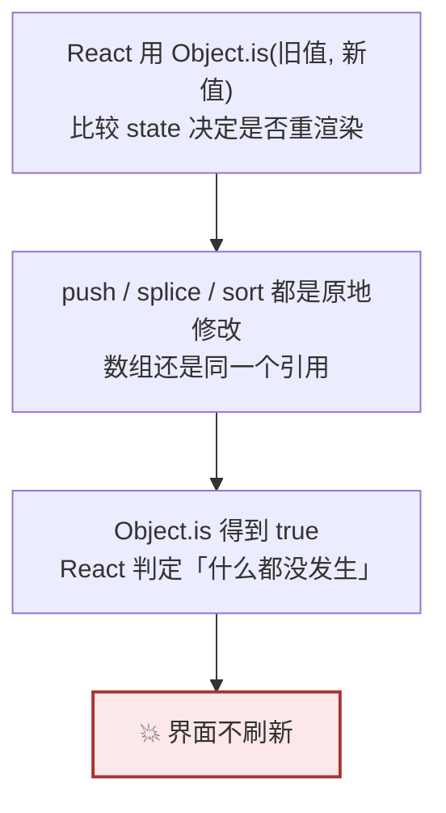
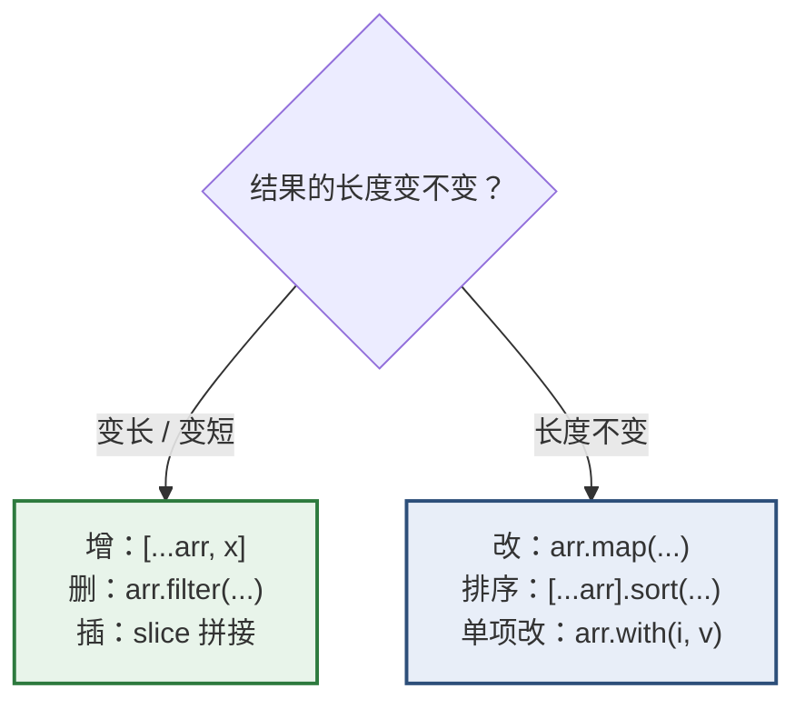
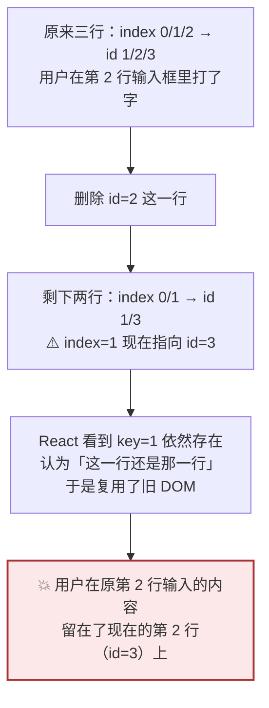

# Day 9 — 数组（二）：不可变更新五式

> **今天的定位**：昨天学「读」，今天学「改」。四个重点：
> 1. **不可变更新五式** —— 增、删、改、插入、排序。**不用背，全部从 Day 3 的 `Object.is` 推导出来**
> 2. **禁用的原地修改方法** —— `push` / `splice` / `sort` / `reverse` 为什么在 React 里不能用
> 3. **`key` 的规则** —— 为什么不能用数组索引，以及「表格 + 可编辑单元格」为什么**必然**撞上这个坑
> 4. **`Map` / `Set`** —— 什么时候它们比对象和数组更合适
>
> **时间**：2 小时
> **前置**：`day2-modules` 项目，`arr.js` 和 `arr-utils.js` 今天要用
> **本文所有输出均经 Node.js 24 实测**

## 今天结束时你应该能做到

- [ ] **能自己推导出五式，不靠背**
- [ ] 闭着眼写出增、删、改三种写法
- [ ] 会写「明细行上移 / 下移」这种企业后台常见操作
- [ ] **能列出全部 7 个禁用方法**，并说出为什么禁
- [ ] 会用 `toSorted` / `toReversed` / `with` / `toSpliced`
- [ ] **能解释「用 index 当 key，删除中间行后输入框值会串行」**
- [ ] 知道新增行还没有 id 时 `key` 该怎么给
- [ ] 知道什么时候该用 `Map` 而不是普通对象
- [ ] **知道 `Set` / `Map` 放进 state 时也要不可变更新**
- [ ] 知道 `for...in` 用在数组上是错的

## 时间分配

| 时段 | 内容 | 时长 |
| --- | --- | --- |
| 1 | 为什么必须不可变（推导） | 15 分钟 |
| 2 | **五式** | 30 分钟 |
| 3 | 禁用的原地修改方法 | 15 分钟 |
| 4 | ES2023 不可变新方法 | 15 分钟 |
| 5 | **`key` 的规则** | 25 分钟 |
| 6 | `Map` / `Set` | 20 分钟 |

---

# 第 1 节：为什么必须不可变（15 分钟）

## 1.1 一条规则推出全部



**这就是 Day 3 第 5.3 节讲的那条规则。今天所有写法都是它的推论。**

## 1.2 亲手验证

新建 `mutate.js`：

```js
const 原始 = [1, 2, 3]

// ❌ 原地修改：引用不变
const 推入后 = 原始
推入后.push(4)
console.log(Object.is(原始, 推入后))       // true    → React 认为「没变化」
console.log(原始)                          // [ 1, 2, 3, 4 ]  原数组也被改了

// ✅ 造新数组：引用变了
const 原始2 = [1, 2, 3]
const 展开后 = [...原始2, 4]
console.log(Object.is(原始2, 展开后))      // false   → React 会重渲染
console.log(原始2)                         // [ 1, 2, 3 ]     原数组没被碰
```

**两行 `Object.is` 的输出就是全部理由。**

## 1.3 在 React 里的两种症状

```jsx
// ❌ 症状一：界面不刷新
const 添加 = (新行) => {
  明细.push(新行)
  set明细(明细)                 // 引用没变 → 不重渲染
}

// ❌ 症状二：改了父组件的数据（更隐蔽）
function 子组件({ 明细 }) {
  明细.sort(...)                // props 是引用，你改的是父组件那个数组
}
```

**症状二更麻烦**，因为它不报错、界面也可能正常，但数据在你意料之外被改了。这违反了 Day 5 第 6 节「组件必须是纯函数」。

## 1.4 对照 C#

| C# | JS / React |
| --- | --- |
| `List<T>.Add()` 原地加，正常做法 | ❌ `push` 在 React 里不能用 |
| `List<T>.Sort()` 原地排，正常做法 | ❌ `sort` 在 React 里不能用 |
| 需要不变时用 `ImmutableList<T>` | **默认就要求不可变** |
| `readonly` 只锁引用 | `const` 只锁绑定（Day 3） |

> **这是你 20 年习惯里最需要改的一条。** C# 里「拿到集合就地改」是天经地义的；React 里这是 bug。
>
> **好消息**：改完这个习惯，你会发现调试变简单了 —— 因为数据永远不会被别人偷偷改掉。

---

# 第 2 节：五式（30 分钟）★



## 2.0 速查表（先看这张，再看细节）

| 操作 | 写法 |
| --- | --- |
| 增（尾部） | `[...明细, 新行]` |
| 增（头部） | `[新行, ...明细]` |
| 删 | `明细.filter((行) => 行.id !== id)` |
| 改某一项 | `明细.map((行) => (行.id === id ? { ...行, 字段: 值 } : 行))` |
| 插入到位置 i | `[...明细.slice(0, i), 新行, ...明细.slice(i)]` |
| 排序 | `[...明细].sort(比较)` 或 `明细.toSorted(比较)` |
| 清空 | `[]` |

沿用昨天的测试数据：

```js
const 明细 = [
  { id: 1, 名称: '超声检查A', 单价分: 865, 数量: 3, 状态: '待审核' },
  { id: 2, 名称: '超声检查B', 单价分: 7, 数量: 100, 状态: '已通过' },
  { id: 3, 名称: '超声检查C', 单价分: 435, 数量: 2, 状态: '待审核' },
]
```

## 2.1 第一式：增

```js
const 新行 = { id: 4, 名称: '超声检查D', 单价分: 1200, 数量: 1, 状态: '待审核' }

// 加到尾部（最常见）
const 加尾 = [...明细, 新行]
console.log(加尾.length)                   // 4
console.log(明细.length)                   // 3   ✅ 原数组没变

// 加到头部（新记录显示在最前面时用）
const 加头 = [新行, ...明细]
console.log(加头[0].名称)                  // '超声检查D'

// 一次加多条
const 加多条 = [...明细, ...另一批]
```

**React 里：**

```jsx
const 添加行 = (新行) => {
  set明细((旧) => [...旧, 新行])           // ← Day 6 的函数式更新
}
```

> **为什么用 `set明细((旧) => ...)` 而不是 `set明细([...明细, 新行])`？**
>
> Day 6 第 4.5 节讲过：连续调用两次时，闭包里的 `明细` 是同一轮的旧值，第二次会覆盖第一次。用函数式更新才能连续追加。

## 2.2 第二式：删

```js
// 按 id 删
const 删掉2 = 明细.filter((行) => 行.id !== 2)
console.log(删掉2.map((行) => 行.id))      // [ 1, 3 ]

// 按条件批量删（删掉所有已通过的）
const 删已通过 = 明细.filter((行) => 行.状态 !== '已通过')
console.log(删已通过.length)                // 2

// 按下标删（较少用，但企业后台的「删除这一行」按钮有时只有下标）
const 下标 = 1
const 按下标删 = 明细.filter((_, i) => i !== 下标)
console.log(按下标删.map((行) => 行.id))   // [ 1, 3 ]
```

**注意 `filter` 的语义是「保留满足条件的」**，所以删除要写 `!==` 而不是 `===`。这是最容易写反的地方。

## 2.3 第三式：改（企业后台最高频）

```js
// 改某一行的状态
const 审核通过 = 明细.map((行) => (行.id === 1 ? { ...行, 状态: '已通过' } : 行))
console.log(审核通过[0].状态)              // '已通过'
console.log(明细[0].状态)                  // '待审核'  ✅ 原数组没变

// 改多个字段
const 改多字段 = 明细.map((行) =>
  行.id === 1 ? { ...行, 状态: '已通过', 审核人: '李四' } : 行
)

// 批量改（全部通过）
const 全部通过 = 明细.map((行) => ({ ...行, 状态: '已通过' }))
console.log(全部通过.every((行) => 行.状态 === '已通过'))    // true
```

**拆解 `明细.map((行) => (行.id === id ? { ...行, 字段: 值 } : 行))`：**

| 部分 | 作用 |
| --- | --- |
| `map` | 长度不变，一对一变换 |
| `行.id === id ?` | 是目标行吗 |
| `{ ...行, 字段: 值 }` | 是 → **造一个新对象**，只改指定字段 |
| `: 行` | 不是 → **原样返回，不造新对象** |

**最后那个 `: 行` 很重要** —— 没改动的行保持原引用，React 可以跳过它们的重渲染，性能更好。

> **常见错误：`: { ...行 }`** —— 给每一行都造新对象，等于告诉 React「所有行都变了」，白白重渲染整张表。

## 2.4 第四式：插入到指定位置

```js
const 插到中间 = [...明细.slice(0, 1), 新行, ...明细.slice(1)]
console.log(插到中间.map((行) => 行.id))   // [ 1, 4, 2, 3 ]
```

**读法**：「前半段 + 新项 + 后半段」。`slice(0, i)` 取前 i 个，`slice(i)` 取第 i 个及之后。

**封装成函数更好用：**

```js
const 插入 = (数组, 位置, 项) => [...数组.slice(0, 位置), 项, ...数组.slice(位置)]
console.log(插入(明细, 0, 新行).map((行) => 行.id))    // [ 4, 1, 2, 3 ]
console.log(插入(明细, 3, 新行).map((行) => 行.id))    // [ 1, 2, 3, 4 ]
```

## 2.5 第五式：排序（复习昨天）

```js
// ✅ 先复制再排
const 按金额 = [...明细].sort((a, b) => a.单价分 * a.数量 - b.单价分 * b.数量)
console.log(按金额.map((行) => 行.单价分 * 行.数量))    // [ 700, 870, 2595 ]

// ✅ 或用 toSorted（第 4 节讲）
const 按金额2 = 明细.toSorted((a, b) => a.单价分 - b.单价分)
```

## 2.6 ⭐ 实战：明细行上移 / 下移

**这是企业后台的经典需求** —— 明细表旁边有「↑ ↓」按钮调整顺序。

```js
const 上移 = (数组, 下标) => {
  if (下标 <= 0) return 数组                 // 已经是第一行，原样返回
  const 新数组 = [...数组]
  ;[新数组[下标 - 1], 新数组[下标]] = [新数组[下标], 新数组[下标 - 1]]
  return 新数组
}

const 下移 = (数组, 下标) => {
  if (下标 >= 数组.length - 1) return 数组   // 已经是最后一行
  const 新数组 = [...数组]
  ;[新数组[下标], 新数组[下标 + 1]] = [新数组[下标 + 1], 新数组[下标]]
  return 新数组
}

console.log(上移(明细, 2).map((行) => 行.id))       // [ 1, 3, 2 ]
console.log(下移(明细, 0).map((行) => 行.id))       // [ 2, 1, 3 ]
console.log(明细.map((行) => 行.id))                // [ 1, 2, 3 ]  ✅ 原数组没变
```

**关键点**：

1. **先 `[...数组]` 复制**，然后在**副本**上原地交换 —— 副本是我们自己造的，改它没问题
2. 交换用了 Day 8 学的 `[a, b] = [b, a]` 数组解构
3. **边界要判断**，否则第一行上移会越界

> **`;[新数组[...]]` 前面那个分号是什么？** 当一行以 `[` 或 `(` 开头时，JS 可能把它和上一行连起来解析。加分号防止这种情况。**如果你配了 Prettier（Day 20），它会自动帮你加。**

## 2.7 嵌套：改「数组里的对象里的数组」

**真实业务数据经常是这样的：**

```js
const 申请单 = {
  单号: 'SQ0001',
  明细: [
    { id: 1, 名称: 'A', 标签: ['急'] },
    { id: 2, 名称: 'B', 标签: [] },
  ],
}

// 给 id=2 的明细加一个标签
const 新单 = {
  ...申请单,                                          // 第一层
  明细: 申请单.明细.map((行) =>                       // 第二层
    行.id === 2 ? { ...行, 标签: [...行.标签, '重要'] } : 行   // 第三、四层
  ),
}

console.log(新单.明细[1].标签)                      // [ '重要' ]
console.log(申请单.明细[1].标签)                    // []       ✅ 原对象没变
```

**和 Day 7 第 4.3 节同一条规则：从根到目标，路径上每一层都要新建。** 只是这里的「层」有对象也有数组。

**四层已经是可读性上限了**（Day 7 讲过）。再深就该拆 state 或上 Immer。

---

# 第 3 节：禁用的原地修改方法（15 分钟）

## 3.1 全部 7 个

**在 React state 上用了这些，界面不会刷新：**

| 禁用方法 | 它想干什么 | ✅ 替代写法 |
| --- | --- | --- |
| `push(x)` | 尾部加 | `[...arr, x]` |
| `pop()` | 删最后一个 | `arr.slice(0, -1)` |
| `unshift(x)` | 头部加 | `[x, ...arr]` |
| `shift()` | 删第一个 | `arr.slice(1)` |
| `splice(...)` | 任意增删 | `filter` / `slice` 拼接 / `toSpliced` |
| `sort(...)` | 排序 | `[...arr].sort()` / `toSorted()` |
| `reverse()` | 反转 | `[...arr].reverse()` / `toReversed()` |

**另外三个也是原地修改**（少见但要知道）：`fill()`、`copyWithin()`、给 `length` 赋值。

## 3.2 一句话记法

> **返回「新数组」的方法可以用；返回「被删项」或「原数组本身」的方法不能用。**

验证一下：

```js
const a = [1, 2, 3]
console.log(a.push(4))                     // 4          ← 返回新长度，不是数组
console.log(a.pop())                       // 4          ← 返回被删的项
console.log([1, 2, 3].splice(1, 1))        // [ 2 ]      ← 返回被删的那些
console.log(Object.is([1, 2, 3], [1, 2, 3].sort()))     // false（两个不同字面量）

const b = [3, 1, 2]
console.log(Object.is(b, b.sort()))        // true       ← 返回的就是自己
console.log(Object.is(b, b.reverse()))     // true       ← 同上
```

**对比一下能用的：**

```js
const c = [1, 2, 3]
console.log(Object.is(c, c.map((x) => x)))     // false   ✅ 新数组
console.log(Object.is(c, c.filter(() => true))) // false  ✅ 新数组
console.log(Object.is(c, c.slice()))            // false  ✅ 新数组
console.log(Object.is(c, c.concat()))           // false  ✅ 新数组
```

## 3.3 ⚠️ 但「在自己造的副本上」可以用

```js
// ✅ 这样是对的 —— 新数组是我们自己刚造的，没人持有它
const 排序 = (数组) => {
  const 副本 = [...数组]
  副本.sort((a, b) => a - b)               // 在副本上原地排，没问题
  return 副本
}

console.log(排序([3, 1, 2]))               // [ 1, 2, 3 ]
```

**判断标准：这个数组是不是「别人的」？** 如果是你刚 `[...]` 出来的临时对象，随便改。第 2.6 节的上移下移用的就是这个技巧。

## 3.4 ESLint 能帮你

Day 20 装 ESLint 后，可以开 `react/no-direct-mutation-state` 之类的规则。但**对普通数组的原地修改，ESLint 检测不出来** —— 它不知道哪个数组来自 state。

**所以这条只能靠你自己养成习惯。**

---

# 第 4 节：ES2023 不可变新方法（15 分钟）

**ES2023 给数组加了四个「返回新数组」的版本**，专门解决原地修改的问题。

## 4.1 四个方法

```js
const 原 = [3, 1, 2]

console.log(原.toSorted((a, b) => a - b))  // [ 1, 2, 3 ]
console.log(原.toReversed())               // [ 2, 1, 3 ]
console.log(原.with(0, 99))                // [ 99, 1, 2 ]      改下标 0
console.log(原.toSpliced(1, 1, 'x', 'y'))  // [ 3, 'x', 'y', 2 ]

console.log(原)                            // [ 3, 1, 2 ]       ✅ 原数组全程没变
```

| 新方法 | 对应的原地方法 |
| --- | --- |
| `toSorted(比较)` | `sort()` |
| `toReversed()` | `reverse()` |
| `toSpliced(起, 删几个, ...插入)` | `splice()` |
| **`with(下标, 新值)`** | `arr[i] = x` |

## 4.2 `with` 最值得记

**`with(i, v)` 是「改第 i 项」的最简洁写法：**

```js
const 数量列表 = [3, 100, 2]

// 老写法
const 改法1 = 数量列表.map((v, i) => (i === 1 ? 99 : v))

// ✅ with
const 改法2 = 数量列表.with(1, 99)

console.log(改法2)                          // [ 3, 99, 2 ]
```

**对对象数组也能用：**

```js
const 下标 = 0                             // 第 0 行原本是「待审核」
const 改一行 = 明细.with(下标, { ...明细[下标], 状态: '已通过' })

console.log(改一行[0].状态)                // '已通过'
console.log(明细[0].状态)                  // '待审核'   ✅ 原数组没变
```

**注意 `with` 的第二个参数是「完整的新项」**，不是「要改的字段」。所以要自己 `{ ...明细[下标], 状态: '已通过' }` 造出新对象。

> ⚠️ **`with` 只管数组这一层**。里面那个 `{ ...明细[下标], ... }` 的展开仍然只拷一层，改嵌套字段还是要逐层展开（Day 7 的规则不变）。

## 4.3 什么时候用哪个

| 场景 | 推荐 |
| --- | --- |
| 按 **id** 改某一项 | **`map`**（因为你手上是 id，不是下标） |
| 按 **下标** 改某一项 | **`with`** |
| 排序 | **`toSorted`**（比 `[...arr].sort()` 清爽） |
| 反转 | `toReversed` |
| 复杂增删 | `filter` / `slice` 拼接（比 `toSpliced` 好读） |

**实务上 `map` 和 `filter` 仍然是主力** —— 因为业务代码里通常是「按 id 操作」而不是「按下标操作」。

## 4.4 兼容性

| 环境 | 支持 |
| --- | --- |
| Node.js 20+ | ✅ |
| Chrome / Edge 110+ | ✅ |
| Safari 16.4+ | ✅ |
| Firefox 115+ | ✅ |

**你的项目（Vite + 现代浏览器）可以直接用。** 如果要支持很老的浏览器，Vite 会通过 polyfill 处理，或者你退回 `[...arr].sort()` 写法 —— 两者完全等效。

---

# 第 5 节：`key` 的规则（25 分钟）★

## 5.1 `key` 是干什么的

**React 用 `key` 回答一个问题：「这一次渲染的这一项，和上一次渲染的哪一项是同一个东西？」**

```jsx
{明细.map((行) => (
  <tr key={行.id}>
    <td><input defaultValue={行.名称} /></td>
  </tr>
))}
```

有了 `key`，React 就能：

- 数据顺序变了 → **移动** DOM 节点，而不是重建
- 删了一项 → 只删对应的那个节点
- 加了一项 → 只插入一个节点

**没有 `key`（或 key 不稳定）时，React 只能按位置猜**，就会出错。

## 5.2 💥 用 index 当 key 的后果



**用纯 JS 把这个错位算出来：**

```js
const 三行 = [{ id: 1 }, { id: 2 }, { id: 3 }]

console.log('删除前的 index → id 映射：')
console.log(三行.map((行, i) => `index ${i} → id ${行.id}`))
// [ 'index 0 → id 1', 'index 1 → id 2', 'index 2 → id 3' ]

const 删后 = 三行.filter((行) => 行.id !== 2)
console.log('删除 id=2 后：')
console.log(删后.map((行, i) => `index ${i} → id ${行.id}`))
// [ 'index 0 → id 1', 'index 1 → id 3' ]
```

**看 `index 1`**：删除前它是 `id 2`，删除后它变成了 `id 3`。

**如果 `key={i}`，React 看到的是「key=1 还在」，它不知道底下的数据已经换人了。** 于是：

- `<input>` 里用户已经输入的值（DOM 内部状态，React 不管）会**留在原位**
- 结果就是 **id=3 那一行显示着用户为 id=2 输入的内容**

### 什么时候会暴露

| 场景 | 用 index 当 key 会出错吗 |
| --- | --- |
| 纯展示的静态列表，从不增删排序 | 不会（但也没必要用 index） |
| 有删除按钮 | ✅ **会** |
| 有排序功能 | ✅ **会** |
| 有「插入到中间」 | ✅ **会** |
| **列表项里有 `<input>` / `<textarea>` / 复选框** | ✅ **会，而且最明显** |
| 列表项里有展开/折叠状态 | ✅ 会 |

> **「表格 + 可编辑单元格」是企业后台的标配**，所以你**必然**会撞上这个坑。

## 5.3 ✅ 什么能当 key

| 能不能 | 用什么 | 说明 |
| --- | --- | --- |
| ✅ **最好** | 数据库主键 `行.id` | 稳定、唯一 |
| ✅ 可以 | 业务唯一编号 `行.单号` | 前提是真的唯一且不变 |
| ⚠️ 勉强 | 多字段拼接 `` `${行.单号}-${行.项目码}` `` | 必须保证组合唯一 |
| ❌ 不行 | `index` | 见第 5.2 节 |
| ❌ **绝对不行** | `Math.random()` | **每次渲染都变** → React 每次都重建整个列表，输入框失焦、动画重播、性能极差 |
| ❌ 不行 | `行.名称` | 名称可能重复、可能被改 |

## 5.4 新增的行还没有 id 怎么办

**这是真实问题**：用户点「新增一行」，这行还没提交到数据库，没有主键。

**❌ 错误做法：渲染时生成**

```jsx
{明细.map((行) => <tr key={行.id ?? crypto.randomUUID()}>...</tr>)}
// 每次渲染都生成新的 key，等于 Math.random()，同样的问题
```

**✅ 正确做法：创建那一刻就生成一个临时 id，存进数据里**

```js
const 新建空行 = () => ({
  临时id: crypto.randomUUID(),      // ← 在「创建时」生成一次，之后不变
  名称: '',
  单价分: 0,
  数量: 1,
})

const 行1 = 新建空行()
const 行2 = 新建空行()
console.log(行1.临时id !== 行2.临时id)     // true   两个不同的 id
console.log(行1.临时id.length)              // 36     UUID 格式
```

```jsx
// key 优先用真实主键，没有就用临时 id
{明细.map((行) => <tr key={行.id ?? 行.临时id}>...</tr>)}
```

**`crypto.randomUUID()` 是浏览器和 Node 原生提供的**，不用装库。

> **一个更简单的替代**：维护一个自增计数器，新行给 `临时id: -1, -2, -3`（负数表示未保存）。这样提交时也容易识别哪些是新增行。

## 5.5 `key` 的其他规则

```jsx
// ① key 只需在「兄弟节点之间」唯一，不需要全局唯一
<table>
  <tbody>{明细.map((行) => <tr key={行.id}>...</tr>)}</tbody>
</table>
<table>
  <tbody>{其他明细.map((行) => <tr key={行.id}>...</tr>)}</tbody>
</table>
// 两张表可以用同样的 key 值，互不影响

// ② key 要放在 map 直接返回的那个元素上
{明细.map((行) => (
  <tr key={行.id}>          {/* ✅ 放在 tr 上 */}
    <td key={行.id}>...</td>  {/* ❌ 放在 td 上没用 */}
  </tr>
))}

// ③ 用 Fragment 包裹时要用完整写法才能加 key
{明细.map((行) => (
  <React.Fragment key={行.id}>   {/* ✅ 简写 <> 不能加 key */}
    <tr>...</tr>
    <tr>明细的展开行</tr>
  </React.Fragment>
))}
```

**第 ③ 条在做「一行数据渲染成两个 `<tr>`」（主行 + 展开行）时会遇到**，这在企业后台很常见。

## 5.6 ⚠️ 用 index 当 key 的唯一「例外」

有人会说「我这个列表是静态的，永远不增删，用 index 没问题」。

**技术上对，但不建议**，两个理由：

1. **「永远不会变」这个假设很脆弱** —— 下个迭代产品经理就要加删除按钮
2. **写 `key={行.id}` 并不比 `key={i}` 麻烦**

> **实务规矩：一律用数据的唯一标识。** 只有在「渲染一组纯文字，且数据本身没有任何 id」这种极端情况下才退而用 index。

---

# 第 6 节：`Map` / `Set`（20 分钟）

## 6.1 `Set`：去重与「在不在」

```js
// 去重（最常用）
const 有重复 = ['待审核', '已通过', '待审核', '已驳回', '已通过']
const 去重后 = [...new Set(有重复)]
console.log(去重后)                        // [ '待审核', '已通过', '已驳回' ]

// 基本操作
const 已选中 = new Set([1, 2, 3])
console.log(已选中.has(2))                 // true
console.log(已选中.size)                   // 3
console.log([...已选中])                   // [ 1, 2, 3 ]
```

**`[...new Set(数组)]` 是 JS 里最经典的去重一行流。** 因为 `Set` 自动排除重复值，再展开回数组。

### 为什么用 `Set` 而不是 `数组.includes()`

```js
// 用数组：每次 includes 都要遍历
const 数组版 = [1, 2, 3, /* ... 10000 项 */]
console.log(数组版.includes(9999))         // 慢：最坏要走完 10000 项

// 用 Set：接近常数时间
const Set版 = new Set(数组版)
console.log(Set版.has(9999))               // 快
```

**实务场景**：表格的「已选中行」用 `Set` 存 id。

```js
const 已选ID = new Set([1, 3])
console.log(明细.map((行) => ({ 名称: 行.名称, 选中: 已选ID.has(行.id) })))
// [ { 名称: '超声检查A', 选中: true },
//   { 名称: '超声检查B', 选中: false },
//   { 名称: '超声检查C', 选中: true } ]
```

**如果用数组存已选 id，每一行渲染都要 `includes` 一次** —— 100 行 × 100 个已选 = 10000 次比较。用 `Set` 就是 100 次。

### ⚠️ `Set` 放进 state 也要不可变更新

```js
// ❌ 原地修改，引用不变
const 错法 = (旧Set, id) => {
  旧Set.add(id)
  return 旧Set                             // Object.is 为 true → 界面不刷新
}

// ✅ 造新 Set
const 对法 = (旧Set, id) => new Set(旧Set).add(id)

const s1 = new Set([1, 2])
const s2 = 对法(s1, 3)
console.log([...s1], [...s2])              // [ 1, 2 ] [ 1, 2, 3 ]
console.log(Object.is(s1, s2))             // false   ✅
```

**`new Set(旧Set)` 复制一份，然后在副本上 `add`。** `add` 返回这个 Set 本身，所以可以链式写。

**删除同理：**

```js
const 取消选中 = (旧Set, id) => {
  const 新Set = new Set(旧Set)
  新Set.delete(id)
  return 新Set
}
console.log([...取消选中(new Set([1, 2, 3]), 2)])       // [ 1, 3 ]
```

## 6.2 `Map`：键可以是任何类型

```js
const 按id = new Map([
  [1, { 名称: '超声检查A' }],
  [2, { 名称: '超声检查B' }],
])

console.log(按id.get(1).名称)              // '超声检查A'
console.log(按id.has(2))                   // true
console.log(按id.size)                     // 2
console.log([...按id.keys()])              // [ 1, 2 ]        ← 数字，不是字符串！
```

### `Map` vs 普通对象

| | 普通对象 `{}` | `Map` |
| --- | --- | --- |
| 键的类型 | **只能是字符串或 Symbol** | **任何类型**（数字、对象、函数） |
| 数字键 | 被转成字符串，且强制升序（Day 7 第 1.5 节） | **保持数字类型和插入顺序** |
| 取长度 | `Object.keys(o).length` | **`map.size`** |
| 遍历 | `Object.entries(o)` | 直接 `for...of` |
| 频繁增删性能 | 较差 | **较好** |
| JSON 序列化 | ✅ 支持 | ❌ **变成 `{}`**（Day 7 讲过） |
| React state 里常用吗 | ✅ 常用 | 🔸 偶尔 |

**用 `Map` 的三个信号：**

1. **键不是字符串** —— 比如用数字主键索引
2. **需要保证插入顺序** —— 对象的整数键会被强制升序（Day 7 那个坑）
3. **需要 `size`** 或频繁增删

```js
// 昨天 Day 8 第 4.4 节那个查找表，用 Map 更好
const 查找表 = new Map(明细.map((行) => [行.id, 行]))
console.log(查找表.get(2).名称)            // '超声检查B'
console.log(查找表.size)                   // 3
```

### ⚠️ `Map` 不能直接 JSON 序列化

```js
console.log(JSON.stringify({ 表: new Map([['a', 1]]) }))       // '{"表":{}}'   数据全丢
```

**要存 localStorage 或发给后端时，先转成数组：**

```js
const m = new Map([['a', 1], ['b', 2]])
const 可序列化 = [...m]                    // [ [ 'a', 1 ], [ 'b', 2 ] ]
console.log(JSON.stringify(可序列化))      // '[["a",1],["b",2]]'
console.log([...new Map(可序列化).keys()]) // [ 'a', 'b' ]      转回来
```

> **这也是为什么 React state 里用 `Map` 不如用对象常见** —— 对象能直接序列化，调试和持久化都方便。

## 6.3 `for...of` vs `for...in`

```js
const 列表 = ['a', 'b', 'c']

// ✅ for...of 遍历「值」
for (const 值 of 列表) console.log(值)                 // a b c

// ❌ for...in 遍历「键」，数组上得到字符串下标
for (const 键 in 列表) console.log(键, typeof 键)      // '0' string, '1' string, '2' string
```

**`for...in` 在数组上有三个问题：**

1. 拿到的是**字符串** `'0'` `'1'`，不是数字
2. 会遍历到数组对象上的**自定义属性**（如果有人加过）
3. 顺序在某些情况下不保证

**规矩：**

| 遍历什么 | 用什么 |
| --- | --- |
| 数组的值 | `for...of` 或 `map` / `filter` / `forEach` |
| 数组的值 + 下标 | `for (const [i, v] of 列表.entries())` |
| 对象的键值 | `Object.entries(o)` + `for...of` |
| **`for...in`** | **基本不用** |

```js
// 值 + 下标
for (const [i, 值] of 列表.entries()) {
  console.log(i, 值)                       // 0 a / 1 b / 2 c
}
```

**`Map` / `Set` 也支持 `for...of`：**

```js
for (const [键, 值] of new Map([['a', 1]])) console.log(键, 值)      // a 1
for (const 值 of new Set([1, 2])) console.log(值)                    // 1 2
```

---

# 今日验收清单

- [ ] `mutate.js` 跑过了，**看到 `Object.is(原始, 推入后)` 是 `true`**
- [ ] **能自己推导出五式**，不需要看速查表
- [ ] 增：`[...arr, x]` / `[x, ...arr]`
- [ ] 删：`arr.filter((行) => 行.id !== id)` —— 记得是 `!==`
- [ ] **改：`arr.map((行) => 行.id === id ? { ...行, 字段: 值 } : 行)`**
- [ ] 知道最后那个 `: 行` 为什么不能写成 `: { ...行 }`
- [ ] 插入：`[...arr.slice(0, i), x, ...arr.slice(i)]`
- [ ] **写过「明细行上移 / 下移」**，知道要先复制再在副本上交换
- [ ] 写过「数组里的对象里的数组」的四层嵌套更新
- [ ] **能列出 7 个禁用方法**：`push` `pop` `shift` `unshift` `splice` `sort` `reverse`
- [ ] 记住那句话：**返回新数组的能用，返回被删项或原数组本身的不能用**
- [ ] 知道「在自己刚复制出来的副本上」原地修改是可以的
- [ ] 会用 `toSorted` / `toReversed` / `with` / `toSpliced`
- [ ] 知道按 id 改用 `map`、按下标改用 `with`
- [ ] **能解释「用 index 当 key，删除中间行后输入框值串行」的完整过程**
- [ ] 知道 `key={Math.random()}` 比 `key={i}` 更糟
- [ ] **知道新增行的 `key` 要在「创建那一刻」生成临时 id，不能在渲染时生成**
- [ ] 知道 `key` 只需兄弟间唯一、要放在 `map` 直接返回的元素上
- [ ] 会用 `[...new Set(数组)]` 去重
- [ ] 知道「已选中行」用 `Set` 存比用数组 `includes` 快
- [ ] **知道 `Set` / `Map` 放进 state 也要 `new Set(旧)` 造新的**
- [ ] 能说出用 `Map` 而不用对象的三个信号
- [ ] 知道 `Map` / `Set` 不能直接 `JSON.stringify`
- [ ] 知道 `for...in` 用在数组上是错的

---

# 常见问题排查

## 加了一行但界面不刷新

用了 `push`。改成 `set明细((旧) => [...旧, 新行])`。第 2.1 / 3.1 节。

## 点表头排序后界面不刷新

`sort` 原地修改。用 `[...明细].sort(...)` 或 `明细.toSorted(...)`。第 3.1 节。

## 删除一行后，输入框里的内容跑到了别的行上

`key` 用了数组索引。改成 `key={行.id}`。第 5.2 节。

## 列表每次渲染都闪一下、输入框失焦

`key` 用了 `Math.random()` 或在渲染时生成的 UUID，每次都变，React 重建了整个列表。第 5.3 / 5.4 节。

## 新增的行没有 id，不知道 key 给什么

创建那一刻生成 `crypto.randomUUID()` 或负数临时 id，存进数据里。第 5.4 节。

## 连续调用两次「添加」只加了一条

没用函数式更新。写 `set明细((旧) => [...旧, 新行])`。第 2.1 节 / Day 6 第 4.5 节。

## 删除写成了 `filter((行) => 行.id === id)`，结果只剩一条

`filter` 保留满足条件的。删除要用 `!==`。第 2.2 节。

## 改了一行，整张表都重渲染了

`map` 里没改动的行写成了 `: { ...行 }`，给每行都造了新对象。应该 `: 行`。第 2.3 节。

## `Set` 里 `add` 了但界面不刷新

原地修改。用 `new Set(旧Set).add(id)`。第 6.1 节。

## `Map` 存进 localStorage 后取出来是空对象

`JSON.stringify` 不支持 `Map`。先 `[...map]` 转数组。第 6.2 节。

## `for...in` 遍历数组，下标变成了字符串

`for...in` 遍历键名。用 `for...of` 或 `列表.entries()`。第 6.3 节。

## `TypeError: Cannot read properties of undefined` 且在上移/下移里

边界没判断，第一行上移或最后一行下移越界了。第 2.6 节。

---

# 今天不需要理解的东西

| 你会看到 | 什么时候学 |
| --- | --- |
| `set明细((旧) => ...)` 为什么要这样写 | Day 6 讲过原理，阶段 4 第 1 周实操 |
| `useState` / `useReducer` | 阶段 4 第 1 / 3 周 |
| React 的 diff 算法细节 | **永远不用**，理解 `key` 的作用就够 |
| Immer 的 `produce` | 阶段 4（可选） |
| `WeakMap` / `WeakSet` | 用不到 |
| 虚拟滚动（上万行表格） | 遇到再说 |
| `structuredClone` 对 `Map`/`Set` 的处理 | Day 7 已讲 |

---

# 作业（25 分钟）

## 作业 1：写六个不可变更新函数

新建 `immutable.js`：

```js
/** 增：加到尾部 */
export function 增行(明细, 新行) {
  // TODO
}

/** 删：按 id 删 */
export function 删行(明细, id) {
  // TODO
}

/** 改：按 id 改指定字段 */
export function 改行(明细, id, 字段, 值) {
  // TODO：注意没改动的行要原样返回，不要造新对象
}

/** 插入：插到指定下标 */
export function 插行(明细, 下标, 新行) {
  // TODO
}

/** 上移：把下标 i 的行往前挪一位。已是第一行则原样返回 */
export function 上移(明细, 下标) {
  // TODO
}

/** 切换选中：id 在 Set 里就移除，不在就加入。返回新 Set */
export function 切换选中(已选Set, id) {
  // TODO
}
```

自测（用 `明细 = [{id:1,数量:3},{id:2,数量:100},{id:3,数量:2}]`）：

| 调用 | 期望 |
| --- | --- |
| `增行(明细, {id:4}).length` | `4`，且 `明细.length` 仍是 `3` |
| `删行(明细, 2).map(r => r.id)` | `[1, 3]` |
| `改行(明细, 2, '数量', 99)[1].数量` | `99`，且原数组 `明细[1].数量` 仍是 `100` |
| `改行(明细, 2, ...)` 后第 0 项 | **和原来是同一个引用**（`Object.is` 为 `true`） |
| `插行(明细, 1, {id:9}).map(r => r.id)` | `[1, 9, 2, 3]` |
| `上移(明细, 2).map(r => r.id)` | `[1, 3, 2]` |
| `上移(明细, 0).map(r => r.id)` | `[1, 2, 3]`（不变） |
| `[...切换选中(new Set([1,2]), 2)]` | `[1]` |
| `[...切换选中(new Set([1,2]), 3)]` | `[1, 2, 3]` |

<details>
<summary>提示（卡住了再看）</summary>

- 增行：`[...明细, 新行]`
- 删行：`明细.filter((行) => 行.id !== id)`
- 改行：`明细.map((行) => (行.id === id ? { ...行, [字段]: 值 } : 行))` —— 注意计算属性名（Day 7）
- 插行：`[...明细.slice(0, 下标), 新行, ...明细.slice(下标)]`
- 上移：先判 `下标 <= 0`，然后 `const 副本 = [...明细]` 再交换
- 切换选中：`const 新 = new Set(已选Set); 新.has(id) ? 新.delete(id) : 新.add(id); return 新`

**第 4 个自测点是关键**：改行时没动的那些行必须保持原引用。

</details>

## 作业 2：找出并修复 9 个问题

```jsx
function 明细编辑表({ 明细, set明细 }) {
  const 添加 = () => {
    明细.push({ 名称: '', 数量: 1 })
    set明细(明细)
  }

  const 批量添加三行 = () => {
    添加()
    添加()
    添加()
  }

  const 删除 = (id) => {
    set明细(明细.filter((行) => 行.id === id))
  }

  const 改数量 = (id, 数量) => {
    set明细(明细.map((行) => (行.id === id ? { ...行, 数量 } : { ...行 })))
  }

  const 排序 = () => {
    set明细(明细.sort((a, b) => a.数量 - b.数量))
  }

  const 上移 = (i) => {
    const 副本 = 明细
    ;[副本[i - 1], 副本[i]] = [副本[i], 副本[i - 1]]
    set明细(副本)
  }

  const 已选 = new Set()
  const 选中 = (id) => {
    已选.add(id)
  }

  return (
    <tbody>
      {明细.map((行, i) => (
        <tr key={i}>
          <td><input value={行.名称} /></td>
        </tr>
      ))}
    </tbody>
  )
}
```

<details>
<summary>点开看答案</summary>

| # | 问题 | 修复 |
| --- | --- | --- |
| 1 | `明细.push(...)` 原地修改，引用不变 → 不刷新，且改了 props | `set明细((旧) => [...旧, 新行])` |
| 2 | `批量添加三行` 连调三次，闭包里 `明细` 是同一轮旧值 → 只加一条 | 用函数式更新后自动解决 |
| 3 | 新行没有 id → `key` 没法给 | 创建时生成 `临时id: crypto.randomUUID()` |
| 4 | 删除写成了 `=== id` → 只剩下要删的那一条 | `!==` |
| 5 | `改数量` 里 `: { ...行 }` → 所有行都造新对象，整表重渲染 | `: 行` |
| 6 | `明细.sort(...)` 原地修改 | `[...明细].sort(...)` 或 `明细.toSorted(...)` |
| 7 | `上移` 里 `const 副本 = 明细` **不是复制**，是同一个引用 | `const 副本 = [...明细]` |
| 8 | `上移` 没判边界，`i = 0` 时 `副本[-1]` 越界 | 加 `if (i <= 0) return` |
| 9 | `已选` 用 `new Set()` 定义在组件函数体里 → 每次渲染都重建，选中状态永远丢失；且 `add` 是原地修改 | 用 `useState(new Set())`，更新时 `new Set(旧).add(id)` |

**参考修复版：**

```jsx
function 明细编辑表({ 明细, set明细 }) {
  const [已选, set已选] = useState(new Set())

  const 新建空行 = () => ({
    临时id: crypto.randomUUID(),
    名称: '',
    数量: 1,
  })

  const 添加 = () => set明细((旧) => [...旧, 新建空行()])

  const 批量添加三行 = () => {
    添加()
    添加()
    添加()          // ✅ 函数式更新，三条都会加上
  }

  const 删除 = (id) => set明细((旧) => 旧.filter((行) => 行.id !== id))

  const 改数量 = (id, 数量) =>
    set明细((旧) => 旧.map((行) => (行.id === id ? { ...行, 数量 } : 行)))

  const 排序 = () => set明细((旧) => [...旧].sort((a, b) => a.数量 - b.数量))

  const 上移 = (i) => {
    if (i <= 0) return
    set明细((旧) => {
      const 副本 = [...旧]
      ;[副本[i - 1], 副本[i]] = [副本[i], 副本[i - 1]]
      return 副本
    })
  }

  const 选中 = (id) =>
    set已选((旧) => {
      const 新 = new Set(旧)
      新.has(id) ? 新.delete(id) : 新.add(id)
      return 新
    })

  return (
    <tbody>
      {明细.map((行) => (
        <tr key={行.id ?? 行.临时id}>
          <td><input value={行.名称} /></td>
        </tr>
      ))}
    </tbody>
  )
}
```

**第 9 个最容易被忽略** —— 把 `new Set()` 写在组件函数体里，每次渲染都是一个新的空 Set，用户的选中操作看起来「没反应」。

</details>

## 作业 3：预测输出（先写答案，再运行）

```js
const 原 = [1, 2, 3]

console.log('①', 原.push(4), 原)
const 原2 = [1, 2, 3]
console.log('②', 原2.pop(), 原2)
const 原3 = [3, 1, 2]
console.log('③', Object.is(原3, 原3.sort((a, b) => a - b)))
const 原4 = [3, 1, 2]
console.log('④', Object.is(原4, 原4.toSorted((a, b) => a - b)), 原4)

console.log('⑤', [1, 2, 3].with(1, 99))
console.log('⑥', [1, 2, 3, 4].toSpliced(1, 2, 'x'))

const 三行 = [{ id: 1 }, { id: 2 }, { id: 3 }]
console.log('⑦', 三行.filter((行) => 行.id !== 2).map((行, i) => `${i}→${行.id}`))

console.log('⑧', [...new Set(['a', 'b', 'a', 'c'])])

const s1 = new Set([1, 2])
const s2 = new Set(s1).add(3)
console.log('⑨', [...s1], [...s2], Object.is(s1, s2))

const m = new Map([[1, 'a'], [2, 'b']])
console.log('⑩', [...m.keys()], typeof [...m.keys()][0])
console.log('⑪', JSON.stringify({ m }))

const 列表 = ['x', 'y']
const 收集 = []
for (const k in 列表) 收集.push([k, typeof k])
console.log('⑫', JSON.stringify(收集))
```

<details>
<summary>点开看答案</summary>

```
① 4 [ 1, 2, 3, 4 ]                push 返回新长度，原数组被改
② 3 [ 1, 2 ]                      pop 返回被删项，原数组被改
③ true                            ⚠️ sort 返回原数组本身
④ false [ 3, 1, 2 ]               ✅ toSorted 返回新数组，原数组不变
⑤ [ 1, 99, 3 ]                    with 改下标 1
⑥ [ 1, 'x', 4 ]                   toSpliced 从下标1删2个再插入'x'
⑦ [ '0→1', '1→3' ]                ⚠️ index 1 从 id2 变成了 id3
⑧ [ 'a', 'b', 'c' ]               Set 去重
⑨ [ 1, 2 ] [ 1, 2, 3 ] false      ✅ new Set(旧) 造了新的
⑩ [ 1, 2 ] number                 ⚠️ Map 的键保持数字类型
⑪ {"m":{}}                        ⚠️ Map 无法 JSON 序列化，数据全丢
⑫ [["0","string"],["1","string"]] ⚠️ for...in 拿到的是字符串下标
```

**③④ 对照看**，就明白为什么推荐 `toSorted`。

**⑦ 是今天 `key` 那一节的核心** —— `index 1` 指向的数据换人了，但 React 只看 key。

**⑩ 解释了为什么用 `Map`** ：普通对象的数字键会被转成字符串（Day 7 第 1.5 节），`Map` 不会。

</details>

## 作业 4：一句话回答（写在笔记里）

1. 我写 `明细.push(新行); set明细(明细)`，界面为什么不刷新？除了不刷新还有什么隐患？
2. `明细.map(行 => 行.id === id ? {...行, 数量: 99} : {...行})` 和 `... : 行` 有什么区别？哪个对？
3. 我的表格用 `key={index}`，现在加了「删除行」按钮，用户反映删了一行后其他行的输入框内容错位了。为什么？
4. 用户点「新增一行」，这行还没保存到数据库没有 id，`key` 该给什么？
5. 我用 `new Set()` 存已选中的行 id，写在组件函数体里，为什么点了复选框没反应？

<details>
<summary>点开看参考答案</summary>

1. **`push` 是原地修改，数组引用没变**，`Object.is(旧, 新)` 为 `true`，React 判定没变化跳过渲染。**另一个隐患**：如果 `明细` 来自 props，你直接修改了父组件的数据（违反组件必须纯函数），父组件的状态在你不知情的时候变了，会造成极难排查的 bug。正确写法 `set明细((旧) => [...旧, 新行])`。

2. **`: 行` 对。** 区别在于没被修改的那些行：`: 行` 原样返回原引用，React 可以跳过它们的重渲染；`: { ...行 }` 给每一行都造了新对象，等于告诉 React「所有行都变了」，整张表全部重渲染。100 行的表格性能差别很明显。

3. **因为删除中间一行后，后面每一行的 index 都往前挪了一位。** 原来 `index=1` 是 id=2，删掉 id=2 后 `index=1` 变成了 id=3。React 看到 `key=1` 依然存在，认为「这一行还是那一行」，复用了旧的 DOM 节点 —— 而 `<input>` 里用户输入的内容是 DOM 自身的状态，就留在原位了。改成 `key={行.id}` 即可。

4. **在「创建那一行的那一刻」生成一个临时 id 存进数据里**，比如 `临时id: crypto.randomUUID()`，然后 `key={行.id ?? 行.临时id}`。**不能在渲染时生成** —— 那样每次渲染 key 都变，等于 `key={Math.random()}`，React 会重建整个列表。

5. **两个问题叠加。** ① `new Set()` 写在组件函数体里，每次渲染都产生一个新的空 Set（Day 6 讲的「每次渲染新建一套变量」），上次的选中记录全丢；② `已选.add(id)` 是原地修改，即使 Set 能保留下来，引用不变 React 也不会刷新。正确做法：用 `useState(new Set())` 保存，更新时 `set已选((旧) => new Set(旧).add(id))`。

</details>

---

# 明天预告：Day 10 — 异步（一）：Promise 与 async/await

明天进入异步，这是取后端数据的基础。四个重点：

1. **`Promise` 三种状态** 与 `then` / `catch` / `finally`
2. **`async` / `await`** —— 日常主力。写法和 C# 几乎一样，但底层模型完全不同：**没有线程池、没有 `ConfigureAwait`、没有真并行**
3. **`Promise.all` / `allSettled`** —— 串行 `await` 循环和并行的性能差别
4. **错误处理** —— `try/catch` 配 `await`，以及一个重要预告：**`try/catch` 抓不住 HTTP 错误状态**（Day 11 专门讲）

`immutable.js` 和 `arr.js` 留着。

---

## 参考来源

- [MDN：Array](https://developer.mozilla.org/zh-CN/docs/Web/JavaScript/Reference/Global_Objects/Array)
- [MDN：Set](https://developer.mozilla.org/zh-CN/docs/Web/JavaScript/Reference/Global_Objects/Set)
- [MDN：Map](https://developer.mozilla.org/zh-CN/docs/Web/JavaScript/Reference/Global_Objects/Map)
- [React 官方文档：更新 state 中的数组](https://react.dev/learn/updating-arrays-in-state)
- [React 官方文档：渲染列表与 key](https://react.dev/learn/rendering-lists)

> 上述来源的内容已经过改写与归纳，以符合许可要求。
